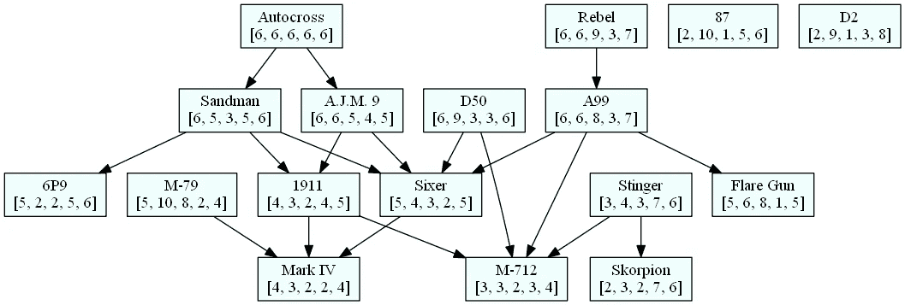

# 集合论和《孤岛惊魂 4》

> 原文：<https://levelup.gitconnected.com/set-theory-and-far-cry-4-7d5292fcf9dc>

## 使用部分订单确定《孤岛惊魂 4》中的最佳武器

当封锁开始时，我发现自己有了一些额外的时间，我明智地投资于玩视频游戏。其中之一是《孤岛惊魂 4》(FC4)，这是一款动作游戏，随着游戏的进展，你会积累各种武器。问题是你一次可以携带的武器数量有限，所以你需要谨慎选择。

不用说，有无数的网站和 YouTube 视频在争论哪些是 FC4“最好的”武器。虽然这在很大程度上取决于个人偏好，但这些武器确实带有数字统计数据，可以用来进行定量选择。我的想法是完全依靠提供的统计数据来确定最好的武器。毕竟，一旦你想出一个系统来评价他们，答案应该会变得很容易。

FC4 的武器有一些从 1 到 10 的标准属性:精度、伤害、射程、射速和机动性。如果我们主要只对这些属性中的一个感兴趣，比如说伤害，我们可以很容易地根据伤害对所有武器进行分类，然后选择价值最高的。但是，如果我们平等地关心武器的所有属性，我们又怎么能比较它们呢？

# 集合论中的序

在之前的[文章](https://medium.com/software-science/software-intelligence-equivalence-relations-and-deduping-your-music-library-ff7d76e005f7)中，我介绍了集合论中的关系，特别是非常有用的*等价关系。*这个帖子也是讲关系的，但是这次我介绍订单。

概括地说，集合 *A* 上的一个*关系* *R* 是一个有序偶集{( *x* ， *y* )| *x* ， *y* ∈ *A* }，或者换句话说，一个关系只是 *A×A* 的子集，即*A*的笛卡尔积如果 *(x，y)* 在 *R* 中，则元素 *x* 和 *y* 与*相关，在这种情况下，我们写*【x R y】*(*x*与 y 相关)*

一个关系是*传递的*如果*【x R y】**【y R z】*，暗示*【x R z】*。请注意，该定义不要求集合中的所有元素都是相关的。如果存在一个**过渡的**关系 R，使得对于任意两个不同的元素 *x* 和 *y* 、*【x R y】*或*【y R x】*，则集合 *A* 是*全序的*。在这种情况下，关系 *R* 被称为 a 上的*总订单*

例如，在一组人中，关系“X 比 Y 高”是传递的，并且它也是全序的，因为人可以按身高排序。关系“X 比 Y 高，比 Y 瘦”也是可传递的，但它不是一个全序，因为 Xerces 可能比 Yana 高，但也比 Yana 胖，这使得他们两个在这个关系上不可比。

定义了传递关系的集合称为*偏序集*，这种关系称为*偏序。*偏序集也称为*偏序集*。用 *≥* 来表示偏序是相当常见的，所以我们不写*【x R y】*，而简单地写 *x ≥ y* 。

偏序集 *A* 的一个元素 *m* 称为*极大*如果在 *A* 中没有其他元素 *x* ，使得 *x≥ a.*

从技术上讲，还要求(弱)偏序是自反反对称的。我们将在这里讨论的偏序是自反的，但不是反对称的。然而，我们可以很容易地解决这个技术问题。

# 绝对是最好的

设 *W* 为 FC4 的那套武器。如果 *w* 是 *W* 的一个元素，我们用 *w(i)* 来表示 *w* 的第 I 个属性，其中 1 是精度，2 是伤害，以此类推。我们对 *W* 定义一个偏序如下:对于每个 I，如果 *w(i) ≥ v(i)* ，则武器 *w* 优于武器 *v* 。

现在我们有一个偏序，我们可以找到最大元素。事实上，我们想更进一步。因为不是所有的武器从一开始就可用，我们需要一种图形化的方式来订购武器，以便我们可以在任何时候选择最佳的可用武器。

例如，考虑下面的侧配枪子集。反叛者，87 霰弹枪，Autocross 没有可比性，因为他们有不同的优势和劣势。另一方面，Autocross bow 比 Sixer 好，Sixer 比 Mark IV 好。

有限集上的任何关系 *R* 都可以用有向图来表示。图的顶点对应于集合的元素。有向边链接两个相关的元素，因此如果*【xRy】*，那么在顶点 *x* 和 *y* 之间有一条边。

我写了一个小程序，读取武器统计数据，并根据我定义的偏序创建边，将它们排列在一个图形中。为了绘制这个图形，我使用了 [Graphviz，](https://graphviz.org/)这是一个流行的图形可视化工具。我为随身武器和双手武器创建了单独的图表，因为它们在不同的插槽中。

这是配枪的图表。最大元素，因此也是最好的武器，是那些没有任何边缘的:自动穿越，反叛，87，D2，D50 和毒刺。最糟糕的武器是那些只有刀刃的武器:Mark IV，M-712 和 Skorpion。

这是双手武器的图表。

为了简化图形，我应用了*传递归约，*这意味着我只保留了相邻节点之间的边，并删除了其余的边。通过传递性，我们已经知道，既然自动穿越优于睡魔，睡魔优于 6P9，那么自动穿越也优于 6P9。

正如我们在脚注(1)中提到的，这在技术上不是一个适当的偏序，因为两种不同的武器可能具有完全相同的统计数据。我们可以很容易地解决这个技术问题，尽管我们可以通过任意选择一种武器来解决这个问题。

# 源头

代码可以在 GitHub 中的 [Python](https://github.com/algorythmist/fc4-python) 和 [Kotlin](https://github.com/algorythmist/fc4dag) 中找到。python 代码足够短，可以完整发布: