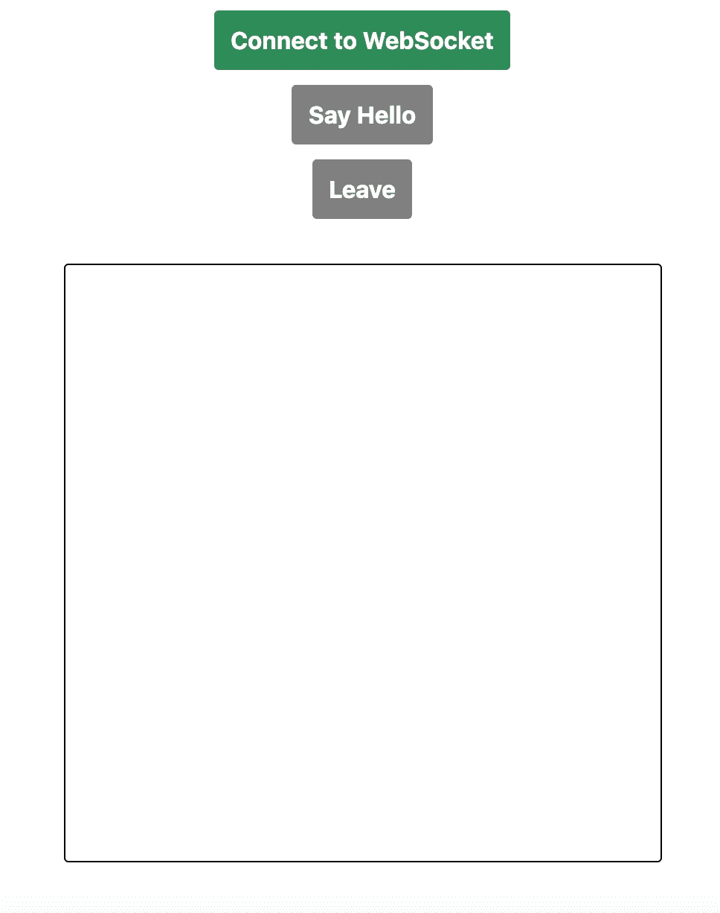
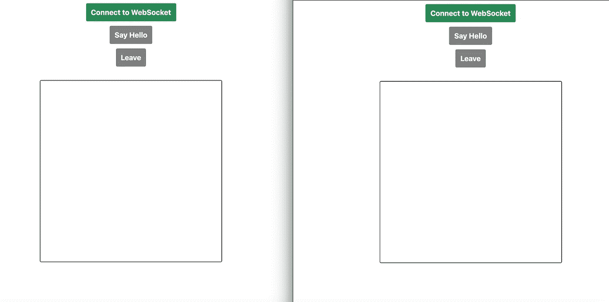
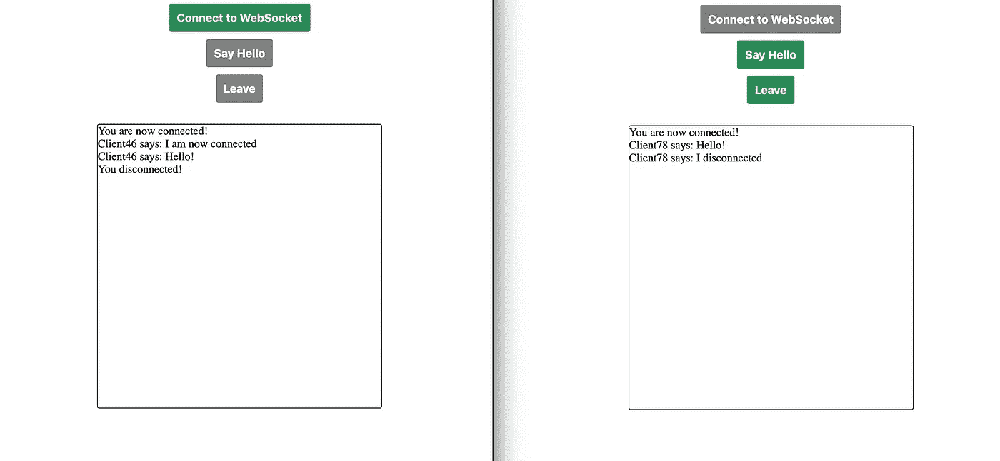

# 通过 WebSocket 建立连接:使用 WebRTC 进行视频通话步骤 2

> 原文：<https://levelup.gitconnected.com/set-up-a-connection-over-websocket-videochat-with-javascript-step-2-f78c307c4fd3>


[Cytonn 摄影](https://unsplash.com/@cytonn_photography?utm_source=unsplash&utm_medium=referral&utm_content=creditCopyText)在 [Unsplash](https://unsplash.com/s/photos/handshake?utm_source=unsplash&utm_medium=referral&utm_content=creditCopyText) 上拍照

我们想使用 WebRTC 协议创建一个视频聊天。我们在[的上一篇文章](/data-stream-from-your-webcam-and-microphone-videochat-with-javascript-step-1-29895b70808b)中看到了如何从浏览器访问网络摄像头和麦克风流。我们现在想在两个用户之间建立一个 P2P 连接。

本地浏览器和远程用户(对等点)之间的 WebRTC 连接将由 JavaScript 接口 [RTCPeerConnection](https://developer.mozilla.org/en-US/docs/Web/API/RTCPeerConnection) 表示。但是你必须首先协调这个连接，在对等体之间交换消息以找到对方，控制通信，然后终止它。这是信号传递过程。信令过程不是 WebRTC 规范的一部分，您可以自由地使用您想要的任何消息传递协议来建立和控制连接。从技术上讲，您可以在每次发布时传递这些消息，但是一个常见的解决方案是使用 WebSocket 协议。

在本文中，我们将允许两个用户通过 WebSocket 进行通信。我们将用一个节点服务器构建一个例子，在这个例子中，对等体可以创建一个连接，互相打招呼，然后关闭连接。

# WebSocket

WebSocket 是一种通信协议，类似于 HTTP。像 HTTP 一样，WebSocket 支持客户端(浏览器)和服务器之间的通信。

当通过 HTTP 通信时，服务器只能对客户机的请求做出反应。它不记得以前的请求，HTTP 是无状态的。另一方面，WebSocket 允许您在客户机和服务器之间打开一个通道。一旦这个通道打开，直到它关闭，通信可以双向进行:服务器可以在它喜欢的时候发送数据，客户端也可以。

WebSocket 实际上被设计为基于 HTTP 工作，所以我们可以使用普通的 web 服务器来构建它。我们将在客户机和节点服务器之间实现一个 WebSocket 通信。

# 设置节点项目

我们将为此使用一个节点服务器和一个实现 WebSocket 的库: [WebSocket-Node](https://github.com/Worlize/WebSocket-Node) 。

如果你的机器上还没有，你应该安装 [Node.js](https://nodejs.org/en/) 。创建一个文件夹，在其中放置你的 WebSocket 项目(我把我的命名为 *web-socket* )。然后在该文件夹中初始化您的项目:

```
npm init
```

创建一个 index.js 文件，并使用 npm 安装 [WebSocket-Node](https://github.com/Worlize/WebSocket-Node) 库:

```
npm install websocket --save
```

按照库的文档，我们首先需要定义一个 HTTP 服务器。我们的将监听端口 1337。然后我们可以在其上创建 WebSocket 服务器。

我们想做一些非常简单的事情来理解 WebSocket 是如何工作的。每个人都可以通过我们的服务器连接和发送消息。当用户发送消息时，其他所有连接的用户都会收到。

我们需要跟踪连接的用户，我们在*客户端*数组中这样做。当一个用户请求一个连接时，我们首先接受它，然后通知其他所有连接的用户。我们生成一个随机 id，然后将带有该 id 的新连接添加到数组中。

当用户发送消息时，发出事件*消息*。除了发送消息的用户之外，每个连接的用户都被发送一些包含消息文本和发送消息的用户的索引的数据。

最后，当一个用户断开连接时，他将从*客户端*阵列中被删除，其他用户将得到通知。

现在让我们通过构建一个简单的用户界面来检查这是否可行。

# 客户

我们不打算在客户端构建任何复杂的东西，我们只想确保通信正常工作。我们将显示三个按钮:

*   一键连接
*   一键发送“你好！”消息
*   一键断开

当用户未连接时，只有第一个按钮被启用，否则只有最后两个按钮被启用。

在按钮下面，我们显示一些区域(在代码中称为*控制台*),在这里将打印消息。



您可以为客户机代码创建一个新文件夹(我将我的命名为 *client* )。同样，我们保持事情简单，所以你只需要*index.html*、 *index.js* 和 *styles.css* 文件。HTML 和 CSS 非常简单:

你可以在下面找到完整的 *index.js* 文件，但是为了让它更容易理解，我们首先将重点放在摘录上。

我们需要定义点击按钮时会发生什么。当点击第一个时，我们想要初始化连接。当第二个被点击时，我们想发送一个“你好！”通过连接传递消息。单击最后一个按钮应该会关闭连接。*连接*是一个全局变量，在*setupWebSocketConnection*函数中初始化。

最有趣的部分当然是如何建立连接。

我们简单地创建了一个 *WebSocket* 类的实例，将 url 作为参数传递。然后我们定义事件处理程序。当连接打开时，我们向控制台添加一条消息，并正确设置按钮的禁用属性。当收到消息时，我们在控制台中显示它。

一旦连接打开，通过它发送消息就像下面这样简单:

```
connection.send('Hello!');
```

这可以在事件监听器函数中看到。关闭连接也很简单，正如您在 *closeConnection* 函数中看到的:

如承诺的那样，这里有完整的 *index.js* 文件:

# 测试

现在让我们启动服务器，在两个客户机之间尝试我们的消息传递系统。要运行服务器，请转到 *web-socket* 文件夹并运行:

```
node index.js
```

您应该在终端中看到“服务器监听端口 1337”。

要测试两个客户端是否可以通过服务器通信，请在两个选项卡或两个浏览器窗口中打开您的*index.html*。



现在按你想要的顺序点击按钮。您可以看到客户端之间正在交换消息:



WebSocket 上的通信工作正常。

我们确实设置了一个 WebSocket 服务器来允许两个客户端交换消息。回到更大的画面，我们现在可以使用这个通道来交换创建和控制 WebRTC 连接所必需的消息。这就是我们在下一篇文章中[要做的事情。](/establishing-the-webrtc-connection-videochat-with-javascript-step-3-48d4ae0e9ea4)