# 具有位存储桶的连续部署管道——使用 AWS 代码部署到 AWS EC2 的管道

> 原文：<https://levelup.gitconnected.com/set-up-a-continuous-delivery-pipeline-from-bitbucket-to-aws-ec2-using-aws-code-deploy-a9777a3cbcad>


## 设置 Node.js 应用程序的连续部署

如果您在这里，我假设您知道什么是持续部署，以及您为什么需要它。在这篇文章中，我们将看到如何在 AWS EC2 实例上部署一个简单的 Node.js 应用程序，以及如何在每次执行一个`git push`到您的生产存储库时自动交付。代码将被部署并托管在您的服务器上，您无需做任何事情。

我们将在这个演示示例中使用的应用程序是一个简单的“Hello World”**node . js**应用程序，但是我们将介绍入门概念，然后可以根据您的需求进行扩展。

这就是我们的节点服务器的`app.js`文件

目录结构如下所示:

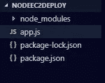

**初始目录结构**

***好了，我们开始吧！***

## 概述:

Bitbucket 存储库有管道支持，我们可以使用它们来简化我们的部署，你可以在这里阅读更多关于它们的信息。它们为各种平台提供集成，如 Amazon Web Services、Google Cloud Platform、Microsoft Azure 等等。

我们将设置一个具有编程访问权限的 IAM 用户，bitbucket-pipelines 将使用该用户将我们的应用程序的副本推送到 S3 存储桶，然后触发 AWS Codedeploy 上的部署，这将依次代表我们在 EC2 实例上按照我们的`appspec.yml`配置部署我们的应用程序。

这可能看起来很多，但坚持住，我们会度过这一切！所以让我们先设置一个 IAM 用户——我假设您熟悉基本的 Amazon Web 服务。

## **步骤 1:创建 IAM 组、用户、角色**

创建具有权限的 IAM 组

*   亚马逊 3 完全访问
*   AWSCodeDeployFullAccess

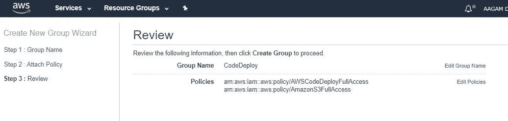

**创建群组**

创建一个用户，并将其添加到这个组与编程访问，
保存凭证(访问密钥，秘密访问密钥)，我们将需要它。

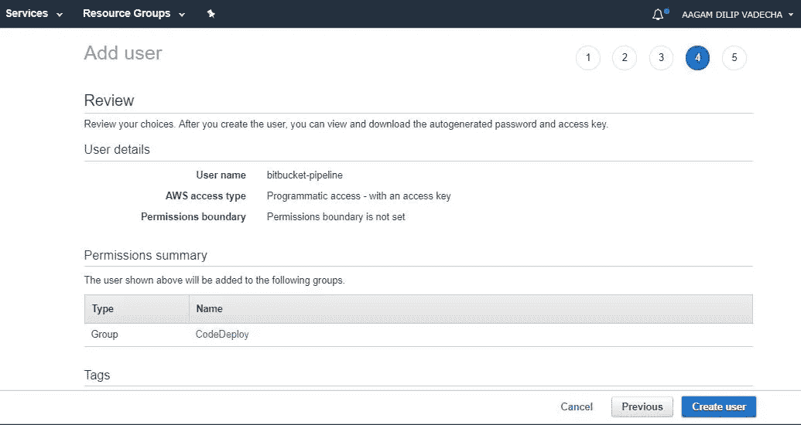

**添加一个**用户到组

此外，在 IAM 中创建一个角色，并选择 EC2 服务，因为我们的 EC2 实例稍后将使用该角色与 CodeDeploy 交互，并添加`AmazonS3FullAccess`和`AWSCodeDeployRole`的策略

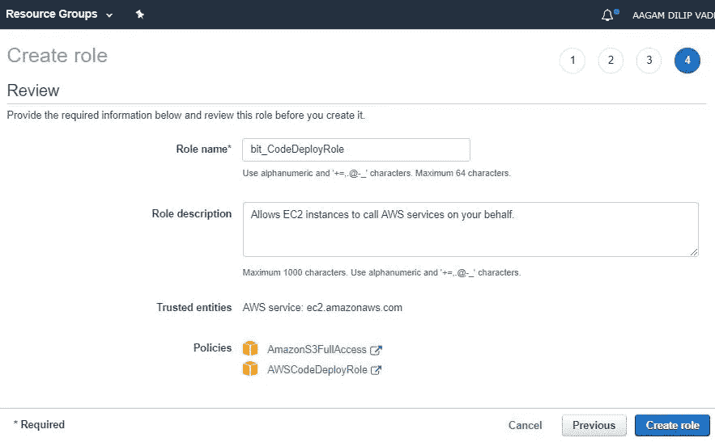

**创建一个角色**

创建角色后，将**信任关系**编辑如下。将地区更改为您正在工作的地区，我的是 N.Virginia，也就是 us-east-1

```
{
  "Version": "2012-10-17",
  "Statement": [
    {
      "Effect": "Allow",
      "Principal": {
        "Service": [
            "ec2.amazonaws.com",
            "codedeploy.us-east-1.amazonaws.com"
        ]
      },
      "Action": "sts:AssumeRole"
    }
  ]
}
```

## **步骤 2:创建一个 S3 存储桶和一个 EC2 实例**

创建一个 S3 桶，并将其命名为您喜欢的任何名称，并保持桶的默认设置。为了简单起见，目前我将其命名为`directcodedeploy-codedeploy-deployment` 。

接下来，创建一个 EC2 实例，操作系统可以根据您的要求，我们将使用 Ubuntu 16.04。我们需要添加我们已经创建的 IAM 角色-AWSCodeDeployRole，现在为了让 AWS 代码部署识别我们的实例，它将寻找标记，因此我们需要标记它，所以我们将标记它为
`Name = CodeDeployDirect`，在**安全组**中打开您的应用程序所需的适当端口，就像我们的应用程序需要打开端口 3000 一样。

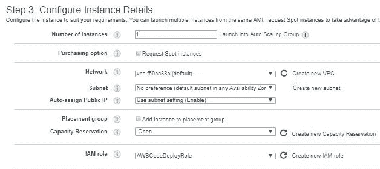

**添加 IAM 角色**

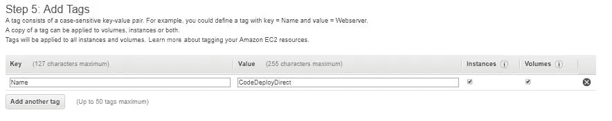

**添加标签**

启动实例，然后在您的服务器上安装 CodeDeploy 代理，根据您的操作系统，安装过程可能会有所不同。您可以在此处找到适当的指南，根据您的操作系统遵循说明，并确保 **Code Deploy 代理已启动并正在运行！**

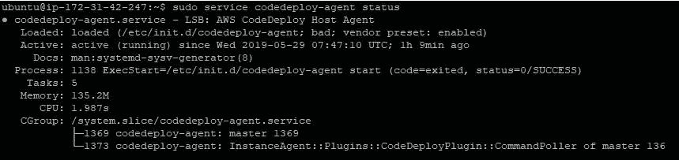

**服务器上的代码部署代理**

## **步骤 3:创建一个 CodeDeploy 应用程序**

转到 AWS CodeDeploy 控制台并单击创建应用程序

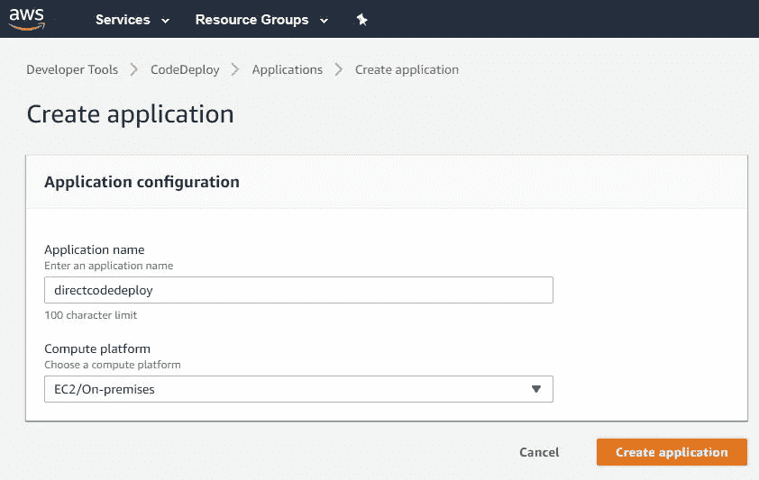

然后用以下设置创建一个部署组
名称:`DG1` (可以任意选择)
服务角色:`AWSCodeDeployRole` 部署类型:`In Place` 部署设置:`CodeDeployDefault.OneAtATime` 禁用负载均衡
环境配置下:

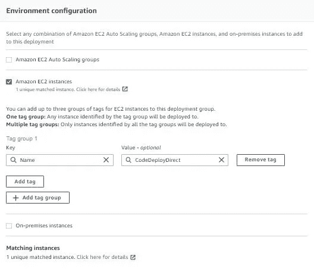

您应该看到 1 个匹配的实例，然后按 Create Deployment Group

到目前为止，我们已经设置了一个供 Bitbucket 管道使用的 IAM 用户，一个存储我们的应用程序 zip 文件的 S3 bucket，一个部署我们的应用程序的 EC2 实例，还安装了代码部署代理，以便根据`appspec.yml`文件部署我们的应用程序。你可以在这里看到一些如何配置`appspec.yml` [的基本例子，也可以在这里](https://docs.aws.amazon.com/codedeploy/latest/userguide/reference-appspec-file-example.html#appspec-file-example-server)阅读**更多关于如何配置 bitbucket-pipelines.yml [的](https://confluence.atlassian.com/bitbucket/configure-bitbucket-pipelines-yml-792298910.html)**。

对于我们的应用程序， **appspec.yml** 如下所示:

上面使用的三个简单的 bash 脚本如下:

将以下文件添加到您的存储库中，然后在 Bitbucket 中添加存储库变量，并在出现提示时启用管道。

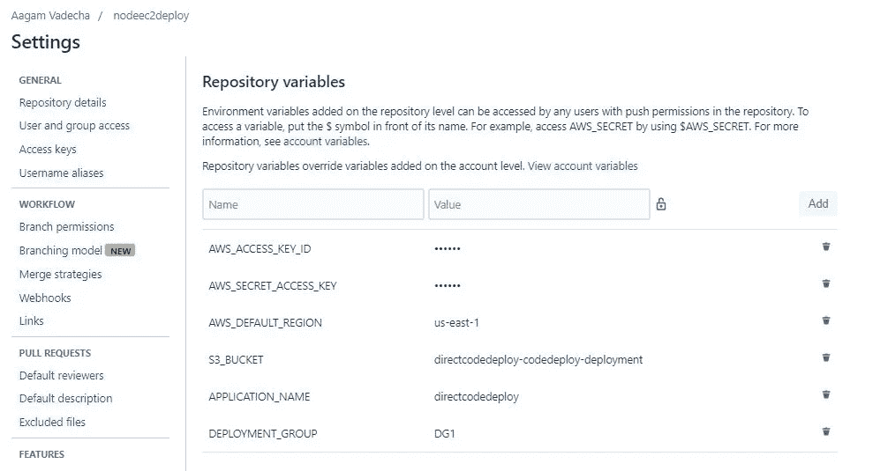

现在剩下的就是设置并把`bitbucket-pipelines.yml`推送到我们的仓库，这样一切都可以工作了。

我们在这里看到的管道是由 Atlassian 维护的另一个脚本，您只需粘贴管道，提供一些关键的信息，其余的就为您完成了。

你可以了解更多关于管道和检查其他管道[在这里](https://confluence.atlassian.com/bitbucket/pipes-958765631.html)。
*最终的目录结构是这样的*

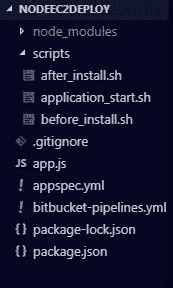

**最终目录结构**

现在是提交和推送到远程的时候了。

在将更改推送到 Bitbucket 之后，转到您的存储库的管道部分，您将能够看到一个由 **#1** 触发的管道，类似于

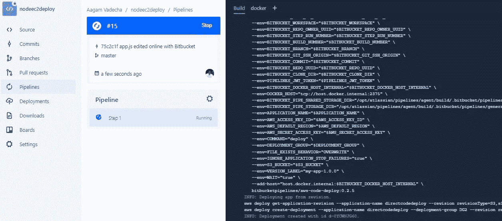

**流水线进行中**

如果您按照正确的步骤操作，您将看到一个成功的管道运行，并且您的应用程序被部署在服务器上！

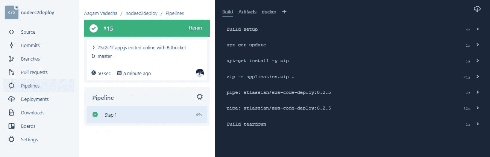

**流水线成功**

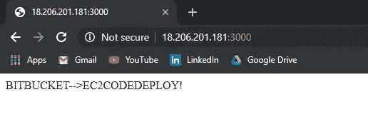

**已部署的应用程序**

现在尝试在您的本地存储库中更改消息，然后将其推送到远程，几分钟后访问您的 URL，看看它将如何减轻您未来部署的负担！

干得好！

感谢阅读！如果你喜欢你所读的，那么留下一个👏然后跟着走。