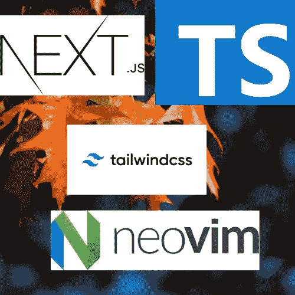
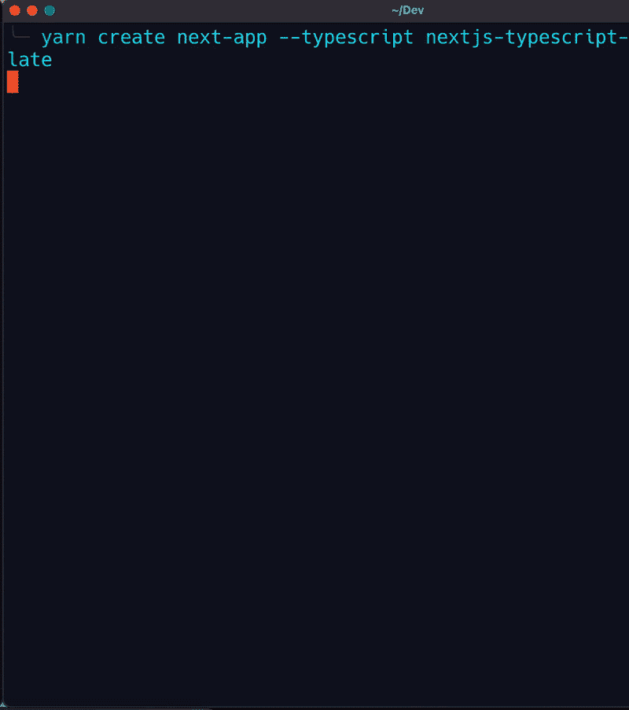
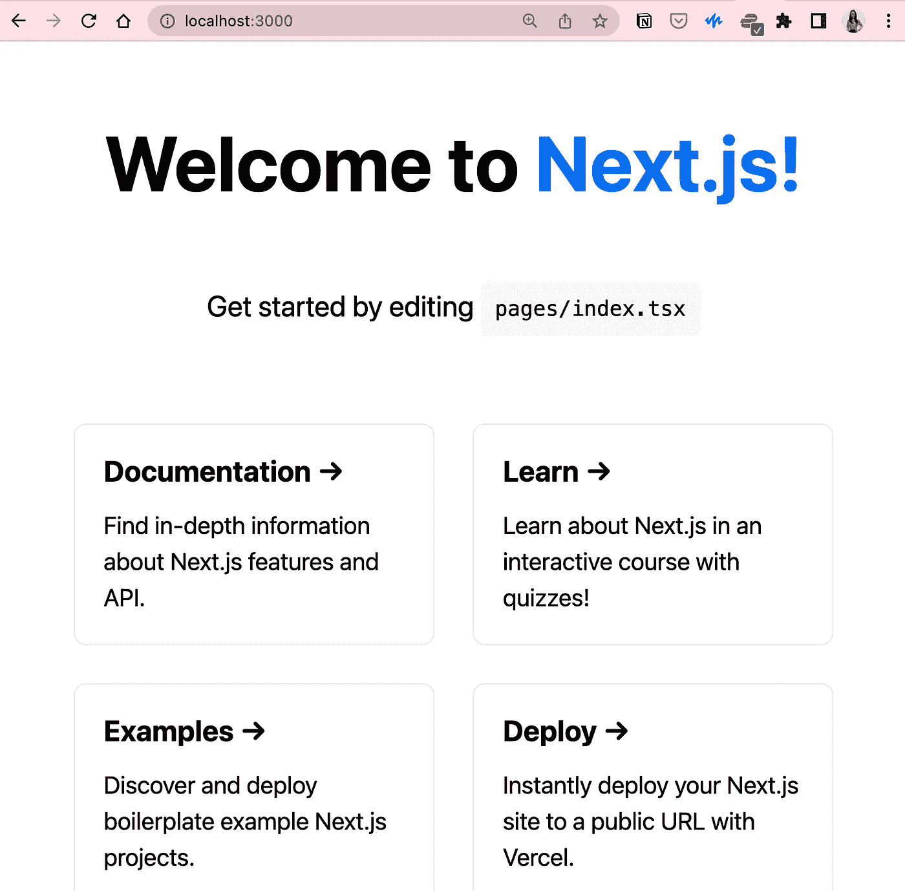
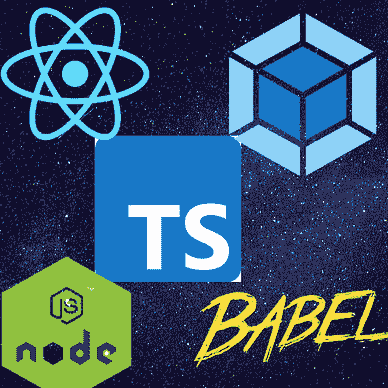
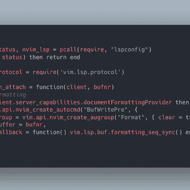
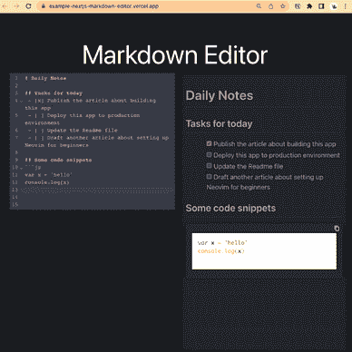

# 使用 Neovim + Lua、TypeScript 和 TailwindCSS 设置 Next.js 应用程序工作流

> 原文：<https://levelup.gitconnected.com/set-up-a-next-js-application-workflow-using-neovim-typescript-tailwind-23621a34ed38>

## 为 Next.js 应用程序创建高效的工作流。

使用 [Canva 创建图像。](https://www.canva.com/)

Next.js 提供了一个集成的[打字稿](https://www.typescriptlang.org/)体验。我在以前的工作中从未写过 TypeScript，但在我的创业项目中，我再也不能忽视它了。TailwindCSS 是一个实用程序优先的 CSS 框架，它允许您创建现代的响应式网站，而无需跳转到`.css`文件来编写 CSS 代码。它帮助开发人员专注于工作。我在我的作品集网站和其他正在进行的[迷你项目](https://amy-juan-li.medium.com/next-js-strapi-build-my-portfolio-website-with-next-js-tailwindcss-and-strapi-v4-3f64d850554c)中使用了这个框架。关于文本编辑器，我从开始开发者生涯开始就一直使用 VS 代码，这是现在 web 开发者非常常用的。然而，我一直是 vim 的忠实粉丝。虽然 VS 代码的 VIM 扩展在某种程度上是可行的，但是非常缓慢。出于各种原因，上个月我开始尝试使用 Neovim 支持的 pure terminal (iTerm2)作为我新的强大的文本编辑器。直到今天，作为一名程序员，我更有信心通过分派我想要执行的动作而成为所有者，而不是依靠鼠标移动和点击活动来实现我的目标。好了，这篇文章将带你了解我是如何建立一个全新的 Next.js 应用程序的。

[*在 Lua 中配置 Neovim 的 GitHub repo。*](https://github.com/amy-juan-li/nvim-lua)

# 技术堆栈

## 网络应用

*   [Next.js](https://nextjs.org/docs/getting-started)
*   [尾翼 CSS](https://tailwindcss.com/)

## 文字编辑器

*   尼奥维姆
*   左上臂
*   [nvim-LSP config](https://github.com/neovim/nvim-lspconfig)—neo vim 内置 LSP 的配置集合
*   [packer](https://github.com/wbthomason/packer.nvim)—neovim 的插件/包管理器
*   [nvim-CMP](https://github.com/hrsh7th/nvim-cmp)—Lua 编码的 neovim 补全插件
*   [lspsaga](https://github.com/glepnir/lspsaga.nvim) — LSP UI

# 使用 TypeScript、TailwindCSS 和 Neovim 设置 Next.js 应用程序

启动一个 next js(next js+TypeScript+TailwindCSS)项目。GIF 作者$ yarn
# development mode
$ yarn dev

# 摘要

本帖介绍一个 [Next.js app 模板，使用 TS 作为主要编程语言，TailwindCSS 作为 CSS 框架，结合 terminal 和 Neovim 作为强大的文本编辑器。](https://github.com/amy-juan-li/Next.js-TS-tailwindcss)

[*如果你想在 Medium 上阅读来自*](https://medium.com/@amy-juan-li/membership) [*【李冠仪】*](https://medium.com/u/9f2dc23bfffa?source=post_page-----23621a34ed38--------------------------------) *以及成千上万其他作家的每一个故事，考虑成为 Medium 会员* *。每月 5 美元，你可以无限制地访问媒体内容。如果你* [*通过我的推荐链接*](https://medium.com/@amy-juan-li/membership) *报名，我会得到一点佣金。*

# 进一步阅读

[李冠仪](https://amyjuanli.medium.com/?source=post_page-----23621a34ed38--------------------------------)

## 网站开发

[View list](https://amyjuanli.medium.com/list/web-dev-db243e7bdf05?source=post_page-----23621a34ed38--------------------------------)6 stories