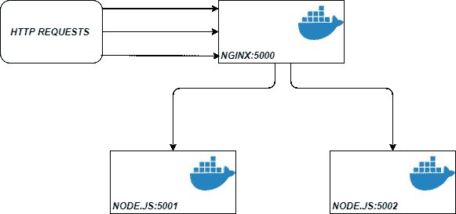
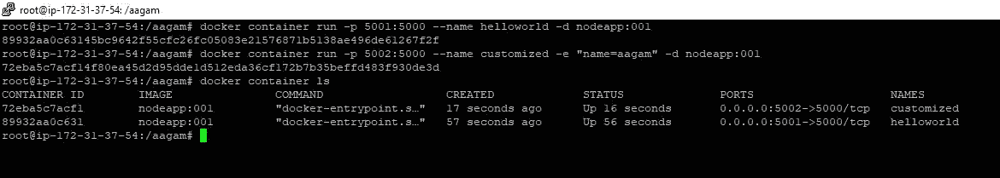
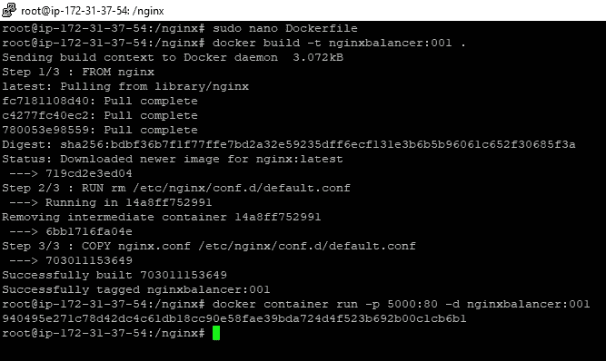
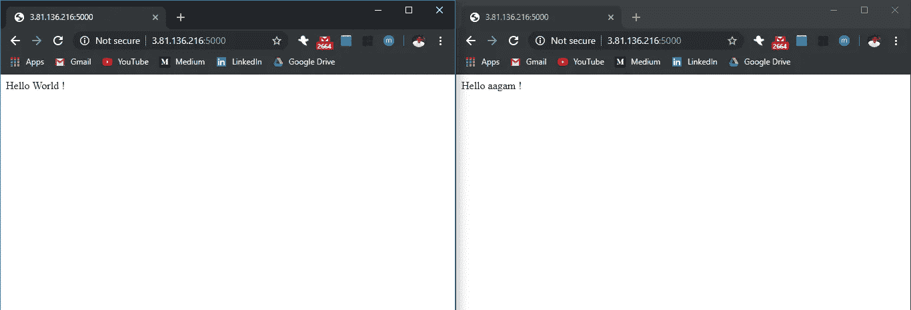

# 为 dockerized Node.js 应用程序设置一个 Nginx 负载平衡器

> 原文：<https://levelup.gitconnected.com/set-up-a-nginx-load-balancer-for-a-dockerized-node-js-application-6bff1a54655a>

如果您在这里，那么您可能知道在您的应用程序中使用 docker 的优势。总结一下，docker 容器加快了您的部署，使您的应用程序可移植到任何平台，映像是轻量级的，简化了维护，并且高度可伸缩。

负载平衡器的工作是在一组后端服务器(称为服务器池)之间高效地分配传入流量。负载平衡器充当后端服务器前面的“交通警察”，在所有能够处理这些请求的服务器之间路由客户端请求，以最大化速度并确保没有服务器超负荷工作，从而降低性能。

**必备:** Docker 基础知识

**概述:** 在这篇博客中，我们将看到如何对一个简单的 Node.js 应用程序进行 docker 化，并在 Ubuntu 服务器的不同端口上部署该应用程序的两个 docker 容器，然后配置 Nginx 作为两个 docker 容器前面的负载平衡器来运行，以提高性能和响应能力。这只是一个演示，涵盖了一般概念，并且该示例可以跨多个服务器(“节点”)扩展到数百个容器

大概是这样的:

我们将总共设置 3 个容器，2 个用于 Node.js，1 个用于 Nginx。Node.js 容器将在主机端口 5001 和 5002 上运行，这两个端口将分别映射到容器端口 5000。

***好了，我们开始吧***

这是我们的 app.js 的样子。它用一个简单的 Hello“Name”作为响应，这个名称可以作为环境变量传递给它，同时从图像创建容器，以便我们可以区分两个容器，并确保我们的负载平衡器正常工作。

如果你不熟悉 docker，我强烈建议你查看一下这个，了解一下 docker 是如何工作的。
让我们创建一个 docker 文件来为这个应用程序构建一个图像，这将非常简单，如下所示

接下来，我们需要转到保存 app.js 和 docker 文件的目录，打开 shell，然后运行“docker build-t custom imagename:tag”从 docker 文件构建图像。

运行:`docker build -t nodeapp:001 .`

一旦建立了映像，您就可以使用`docker images`命令来查看它

然后使用-publish(-p)选项在不同的主机端口上启动来自映像的容器，并使用-e 选项传递环境变量“name ”,以区分两个容器。

*   `docker container run -p 5001:5000 --name helloworld -d nodeapp:001`
*   `docker container run -p 5002:5000 --name customized -e "name=aagam" -d nodeapp:001`

检查您的 [http://ip:port](http://ip:port) 的浏览器，并验证容器是否已成功部署。

在这里，我们可以看到一个容器在主机端口 5001 上运行，另一个在主机端口 5002 上运行。好像不错！

我们已经成功部署了两个 Node.js 容器，现在我们需要在它前面添加一个 Nginx 负载平衡器。要设置一个 nginx 容器，我们需要编写一个 Nginx 配置文件和一个单独的 Dockerfile，所以移到一个新的文件夹，创建两个名为 nginx.conf 和 Dockerfile 的文件，如下所示:

我们刚刚输入了什么？我们使用 upstream 在 nginx.conf 中设置了一个代理，并添加了两个需要进行负载平衡的服务器地址，我们将负载平衡算法设置为 least_connection，而不是默认的循环调度。
要了解更多关于 nginx 负载均衡的信息，你可以参考[这篇](https://docs.nginx.com/nginx/admin-guide/load-balancer/http-load-balancer/)

设置好这些文件后，我们可以使用
`docker build -t nginxbalancer:001 .`来构建一个图像

然后在任何主机端口上启动容器，我们将使用端口 5000

`docker container run -p 5000:80 -d nginxbalancer:001`

如果事情对你来说是正确的，就像我希望的那样😆，您应该在浏览器上访问您的 IP:5000 并点击 refresh multiple 来查看同一个地址上的两个输出，这意味着 nginx 正在将我们的 http 请求重定向到两个容器并平衡整体负载。

干得好！
我们刚刚使用 2 个容器为 dockerized 节点应用程序设置了一个 Nginx 负载平衡器，如前所述，这个概念可以根据需要进行扩展。

***感谢阅读！如果你喜欢你所读的，那么留下一个👏然后跟着走。***