# 使用 Express、Graphql 和 Typescript 设置项目

> 原文：<https://levelup.gitconnected.com/set-up-a-project-using-express-graphql-and-typescript-1fa38ee79886>

## 了解如何使用 Express、Graphql (Apollo server)、Typescript、Codegen 和 Graphql 文件设置后端


照片来自 [Pexels](https://www.pexels.com/photo/turned-on-silver-imac-with-might-mouse-and-keyboard-930530/?utm_content=attributionCopyText&utm_medium=referral&utm_source=pexels)

# 工具

让我们回顾一下我们将要使用的工具以及我们为什么要使用它们。当然，如果你只是对设置项目感兴趣，你可以直接向下滚动到练习！

## 阿波罗服务器

Apollo 是一个开源的 Graphql 组织，为客户机和服务器开发 Javascript Graphql 库。阿波罗服务器是它的服务器端。它支持完整的 Graphql 实现。在本文中，我们将使用`apollo-server-express`，它是 Apollo 的一个版本，可以嵌入到 Express 服务器中。这样选择的原因是，如果您想在不使用 Graphql 的情况下添加更多的 API 端点，您可能需要一个 Express 服务器。

## Codegen

如果您将 graphql 与 Typescript 一起使用，Codegen 是您需要的工具。Codegen 将扫描您的 graphql 文件，并生成一个包含您的解析器所需的所有类型的 Typescript 文件！

我不打算列举像 Express 或 Typescript 这样的工具。他们已经足够出名了！

# 我们开始吧

首先，让我们通过简单地运行`npm init -y`来建立一个新项目

然后安装 typescript，并通过执行以下操作初始化您的 typescript 项目

`npm install -D typescript && tsc --init`

> 如果`tsc --init`不起作用，运行`npx tsc --init`代替

## 设置 codegen

然后，我们将设置 codegen，开始基于我们的模式生成我们的 typescript 文件。

为此，我们需要添加一个 graphql 文件，这样我们就有东西可以扫描了。为了文章的目的。我们将创建一个非常简单的文件来登录/注册，并从一个假用户那里获得令牌。

创建一些文件夹，使您的层次结构如下所示:

```
- src
  - graphql
    - schemas
    - resolvers
```

在 schemas 文件夹中，创建一个`user.graphql`文件，内容如下:

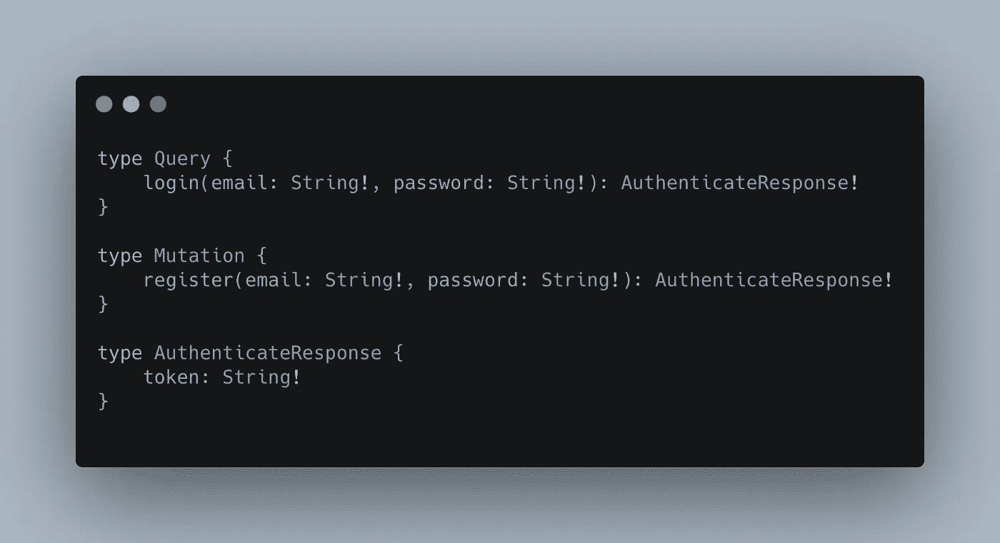

src/graph QL/schemas/user . graph QL

在 graphql 文件中，我们只是每次添加一个请求(突变和查询)和一个类型(AuthenticateResponse ),这样我们就可以充分利用 codegen 的优势。

现在，在您的终端中，运行以下命令来安装我们需要的新包:`npm install -D @graphql-codegen/cli graphql`然后运行以下命令来设置 codegen: `npx graphql-codegen init`
该命令将启动一个向导来创建您的新 codegen 配置。

第一个问题是关于你希望运行 codegen 的环境类型。因为我们这里的目标是 nodeJS，所以使用 space 选择第一个选项(API 或 server ),并按 enter 键进入下一步。

第二个问题是关于模式在哪里。您可以使用 URL(但是您必须运行您的服务器来更新 typescript 文件),或者您可以指定 graphql 文件的文件路径。在我们的案例中，我们希望针对所有。graphql 文件位于`src/graphql/schemas`下。
只需键入以下值:`src/graphql/schemas/**/*.graphql`。

第三个问题是关于你可能需要生成类型脚本文件的插件。在我们的例子中，默认选项非常好。如果您想将 codegen 用于 mongodb，那么您可以选择第三个选项。否则，只需按回车键

第四个问题是生成我们的 typescript 文件的路径。你可以把它放在你喜欢的任何地方。就我而言，我会选择`src/graphql/generated.ts`

对于第五个问题，选择“否”(键入 N，然后按回车键)

对于最后一个，只需保持默认状态并按回车键

最后，对于最后一个问题，codegen 询问脚本名称来运行 codegen 命令。在我的例子中，我只需键入`codegen`并按回车键

一旦设置完成，按照 codegen 的要求运行`npm install`，然后运行`npm run codegen`来生成 typescript 文件。

如果设置已经正确完成，那么您将在向导的第四步中指定的路径下找到一个新的 typescript 文件！

如果您打开项目根目录下的 codegen.yml 文件，您将看到 cli 是如何生成配置的。

## 设置解析程序映射器

为了更好地维护，我希望能够将我的文件分开。这就是为什么我想直接向您展示如何设置解析器映射器(将多个解析器合并为一个),而不是只为所有解析器使用一个文件。

首先，在我们的文件夹`resolvers`中创建一个名为`UserResolver.ts`的新的 typescript 文件。这个文件将包含所有与 user.graphql 文件相关的解析器。

您可以在其中填入以下内容:

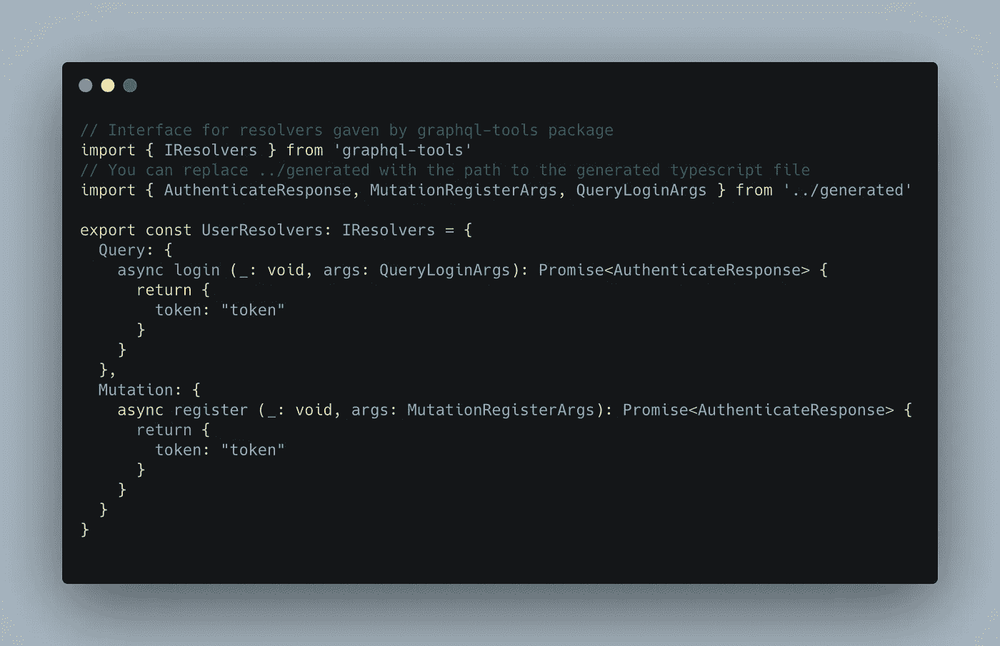

src/graph QL/resolvers/user resolver . ts

> 不要忘记运行`npm install -D graphql-tools`来访问这个文件中使用的 graphql-tools 包。Graphql-tools 提供了许多类型和助手来处理 Graphql。

这个文件包含两个解析器，分别对应于相应 graphql 文件中的查询和变异。此外，我们从生成的文件中获取类型，并在我们的解析器中使用它们。

我决定让我们的解析器变得简单，只返回一个简单的带有令牌的对象。

> 如您所见，codegen 使用一种模式来生成类型。在你的 graphql 文件中，如果你定义了一个类型，这个名字是不会改变的。然而，对于查询或变异，它将遵循模式`<requestType><RequestName>Args`

既然 are resolver 已经准备好了，我们将使用它将它合并(暂时单独)到一个专用文件中。在文件夹 graphql 中创建名为`resolversMap.ts`的文件，并将以下内容放入其中:

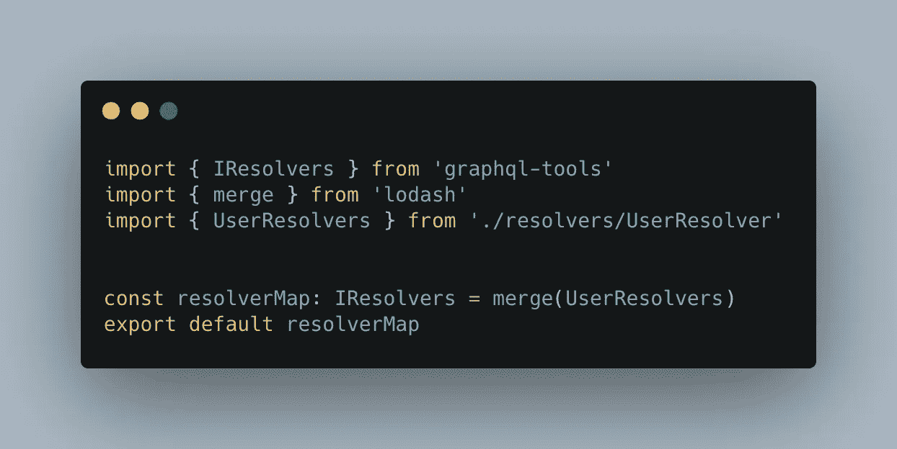

src/graphql/resolversMap.ts

> 不要忘记运行`npm install --save lodash`和`npm install -D @types/lodash`来访问合并函数及其类型。

这个文件的目的是获取所有的解析器，并将它们合并成一个。这个新的解析器稍后将被您的 graphql 服务器使用。

## 设置模式映射器

现在，我们将对我们的模式做同样的事情。在 resolversMap.ts 旁边，创建一个名为`schemasMap.ts`的新文件，并将以下内容放入其中

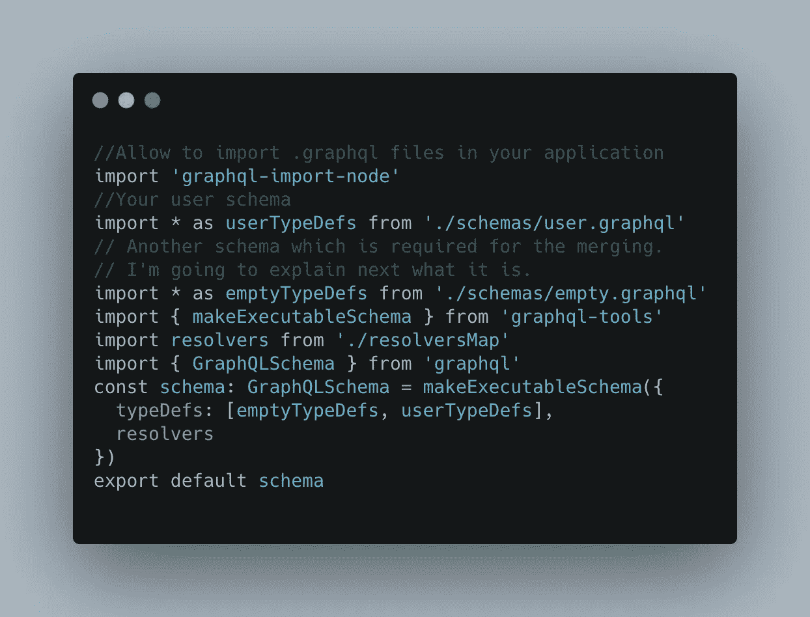

src/graphql/schemasMap.ts

> 别忘了跑`npm install --save graphql-import-node`。这个包允许您在应用程序中导入。graphql 文件。如果没有它，您在导入它们时很可能会出错。

现在还不要担心 empty.graphql 导入，我将在完成这个文件后向您展示它。

函数`makeExecutableSchema`是管理整个合并的关键函数。它将模式(或 typeDefs)和解析器作为参数，并生成一个新的标准 Graphql 模式。

> 注意 typeDefs 数组中的顺序。emptypedefs**必须**是数组中的第一个，否则将不起作用。

现在，对于 empty.graphql 文件。在 user.graphl one 旁边创建它，并将此内容放入其中

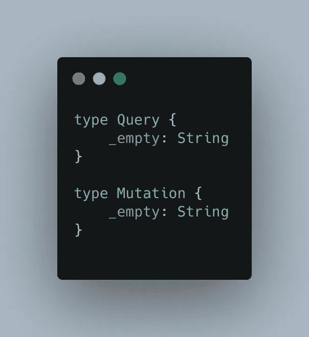

src/graph QL/schemas/empty . graph QL

该文件的目标是定义查询和变异类型，以便所有其他模式文件都可以从它们扩展。这就是前面提到的 emptyTypeDefs 必须位于数组第一位的原因。

> 这里的`_empty`值是占位符，因为 graphql 不授权空对象

我们还对 user.graphql 文件做了一点小小的修改。因为我们现在正在合并，你必须在`type Query`和`type Mutation`之前添加关键字`extend`，并且将来你必须在任何使用这种类型的文件中这样做。只有 empty.graphql 没有使用 extend，因为它定义了原始类型。

## 设置 Express/Apollo 服务器并测试我们的 API

我们快到了！现在我们所有的工具都准备好了，我们只需要把它们连接起来。

在 src 文件夹中，创建一个 index.ts 文件，其中包含以下内容

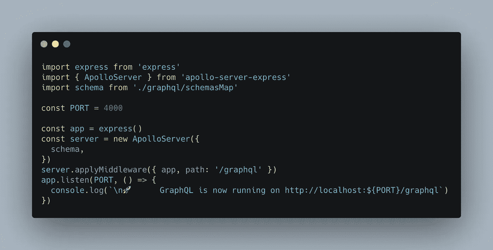

src/索引. ts

> 不要忘记通过运行`npm install --save express apollo-server-express`和`npm install -D @types/express`来安装新的依赖项

这个文件是你的应用程序的入口点。它将首先设置一个 express 应用程序，然后通过给它之前创建的 schemaMap 创建一个新的 Apollo 服务器。然后，我们将应用 Apollo server express 作为中间件，并将 graphql 路径设置为`/graphql`

终于，我们开始听了！

现在，如果我们想测试我们的应用程序，我们必须能够运行它。为此，我们将通过运行命令`npm install -D nodemon ts-node`来安装 nodemon 和 ts-node。

然后在 package.json 中添加一个新脚本，使用您喜欢的名称，并让它运行这个命令:`nodemon src/index.ts`

如果一切顺利，控制台上会显示一条消息，说明 Apollo 正在端口 4000 上运行

# 测试我们的 graphql 应用程序

## 图形 QL

现在是测试时间！有很多方法可以连接到 graphql 应用程序。对于初学者来说，最直接的方法是 graphql，这是 graph QL 的一个开源 GUI。你可以在这里下载

下载并打开之后，您可以在`GraphQL Endpoint`字段中输入您的 graphql 应用程序的 url，应该是[http://localhost:4000/graph QL](http://localhost:4000/graphql)

确保右侧的`Method`设置为 POST。

如果一切都配置好了，您将会在右边看到您的 graphql API 的文档

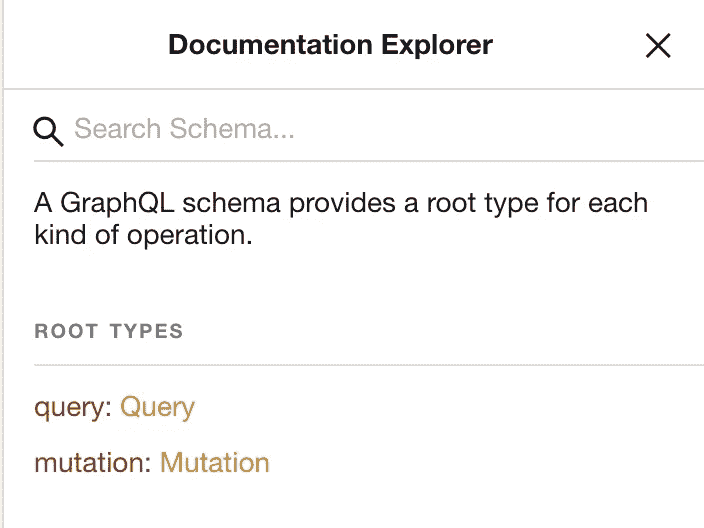

你的申请文件

然后，您可以单击不同的类型来查看它们包含的内容。你应该四处玩一玩，让自己熟悉 GraphiQL！

## 运行查询

应用程序的主要部分是一个用于输入查询的多行字段(在左边)和结果区域(在屏幕中间)

要运行一个查询，您必须首先输入它的类型(查询或变异),然后输入您想要为查询指定的名称。

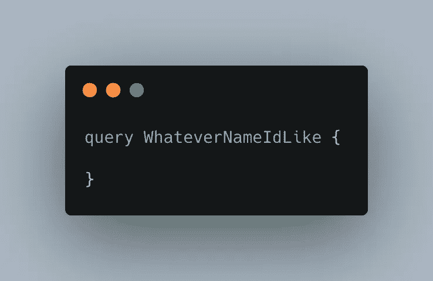

然后，在对象中，您将调用您想要执行的查询。我们要打电话给`login`。按照模式中的定义，login 将电子邮件和密码作为参数。我们将在查询中给出它们。

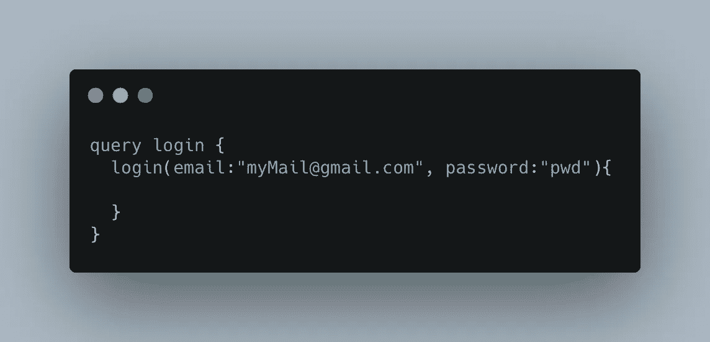

最后，在第二个对象中，你将放置你想从这个请求中获取的值。

> Graphql 的伟大之处在于，您可以选择您感兴趣的参数，而不会得到您不想要的参数。这允许保存数据并降低一些对象的复杂性。例如，如果您想只获取用户的令牌而不获取完整用户，则只能指定 token！

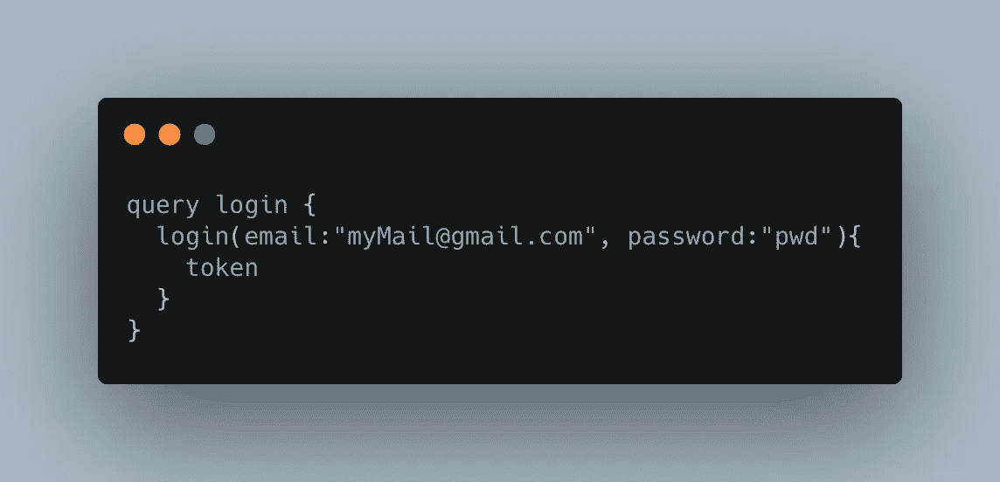

你最后的请求

这是我们的要求！现在，你所要做的就是按下播放按钮，在中间的面板上看到结果！

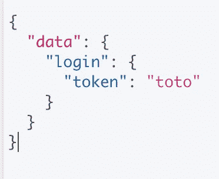

我们的结果

开始了。我们的 graphql 应用程序向我们发送了来自解析器的预期响应！

# 结论

这就是我想要的完美的 Apollo/Typescript 服务器。它已经让你有可能分裂你的文件，并在良好的基础上开始！

如果你想让整个项目已经准备好，你可以在[我的 github](https://github.com/psyycker/graphql-ts-express-codegen) 上得到它。

我希望你喜欢读这篇文章，就像我喜欢写它一样:)

下一集再见！

雷米