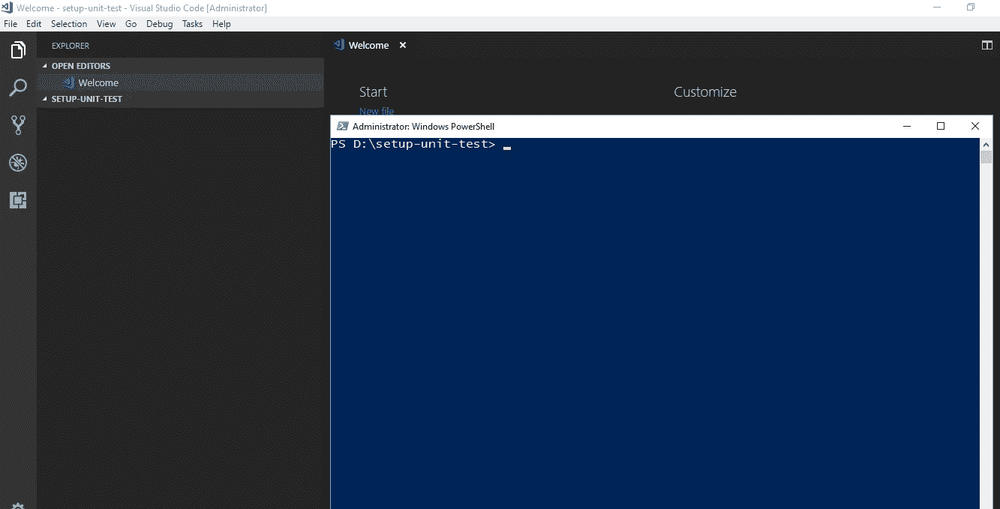
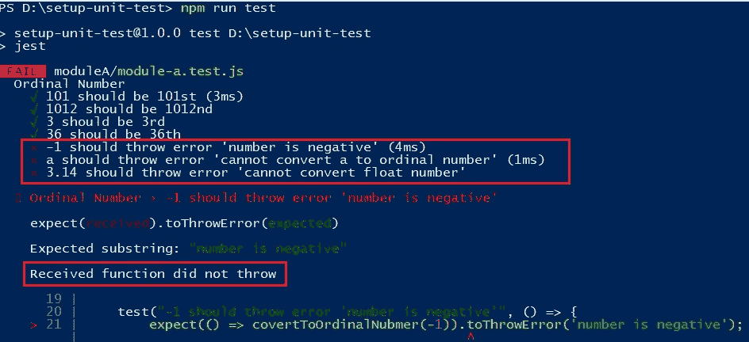

# 从零开始设置简单的 JavaScript 单元测试环境

> 原文：<https://levelup.gitconnected.com/set-up-a-simple-javascript-unit-test-environment-from-zero-ab8c053050ac>

## Java Script 语言

## 使用 Jest 从头开始实现 JavaScript 单元测试的指南


Ashkan Forouzani 在 [Unsplash](https://unsplash.com/s/photos/coffee-cup?utm_source=unsplash&utm_medium=referral&utm_content=creditCopyText) 上拍摄的照片

在本文中，我将提供一个教程，介绍如何用 Jest 创建一个简单的单元测试环境。

1.  从头开始创建项目
2.  安装 Jest
3.  编写您的第一个单元测试

我通常用这种方式为我的私有库在一个用 JavaScript 实现的项目中创建单元测试。

*更多类似内容，请查看*[*https://betterfullstack.com*](https://betterfullstack.com)

# 从头开始创建项目

我更喜欢从零开始为初级开发人员创造一些东西，因为这将帮助他们很好地理解编程，设置事物，并对事物如何协同工作有更好的想法。

首先，我创建一个名为`setup-unit-test`的新文件夹:



安装-单元-测试中的 Visual Studio 代码和 PowerShell 状态

其次，使用`npm init`创建`package.json`,需要注意几点:

1.  **描述**:您的项目描述
2.  **测试命令**:放`jest`因为这个项目会用 jest 来运行
3.  **关键字**:添加项目中使用的编程语言或主要框架等主要关键字。
4.  **作者**:作者信息，应遵循`full name <email> (personal website)`。

如果你想把你的代码推送到像 [Github](https://github.com/) 这样的公共库，那么做:

```
git init
git add README.md
git commit -m "first commit"
git remote add origin REPO-URL
git push -u origin master
```

或者用于现有的储存库。

```
git remote add origin REPO-URL
git push -u origin master
```

# 安装 Jest

什么是 Jest？Jest 是一个令人愉快的 JavaScript 测试框架，专注于简单性。

我们需要首先创建`package.json`，因为我们需要这个文件来管理项目的依赖项，比如 [Jest](https://jestjs.io/) 。

要安装 Jest，我们需要执行以下步骤:

首先，运行`npm i -D jest`或`npm install --save-dev jest`将 jest 添加到`package.json`


将 jest 安装到项目

这将自动添加`node_modules`文件夹，我们存储所有的依赖关系。

其次，添加一个`index.js`文件，因为在`package.json`中，我们添加了`index.js`作为项目的主文件。


index.js 文件被自动设置为主文件。

现在你可以看到，如果你在项目中有 Git，我们有超过 5k 的文件修改。


来自 git 的 5k 文件更改

我们需要添加`.gitignore`来忽略`node_modules`目录，以减少文件更改，并删除不必要推送到存储库的文件夹。


添加 gitignore 文件以忽略 node_modules

现在提交文件，一切准备就绪，可以编写一些单元测试了。

# 编写第一个单元测试

注意:这一节不是关于如何编写一个好的单元测试。这就是我们在为新手级别安装 Jest 后，如何用 Jest 实现我们的第一个单元测试。

开始吧！

有一个新函数接受一个整数，并将其作为一个**序数返回。**序数[是表示某事物在列表中的位置的数字，如第一、第二、第三、第四、第五等。](https://www.mathsisfun.com/numbers/cardinal-ordinal-chart.html)

**问题**:需要对新功能进行单元测试，这样我们才能确保它在每一种情况下都能正常工作。

在源代码中，我们需要为其编写单元测试的文件位于`moduleA`文件夹中，并命名为`module-a.js`。以下是文件开头的内容:

`module-a.js`的内容

接下来创建一个`module-a.test.js`文件，我们将在其中编写我们的测试。

我们要为单元测试写一些案例:

1.  为快乐案例编写测试
2.  为诸如负数、非数字、浮点数等错误输入编写测试用例。

首先，为 happy case 编写所有测试用例。运行`npm run test`来测试我们的文件。Jest 将识别扩展名为`.test.js`的测试文件。


测试每种情况下的输出

第二，编写所有单元测试来处理错误输入，并期望得到一些错误消息。

完成所有关于不良输入的测试用例

这里我们有 3 个测试失败。



在我们为错误输入添加更多单元测试后，测试失败

现在我们回去更新函数来处理错误的输入。

1.  为负数添加验证
2.  为非数字输入添加验证
3.  为浮点数添加验证


处理方法的错误输入的新逻辑

这是我们添加更多逻辑来处理糟糕情况后的最终结果。


所有测试用例都通过了

搞定了。

# 摘要

本文提供了一些关于从头创建一个简单的 JavaScript 项目并为其安装单元测试的提示。

我希望这篇文章对你有用！你可以在[媒体](https://medium.com/@transonhoang?source=post_page---------------------------)上关注我。我也在[推特](https://twitter.com/transonhoang)上。欢迎在下面的评论中留下任何问题。我很乐意帮忙！

查看源代码样本[这里](https://github.com/hoangtranson/setup-unit-test)。

[](https://betterfullstack.com/stories/) [## 故事-更好的全栈

### 关于 JavaScript、Python 和 Wordpress 的有用文章，有助于开发人员减少开发时间并提高…

betterfullstack.com](https://betterfullstack.com/stories/)