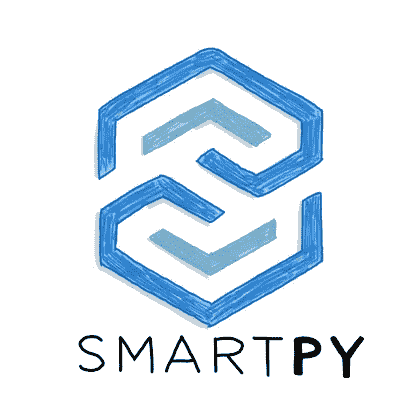

# 使用 SmartPy 和 Taquito 设置 Tezos 智能合约 IDE

> 原文：<https://levelup.gitconnected.com/set-up-a-tezos-smart-contract-ide-with-smartpy-and-taquito-32fe445d274>

## 循序渐进的指南。


由 [u.today](https://u.today/tezos-ecosystem-starts-six-grant-programs-invites-developers-to-build-on-tezos-xtz) 提供

以太坊(或统称为 EVM)智能合约开发者拥有难以置信的便利开发环境，如 [Hardhat](http://hardhat.org/) 。Tezos(还)没有严格的对等物，但是建立一个环境来编译、测试和部署 Tezos 智能契约实际上非常简单。

在这篇文章中，我提供了一个循序渐进的指导。

## **设置**

首先，安装 [SmartPy](https://smartpy.io/) ，这是一个用于编写和测试 Tezos 智能合约的 Python 库。*注意:SmartPy 的一个打字版本(名为*[*SmartTS*](https://smartpy.io/ts-ide)*)目前处于测试阶段。🚀*

```
$ sh <(curl -s [https://smartpy.io/cli/install.sh](https://smartpy.io/cli/install.sh))
```

您可以通过运行以下命令来验证它是否已正确安装:

```
$ ~/smartpy-cli/SmartPy.sh — version
```

然后，用三个文件夹初始化一个`npm`项目:`build`、`contracts`和`deployment`。

```
$ npm init --yes
$ mdkir build contracts deployment
```

最后，安装一些必需的依赖项:

```
$ npm install @taquito/taquito @taquito/signer ts-node dotenv
```

## **合同**



由媒体上的 [SmartPy.io](https://smartpy-io.medium.com/) 提供。

出于本文的目的，我们将使用一个简单的“反向”契约。

在`contracts`文件夹中创建一个文件`counter.py`。该文件还可以包含测试，这是 SmartPy 提供的一个强大而方便的功能。

*注意下一步所需的* `*sp.add_compilation_target*` *。*

## 汇编

为了让 Tezos 虚拟机理解，我们的 SmartPy 契约必须向下编译到迈克尔逊。这是最(句法)无糖的一步——双关语。

简单地创建一个文件`compile.sh`并复制粘贴这个 [bash 脚本](https://gist.github.com/kalouo/b80e4761c94c7768bbc295939a0688d8?file=compile.sh)。它是基于哈弗实验室编写的一个脚本，这个团队是“先驱者”和“科利布里”的幕后团队。

向您的`package-json`文件的`scripts`对象添加一个命令`"compile-contracts"`，运行`./compile.sh`。您将需要通过运行`chmod +x compile.sh`使您的文件可执行(一次)。

现在，使用以下命令编译您的契约:

```
$ npm run compile-contracts counter 
```

这将输出两个文件到`/build`文件夹:

*   `counter.json`:编制好的迈克尔逊合同。
*   `counter_storage.json`:上述编译目标(`sp.add_compilation_target`)中定义的初始契约存储。

它还将运行您编写的任何测试。

## 部署


由[塔奎托](https://twitter.com/TezosTaquito/photo)提供

要部署智能合同，您需要定义一个节点，通过该节点您可以与 Tezos 区块链进行交互，还需要定义一个帐户来签署部署交易并支付燃气费。用以下变量创建一个`.env`文件:

```
TEZOS_RPC_URL=<PUBLIC_NODE_URL>
DEPLOYER_PRIVATE_KEY=<YOUR_PRIVATE_KEY>
```

Taquito 提供了一个[有用的社区运营节点列表](https://tezostaquito.io/docs/rpc_nodes/)。您可以通过`Settings` > `Reveal Private Key`导出您在 Temple Wallet 上的私钥。

> 如果你在 testnet 上部署，最便捷的方式是通过 Telegram 上的 [Tezos 水龙头机器人](https://t.me/tezos_faucet_bot)向你的 testnet XTZ 账户提供资金。

然后，在`/deploy`文件夹中创建一个文件`deploy.ts`:

最后，将命令`"deploy-contracts”`添加到您的`package.json`中，运行`ts-node deployment/deploy.ts`。您现在可以通过以下方式部署您的合同:

```
$ npm run deploy-contracts
```

*Et voilà，*契约的地址应该在命令行上可见，你可以通过 [*与之交互更好的调用 Dev*](https://better-call.dev/) *。*

为了进一步参考，你可以在这里看到完整的 GitHub 库[。](https://github.com/kalouo/tezos-ide) [Taquito](https://tezostaquito.io/docs/quick_start) 和 [SmartPy](https://smartpy.io/reference.html) 都是有据可查的，在 Telegram 上的`Tezos Developers` [频道](https://t.me/TezosDevelopers)随时可以提问。

我希望这个指南对你有用。

快乐编码🚀 🚀 🚀