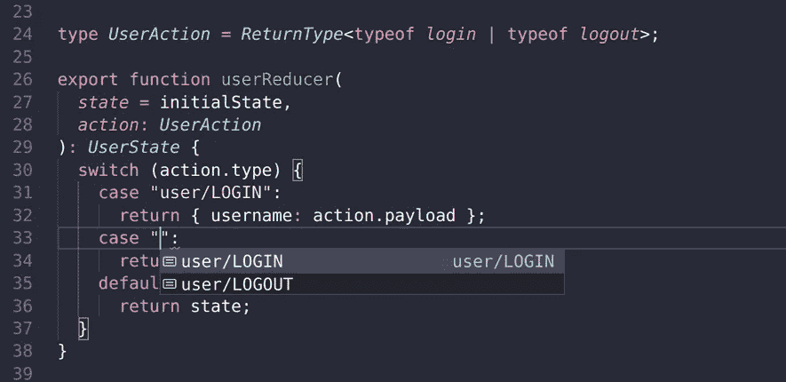
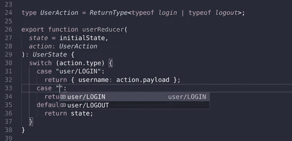

# 建立一个 Typescript React Redux 项目

> 原文：<https://levelup.gitconnected.com/set-up-a-typescript-react-redux-project-35d65f14b869>



# 介绍

这篇文章提供了一种用 Typescript 键入 React Redux 项目的方法。

***

## 通过注册我的免费时事通讯，在您的收件箱中获得快速 JavaScript 和打字技巧！

***

# 使用鸭子模式

这篇文章松散地使用了 Redux Ducks 提议，它将 Redux“模块”组合在一起，而不是按照 Redux 中的功能。例如，所有与`users`状态相关的 Redux 代码都位于同一个文件中，而不是分散在应用程序中不同的`types`、`actions`和`reducer`文件夹中。如果这还不太清楚，你很快就会明白我的意思了！

# 示例应用程序

举个例子，假设我们正在制作一个购物车应用程序，其中我们有一个`user`，它可能已经登录，也可能没有登录，我们还有`products`。这些将作为 Redux 状态的两个主要部分。

因为我们关注的是重复打字，所以让我们使用`create-react-app`引导我们的应用程序，这样我们就可以快速启动并运行。记得在创建项目时给它一个`--typescript`标志。

```
yarn create-react-app shopping-cart --typescript
```

太好了！现在，让我们进入我们的应用程序目录并安装 Redux 及其类型。

```
yarn add redux react-redux @types/redux @types/react-redux
```

# 设置我们的第一个模块

让我们创建`user`模块。我们将通过创建一个`src/redux/modules/user.ts`文件来做到这一点。我们可以定义我们的`UserState`类型和几个动作创建者:`login`和`logout`。

因为我们不担心验证密码，所以我们可以假设我们的`user`状态上只有一个`username`属性，它可以是登录用户的`string`或访客的`null`。

**src/redux/modules/user . ts**

```
type UserState = {
  username: string | null;
};const initialState: UserState = { username: null };const login = (username: string) => ({
  type: 'user/LOGIN';
  payload: username;
});const logout = () => ({
  type: 'user/LOGOUT'
});
```

注意，`user/login`是 Redux Ducks 提议的粗略改编，以`app-name/module/ACTION`的格式命名您的类型。

接下来，让我们创建一个`user`减速器。缩减器接受状态和动作，并产生新的状态。我们知道我们可以将我们的`state`参数*和*输入为`UserState`，但是我们应该如何输入传递给减速器的动作呢？我们的第一个方法将是采取`login`和`logout`动作创作者的`ReturnType`。

**src/redux/modules/user . ts**

```
type UserState = {
  username: string | null;
};const initialState: UserState = { username: null };const login = (username: string) => ({
  type: 'user/LOGIN',
  payload: username,
});const logout = () => ({
  type: 'user/LOGOUT',
});type UserAction = ReturnType<typeof login | typeof logout>;export function userReducer(
  state = initialState,
  action: UserAction
): UserState {
  switch (action.type) {
    case 'user/LOGIN':
      return { username: action.payload };
    case 'user/LOGOUT':
      return { username: null };
    default:
      return state;
  }
}
```

不幸的是，我们有几个问题。首先，我们得到下面的 Typescript 编译错误:`Property 'payload' does not exist on type '{ type: string; }'`。这是因为我们尝试的联合类型不太有效，Typescript 编译器认为我们可能有也可能没有登录情况下的操作有效负载。

第二个问题，也是导致第一个问题的原因，是 Typescript 编译器在我们的`switch`语句中没有检测到不正确的`case`。例如，如果为`"user/UPGRADE"`添加了一个`case`，我们会希望出现一个错误，指出它不是一个可用的类型。

我们如何解决这些问题？

# 函数重载和泛型来拯救！

原来我们可以通过使用 Typescript *函数重载*和*泛型*来解决这个问题。我们要做的是创建一个函数，为我们创建类型化的动作。这个函数创建的`type`将是一个扩展`string`的泛型。`payload`将是一个扩展`any`的泛型。

**src/redux/modules/user . ts**

```
export function typedAction<T extends string>(type: T): { type: T };
export function typedAction<T extends string, P extends any>(
  type: T,
  payload: P
): { type: T; payload: P };
export function typedAction(type: string, payload?: any) {
  return { type, payload };
}type UserState = {
  username: string | null;
};const initialState: UserState = { username: null };export const login = (username: string) => {
  return typedAction('user/LOGIN', username);
};export const logout = () => {
  return typedAction('user/LOGOUT');
};type UserAction = ReturnType<typeof login | typeof logout>;export function userReducer(
  state = initialState,
  action: UserAction
): UserState {
  switch (action.type) {
    case 'user/LOGIN':
      return { username: action.payload };
    case 'user/LOGOUT':
      return { username: null };
    default:
      return state;
  }
}
```

成功！我们现在没有编译错误了。更好的是，我们可以确保我们的案例被限制在我们创建的实际类型中。



# 创建我们的 RootReducer 和商店

现在我们已经把第一个模块组装好了，让我们在`src/redux/index.ts`文件中创建我们的`rootReducer`。

**src/redux/index.ts**

```
import { combineReducers } from 'redux';
import { userReducer } from './modules/user';export const rootReducer = combineReducers({
  user: userReducer,
});export type RootState = ReturnType<typeof rootReducer>;
```

如果您熟悉 Redux，这看起来应该很标准。唯一稍微有点独特的是，我们使用我们的`rootReducer`的`ReturnType`来导出一个`RootState`。

接下来，让我们在`index.tsx`中创建我们的商店，并用`Provider`包装我们的应用程序。同样，如果我们熟悉 Redux，我们应该熟悉这一点。

**src/index.tsx**

```
import React from 'react';
import ReactDOM from 'react-dom';
import App from './App';
import { Provider } from 'react-redux';
import { createStore } from 'redux';
import { rootReducer } from './redux';const store = createStore(rootReducer);ReactDOM.render(
  <Provider store={store}>
    <App />
  </Provider>,
  document.getElementById('root')
);
```

# 使用 Thunks 添加模块

通常，我们在动作创建器中需要一些异步功能。例如，当我们得到一个`products`的列表时，我们可能会执行一个 fetch 请求，这个请求将在未来的某个时间解决它的承诺。

为了允许这种异步功能，让我们添加`redux-thunk`及其类型，这允许我们从动作创建者返回 *thunks* 。

```
yarn add redux-thunk @types/redux-thunk
```

接下来，让我们确保在创建我们的`store`时添加这个中间件。

**src/index.tsx**

```
import React from 'react';
import ReactDOM from 'react-dom';
import App from './App';
import { Provider } from 'react-redux';
import { createStore, applyMiddleware } from 'redux';
import { rootReducer } from './redux';
import thunk from 'redux-thunk';const store = createStore(rootReducer, applyMiddleware(thunk));ReactDOM.render(
  <Provider store={store}>
    <App />
  </Provider>,
  document.getElementById('root')
);
```

太好了！我们现在可以创建我们的`products`模块，它将能够从它的动作创建者返回 thunks。

我们州的产品部分会稍微复杂一点。它会有一个`products`道具、`cart`道具和`loading`道具。

**src/redux/modules/products . ts**

```
// TODO: We should move typedAction elsewhere since it's shared
import { typedAction } from './users';
import { Dispatch, AnyAction } from 'redux';type Product = {
  id: number;
  name: string;
  price: number;
  img: string;
};type CartItem = {
  id: number;
  quantity: number;
};type ProductState = {
  products: Product[];
  loading: boolean;
  cart: CartItem[];
};const initialState: ProductState = {
  products: [],
  loading: false,
  cart: [],
};const addProducts = (products: Product[]) => {
  return typedAction('products/ADD_PRODUCTS', products);
};export const addToCart = (product: Product, quantity: number) => {
  return typedAction('products/ADD_TO_CART', { product, quantity });
};// Action creator returning a thunk!
export const loadProducts = () => {
  return (dispatch: Dispatch<AnyAction>) => {
    setTimeout(() => {
      // Pretend to load an item
      dispatch(
        addProducts([
          {
            id: 1,
            name: 'Cool Headphones',
            price: 4999,
            img: 'https://placeimg.com/640/480/tech/5',
          },
        ])
      );
    }, 500);
  };
};type ProductAction = ReturnType<typeof addProducts | typeof addToCart>;export function productsReducer(
  state = initialState,
  action: ProductAction
): ProductState {
  switch (action.type) {
    case 'products/ADD_PRODUCTS':
      return {
        ...state,
        products: [...state.products, ...action.payload],
      };
    case 'products/ADD_TO_CART':
      return {
        ...state,
        cart: [
          ...state.cart,
          {
            id: action.payload.product.id,
            quantity: action.payload.quantity,
          },
        ],
      };
    default:
      return state;
  }
}
```

这里发生了很多事情，但是真正新奇的是`loadProducts`，我们的动作创建器返回一个 thunk。我们的`setTimeout`功能是模拟一次提取，而不必实际执行提取。

我们现在需要用我们的`rootReducer`注册`productsReducer`。此时，只需添加相应的键即可。

**src/redux/index.ts**

```
import { combineReducers } from 'redux';
import { userReducer } from './modules/user';
import { productsReducer } from './modules/products';export const rootReducer = combineReducers({
  user: userReducer,
  products: productsReducer,
});export type RootState = ReturnType<typeof rootReducer>;
```

# 在我们的应用中使用

我们准备使用我们的 Redux 商店！我们已经将`Provider`添加到了`index.tsx`文件中，所以我们要做的就是连接各个组件。

我们先接一个`Auth`组件。我们想要从我们的状态访问`user.username`道具以及`login`和`logout`动作创建者。

**src/Auth.tsx**

```
import React from 'react';
import { RootState } from './redux';
import { login, logout } from './redux/modules/user';
import { connect } from 'react-redux';const mapStateToProps = (state: RootState) => ({
  username: state.user.username,
});const mapDispatchToProps = { login, logout };type Props = ReturnType<typeof mapStateToProps> & typeof mapDispatchToProps;const UnconnectedAuth: React.FC<Props> = props => {
  // Do auth things here!
  return <>{props.username}</>;
};export const Auth = connect(
  mapStateToProps,
  mapDispatchToProps
)(UnconnectedAuth);
```

注意，我们在顶部定义了`mapStateToProps`和`mapDispatchToProps`，这有助于我们使用`ReturnType`派生`Props`类型。我们现在可以访问组件中的`props.username`、`props.login`和`props.logout`。

# 调度 Thunks

一个问题是当我们想要映射一个返回 thunk 的动作创建器时。我们可以以我们的`loadProducts`动作创建器中的`map`为例。在这种情况下，我们使用 Redux 的得心应手的`bindActionCreators`函数！

**src/Products.tsx**

```
import React from 'react';
import { RootState } from './redux';
import { loadProducts } from './redux/modules/products';
import { connect } from 'react-redux';
import { bindActionCreators, Dispatch } from 'redux';const mapStateToProps = (state: RootState) => ({
  cart: state.products.cart,
});const mapDispatchToProps = (dispatch: Dispatch) => {
  return bindActionCreators(
    {
      loadProducts,
    },
    dispatch
  );
};type Props = ReturnType<typeof mapStateToProps> &
  ReturnType<typeof mapDispatchToProps>;const UnconnectedProducts: React.FC<Props> = props => {
  // Do cart things here!
  return <>Your Cart</>;
};export const Products = connect(
  mapStateToProps,
  mapDispatchToProps
)(UnconnectedProducts);
```

# 结论

就是这样！用 Typescript 的类型安全来获得 Redux 的状态管理良好性还不错。如果你想看一个类似的应用程序，请查看[相关的 github repo](https://github.com/nas5w/ts-redux) 。