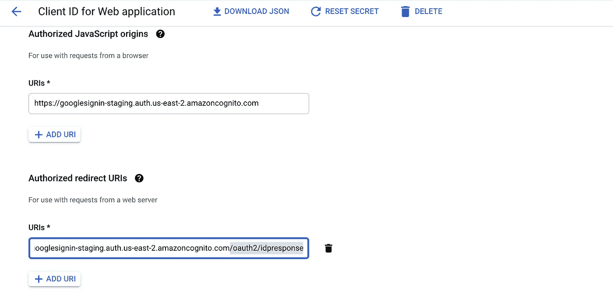

# 使用 Google 登录设置 AWS Amplify 应用程序

> 原文：<https://levelup.gitconnected.com/set-up-an-aws-amplify-app-with-google-sign-in-c738df79d272>


本文讨论了如何使用 React 应用程序前端设置一个带有 Google Sign 的 Amplify 应用程序。这也将提到如何为每个应用程序配置多个重定向 URIs。

第一部分专门介绍 React、Github、Amplify 和 Google 开发者控制台的样板设置，第二部分介绍如何添加 auth。

> /**如果您已经创建了一个应用程序，请跳过设置步骤，直接转到标题**添加授权以放大应用程序** */

# 设置反应和放大

## **1。创建一个新的 React 应用和 GitHub repo，在 Google 开发者控制台中添加一个项目**

**在命令行上**

*   在应用程序中创建一个带有`npx create-react-app google-test`、`cd`的 react 应用程序，并在您的本地机器上运行`npm start`来启动它。
*   在 GH 中为 app 新建一个回购，推送到这个回购。

**在 AWS 控制台**

*   登录 AWS 控制台，找到 Amplify 服务。
*   在主放大页面上，选择**开始**和**交付**创建一个 web 应用*或*从应用页面上，选择**新建应用**和 **Web 应用。**
*   选择 GitHub 作为提供商。
*   如果没有，请与 GH 联系。
*   选择回购和分支`main`。
*   选择默认构建设置。我使用 npm 作为包管理器，所以我在`npm start`和`npm run build`命令中从`yarn`改为`npm`。
*   保存。

您的 GH repo 将与 Amplify 实例同步，并将设置持续部署——


**在谷歌开发者控制台**

*   创建一个项目并命名。
*   在 API 和服务页面中，选择 **Oauth 同意屏幕**选项卡。
*   使用必填字段设置 OAuth 同意屏幕—这些字段稍后都可以更改。
*   选择**凭证**选项卡→创建凭证→ Oauth 客户端 ID


*   命名项目并保存它以获得 Oauth 客户端 ID 和密码。我以 JSON 的形式下载了它，以便于以后访问。

## 2.在 React 应用中设置 Amplify

**在命令行上**

*   `npm install -g @aws-amplify/cli` —安装 Amplify CLI，允许您使用前缀为`amplify`的 CLI 命令。

**在 AWS 控制台**

*   在您的项目页面中，单击**后端环境**选项卡→ **开始。**这将初始化一个后端环境。
*   完成后，点击**本地设置说明下拉菜单**并复制 CLI 命令:`amplify pull --appId {appId} --envName staging`

**在命令行上**

*   运行复制的命令。
*   在浏览器中登录放大管理用户界面。
*   从列出的选项中选择默认值或适用于您的项目的选项。

```
? Choose your default editor: **Visual Studio Code**
? Choose the type of app that you're building **javascript**
Please tell us about your project
? What javascript framework are you using **react**
? Source Directory Path:  **src**
? Distribution Directory Path: **build**
? Build Command:  **npm run-script** **build**
? Start Command: **npm run-script** **start**
? Do you plan on modifying this backend? **Yes**
```

*   `amplify pull`
*   `npm install aws-amplify`

# 将 auth 添加到 Amplify 应用程序

## 1.将 auth 添加到 Amplify 后端，并完成 Google Oauth 同意屏幕的设置

**在命令行上**

*   `amplify add auth` —我们现在正在将 **auth** 基础设施添加到我们的应用中！
*   它将显示一个选项列表—选择**与社交提供商(联盟)**的默认配置以使用社交登录和直接登录，并选择您希望用户能够进行身份验证的其他方式(电子邮件、用户名、电话号码)。

```
Do you want to use the default authentication and security configuration? **Default configuration with Social Provider (Federation)**
 Warning: you will not be able to edit these selections.
 How do you want users to be able to sign in? **Email**
 Do you want to configure advanced settings? **No, I am done.**
 What domain name prefix do you want to use? **googlesignin**
 Enter your redirect signin URI: [**https://main.dpdzznty4hgmh.amplifyapp.com/**](https://main.dpdzznty4hgmh.amplifyapp.com/)
? Do you want to add another redirect signin URI **Yes**
 Enter your redirect signin URI: [**http://localhost:3000/**](http://localhost:3000/)
? Do you want to add another redirect signin URI **No**
 Enter your redirect signout URI: [**https://main.dpdzznty4hgmh.amplifyapp.com/**](https://main.dpdzznty4hgmh.amplifyapp.com/)
? Do you want to add another redirect signout URI **Yes**
 Enter your redirect signout URI: [**http://localhost:3000/**](http://localhost:3000/)
? Do you want to add another redirect signout URI **No**
 Select the social providers you want to configure for your user pool: **Google**
```

*   对于**域名前缀，**你可以使用默认给定的，我只是有一个受保护的词，`aws`在我的，所以我不得不改变它。
*   对于**重定向签到/签出 URIs** 添加 Amplify app 的 URL，可以找到**前端环境**标签，结构类似`main. ... .amplifyapp.com`。我添加了两个重定向登录/注销 URIs，一个用于“已部署”URL，另一个用于 localhost 在我的本地机器上测试 auth。
*   `amplify push`

> ❓ **问:什么是重定向登录/注销 URI？**
> 
> ⁉️ **答:**当用户点击登录谷歌时，他们会被带到谷歌运营的页面，在那里他们的谷歌证书会被验证。如果你看看这个网页的网址，它是这样的:`[accounts.google.com/o/oauth](https://accounts.google.com/o/oauth2/auth/)…`。这意味着一旦注册完成，用户必须被推回到主站点。该 URL 定义了该用户将被推送到哪里。

**In React > src 文件夹**

*   一旦更新被推送，中的`/src`文件夹中的`aws-exports.js`文件将会使用 Amplify 中设置的 Oauth 配置进行更新。
*   复制 oauth 对象中的`domain`，例如`googlesignin-staging.auth.us-east-2.amazoncognito.com`

**在谷歌开发者控制台**

*   **凭证**选项卡→ Oauth 2.0 客户端 id→单击铅笔图标编辑您的项目。
*   将复制的域添加为授权的 Javascript 源，并重定向 URI。在重定向 URIs 部分的域末尾，添加`/oauth2/idpresponse`。这是不可配置的，所以您必须准确地添加片段。



> ❓ **问:** `**/oauth2/idresponse**` **片段是做什么用的？**
> 
> ⁉️ **答:**这个是来自 Amplify 的现有端点，在 Oauth 登录期间[处理重定向。因为您的 Amazon Cognito 用户池 URL 与您的应用程序相关联，它可以使用此端点将您的用户发送到您在 Amplify 配置中指定的重定向。](https://docs.aws.amazon.com/cognito/latest/developerguide/cognito-user-pools-social-idp.html#cognito-user-pools-social-idp-step-1)

# 在前端使用谷歌登录

## 1.将 index.js 配置为侦听多个重定向 URIs

*   首先，我们将把 Amplify 和 auth config 导入 React 应用程序，并添加一些条件来检测 env 将使用哪个重定向登录/注销 URI。
*   我粗略地使用了在重定向 URIs 标题下的放大文档[中概述的代码示例。](https://docs.amplify.aws/lib/auth/social/q/platform/js#amazon-cognito-user-pool-setup)

**index.js**

```
// add to existing imports
import Amplify from 'aws-amplify';
import config from './aws-exports'; // check if env is localhost or not
// if you're not developing on localhost, you will need to detect this is another way—the docs linked above give some examples. const isLocalhost = !!(window.location.hostname === "localhost"); // split redirect signin and signout strings into correct URIsconst [
productionRedirectSignIn,
localRedirectSignIn ] = config.oauth.redirectSignIn.split(",");const [
productionRedirectSignOut,
localRedirectSignOut ] = config.oauth.redirectSignOut.split(","); // use correct URI in the right envconst updatedAwsConfig = {
...config,
oauth: {
...config.oauth,
redirectSignIn: isLocalhost 
    ? localRedirectSignIn 
    : productionRedirectSignIn,
redirectSignOut: isLocalhost 
    ? localRedirectSignOut 
    : productionRedirectSignOut, }
} Amplify.configure(updatedAwsConfig);
```

> 您可以通过只让 auth 在开发或生产环境中工作来避免多次重定向 this 但这似乎会使测试/部署更加困难。

*   需要一些基本的用户界面来完成这个例子。我跑`npm i skylight-react`是为了用一个我做的基本组件库，但是用什么组件由你决定！要使用 AWS UI 库，也要安装`@aws-amplify/ui-react`包……我觉得这个 UI 库简直太单调了，不过那是主观的。
*   我们将配置 App.js，使用 Amplify **Auth** 类检查每个页面刷新中是否存在用户，并使用事件监听器组件 **Hub** 监听 Auth 事件登录和注销。

## 2.监听身份验证并将用户存储在状态中

这建立了一个基本的配置，如果有用户，他们将被定向到<userhome>页面，如果没有，将被定向到一个普通的<landing>页面。</landing></userhome>

*   在这个例子中，我将用户存储在简单的 useState 中，但是更大的应用程序将使用 useContext 钩子或状态管理库来存储用户。

**App.js**

```
import React, { useEffect, useState } from 'react';
import { Hub, Auth } from 'aws-amplify';
import { Loader } from 'skylight-react';
import './App.css';
import 'skylight-react/dist/skylight.css';
import Landing from './modules/Landing';
import UserHome from './modules/UserHome';function App() {// init state to store user and show loader const [user, setUser] = useState(null);
const [loading, setLoading] = useState(true); // get userasync function getUser() {
try {
const token = await Auth.currentAuthenticatedUser();
   setLoading(false);
   setUser(token);
} catch(err) {
   console.log(err);
   setLoading(false);
   }
}//listen for sign in + out events, if neither are happening check if user exists useEffect(() => {
Hub.listen('auth', ({ payload }) => {
   if (payload.event === 'signIn') {
      return getUser();
} if (payload.event === 'signOut') {
      setUser(null);
      return setLoading(false);
     }
});getUser();
}, []); // show loading screen while fetching, otherwise return pageif(loading) return <Loader/>return (<div className="App"> {user ? <UserHome email={user.attributes.email}/> : <Landing/>}</div>)};export default (App);
```

*   我们在每次登录事件或任何没有注销事件的页面加载时检查用户。`currentAuthenticatedUser()`方法返回一个 CognitoUser 类，该类包含关于用户及其元数据的信息。这个物体看起来像这样:


*   属性是一个包含用户信息的对象，比如 email。这就是如何使用`user.attributes.email`属性在前端获取用户的电子邮件。
*   如果没有 auth user，则不会返回任何内容。
*   *参见底部的参考资料部分，获取 Hub 和 Auth 的开发文档。*

## 3.使用 Google 按钮登录，并添加到登录页面

*   从谷歌[这里](https://developers.google.com/identity/branding-guidelines)下载资产或获取按钮的规格。

```
import React from 'react';
import { Auth } from 'aws-amplify';
import btn from '../../assets/auth/btn_normal.png';const GoogleSignIn = () => {return (<button onClick={() => Auth.federatedSignIn({ provider:"Google" })}></button>);}export default GoogleSignIn;
```

**Landing.js**

```
import React from 'react';
import GoogleSignIn from './auth/GoogleSignIn';
import { Flex } from 'skylight-react';const Landing = () => {return (
<Flex column center middle gap={1} height="100vh" width="100%"><h3>Authenticate to continue</h3><GoogleSignIn/></Flex>);
}export default Landing;
```

*   为经过身份验证的用户创建一个基本页面。
*   在屏幕上显示用户的电子邮件以证明他们已登录。

## 4.创建一个只对授权用户可用的受保护页面

**UserHome.js**

```
import React from 'react';import { Flex } from 'skylight-react';const UserHome = ({ email }) => {return (<Flex center middle height="100vh" width="100%" gap={1}><h3>Hello, {email}.</h3><p>This route is for protected users :~)</p></Flex>);}export default UserHome;
```

*   按下 GitHub，等待 Amplify 中的更改同步。
*   这应该对 AWS 和 localhost 给我们的 URL 都有效:3000！


匿名用户的超级基本登录页面

*   点击使用 Google 登录


Google Oauth 屏幕

*   注意 Oauth 屏幕上的名称是 amazoncognito.com，而不是配置的应用程序名称。这是因为我们的应用程序是一个**未验证的**外部应用程序，必须通过谷歌验证才能使用显示名称。
*   选择一个帐户并进行身份验证。


我们在…

*   要查看用户，请转到 AWS 控制台中的 Cognito 服务，然后单击**用户池** →选择您的项目→用户和组


唯一的，孤独的用户

这是我们的单一用户！

我们有效地完成了这一指南。一些最后要考虑的事情…

*   Amazon 使用本地存储来存储 ID、访问和刷新令牌。所有这些都可以通过在浏览器的开发工具中打开本地存储，在 JS 中检查它，或者运行`const session = await Auth.currentSession()`并查看`session`来查看。


*   默认情况下，访问和 id 令牌为 60 分钟，但最长可达一天。[来源](https://docs.amplify.aws/lib/auth/emailpassword/q/platform/js#sign-out)。
*   刷新令牌可以刷新自发布时间起 30 天的访问权限，但可以设置为 60 分钟到 10 年。[来源](https://docs.aws.amazon.com/cognito/latest/developerguide/amazon-cognito-user-pools-using-the-refresh-token.html)。

**放大参考文献:**

[放大 Oauth 实现文档](https://docs.amplify.aws/lib/auth/social/q/platform/js#amazon-cognito-user-pool-setup)—非常全面，参见代码示例

[授权文档](https://aws-amplify.github.io/amplify-js/api/classes/authclass.html) ⚫️ [用户检索方法的解释](https://medium.com/@dantasfiles/three-methods-to-get-user-information-in-aws-amplify-authentication-e4e39e658c33)—这很有用，因为授权 API 文档很差

[Hub docs](https://docs.amplify.aws/lib/utilities/hub/q/platform/js) ⚫️ [可以监听的 Hub auth 事件的完整列表](https://docs.amplify.aws/lib/auth/auth-events/q/platform/js)

[谷歌登录按钮开发文档](https://developers.google.com/identity/branding-guidelines)

**参考资料上的社会标志:**

[AWS |引擎盖下的社会服务提供者联盟](https://docs.amplify.aws/lib/auth/overview/q/platform/js#accessing-aws-services)

[媒介|社会认证如何工作](https://medium.com/@bretanac93/how-social-authentication-works-787e4508b75d)

[Auth0 |学习社交登录](https://auth0.com/learn/social-login/)

[Okta | Oauth 是什么鬼？](https://developer.okta.com/blog/2017/06/21/what-the-heck-is-oauth)