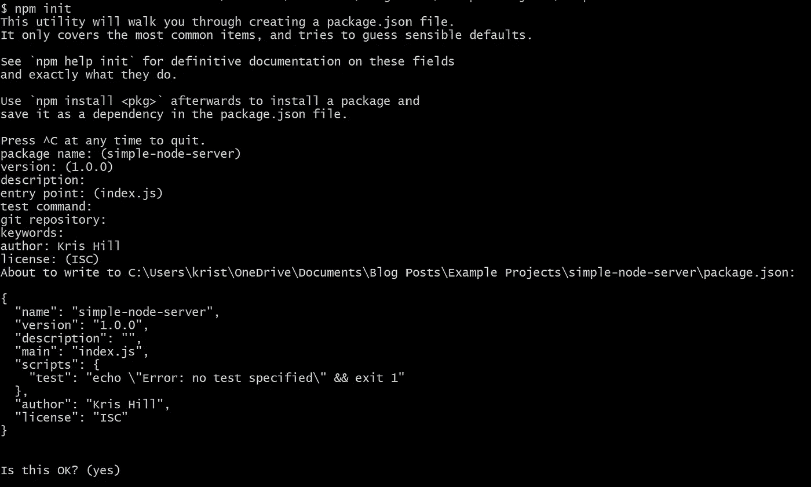
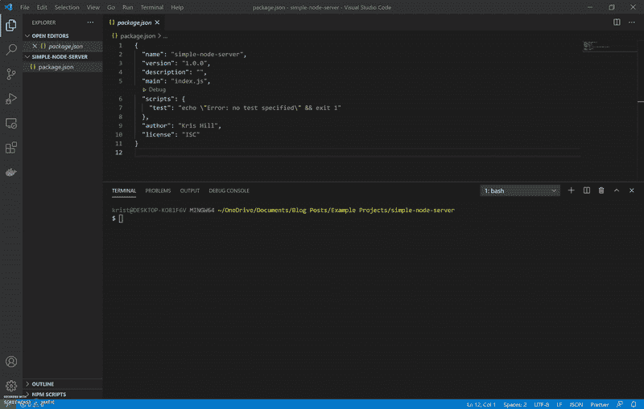
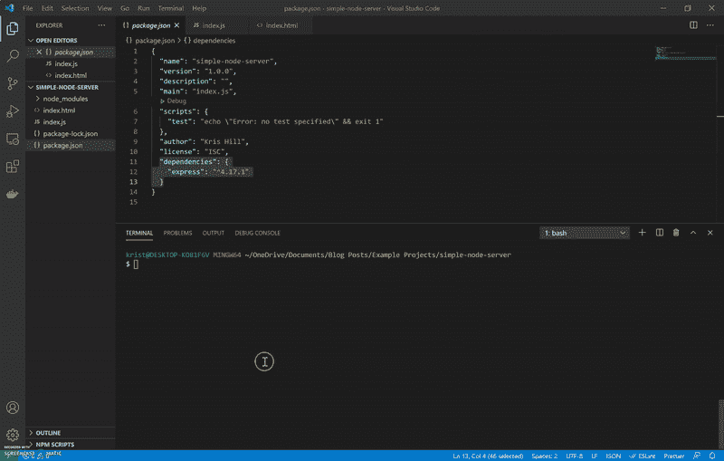

# 设置并运行一个简单的节点服务器项目

> 原文：<https://levelup.gitconnected.com/set-up-and-run-a-simple-node-server-project-38b403a3dc09>

我学习计算机编程已经快三年了，我注意到了一个新的发展，我掌握了实际帮助其他开发者的技术知识。所以，我想我应该开始写下我所熟悉的东西，来帮助我记住我所知道的，并为其他人提供参考。为此，我从一些简单的东西开始，一个用静态文件响应请求的节点应用程序。或者，至少这在有经验的开发人员中可能*看起来*简单，但是我将对此略加赘述，因为我希望具有最低限度的 web 开发知识的人至少能够开始使用这个 Node 应用程序，并在完成本教程后为接下来的有趣内容打下坚实的基础。尽管如此，我不能解释所有的事情，所以如果你想的话，有时我会送你去学习更多。

## **加入升级人才集体**

[](https://jobs.levelup.dev/talent/welcome?referral=true) [## 升级—转变技术招聘

### 升级—转变技术招聘🔥使软件工程师能够找到完美的角色…

作业. levelup.dev](https://jobs.levelup.dev/talent/welcome?referral=true) 

在本教程中，我将介绍设置节点服务器的步骤。从客户机的角度来看(客户机是与服务器通信的人/计算机)，这个服务器只做一件事:显示一个单一的静态 HTML 页面。没有 CSS，没有前端 JavaScript，没有数据库连接，什么都没有，只有最少的 NPM 包(我会解释一下 NPM 在哪里)。事实上，我们甚至不会在实际的互联网上运行它，我们只是在本地运行它。我还应该补充一点，如果你想了解服务器一般是如何工作的，客户端-服务器通信的机制，这一点很重要，如果你想做更严肃的节点工作，我就不在这里讨论了。

首先，让我们回顾一下大致情况:

1.  去 NodeJS 网站下载 NodeJS
2.  确保安装了节点和 NPM，并定义了它们的路径
3.  创建新的项目文件夹
4.  在你的项目文件夹中开始运行 NPM(它在后台运行)
5.  安装我们需要的任何 NPM 软件包
6.  在项目文件夹中创建一个 HTML 文件(这是客户端将看到的内容)
7.  在项目文件夹中创建一个节点/JavaScript 文件(这是您的服务器文件)
8.  运行您的服务器
9.  访问您的(本地)网站！

**第一步:去 NodeJS 网站下载 NodeJS**

[这里是 NodeJS 网站](https://nodejs.org/en/)。如果你正在遵循这个教程，那么我会推荐你**下载 LTS(长期支持)版本**，这是大多数人使用的稳定版本，如果出现问题，你将有更好的时间获得帮助。这个部分的标题在技术上有误导性，你实际上下载了 NodeJS *安装程序*，一旦下载完成，你应该打开它并按照指示安装 Node。

**第二步:确保安装了节点和 NPM，并定义了它们的路径**

一旦下载并安装了 NodeJS，您将希望通过在终端中运行以下命令来确保 Node 实际上安装正确:

```
node -v
```

这将返回一个版本号，如下所示:

```
v14.15.0
```

安装 Node 时，还会安装 Node Package Manager，通常简称为 NPM。就命令行而言，您很可能会更多地与 NPM 交互，而不是与 Node 交互。我稍后会解释它是做什么的，但是现在，只需要检查一下 NPM 是否已经安装，它的路径是否正确。要检查这些，请执行与节点相同的操作:

```
npm -v
```

这将返回一个类似的数字，如:

```
6.14.8
```

事实上，这是在命令行上检查大多数程序的常用技术。在不深入了解命令行语义的情况下，大多数(all？)您将在命令行上与之交互的程序可以处理-v 标志，因此您几乎总是可以通过遵循以下格式来检查您安装的在命令行上使用的工具/程序是否正常工作:

```
<name of program> -v
```

如果一切顺利，你就可以开始下一步了。如果你收到这条信息:

```
'node' is not recognized as an internal or external command,
operable program or batch file.
```

你应该做的第一件事是检查你的路径变量，因为 9/10 次，这是这个错误的问题。为了让这篇文章尽可能的简短，我不会去解决这个问题，但是这是一个很常见的问题，很多人都在网上问过。一旦节点和 NPM 正常工作，我们就可以进入下一步了。

**第三步:创建一个新的项目文件夹**

您可以将项目文件夹放在电脑上的任意位置，并随意命名。这一步很容易。每个人都知道如何创建一个新的目录或文件夹，对吗？

**步骤 4:在你的项目文件夹中开始运行 NPM**

好吧，那么 NPM 到底是什么？你可以去[网站](https://docs.npmjs.com/about-npm)亲自看看，但是对于刚刚学习 Node 的人来说，让它变得简单一点，一个包只不过是一个被设计来与你的 Node 应用一起工作的程序。当您需要您的 web 应用程序做一些事情、执行一些逻辑、操作一些数据或与互联网上其他地方的另一个服务通信时，您可以查找一个包，下载它，并将其添加到您的项目中，而不是自己在节点文件中编写所有代码。这并不是说使用 NPM 包总是很容易，通常仍然需要编写一些代码来创建节点项目和包中代码之间的接口，有时这些代码可能有点棘手。

这是你如何开始在你的项目文件夹中运行 NPM:

*   打开终端
*   更改目录，直到进入项目文件夹
*   在终端中运行命令`npm init`

此时，应该会提示您输入以下信息:

```
This utility will walk you through creating a package.json file.It only covers the most common items, and tries to guess sensible defaults.See `npm help init` for definitive documentation on these fieldsand exactly what they do.Use `npm install <pkg>` afterwards to install a package andsave it as a dependency in the package.json file.
```

下面应该是这样的:

```
Press ^C at any time to quit.package name: (simple-node-server)
```

“package name:(simple-node-server)”这一行以及您将在此设置过程中看到的所有后续行首先说明它们需要什么变量(在本例中为`package name`)，其右侧要么是括号中的内容，要么是空白。括号中的值是默认值，对于这些行中的每一行，您可以只按 enter 键接受默认值(也可以接受空白默认值)，或者您可以键入自己的值，然后按 enter 键。大多数刚刚起步的人坚持使用默认设置。

关于这个设置需要知道的另一件事是，`entry point`变量将是你的主服务器文件(在较大的项目中，通常有多个服务器文件，所以 Node 将使用入口点文件来启动应用程序，但是对于像这样的简单文件，我们只需要一个)。当我开始使用 Node 时，让我感到困惑的是开发人员给他们的主服务器文件起了不同的名字，我见过的最常见的是:

*   索引. js
*   app.js
*   server.js

主服务器文件的名称是任意的，这可能会引起混淆，因为您将与 Node 一起使用的一些服务希望服务器文件具有特定的名称和/或位于特定的位置。对于这个简单的服务器来说，这并不是非常重要，但是如果你开始看例子的话，一定要记住这一点。

完成后，终端应该如下所示:



您的项目文件夹中应该有一个名为 package.json 的文件，如下所示:

**第五步:安装任何 NPM 软件包:**

好了，现在我们已经将 NPM 连接到我们的项目，我们将使用命令行安装一个 NPM 包。您将在大多数节点服务器项目中使用这个特定的包。它被称为 Express.js，它与 Node 本身同义，在大多数 Node 项目中，您实际上会使用 Express 中的对象和方法，这些对象和方法使运行常见的 web 开发过程(如路由、数据库集成、错误处理和使用前端模板)变得更加容易。

我们的根项目文件夹中的 package.json 文件保存了关于我们的应用程序的一些基本信息，但是 package.json 文件最常见的用途是保存我们下载并保存到我们的项目中的所有包的记录。这一点很重要，因为为了让我们的项目代码在其他环境中运行(例如，如果您正在与一个团队合作，或者您有一个开源项目，您希望其他人能够在他们自己的计算机上工作，或者如果您希望将它部署在亚马逊网络服务(AWS)、谷歌应用引擎(GAE)、Heroku 或一些类似的服务上)，其他环境需要知道您的项目使用了哪些 NPM 包，以便可以下载和保存它们。package.json 实际上做了很多不同的事情，但是现在，您只需要知道它保存了项目的基本信息，包括包。

简而言之，将包连接到我们的应用程序有两个部分:

1.  从 NPM 下载/安装软件包
2.  将包名和版本号保存在 package.json 中的“Dependencies”下

要下载并安装一个 NPM 包到我们的项目中，在本例中是`express`，我们将需要从您的终端运行下面的命令(当您运行这个命令时，确保您在项目的根文件夹中):

```
npm i -s express
```

*   `npm`是您正在运行的程序的名称
*   `-i`是`--install`的简称，你可以使用其中任何一个。这将把`express`添加到根项目文件夹中的一个名为`node_modules`的文件夹中。需要注意的是，在第一个软件包安装 NPM 之前，这个文件夹不会添加到您的项目文件夹中。(这就是为什么您还没有在项目文件夹中看到它)。
*   `-s`是`--save`的简写别名，你可以使用其中任何一个。这是一个可以添加到 npm install 命令中的标记，用于自动保存到 package.json 中。需要注意的是，如果您忘记了`-s`或`--save`，您可以手动将软件包名称和版本号添加到 package.json 中。无论如何，只要确保软件包名称和版本号在您的 package.json 中即可。



看到底。你看到了吗？Node 自动将 express 添加到 package.json，将 node_modules 文件夹添加到根文件夹。

**第六步:创建一个 HTML 文件**

这可能是创建项目文件夹之后第二简单的步骤。将扩展名为'的文件添加到文件夹中。“html”。一个常见的惯例是将主 html 文件命名为“index.html”，但这不是一个硬性规定，所以您可以随意命名。

这就是你在 html 文件中所需要的，但是你可以随意把它做成你想要的任何类型的 html 页面:

**第七步:在项目文件夹中创建一个节点/JavaScript 文件**

在项目的根文件夹中，创建一个名为“index.js”的文件。对，没错，现在有一个文件叫‘索引’。html 和一个名为‘index’的文件。在你的根文件夹中。如果这令人困惑，您只需习惯它，事实上，一旦您知道了规则(更像是一个指南)，如果 Node 在启动您的服务器或呈现您的某个页面时遇到问题，它可以方便地进行调试。规则是:

> [如果目录中没有 package.json 文件，那么 Node.js 将尝试从该目录中加载一个](https://nodejs.org/dist/latest-v7.x/docs/api/modules.html#modules_folders_as_modules) `[index.js](https://nodejs.org/dist/latest-v7.x/docs/api/modules.html#modules_folders_as_modules)` [或](https://nodejs.org/dist/latest-v7.x/docs/api/modules.html#modules_folders_as_modules) `[index.node](https://nodejs.org/dist/latest-v7.x/docs/api/modules.html#modules_folders_as_modules)` [文件。](https://nodejs.org/dist/latest-v7.x/docs/api/modules.html#modules_folders_as_modules)

许多前端框架，从 Handlebars 之类的模板引擎到 React 之类的 JavaScript 框架，都利用了这一点，在某些文件夹中寻找 index.js 文件作为特定目录的入口点。

无论如何，如果你对服务器实际上是如何工作的一无所知，这里有一些关于服务器工作的最基本的东西:

1.  打开端口以侦听来自客户端的传入请求
2.  定义如何处理每个进来的请求(服务器的响应)

这是对被恰当地称为请求-响应循环的最简单的描述，也是互联网主要是如何工作的。因此，我们需要设置我们的服务器来做到这一点。

在 Node/Express 应用程序中，这是以某种方式完成的:

1.  导入我们刚刚安装的 Express 依赖项。
2.  实例化(即创建一个实例)Express app 对象。这个 app 对象有一大堆内置的方法和变量，您可以将它们用于您的服务器，您马上就会看到其中的两个。
3.  将端口号保存在变量中。这在该应用中是可选的，但当你开始与他人开发应用并将你的应用部署到一些基于云的服务时，你会想要添加一些逻辑，以便你的应用可以确定它在什么样的环境中工作并使用适当的端口。
4.  设置路由，在这种情况下只有一个，它的工作是在应用程序的根目录('/')接收任何请求，并通过向客户端的浏览器发送 HTML 文件进行响应。同样，如果您在任何大型节点应用程序上工作，您将有多个路由，并且通常是完全独立的路由器文件，每个都有自己的多个路由，连接到您的主服务器文件。
5.  最后，我们需要为服务器设置监听端口。这是等待传入连接的文件，在 Express 应用程序中，它总是在文件的末尾。

好吧，你是这样做的:

1.  要将依赖项导入到节点文件中，需要遵循以下格式:

```
const <variable-name> = require('<name-of-package>');
```

这方面的一些要点:

*   `<variable-name>`是一个任意的名字，你想用什么就用什么，真的。但是，最佳实践是根据这些变量各自的依赖关系来命名它们。
*   `require()`是一个内置的节点函数，允许您访问另一个节点文件的代码。您可以将它用于您引入到节点服务器中的每个依赖项，您也可以编写自己的节点文件，并以同样的方式将它们导入到主服务器文件中。
*   `<name-of-package>`应该是您希望导入的文件夹或文件的确切名称(如果您只是导入一个 JavaScript 文件，您可以关闭文件扩展名)。如果您要导入的是 NPM 包，您可以只使用 package.json 作为参考，因为 package.json 中列出的内容应该与您在节点服务器文件中需要的字符串相同。在我们的 package.json 中，依赖关系如下所示:

```
"dependencies": { "express": "^4.17.1"}
```

所以，package.json 说，' express '，我们的 require()函数接受字符串，' express '。

2.接下来，我们需要在 Express 中创建 app 对象的实例。如果你想用 Node 构建应用程序，应用程序对象是你想要彻底理解的东西。我们像这样实例化它:

```
const app = express();
```

*   这只是运行您在上面的行中导入的依赖项，该依赖项导出一个 app 对象，该 app 对象保存到名为 app 的常量变量中。正是这个 app 对象保存了 Express 代码，并且您将与它进行最多的交互。

3.这很简单，现在只需在变量 port 中保存一个端口号。3000 到 8000 之间的任何数字的作品，大多数人都会选择 3000 或 8000。

```
const port = 5000;
```

4.基于 [HTTP 方法](https://developer.mozilla.org/en-US/docs/Web/HTTP/Methods),[app 对象包含几个用于路由请求](https://expressjs.com/en/4x/api.html#app.METHOD)的函数，这些函数中最常见的有:

*   app.get()
*   app.post()
*   app.put()
*   app.delete()
*   app.use()
*   app.all()

我认为其中最常见的一个，也是我们现在要使用的一个，是 app.get()，它用于 get 请求，是您每次访问网站时要做的事情。GET 请求是互联网上最常见的一种请求，所以我们来看看 app.get()。[快递单据给我们下了这个定义](https://expressjs.com/en/4x/api.html#app.get.method):

> **app.get(path，callback [，callback …])**
> 
> 使用指定的回调函数将 HTTP GET 请求路由到指定的路径。

他们给了我们一个例子:

```
app.get('/', function (req, res) {
  res.send('GET request to homepage')
})
```

因此我们可以看到，从定义中我们应该期望 app.get()接受两个参数，*路径*和任何*回调函数*。在示例中，我们可以看到有两个参数:

*   `'/'` =路径
*   `function (req, res) { res.send('GET request to homepage')}` =回调函数

在这个例子中，只有一个回调函数，但是可能有一大堆回调函数。在 Express 中，他们称这些为中间件，因为它们被插入到您的路由中间，介于服务器收到客户端请求和服务器发回响应之间。此外，在较大的节点项目中，中间件功能的数量可能会变得相当大，并且路由通常具有多个中间件功能。也有许多 NPM 包，您可以在您的节点项目中使用，它们被编写为像中间件一样使用。[的确，这就是全部的表达，真的](https://expressjs.com/en/guide/using-middleware.html):

> Express 是一个路由和中间件 web 框架，它本身的功能很少:Express 应用程序本质上是一系列中间件函数调用。

在 Express 中，许多中间件将在其他地方定义，并以其名称传递给路由函数，但路由函数中的最后一个回调函数通常看起来像本例中的函数，您应该知道这一点:

*   它有两个参数:req 和 res。这些是内置对象，可以帮助您在新的请求-响应周期中做很多有趣的事情，Express 希望它们出现在它们的中间件功能中。目前，我们没有使用 req 对象，但是如果您的应用程序有输入或 url 编码的数据(在 url 中传递给服务器的东西)，您可以使用 req 对象访问这些信息。res 对象是当您的服务器发送响应时您将使用的对象。值得注意的是，您实际上不需要将它们命名为 req 和 res，Express 将使用您使用的任何名称来代替 req 和 res，但是文档中所有的内容都引用了 req 和 res，并且绝大多数节点服务器都遵循这一约定，所以我也会这样做。
*   它实际上与大多数被认为是中间件的东西略有不同，因为它没有下一个参数，大多数中间件用它来告诉 Express 继续到下一个中间件。当这个函数调用 res.sendFile()时，这是请求-响应周期的结束，服务器完成了该请求。

如果你想了解更多关于 res.sendFile()，[去阅读文档](https://expressjs.com/en/4x/api.html#res.sendFile)，但是现在只知道

```
res.sendFile('<file-name>', {root: __dirname});
```

是如何从服务器文件(index.js)所在的同一文件夹(根目录)中发送文件。

5.最后，我们希望设置服务器知道的代码来监听传入的请求。Express 中的 app 对象有一个名为 app.listen()的函数，所有参数都是可选的，包括端口号。然而，通常你至少会看到一个端口号，而且经常会看到一个回调函数被传递。我在应用程序中使用的 app.listen()的完整版本是:

```
app.listen(port, () => {
    console.log(`Now listening on port ${port}`);
}); 
```

好的，让我们把这个分解，然后我们可以把它包起来。

*   是我们在 index.js 文件顶部定义的同一个端口吗
*   是一个箭头函数，它做的事情和 JavaScript 中的常规函数完全一样，只是看起来更干净一点。
*   `console.log()`可能是您以前见过的，但是如果没有，这一行将会把提供给它的字符串打印到控制台上。

总的来说，index.js 文件应该如下所示:

**步骤 8:启动节点服务器**

这是它的编码部分。下一步是实际启动服务器！您可以通过打开终端并运行以下命令来实现:

```
node index.js
```

您应该看到您的 console.log 消息出现在您的控制台中，带有您告诉它使用的任何端口号。



第九步:访问你的(本地)网站！

剩下唯一要做的就是去你的网站。您的站点托管在您给定的端口上的本地主机上。打开浏览器，使用以下网址:

```
localhost:<port number>
```

您应该可以获得 HTML 页面中包含的所有内容！恭喜你，你主持了你的第一个节点网站！

你觉得这个教程怎么样？您是否能够按照所有步骤操作，并在本地运行一个简单的 html 页面？有什么术语令人困惑吗？它们是什么？请在评论中告诉我。

# 分级编码

感谢您成为我们社区的一员！在你离开之前:

*   📰查看[级编码出版物](https://levelup.gitconnected.com/?utm_source=pub&utm_medium=post)中的更多内容
*   🔔关注我们:[推特](https://twitter.com/gitconnected) | [LinkedIn](https://www.linkedin.com/company/gitconnected) | [时事通讯](https://newsletter.levelup.dev)

🚀👉 [**将像你这样的开发人员安置在顶级创业公司和科技公司**](https://jobs.levelup.dev/talent/welcome?referral=true)

[](https://jobs.levelup.dev/talent/welcome?referral=true) [## 升级—转变技术招聘

### 升级—转变技术招聘🔥使软件工程师能够找到完美的角色…

作业. levelup.dev](https://jobs.levelup.dev/talent/welcome?referral=true)