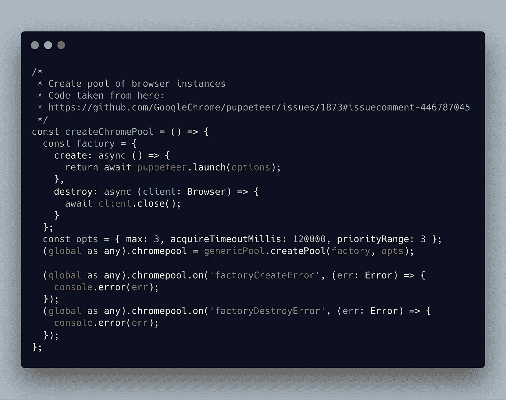
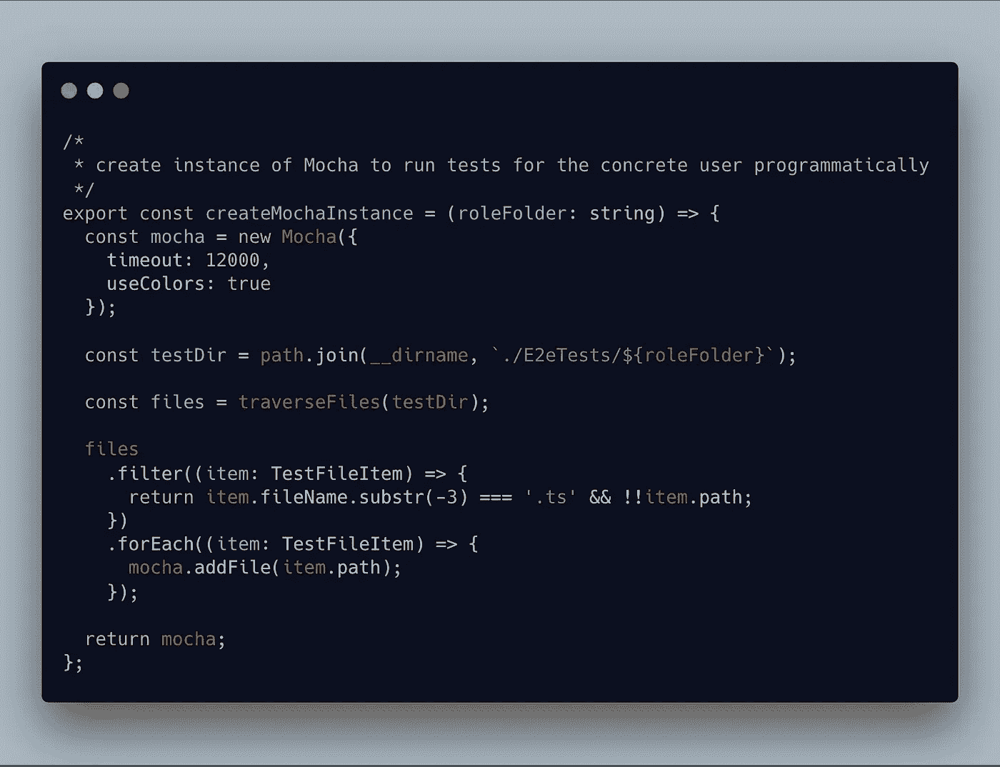
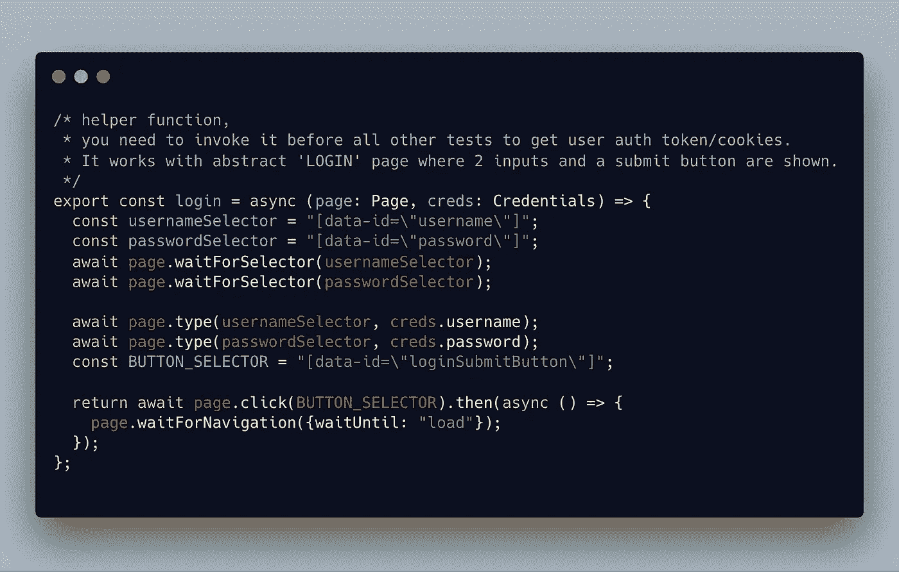

# 用木偶师和摩卡建立端到端的测试

> 原文：<https://levelup.gitconnected.com/set-up-end-to-end-tests-with-puppeteer-and-mocha-4bb0c24b563a>

## 如何在主测试套件之前登录，并在并行浏览器实例中运行几个套件

[rawpixel](https://unsplash.com/photos/UAOJ9MlbnL8?utm_source=unsplash&utm_medium=referral&utm_content=creditCopyText) 在 [Unsplash](https://unsplash.com/?utm_source=unsplash&utm_medium=referral&utm_content=creditCopyText) 上的照片

最近，我设法在我们的项目中设置了对**木偶师**和**摩卡**的端到端测试，我想谈谈使用这些工具时的一般过程和技术。

> 我所说的端到端( **e2e** 在本文的其余部分)测试指的是自动脚本，它会检查你的应用程序，检查界面元素、网络请求和应用系统的其他部分的工作。它可以是复杂的场景，如登录和创建比萨饼订单，但也可以是更简单的应用程序栏导航或使用过滤工具的情况。

[木偶师](https://github.com/GoogleChrome/puppeteer)是一个非常受欢迎的库，[它与 Jest](https://jestjs.io/docs/en/puppeteer) 的结合使用在例子中最常见。然而，在某种程度上，我们面临着不太方便的 Jest 方面:由于超时和复杂的依赖关系管理，当更新一个库时，异步测试失败。Jest 的普遍性和它为我们做出的决定有时也会成为一个障碍，至于 e2e 测试，我们希望对它们的执行有更细粒度的控制。(我承认，大约六个月前我曾为此尝试过 Jest，可能从那以后安装和调试变得容易多了。)

> 注意:我的例子反映了一个相当具体的设置，但是我希望对这个使用 Puppeteer 的特殊案例的描述将有助于您的工作和实验。这篇文章并不想成为编写 e2e 测试的通用方法的概括或例子。

我在 Github 上的沙盒项目中创建了[分支，以共享带有基本示例的测试设置的样板代码。请注意，这里既没有业务逻辑，也没有真正的组件，它只是用作一个方法演示。然而，我认为`main.puppeteer.ts`文件的基本框架可能对那些正在与类似问题作斗争的人有所帮助。我非常希望如此。](https://github.com/ainalain/sandbox/tree/puppeteer-and-mocha-boilerplate)

## 测试设置和分组

这是我们项目的初始状态，需要 e2e 测试。这是一个基于 Typescript 和 React 的 web 应用程序，为具有不同权限和角色的用户提供不同级别的访问。除了两个传统的“用户”和“管理员”之外，还有更多角色。根据用户的身份，会呈现特定的界面和完全不同的场景，因此身份验证对于我们的测试脚本正确工作是必要的。

我们假设，在未来，单一的应用程序可以被分解，潜在地，交付给特定类型用户的每一种最终类型的应用程序都可以成为这样的一部分。如果应用程序的不同部分可以映射到不同的用户类型，那么测试也可以做到这一点。
因此，我想到了这个方案:我们有一个共同的输入点，为所有可用的脚本启动流程(它是`main.puppeteer.ts`)，以及对应于每种类型用户的测试文件夹:

测试按用户类型分组

我们决定为不同的用户类型编写独立的测试套件。在我的例子中，我们在公共的`E2eTests`文件夹中有 3 个目录:用于*医生*、*父母*和*管理*用户类型。此外，我们将有一个带有认证助手功能和一些测试数据的`testUtils`文件夹。

那么，主要切入点呢？

我想做一个简短的 main 函数，为三个用户启动三个浏览器实例，用 Mocha 运行所有测试，然后成功退出/出错。

我没有尝试很多方法来并行运行几个浏览器实例:在谷歌搜索问题时，你可以找到各种库或代码片段。我尝试的第一个解决方案效果很好，所以目前是[泛型池](https://www.npmjs.com/package/generic-pool)库为我们的 Chromium 实例创建工厂，我使用[这个来自一个木偶问题的答案](https://github.com/GoogleChrome/puppeteer/issues/1873#issuecomment-446787045):

创建浏览器实例池

此外，我们需要一个函数来创建一个 Mocha 实例。我非常喜欢 Mocha 的这个特性:[您可以从代码](https://github.com/mochajs/mocha/wiki/Using-mocha-programmatically)开始运行您的测试，使用一些在 npm 脚本中不可能或不那么简单的条件选项。因此，在我们的主设置中，我们创建了 3 个 Mocha 实例，并给每个实例一个文件夹，其中包含针对具体用户的测试:

创建 Mocha 实例，并给它适当的文件

因为我们打算在配置项中使用这些测试，所以我希望在其中一个测试失败时得到失败消息。我决定使用`Promise.all`机制来控制所有的测试套件:`main`函数为 3 种用户类型创建 3 个承诺，并等待`resolve/reject`结果；

创建成套承诺的主要功能的一部分

这是一个创建承诺的功能，它采用准备好的早期浏览器和 Mocha 实例，并通过用户类型引用结果来运行测试:

运行测试套件并解决。拒绝承诺

粉笔对着色结果很有用:我们使用 Gitlab 控制台，在那里更容易阅读彩色日志。

您可能已经注意到，我没有展示测试代码本身的任何例子。这是因为围绕木偶师教程有大量干净有用的测试示例。repo 中有[个测试用例](https://github.com/ainalain/sandbox/tree/puppeteer-and-mocha-boilerplate/src/E2eTests)的基本例子。与此同时，有一个非常重要的测试对于运行所有的 rest suites 至关重要:`authentication.helper.ts`。该脚本在应用程序界面中使用标准登录表单，并在身份验证成功时解析承诺。在 **之前的**都是套房的**，所以是套房承诺的一部分:**

“登录”助手功能

最后，我们的`main`函数看起来像这样:

将在配置项脚本中启动的主要功能

总有改进的空间，但这一基本配置足以涵盖我们的应用程序与简单的 e2e 测试。

## 额外收获:为运行 e2e 测试配置 Gitlab CI

我提到过我们使用 [Gitlab CI](https://docs.gitlab.com/ee/ci) ，所以我将添加一个为我们的测试配置作业的`.gitlab-ci.yml`示例。这是配置的简化版本，没有缓存和其他阶段，也没有可能在您的 CI 中运行的作业。

在 Gitlab runner 中运行 Chromium 时，有一件事是你应该注意的:浏览器需要一堆 Chromium 依赖项来启动。可以通过在运行测试的机器上安装所有必要的包或 Chromium 本身来预先准备它们。在我们的示例中，我们在脚本之前安装依赖关系:

的简单版本。gitlab-ci.yml 文件

我们测试结果的日志如下所示:

终端/Gitlab 控制台中的测试结果日志

仅此而已！我意识到这个故事似乎描述了一个特定的情况，这个认证的解决方案可能有点奇怪。然而，目前，这种设置适合我们的项目需求，我认为它可以很好地与您分享。有时你会发现自己在谷歌上搜索一个非常具体的问题，或者在无限的 Github 问题中挖掘😞。也许这篇文章会帮助你🌷。感谢您的时间和关注。

 [## 学习 TypeScript -最佳 TypeScript 教程(2019) | gitconnected

### 18 大 TypeScript 教程-免费学习 TypeScript。课程由开发人员提交并投票，从而实现…

gitconnected.com](https://gitconnected.com/learn/typescript)