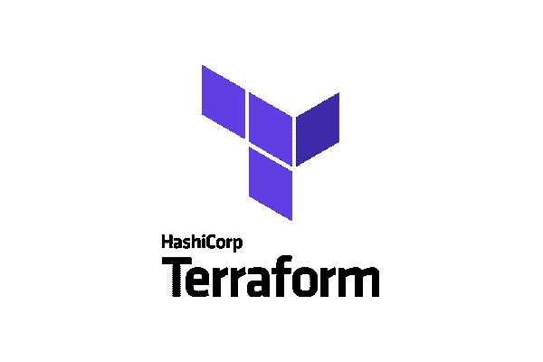
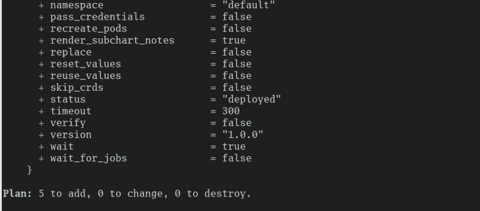
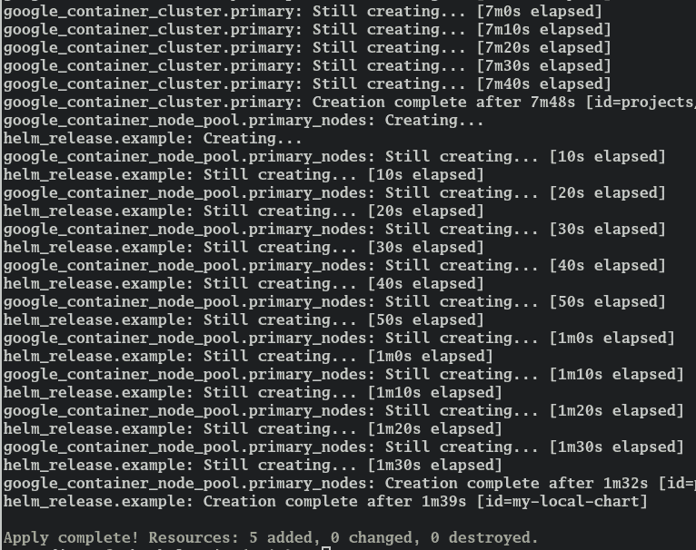
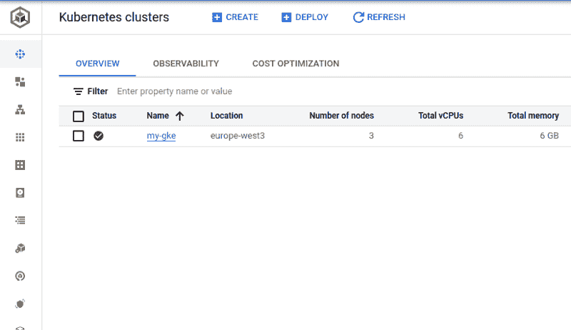
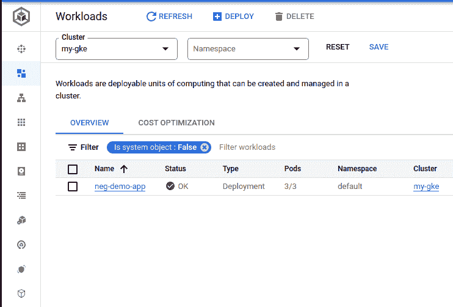

# 用地形在你的 GKE 集群上设置头盔

> 原文：<https://levelup.gitconnected.com/set-up-helm-on-your-gke-cluster-with-terraform-898f44faaaa5>

在这篇简短的文章中，我将向您展示如何使用 Terraform 通过 GKE 在 GCP 上设置 Kubernetes 集群，并在没有任何手动干预的情况下使用 Terraform 应用您的舵图。



**GitHub 库**

如果您想一次看到所有代码，或者想以后再查看，我为您准备了一个小的存储库:

[](https://github.com/mr-pascal/medium-tf-gke-helm) [## GitHub-Mr-Pascal/medium-TF-gke-helm

### 出现此错误时:错误:试图加载应用程序默认凭据，因为凭据或…

github.com](https://github.com/mr-pascal/medium-tf-gke-helm) 

# 为什么？

通常情况下，您可以在通过 Terraform 或 ClickOps 设置集群后登录集群，并直接在其中应用舵图。

但是除了您需要额外的访问和权限之外，对于大型企业公司来说，这可能不是一件好事。此外，如果您正在使用 Terraform，您通常不希望登录到您创建的基础架构并进行一些手动强制更改，即使它只是应用一个舵图。

因此，在本文中，您将看到如何在 Kubernetes 集群上应用舵图(我在这里选择了 GCP)，但实际上，定义舵图资源的 Terraform 并不关心您的集群在哪里运行。

# 代码

但是让我们来看看实际的代码。尽管我不会浏览所有的代码，只看必要的部分。如果您想查看整个设置，请查看公共存储库。

## GKE 集群设置

如果您没有在 GCP 上运行，而是想使用 GKE，您可以跳过这一部分。

关于这段代码没有太多要说的，因为它主要取自[官方 terraform 文档](https://registry.terraform.io/providers/hashicorp/google/latest/docs/resources/container_node_pool)。但是需要注意的是，默认的节点池被删除(“remove_default_node_pool=true”)，一个单独管理的节点池(“google_container_node_pool”资源)是根据提供者的建议创建的。

名为“google_client_config”的数据资源是必不可少的，因为 Helm provider 将需要这个资源来获得一个连接到 GKE 集群的令牌。

## 舵设置

将要应用的舵图可以在[提到的库](https://github.com/mr-pascal/medium-tf-gke-helm/tree/main/helm)的舵文件夹中找到。我不会详述这些文件，因为它们是不相关的，可能是你想应用的任意舵图。

在下面的代码片段中，您可以找到 Helm provider 和 Terraform 资源初始化。

为了知道在哪里应用 helm 图表以及如何连接到底层 Kubernetes 集群，必须使用集群的访问令牌(“令牌”)来初始化 Helm 提供程序，当然，还要知道可以到达集群的位置(“主机”)。还有其他方法来初始化它，但这是当前设置中最简单的一种。

如果您使用的是 Terraform 管理的 GKE 集群，您可以通过引用集群资源和 google 客户端配置来获取这些值(参见“GKE 集群设置”一节)。

“helm_release”资源是代表您想要应用的掌舵图的资源。你必须引用本地文件路径到你的舵图，例如。/helm”来引用与此 Terraform 代码在同一层的“helm”文件夹。

如果您通过 Terraform 维护您的 GKE 集群(或任何其他云)，那么添加“依赖于”元参数是必不可少的。

原因是 Helm 需要在访问集群之前知道集群何时准备好。如果“depends_on”不存在，并且群集将与 Helm 资源一起创建，那么它将失败，因为 Helm 将尝试访问尚未准备好的群集，因为它刚刚被创建。这就是为什么必须明确设置这些资源之间的依赖关系。

## 运行它

但是现在，让我们验证一下一切是否如预期的那样工作。为此，最好克隆[存储库](https://github.com/mr-pascal/medium-tf-gke-helm)，并在运行之前配置本地 gcloud SDK(如果您使用 GCP)。

对于即将出现的 shell 命令，确保将“YOUR_PROJECT”替换为您的 GCP 项目。

首先，让我们通过以下方式交叉检查地形图:

```
terraform plan -var “project=YOUR_PROJECT”
```



地形图

整个计划太长了，无法在这里发布，但是如果您在您的机器上运行它，请随意进一步检查它。

总的来说，五个资源看起来不错，因为我们在“main.tf”文件中有上面提到的三个资源和两个 API 启用，您不必担心。

现在让我们应用它:

```
terraform apply -var “project=YOUR_PROJECT”
```



地形应用

正如您在上面的图像中看到的，创建集群大约需要 8 分钟(但我也看到了长达 15 分钟的时间),另外还需要 1.5 分钟来设置节点池和应用 Helm 图表。因此，在使用集群时，要做好相当长时间等待的准备。

快速查看 GCP 控制台也可以验证集群是否正在运行



GCP 的库贝内特斯星团

掌舵图中定义的部署也正常运行:



Kubernetes 在 GCP 的工作量

## 清除

现在，如果您想再次清理集群和舵图，只需运行以下命令，但要准备好再等几分钟，直到集群关闭:

```
terraform destroy -var "project=YOUR_PROJECT"
```

## 你想联系吗？

如果你想联系我，请通过 [LinkedIn](https://www.linkedin.com/in/pascal-zwikirsch-3a95a1177/) 联系我。

另外，可以随意查看[我的书籍推荐](https://medium.com/@mr-pascal/my-book-recommendations-4b9f73bf961b)📚。

[](https://mr-pascal.medium.com/my-book-recommendations-4b9f73bf961b) [## 我的书籍推荐

### 在接下来的章节中，你可以找到我对所有日常生活话题的书籍推荐，它们对我帮助很大。

mr-pascal.medium.com](https://mr-pascal.medium.com/my-book-recommendations-4b9f73bf961b) [](https://mr-pascal.medium.com/membership) [## 通过我的推荐链接加入 Medium—Pascal Zwikirsch

### 作为一个媒体会员，你的会员费的一部分会给你阅读的作家，你可以完全接触到每一个故事…

mr-pascal.medium.com](https://mr-pascal.medium.com/membership)