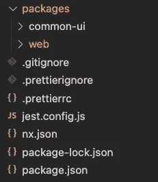
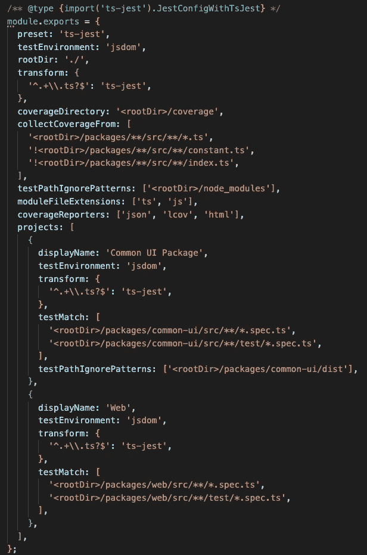

# 5 分钟后在你的 Monorepo 中设置 Jest

> 原文：<https://levelup.gitconnected.com/set-up-jest-in-your-monorepo-in-5-minutes-ea0604760625>


# 介绍

Jest 是一个令人愉快的 JavaScript 测试框架，专注于简单性。你可以在任何 JavaScript 上使用 Jest，比如 React、Angular、Node、TypeScript…

我有一个关于为你的项目[设置 Jest 的教程](https://duckylele.medium.com/set-up-jest-for-your-typescript-projects-in-under-5-minutes-a2bf0676f912)

Monorepo 或 Monorepository 是一种代码管理和架构概念，其中您将所有代码保存在一个超级存储库中，而不是管理多个较小的存储库，就像您的网站和库的单个存储库一样

我也有一个关于如何用 NX right [创建基于包的 Monorepo 的教程](https://duckylele.medium.com/create-a-package-based-monorepo-with-nx-ce4476b08139)

# 设置笑话

这篇文章将是一个关于如何为你的 Monorepo 设置 Jest 的教程，从在你的根文件夹中安装 Jest 和 TS-jest 开始:

```
yarn add jest @types/jest ts-jest
```

# 配置笑话

安装完所有依赖项后，我们用支持的 typescript 初始化 jest 配置文件:

```
yarn ts-jest config:init
```

将创建`jest.config.js`文件。我们将在这里完成所有配置，但首先，让我们看看我的产品包:



我有两个包:`common-ui`和`web`，这里是`jest.config.js`



我将从上到下:

*   `preset`:显然是`ts-jest`
*   `testEnvironment`:我们将使用`jsdom`，这样我们就可以在测试中使用`document`方法
*   `rootDir`:由于这是一个 monorepo，为了可读性，我们可能需要一个`rootDir`常量
*   `coverageDirectory`:我们想要放代码覆盖率报告的文件夹
*   `collectCoverageFrom`:如您所见，我只想收集`.ts`文件，排除`constant.ts`和`index.ts`(您可以根据需要轻松定制)
*   这是最重要的部分，我们将为我们的每个包专门设置一个 Jest。
*   `testMatch`:我们将测试与其对应的`.spec.ts`进行匹配，以正确收集其覆盖范围。

# 运行测试

我们可以用`yarn jest`在根文件夹中运行 Jest

# 结论

这是一个关于如何用我的`jest.config.js`示例为你的 Monorepo 配置 Jest 的简单教程。只是根据你的 monorepo 和喜好来配置 Jest

# 遗言

虽然我的内容对每个人都是免费的，但是如果你觉得这篇文章有帮助，[你可以在这里给我买一杯咖啡](https://www.buymeacoffee.com/kylele19)

# 分级编码

感谢您成为我们社区的一员！在你离开之前:

*   👏为故事鼓掌，跟着作者走👉
*   📰更多内容请查看[升级编码刊物](https://levelup.gitconnected.com/?utm_source=pub&utm_medium=post)
*   🔔关注我们:[推特](https://twitter.com/gitconnected) | [LinkedIn](https://www.linkedin.com/company/gitconnected) | [时事通讯](https://newsletter.levelup.dev)

🚀👉 [**加入升级人才集体，找到一份神奇的工作**](https://jobs.levelup.dev/talent/welcome?referral=true)