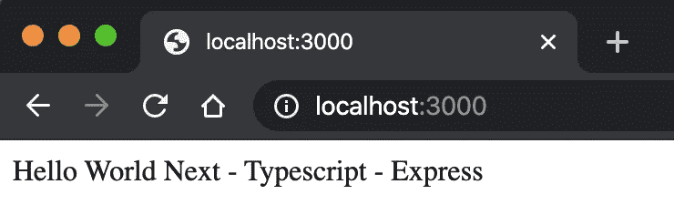
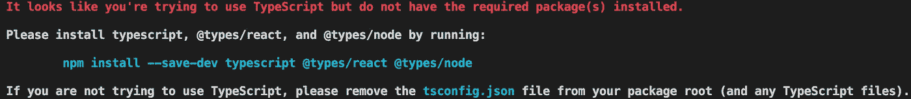
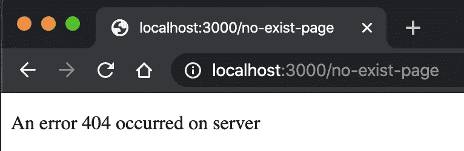
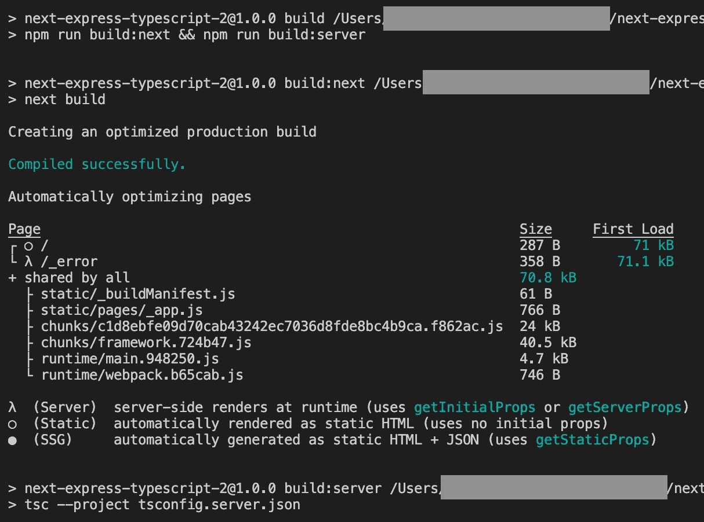
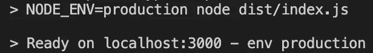
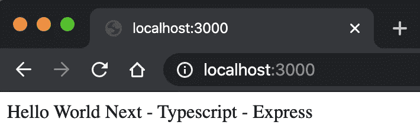

# 使用自定义 Express Server + Typescript 设置 Next.js

> 原文：<https://levelup.gitconnected.com/set-up-next-js-with-a-custom-express-server-typescript-9096d819da1c>


照片由 [Adi Goldstein](https://unsplash.com/@adigold1?utm_source=unsplash&utm_medium=referral&utm_content=creditCopyText) 在 [Unsplash](https://unsplash.com/s/photos/coding?utm_source=unsplash&utm_medium=referral&utm_content=creditCopyText) 上拍摄

在本文中，我将带您了解如何使用 Typescript 创建一个由自定义 Express 服务器处理的 Next.js 应用程序。

你可以在 [GitHub](https://github.com/tiptopcoder/simple-next-express-typescript) 上看到发布的完整代码。

# 设置 Next.js 项目

首先创建一个项目文件夹:

```
mkdir -p next-express-typescript
cd ./next-express-typescript
```

初始化一个`package.json`文件并安装依赖项:

```
npm init -y
npm install react react-dom next
```

将以下脚本添加到`package.json`:

```
"scripts": {
  "dev": "next",
  "build": "next build",
  "start": "next start"
}
```

创建您的第一页:

```
mkdir -p src/pages
touch src/pages/index.js
```

用一些虚拟内容填充`./src/pages/index.js`:

```
function IndexPage() {
  return <div>Hello World Next - Typescript - Express</div>;
}

export default IndexPage;
```

然后运行`npm run dev`并访问`http://localhost:3000`查看创建的页面:



# 配置 Typescript

基本上，Next.js 为我们提供了一种快速配置 Typescript 的方法。首先，创建一个空的`tsconfig.json`:

```
touch tsconfig.json
```

然后再次执行`npm run dev`，您应该会看到 Next.js 中的一个向导告诉您安装所需的包:



因此，让我们安装并完成 Typescript 设置:

```
npm install --save-dev typescript [@types/react](http://twitter.com/types/react) [@types/node](http://twitter.com/types/node)
mv src/pages/index.js src/pages/index.tsx
```

然后再次运行开发服务器，一切都应该正常工作了。

# 设置 Express

当你运行`npm run dev`时，基本上 Next.js 会启动它自己的服务器，但是也可以用你自己的 Express 服务器以编程方式处理它。

我们需要安装`express`及其 Typescript 定义:

```
npm install express
npm install --save-dev @types/express ts-node
```

创建服务器文件夹和服务器入口点:

```
mkdir -p server
touch server/index.ts
```

用此代码填充`index.ts`:

让我们编辑`package.json`中的`dev`脚本:

```
"scripts": {
   "dev": "ts-node server/index.ts",
   ...
}
```

> `ts-node`是 node.js 的 TypeScript 执行和 REPL，支持源映射。([来源](https://www.npmjs.com/package/ts-node))

现在运行`npm run dev`。但糟糕的是，我们遇到了一个错误:

```
import express from "express";
       ^^^^^^^
```

问题来自`tsconfig.json`，有一条线`"module": "esnext"`。通常，Next.js **会强制** TS 使用 ESNext 模式编译，但是`express`是基于`commonjs`模式构建的。如果您将值从`esnext`更改为`commonjs`， **Next.js 会自动将其恢复。**

为了解决这个问题，让我们创建另一个配置文件:

```
touch tsconfig.server.json
```

并从`tsconfig.json`开始延伸:

分解为:

*   `"extends": "./tsconfig.json"`:从`tsconfig.json`获取所有选项
*   `"compilerOptions.module": "commonjs"`:使用`commonjs`作为模块模式，使`express`和`next`一起工作。
*   `"compilerOptions.outDir": "dist"`:该选项用于生产。它会将`server`目录下的所有`.ts`文件编译到`.js`并发送到`dist`目录。
*   `"compilerOptions.noEmit": true`:该选项用于生产。Next.js 基本上是用`babel`来编译 Typescript 所以 TS 编译器不会输出`.js`。我们将覆盖这个值，告诉 TS 编译器编译并输出我们的`server`文件。
*   `"include": ["server"]`:该选项也用于生产。它让 ts 编译器只知道编译`server/`目录中的`.ts`文件。

我们将使用这个配置进行本地开发。现在我们需要再次编辑`dev`脚本:

```
"dev": "ts-node --project tsconfig.server.json server/index.ts"
```

然后执行`npm run dev`然后访问`http//localhost:3000` …成功了！

## 找不到修复错误页面

当运行定制服务器时，你们中的一些人可能会遇到控制台弹出`RangeError: Invalid array length`。

另外，当你访问一个未知的页面，比如说`http://localhost:3000/no-exist-page`，你会得到`Internal Server Error`而不是`404 not found`这样的消息。这是因为 Next.js 在与定制服务器集成时不再处理错误。

解决方案是创建[一个自定义错误页面](https://nextjs.org/docs/advanced-features/custom-error-page):

```
touch src/pages/_error.tsx
```

然后用下面的代码填充它:

现在再次访问`[http://localhost:3000/no-exist-page](http://localhost:3000/no-exist-page)`，您应该会看到我们的错误消息:



控制台中的错误也消失了！

# 我们去生产吧

在生产模式下启动服务器之前，我们需要将 Next.js 和服务器代码编译到`.js`。现在，修改`package.json`中的`scripts`:

```
"scripts": {
    "build:server": "tsc --project tsconfig.server.json",
    "build:next": "next build",
    "build": "npm run build:next && npm run build:server",
    "start": "NODE_ENV=production node dist/index.js"
}
```

细分:

*   `build:server`:将`server`代码构建到`dist`目录下
*   `build:next`:构建 Next.js 应用程序
*   `build`:运行`build:server`和`build:next`
*   `start`:运行服务器。它运行`node dist/index.js`而不是`next start`，因为现在我们让`experss`处理服务器。

让我们通过运行`npm run build`来构建所有的东西，您应该会看到这样的结果:



现在运行`npm start`,让我们看看我们的应用在生产中的工作情况:



告诉它正在生产环境中工作的控制台消息…



…在浏览器上，我们的 Next.js 应用程序工作正常！

# 包裹

现在您有了一个样板文件，可以用 Express server 和 Typescript 开始您的 Next.js 项目了！还有一些高级配置，比如 make [Path Alias](/get-rid-of-relative-import-path-hell-in-your-typescript-project-9952adec2e84) 与 VSCode 一起工作，TS-Jest for Next 和 Express testing……希望我能在不久的将来写出来。

# 参考

[](https://nextjs.org/docs/advanced-features/custom-server) [## 自定义服务器-文档| Next.js

### 通常，您可以使用“下一次启动”来启动下一台服务器。然而，100%以编程方式启动服务器是可能的…

nextjs.org](https://nextjs.org/docs/advanced-features/custom-server)