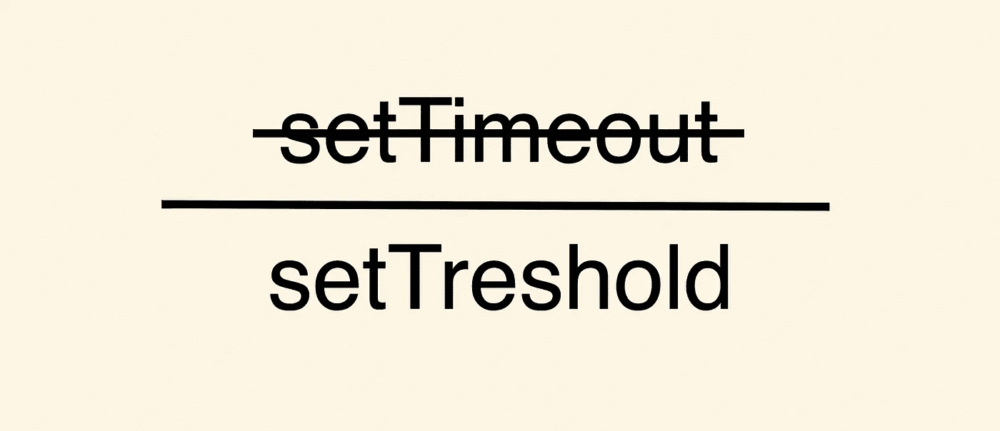
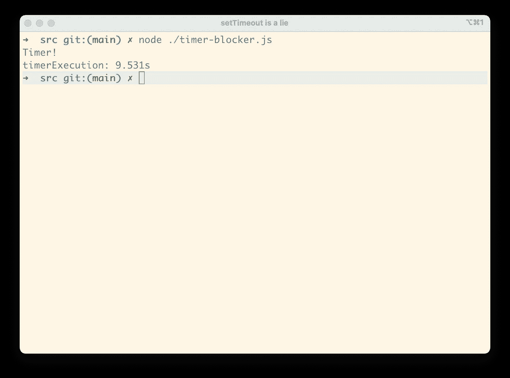

# setTimeout 是骗人的。应该叫 setThreshold。

> 原文：<https://levelup.gitconnected.com/settimeout-is-a-lie-it-should-be-called-setthreshold-dcb752766b9d>

## 这就是为什么…

Node.js 是异步的，它提供了一个名为`setTimeout`的简单函数，尽管它可能会让任何使用它的人感到困惑。

## 它是如何工作的

正如你从我的关于异步服务器的[文章中所知道的，](/why-asynchronous-is-a-trend-c9892667e245)我们只有一个执行主代码的线程。这里实际发生的事情是 Node.js 使用您的 OS(操作系统)功能创建一个 Timer 对象。事件循环等待来自计时器对象的信号来运行您的代码。

因此，这里我们有两件事情出错了…

## **竞争条件**

虽然我们将 0 作为毫秒数传递给函数调用，但最小时间是 3 毫秒，所以现在我们有了一个竞争条件。如果你的 CPU 性能足够好，那么它执行整个事件循环的速度会比定时器发出信号的速度快，在这种情况下，你会看到一个`setImmediate`启动得更快。

有时`setImmediate`比`setTimeout`开火更快，尽管我们通常期望`setTimeout`更快。

另外，记住你的程序不是运行在机器上的单个进程，所以 OC 也可以为其他进程分配 CPU 时间。

## 主线程上的阻止程序

另一个可能出错的原因是主线程上有一个阻塞程序。记住 Node.js 是异步的，并且只有一个执行业务逻辑的主线程，所以如果我们有一些代码在相当长的时间内阻塞了我们的线程，回调将在以后执行。

这是结果

## 摘要

如果操作时间对您的业务至关重要，您不应该依赖 Node.js 中的`setTimeout`函数，因为无法保证它会在您传递给它的 X 毫秒内执行。

## 接下来呢？

爱 Node.js？你可以看看我关于它的其他文章:

*   [流以及它们如何适应 Node.js 的异步特性](/streams-and-how-they-fit-into-node-js-async-nature-a08723055a67)
*   [如何处理 Node.js 中的拦截器](/how-to-handle-blockers-in-node-js-1966d0399703)

# 分级编码

感谢您成为我们社区的一员！在你离开之前:

*   👏为故事鼓掌，跟着作者走👉
*   📰查看[升级编码出版物](https://levelup.gitconnected.com/?utm_source=pub&utm_medium=post)中的更多内容
*   🔔关注我们:[Twitter](https://twitter.com/gitconnected)|[LinkedIn](https://www.linkedin.com/company/gitconnected)|[时事通讯](https://newsletter.levelup.dev)

🚀👉 [**将像你这样的开发人员安置在顶级创业公司和科技公司**](https://jobs.levelup.dev/talent/welcome?referral=true)