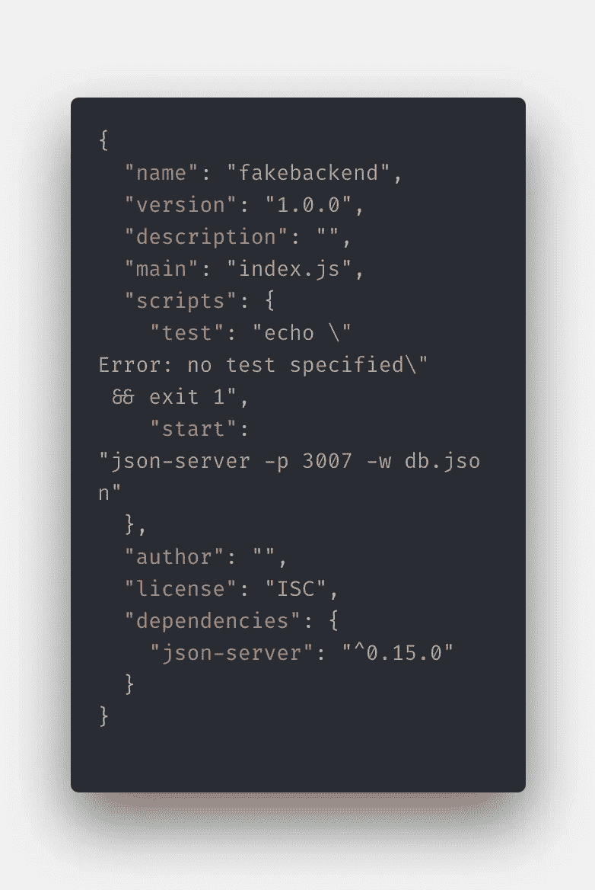
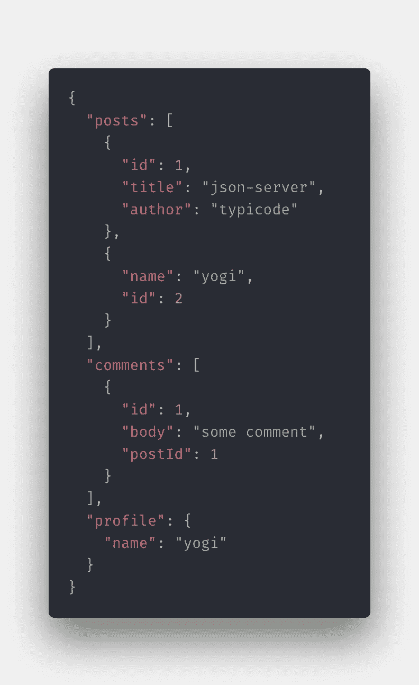

# 在不到 60 秒的时间内在 Node 中设置一个假的后端服务器

> 原文：<https://levelup.gitconnected.com/setting-a-fake-backend-server-in-less-than-60-seconds-a5b1a9c425ef>

作为一名前端工程师，在没有完整后端的情况下构建一个虚拟或概念验证项目，对于设置 REST API 来说可能非常具有挑战性。您可以使用 Firebase 或许多其他东西来设置后端，而无需编写太多代码。但是，

有一种方法可以在本地主机上建立一个非常简单的后端服务器。这将是一个节点项目。

假设您有一个前端，我们可以使用 NPM 模块[**JSON-server**](https://www.npmjs.com/package/json-server)**创建一个后端服务器。**

让我们将您的节点项目命名为“ **FakeBackend** ”。

步骤:

1.  制作目录`FakeBackend`
2.  `cd FakeBackend`
3.  `npm init`
4.  遵循安装 CLI，为您的节点项目提供基本信息
5.  `npm install json-server -g`
6.  创建一个 db.json 文件。跑`touch db.json`
7.  你需要看那个文件
8.  在 package.json 中编写一个启动脚本，如下所示=> `json-server -p 3007 -w db.json`
9.  将您的 JSON 放在 db.json 中
10.  `npm start`

如果你想建立一个假的后端服务器，这就是你所要做的:)

My package.json:



在我的 db.json 中，我有:



## 从邮递员发出 API 调用:

```
GET ::: localhost:3007/posts/2{
  “name”: “yogi”,
  “id”: 2
}
```

如果进行 POST 调用，那么 db.json 中的数据会自动更新。

参考来源代码:[https://github.com/yogain123/Fake-Backend](https://github.com/yogain123/Fake-Backend)

快乐学习:)

[](https://gitconnected.com/learn/node-js) [## 学习 Node.js -最佳 Node.js 教程(2019) | gitconnected

### 排名前 45 的 Node.js 教程-免费学习 Node.js。课程由开发人员提交和投票，使您能够…

gitconnected.com](https://gitconnected.com/learn/node-js)