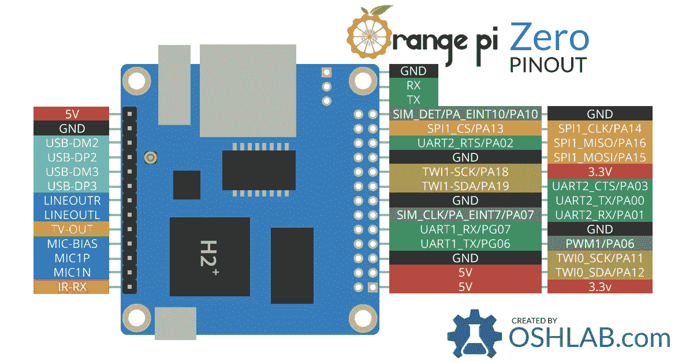
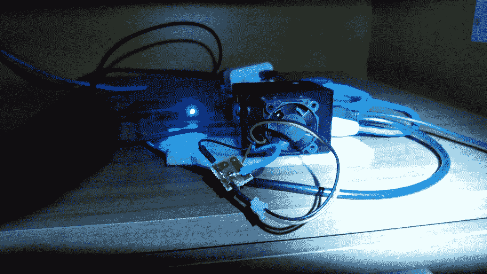

# 使用 Python 为您的橘子汁/树莓汁设置冷却器。

> 原文：<https://levelup.gitconnected.com/setting-up-a-cooler-for-your-orange-pi-raspberry-pi-using-python-39f6276fc920>

Python 几乎可以用于任何事情，包括帮助控制你最喜欢的单板计算机的温度。尽管今天的 SBC 很棒，但是如果让它们运行一段时间，大多数都会变得非常热，从而缩短它们的寿命并抑制它们的性能。

所以，让我在我的 SBC 上安装一个简单的 5v 或 12v 风扇，所有问题都解决了，对吗？没那么快。一周七天、一天二十四小时运转的风扇通常会让你因噪音而发疯，在需要更换之前会持续很短一段时间，并利用不必要的能量。

现在我们有进展了。让我们使用 python 建立一个简单的脚本，检查温度是否高于阈值并打开风扇。由于大多数风扇在 5V 或更高电压下运行(大多数 GPIO 引脚为 3.3V)，我将使用 PNP 晶体管，因此当 GPIO 输出为低电平时，晶体管工作(这使得晶体管型号更加灵活)。

# **你需要:**

- 1 个橘皮或树莓皮
- 1 个 PNP 晶体管(5v 风扇示例中的 BC 327)
-电线
-热缩管
-一个风扇(5v 或 12v)

# **免责声明**

本教程旨在帮助你为你的橘子皮/树莓皮建立一个风扇控制器。以下步骤需要一些电子、电气系统和 IT 知识。如果你遵循这些步骤，风险自负。

# **连接 GPIO**

如果使用 5V 风扇，找到 GND、5V 引脚和一个 GPIO 引脚，用于控制晶体管和插线(可以使用[接头](https://www.google.com/search?q=pin+headers+female)或焊接电线)。如果你使用 12v 风扇，你将需要一个外部电源，而不是使用板 GND 和 5V 引脚，使用 12v 电源线。**任何情况下都不要将任何 12V 电线连接到电路板上。**



橙色 Pi 零 GPIO

# **PNP 晶体管布线**

现在，按照逻辑示意图焊接来自 GPIO 的电线。负轨为 GND，正轨为 5V，GPIO 引脚为 GPIO 输出。逻辑很简单，晶体管充当负供电轨内的开关。当 GPIO 引脚关闭时，电流流动并允许风扇旋转。最后，你可以用热缩管来隔离连接。


使用 PNP 晶体管的简单布线示意图


第一个原型

# **Python 脚本**

现在，连接已经完成，我们可以开始交易的软件部分了。确保在您的系统上安装 Python，创建一个. py 文件，并粘贴以下代码:

```
# Do the imports
import os
import sys
# OPi Library and instructions: [https://pypi.org/project/OrangePi.GPIO/](https://pypi.org/project/OrangePi.GPIO/)
import OPi.GPIO as GPIO
from time import sleep# Orange Pi Setup
GPIO.setboard(GPIO.ZERO)
GPIO.setmode(GPIO.BOARD)# Targeted temperature to start the fan (40 degrees celsius)
controlTemp = 40000# I’m using GPIO and a PNP transistor to control the fan, by default it will be enabled. 1 sets the GPIO to HIGH and 0 to LOW.
outputValue = 0# Output GPIO pin for the fan transistor. Check the pinout at: [https://i0.wp.com/oshlab.com/wp-content/uploads/2016/11/Orange-Pi-Zero-Pinout-banner2.jpg?fit=1200%2C628&ssl=1](https://i0.wp.com/oshlab.com/wp-content/uploads/2016/11/Orange-Pi-Zero-Pinout-banner2.jpg?fit=1200%2C628&ssl=1)
outputPin = 24# Reads the armbian temperature file and checks if it's higher than the threshold, if positive, turns the fan on, otherwise, off.
with open(‘/etc/armbianmonitor/datasources/soctemp’, ‘r’) as fin:
 temp=0 
 temp = int(fin.read())
 if(temp >= controlTemp):
  outputValue = 0
 else:
  outputValue = 1
 #print temp
 #print controlTemp
 #print outputValueGPIO.setup(outputPin, GPIO.OUT)
GPIO.output(outputPin, outputValue)
GPIO.cleanup()
```

# **覆盆子替代品**

您可以将该脚本用于您的树莓 Pi。用 [RPI 库](https://pypi.org/project/RPi.GPIO/)更改 OPi，并用“/sys/class/thermal/thermal _ zone 0/temp”交换“/etc/armbian monitor/data sources/SOC temp”的温度读数。

# **设置 Cron**

现在，让我们将脚本设置为每五分钟运行一次，这样它就可以检查温度并在必要时打开风扇。为此，我们将使用 [Crontab](https://pt.wikipedia.org/wiki/Crontab) 。在终端中，键入:

```
sudo crontab -e
```

您将被要求编辑 cron 文件(使用 nano 或您最喜欢的编辑器)。进入编辑模式，转到文件的最后一行，插入以下行:

```
/5 * * * * /usr/bin/python /path/to/yourscript.py
```

**/5** 表示系统每五分钟调用一次这个脚本。
**/usr/bin/python** 是 python 引擎的路径。(如果你的路径更新了，也可以只使用 *python* )。
**/path/to/your script . py**是你的脚本的路径。

之后，通过按 CTRL + X 和“是”保存文件。
重启系统，一切准备就绪。
您的风扇控制器应该工作正常。

[](https://media1.giphy.com/media/KhdQ2Ia3FJuKs/giphy.gif?cid=3640f6095c8f05d451717a47366c57de) [## 猫迷 GIF -在 GIPHY 上查找和分享

### 发现并与你认识的每个人分享这只猫的 GIF。GIPHY 是你搜索、分享、发现和创建 gif 的方式。

media1.giphy.com](https://media1.giphy.com/media/KhdQ2Ia3FJuKs/giphy.gif?cid=3640f6095c8f05d451717a47366c57de) 

# **结果**



橙色 Pi，带风扇和控制器晶体管，用作带外置硬盘的文件服务器。

现在，您的 SBC 可以运行风扇，只在需要时运行。