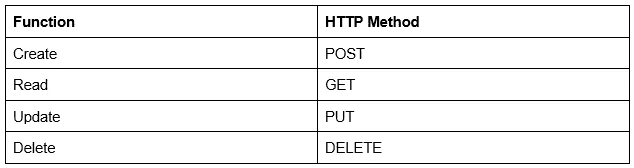
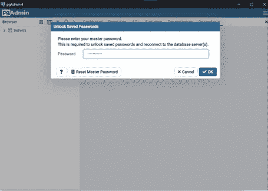
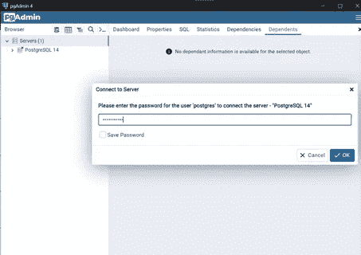
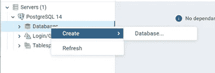
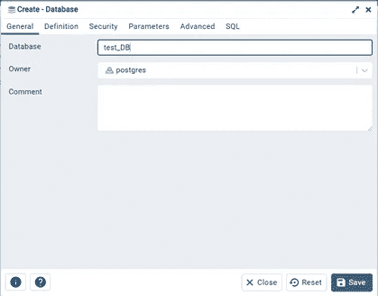
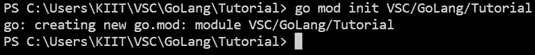
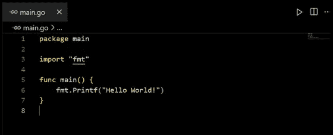
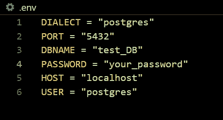
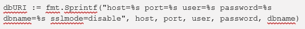
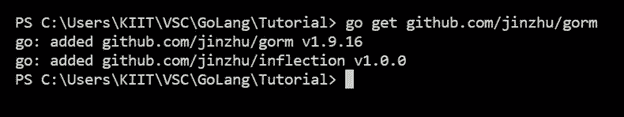

# 在 Golang 中设置 CRUD 应用程序

> 原文：<https://levelup.gitconnected.com/setting-up-a-crud-application-in-golang-ef81f394889e>

## 创建、读取、更新和删除流程


图像[来源](https://www.syncfusion.com/blogs/wp-content/uploads/2020/11/How-to-Build-a-Blazor-WASM-CRUD-Application-with-Entity-Framework.png)

有没有听说过有人建立了一个 CRUD 应用程序，并认为这是一个粗糙的应用程序？

与听起来相反，CRUD 代表:创建、读取、更新、删除。这些是您可以使用服务器在数据库上执行的基本过程。服务器可以用任何后端语言或框架编写。

在本文中，您可以看到如何使用 Go 实现它。数据库是在 PostgreSQL 中建立的，PostgreSQL 的语法类似于任何其他基于 SQL 的数据库。

但是，在开始之前，我们先来看看先决条件。

> ***先决条件***

要阅读本文，您需要了解:

*   基本 Go 语法
*   SQL / pgAdmin

软件要求:

*   您可以在任何想要的环境中构建应用程序。我个人用的是 Windows 10。
*   获取一个 IDE。我将使用 VSCode。你也可以使用 Atom，IntelliJ IDEA，Vim 等。
*   围棋的最后一个稳定版本。对我来说，那就是 Go 1.19
*   PostgreSQL(我使用 PGAdmin，但是您也可以坚持使用 CLI)

现在您已经为创建您的应用程序做好了一切准备，让我们深入了解 CRUD 应用程序到底是什么以及如何构建它。

> ***什么是 CRUD 应用？***

当您构建一个 API 时，您基本上希望它能够完成 4 个基本功能:

*   创造
*   阅读
*   更新
*   删除

构建 web 应用程序时遵循这种范式。

如果您正在创建 RESTful API，这些术语可以很容易地与不同类型的 HTTP 方法相关联，如下所示:



Go 有许多软件包，使得开发 CRUD 应用程序变得非常简单。请继续阅读，了解如何实现。

> ***在 Go*** 中设置 CRUD 应用程序

遵循给定的步骤:

## 1.设置 pgAdmin

在这一步，你只需要安装 pgAdmin 并给它一个密码。

*   您可以使用任何端口来运行它。只要记住你选择哪个端口。
*   设置密码并记住它。
*   创建一个数据库，你可以随意命名。我将把我的命名为“test_DB”。

要创建数据库:

**第一步:打开 pgAdmin，输入密码。**



**第二步:点击“服务器”并再次输入您的密码以查看列表。**



**第三步:右击数据库并选择“创建”选项。**



第四步:给你的数据库起个名字，现在，坚持默认设置。

保存你的数据库，你就可以开始了。



## 2.设置 Go 服务器

现在，让我们转向 IDE。

打开要在其中工作的文件夹。然后，按照以下步骤操作:

**第一步:初始化 mod 文件。**

该文件将保存您的所有依赖项。使用命令:

```
*go mod init ./folder_path*
```



第二步:创建 main.go 文件。

这是启动服务器时运行的第一个文件。



**第三步:连接数据库。**

你可以硬编码这个部分。但是，最好不要。因此，让我们创建一个. env 文件，它将存储连接到数据库所需的所有凭证。



现在，创建一个名为 Database 的不同文件夹，其中包含一个名为 connection.go 的文件。

代码:

```
package Databaseimport (
        "fmt"
        "os" "github.com/jinzhu/gorm"
        _ "github.com/jinzhu/gorm/dialects/postgres" "github.com/joho/godotenv"
       )var DB *gorm.DBfunc Connect() {
       e := godotenv.Load(".env") if e != nil {
           panic("unable to load env")
           } dialect := os.Getenv("DIALECT")
      host := os.Getenv("HOST")
      port := os.Getenv("PORT")
      user := os.Getenv("USER")
      dbname := os.Getenv("DBNAME")
      password := os.Getenv("PASSWORD")
```



```
 connect, gorm_err := gorm.Open(dialect, dbURI) if gorm_err != nil {
         panic("Failed to establish connection") } else {
         fmt.Print("Successfully established connection on local")
         } DB = connect defer connect.Close()
}
```

某些导入的依赖项可能对您不可用。您可以通过运行以下命令轻松获得它们:

```
*go get dependency*
```

示例:



Go 中的 gorm 包帮助我们建立连接。我所做的是:

*   创建了一个全局指针，本质上只是指向数据库
*   编写了一个名为 Connect()的函数来保存连接代码。确保这个函数的名字以大写字母开头。否则，Go 将继续寻找您使用 Connect()函数的主函数，并向您抛出一个错误。
*   接下来，我加载了。env 文件，并处理了该过程中可能出现的错误。
*   然后，使用环境变量，我创建了用于连接 Postgre 数据库的 dbURI 字符串。连接存储在“connect”变量中，我已经处理了可能由此产生的错误。
*   最后，我将指针指向连接变量。这一步完成了连接过程。

最后一个“defer”关键字在编译器执行完所有代码后关闭数据库。因为我们没有在数据库上执行任何操作，所以我要关闭连接。在创建了操作数据库或表的函数之后，可以离开延迟行。

[](https://medium.com/pythoneers/why-the-world-is-switching-to-golang-programming-language-ef546d5603d9) [## 为什么世界正在转向 GoLang 编程语言

### 像 C++一样的快速处理和性能

medium.com](https://medium.com/pythoneers/why-the-world-is-switching-to-golang-programming-language-ef546d5603d9) 

**第 4 步:将数据库包导入到 main。**

现在，您已经准备好将连接函数导入到您的主包中，并让您的服务器运行起来。

代码:

```
package mainimport (
     "VSC/GoLang/Tutorial/Database"
)func main() {
    Database.Connect()
    }
```

我们只需导入我们创建的数据库包，并调用 Connect 函数。现在，您运行您的代码，如果您做的一切都正确，您的程序应该成功地连接到数据库！

*这就是在 Go 中为 CRUD 应用程序设置基本连接的方法。从这一点开始，你可以做更多的事情。例如:*

*   *创建 RESTful APIs 来读写数据库表中的行*
*   *使用该系统设计一个注册/登录系统*
*   *在两台或多台服务器之间建立通信*

*可能性是无限的。所以，开始编写快速高效的 go 服务器吧。*

*我希望你喜欢这篇文章。通过我的 [LinkedIn](https://www.linkedin.com/in/data-scientist-95040a1ab/) 和 [twitter](https://twitter.com/amitprius) 联系我。*

# *推荐文章*

*1.[Python 最有用的 15 个 NumPy 方法](https://pub.towardsai.net/15-most-usable-numpy-methods-with-python-4d20eb93e149?sk=911d2bebf042b148be8f366b907af158)
2。 [NumPy:图像上的线性代数](https://pub.towardsai.net/numpy-linear-algebra-on-images-ed3180978cdb?source=friends_link&sk=d9afa4a1206971f9b1f64862f6291ac0)
3。[Python 中的异常处理概念](https://pub.towardsai.net/exception-handling-concepts-in-python-4d5116decac3?source=friends_link&sk=a0ed49d9fdeaa67925eac34ecb55ea30)*