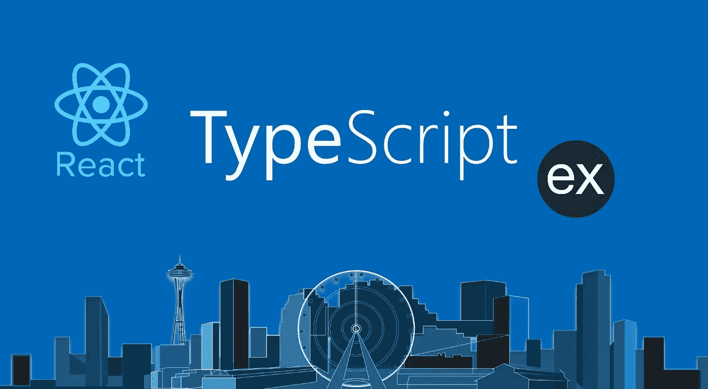

# 设置全栈类型脚本应用程序:以 Express 和 React 为特色

> 原文：<https://levelup.gitconnected.com/setting-up-a-full-stack-typescript-application-featuring-express-and-react-ccfe07f2ea47>

## 非常适合任何规模的项目…初创公司和企业！



打字稿的世界是无限的

许多人会告诉你 NodeJS 更适合小型项目，而 Java/C#这样的静态编译语言更适合大型企业应用程序。这就是 TypeScript 派上用场的地方；它为您提供了结合静态语言类型安全的脚本语言的快速开发。如果你已经知道 JavaScript，那么对于 TypeScript 的学习曲线是非常小的。TypeScript 只是在开始时需要一点额外的设置，因为它是一个超集，而不是技术上的语言。

> 只是为了指出这一点，我确信网上到处都有教程向您展示如何为 React 或 NodeJS 设置 TypeScript。但是我遇到的都是相当零碎的，我从来没有真正读过一个足够全面的。本文的重点是向您展示如何为前端和后端开发设置 TypeScript，以及调试、单元测试，然后为生产构建一切。

# 编辑 2019 年 6 月

现在有一个 npm 应用程序可以为我们处理本教程的大部分后端部分。它叫做*express-generator-typescript*。

[](https://www.npmjs.com/package/express-generator-typescript) [## 快速生成器类型脚本

### 生成类似于 express-generate 的新的 Express 应用程序，但是将其设置为使用 TypeScript

www.npmjs.com](https://www.npmjs.com/package/express-generator-typescript) 

所有的源代码都可以在下面的资源库中找到。在阅读本文时，您应该观察回购中相应的文件/文件夹。

[](https://github.com/seanpmaxwell/TypeScriptFullStackShell) [## seanpmaxwell/TypeScriptFullStackShell

### 为全栈类型脚本开发设置 web 应用程序-seanp Maxwell/TypeScriptFullStackShell

github.com](https://github.com/seanpmaxwell/TypeScriptFullStackShell) 

# 文件夹层次结构

为了保持有序，我们将把后端的所有配置和依赖项放在目录的根目录下。我们将使用 *create-react-app* npm 模块生成前端所需的一切，并将其嵌套在 **src/public/react/** 文件夹中。将我们的 react 应用程序放在这里而不是放在单独的根目录文件夹中的原因是，随着您的 web 应用程序的增长，您可能最终会提供一些不属于主 React 应用程序的页面，或者您甚至可能会提供多个 React 应用程序。

举个例子，你可能最终让普通用户可以访问的所有前端内容都包含在一个 React 应用程序中的一条快速路线上。同时，网站管理员使用的内容可以在另一个 React 应用程序中以不同的快速路线提供。但是对于本教程，我们将只设置一个 React 项目。

创建一个文件夹作为根目录，并给它起一个你的应用程序的名字。我就叫我的根吧。在里面运行`npm init`把它变成一个 npm 包，生成一个 **package.json** 文件。创建另一个名为 **src/** 的文件来保存我们的前端和后端代码，创建另一个名为 **util/** 的文件来保存我们用于生产构建的文件。

```
root/
  src/
    public/
      react/
        demo-react/
  util/
  package.json
```

# 后端的打字稿

## 设置 ts 节点

要开始在 TypeScript 中编码，我们需要安装将转换我们的代码的依赖项，然后创建配置文件(尽管它们不是严格必需的),为如何转换它们设置规则。在应用程序的根目录下安装 *ts-node 和 nodemon* ，它们运行我们的。ts 文件，也可以在检测到更改时重新启动我们的服务器，以及*类型脚本*，来调用我们的*。*中的 ts* 文件。js* 文件。这些模块用于开发，因此请确保使用`-D`选项。

*   `npm i -D ts-node nodemon typescript tslint`

为了指定编译规则，在 **root/** 下创建一个名为 **tsconfig.json** 的文件，并粘贴以下内容。如果您计划使用 Webstorm 或 VsCode 之类的 IDE 进行调试，我们需要生成 **.js.map** 文件，这就是第 8 行的“sourcemap”的用途。

我们最终创建的单元测试测试文件将以. test.ts 结尾，并且不需要用于生产，因此确保除了任何前端文件夹之外还排除那些文件，前端文件夹将有它们自己的构建脚本。

为了对您的 TypeScript 实施一套编码标准，创建另一个名为 **tslint.json** 的文件。我倾向于把我的设置得非常严格，因为我喜欢遵循惯例，但是如果你愿意的话，你可以随意地摆弄这些设置。

## 创建服务器

现在我们终于可以开始写一些打字稿了。在 **src/** 下创建一个将配置和运行 Express 的服务器文件。我们可以单独使用 plain *express* 模块，但是我认为我们应该利用我们使用 TypeScript 的事实。OvernightJS 是一个简单的库，它将 decoratorss 封装在 Express `Router`对象周围，因此您不必为您创建的每个 API 实例化一个 decorator。它不是 Express 之上的抽象，也不意味着改变你与它交互的方式。这就是为什么我喜欢它胜过一些大型框架，如 *NestJS* 或*typescript-express-decorator*。

[](https://www.npmjs.com/package/@overnightjs/core) [## @overnightjs/core

### Express web 服务器的 TypeScript decorators。OvernightJS 项目的一部分。

www.npmjs.com](https://www.npmjs.com/package/@overnightjs/core) 

安装@overnightjs/core，创建一个服务器文件，并从您命名的服务器类扩展`Server`类。

*   `npm i -s overnightjs/core`

## 创建 start.ts 文件

我相信你已经准备好看到你的代码运行了…但是首先！！为了让运行/构建我们的应用程序更快一点，让我们创建一个 **start.ts** 文件，它可以启动一切。注意我们的 **package.json** 文件中的“scripts”键。“脚本”中的每个属性就像一个迷你 bash 脚本，我们可以用`npm run “whatever the key is”`运行它。这连同 **start.ts** 文件将使我们能够仅用一小组`npm run …`命令来运行/测试/构建我们的代码。

向 **root/** 添加另一个名为 **start.ts** 的文件，并给它一些`if-else`语句来检查我们是在运行开发/生产还是测试。现在，让我们启动服务器。我们将通过不同的部分来完成这个文件。

为了避免每次代码更改时都必须启动和停止 Express，让我们使用 *nodemon* 在源文件发生更改时重启 ts-node。nodemon 可以直接从命令行或文件导入 it 设置:文件更简单，所以我们就用它吧。将文件 **nodemon.json** 放在 **util/** 下。

所以其他开发者不用每次都输入很长的命令，我们把 nodemon 作为属性添加到 **package.json** 的“脚本”中。

第 7 行的命令将使用 **tsconfig.json** 文件中的设置启动 ts-node，并在每次运行时以`development`模式重启服务器:

*   `npm run start-dev`

继续运行该命令，您应该会看到控制台输出的`SERVER_START_MSG`。对服务器文件(端口或启动消息)进行更改，您应该立即看到 Express 服务器重新启动和更改。

恭喜你。！您已经看到了 Express/TypeScript 开发服务器。

# 制作 API

拥有一个不做任何事情的 Express 服务器并不好玩，所以使用 OvernightJS 让我们制作一个简单的 API，它只打印一些文本并发回一个 JSON 响应。在 **src/** 下创建一个名为 **controllers/** 的文件夹，添加一个控制器文件，随便你怎么命名:我命名为 mine **DemoController.ts** 。现在使用 OvernightJS 的 route decorators 给它一个 API(以后可以添加更多),并给路由一个处理错误响应的`try/catch`块。这将有助于稍后向您展示如何进行单元测试。

回到服务器文件，setup Express 解析 JSONs 并导入/激活我们刚刚创建的控制器。所以我们在浏览器中访问 **localhost:3001** 时不会触发错误，让我们在开发模式下运行服务器时也设置一个默认响应。

重启 nodemon，使用您选择的 API 调用工具(比如 Postman)向**localhost:3001/API/say-hello/:name**发出 GET 请求。确保您得到一个返回值，并且当您将`makeitfail`作为参数传入时，Express route 触发一个错误。

如果一切顺利，我们可以继续我们的前端！

# 创建 React 应用程序

这将需要更少的配置，因为 *create-react-app* 将为我们的项目旋转一个 shell 并导入所有必要的依赖项。我们所要做的就是将前端和后端连接起来，这样我们就可以分别开发每一个，同时仍然可以从 React 内部激活 Express APIs。

全局下载 *create-react-app* (或者使用 *npx* ，导航到 **src/public/react/** ，，新建一个 TypeScript React 项目:

```
cd src/public/react/
npx create-react-app demo-react --typescript
```

导航到 **demo-react/** ，运行 npm start，在 **localhost:3000** 处，您应该会看到 react 示例页面。

## 在开发过程中将前端和后端连接在一起

现在我们已经有了前端和后端，我们需要设置一个代理，这样您的 http 请求将转到 Express，而不是 React 开发服务器。为了确保我们的配置有效，让我们在 React 中放一些代码，向我们的“say-hello”API 发送请求。为了简单起见，只需添加一些现在自动触发的东西。如果您想在浏览器中显示响应，您需要将响应转换成 JSON 格式(参见下面的第 12 行)。使用 *fetch* ，我在 **demo-react/src/App.tsx** 中添加了一个 get 请求。

现在，为了将我们的请求传送到后端，将`proxy`属性添加到 React 应用程序的 **package.json** 文件中，并将值设置为运行 Express 的 url:port。请参见下面的第 21 行。

如果 React 的开发服务器当前正在运行，保存文件(您应该会看到浏览器自动刷新)，并且应该会出现一个带有 API 响应的警告。

# 后端单元测试

恭喜，您已经获得了用于开发的全栈 Express/React 应用程序设置。测试前端所需的工具已经打包在 *create-react-app* ，中，但是因为我们已经从头开始测试后端，所以让我们来看看如何开始测试。有很多测试工具可以使用，但我最喜欢的是 *Jasmine* 和 *Supertest* 。Jasmine 允许你用`describe()`和`it()`编写业务驱动开发测试。Supertest 使我们能够在 TypScript 代码中发出 API 调用，传递我们想要的任何数据，并为我们进行测试断言的响应提供回调。

安装用于测试的两个依赖项及其对应的 *@types/* 包:

*   `npm i -D jasmine @types/jasmine supertest @types/supertest`

## 测试服务器

在**控制器/演示**文件夹中创建另一个文件，其名称与您上一个控制器文件相同，但附加了 **.test.ts** 。为了进行 API 调用，Supertest 需要获得我们的 Express 应用程序的一个实例。不过，我们实际上并不想用`this.app.listen`来启动我们的服务器，所以我们不使用主 **DemoServer.ts** 配置，而是创建一个新的服务器文件来进行测试。它需要做的只是激活一个控制器并返回 Express 实例。哦，还有一件事，我们仍然需要传递它，不管我们在主服务器文件中做了什么中间件。将该文件放在 **controllers/shared/** 文件夹中，并在测试文件的顶部导入服务器类。

> 这是另一件让通宵如此伟大的事情。为测试目的开发新的 Express 应用程序是微不足道的。

## 你的第一个单元测试

在您的测试文件中，在`beforeall()`方法中配置 Supertest，并为每个控制器路由设置一个单元测试。确保为用户在每个单元测试中可以触发的每个可能的路径添加一个断言。

## 配置 Jasmine

我们可以使用`jasmine`从命令行直接运行 Jasmine，但是如果我们想像调试任何其他节点脚本一样调试我们的测试文件，我们需要从**运行 Jasmine。js** 文件。为此，让我们在 **start.ts** 中为 Jasmine 添加一个配置。

如果我们使用`test`参数运行 **start.ts** ，配置 Jasmine 从 **src/** 目录加载测试文件(第 15-22 行)。当编写测试时，您可能不想一次运行所有的测试；您可能只想运行一个测试文件。这就是为什么我们检查第二个参数(这将是一个测试文件的路径)，如果它存在的话，把它传递给 Jasmine 的`execute`方法。

将以下属性赋予 **package.json** `“scripts”`，这样我们就可以用`npm run test`运行我们的单元测试。

*   `“test”: "ts-node ./src/start.ts test"`

如果您想通过单元测试，您只需要运行:

*   `npm test -- "path to the unit-test file" (i.e. controllers/DemoController)`

# 生产建筑

开发和测试完代码后，您会想要构建它。ts-node 应该只在开发期间使用，所以我们需要生成。用于生产的 js 文件。

## 自动化构建过程

要为生产构建后端和前端，我们不想每次准备好生产时都必须手动传输我们的类型脚本、构建我们的代码、导航到前端目录、构建代码，然后将捆绑的 React 应用程序移动到我们的顶级构建文件夹。因此，让我们创建一个脚本来完成所有这些工作，然后配置该应用程序，使其只需一个命令即可运行。

配置这个脚本来传输我们的后端代码(跳过测试文件)，导航到 React 应用程序，构建它，给输出文件夹取与 React 应用程序的文件夹相同的名称(记住要保持一致性)，然后将它移动到构建后端代码的位置。源地图只在开发时需要，所以使用下面第 9 行的`sourceMap false`选项，这样我们就不会生成一堆 **.js.map** 文件。我用 Linux 开发，所以用 Bash 但是，如果您使用的是 Windows，您必须查找等效的批处理或 PowerShell 命令。

## 修改服务器文件以服务于前端生产

在开发模式中，Express 只是向浏览器发送一行代码，告诉我们 Express 运行在哪个端口上。但是在生产中，Express 需要从运行它的同一个端口提供 React 服务。因为我们的整个前端现在都包含在一个单独的 React 应用程序中，所以我们可以将静态和视图目录都放在那里。

向服务器文件添加另一个方法，并在构造函数中添加`if`语句，该语句在生产模式下为 Express 设置**视图/** 和**静态/** 目录。

为了激活我们的构建脚本，并使在生产模式下启动我们的整个应用程序变得容易，让我们最后一次修改 **package.json** 文件来运行我们的构建脚本，并通过在环境设置为生产的情况下运行构建的启动脚本来启动生产代码。

注意下面代码片段中的第 7 行和第 10 行。我们可以用`npm run build`进行生产构建，用`npm start`开始生产模式。

现在，当您在生产模式下启动 Express 服务器，并在浏览器中导航到启动它的同一路径时，您应该会看到 React 应用程序的显示。

# 如果你觉得这篇文章有帮助，请在 GitHub 上启动 repo 和 OvernightJS repo。祝网络设计愉快:)

[](https://levelup.gitconnected.com)[](https://gitconnected.com/learn/typescript) [## 学习 TypeScript -最佳 TypeScript 教程(2019) | gitconnected

### 18 大 TypeScript 教程-免费学习 TypeScript。课程由开发人员提交并投票，从而实现…

gitconnected.com](https://gitconnected.com/learn/typescript) [](https://gitconnected.com/learn/react) [## 学习 React -最佳 React 教程(2019) | gitconnected

### 排名前 49 的 React 教程-免费学习 React。课程由开发人员提交并投票，使您能够…

gitconnected.com](https://gitconnected.com/learn/react)