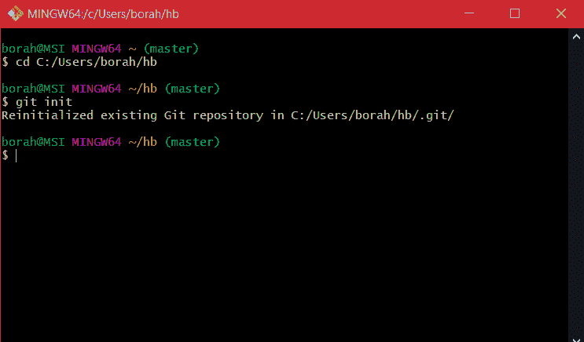

# 正确设置 Git 存储库

> 原文：<https://levelup.gitconnected.com/setting-up-a-git-repository-correctly-ae2df94b01d>


照片由[扬西·敏](https://unsplash.com/@yancymin?utm_source=medium&utm_medium=referral)在 [Unsplash](https://unsplash.com?utm_source=medium&utm_medium=referral) 上拍摄

源代码可以说是计算机软件最重要的方面。它是一个最终用户看不到的实体，只有开发人员可以访问。它是程序的基础，因此，源代码是软件生命周期中不可或缺的一部分。

组织需要采取精心计划的措施来确保他们的安全。这无疑是一个挑战。当谷歌向你狂轰滥炸关于源代码盗窃事件的警报时，这似乎是一项更加难以完成的任务，有些案件与谷歌、联想和 IBM 等大公司有关。

这就是[版本控制系统](https://www.toolsqa.com/git/version-control-system/) (VCS)的用武之地。VCS 允许软件团队记录并跟踪源代码随时间的变化。Git 是一个免费的、开源的分布式 VCS，已经成为版本控制的行业标准。


[图片来自 Git](https://git-scm.com/book/en/v2/Getting-Started-About-Version-Control)

Git 最大的 USPs 之一是它对源代码的安全管理。Git 通过其存储库系统实现了这一点。顾名思义，Git 存储库(又名 repo)是您的源代码及其整个版本历史的虚拟仓库。在本文中，我们将讨论正确设置 Git 存储库的过程。

# 创建存储库

创建存储库有许多方法。您可以:

1.  在现有目录中创建存储库，或者
2.  您可以克隆现有的存储库。

首先，转到您想要创建存储库的根项目文件夹。下面是一条典型的路径:

```
$ cd C:/Users/user/my_project
```


按照此步骤，键入以下内容:

```
$ git init
```



那里！您已经成功创建了一个. git 子文件夹。这是您的准系统 git 存储库。

或者，**您也可以使用** [**Git GUI**](http://wiki.seas.harvard.edu/geos-chem/index.php/Using_Git_GUI) 创建一个存储库。


现在让我们看看第二种方法，克隆一个现有的存储库。

克隆现有存储库所需的命令是 git clone。当您运行 git clone 时，您会收到存储库的完整副本，一直到项目历史中每个文件的每个版本。听起来很方便，不是吗？

创建克隆依赖于您要克隆的存储库的 URL。你可以这样做:

首先，你应该登录 Git 来访问 Github。要登录，请输入以下命令:

```
$ git config — global user.name “Enter your name here”$ git config — global user.email yourname@yourmail.com
```


这样一来，我们现在可以继续克隆一个存储库了。在 git bash 中输入以下命令:

```
$ git clone <url>
```

这里有一个例子可以帮助你理解:

```
$ git clone [https://github.com/libgit2/libgit2](https://github.com/libgit2/libgit2)
```

这是这样做后您的屏幕看起来的样子:


按照这些步骤创建一个名为“ **ligbit2** 的新目录，并在其中创建一个`.git`。所有必要的文件都可以在这个目录中找到。

与创建新的存储库一样，您也可以通过 Git GUI 克隆现有的存储库。但是，我推荐使用 Git bash(如上所示的 UNIX shell ),因为它是 Git 用户最主流的选择，并且以在线教程和故障排除指南的形式提供了最高级别的支持。

# 常见错误

人们在计算 git 仓库时遇到的最常见的错误之一是:[致命错误:不是 git 仓库(或任何父目录):。git](https://komodor.com/blog/solving-fatal-not-a-git-repository-error/) 。

它看起来是这样的:


当您在不正确的文件夹中运行 git 命令或者在初始化存储库之前运行 git 命令时，会发生这种情况。

避免这种情况发生的最简单的方法之一是检查存储库是否在您的项目文件夹中初始化。您可以使用以下命令对此进行检查:

```
$ ls -la
```

这将引导您进入一个列表，您可以在其中检查您的`.git`文件夹(如下所示)。


# 结论

在本教程中，我们演示了如何通过 git init 和 git clone 建立 Git 存储库，以及处理常见问题的方法。有了这些信息，您就可以开始使用 Git 以及它所展现的巨大潜力。

# 进一步阅读

这里有一篇由 [Thanoshan MV](https://medium.com/u/d2536f37cd32?source=post_page-----ae2df94b01d--------------------------------) 写的有趣的文章，一定要看看。

[](https://mvthanoshan.medium.com/ubuntu-a-beginners-guide-to-git-github-44a2d2fda0b8) [## Git & GitHub 初学者指南

### Git 是一个免费的开源版本控制软件。

mvthanoshan.medium.com](https://mvthanoshan.medium.com/ubuntu-a-beginners-guide-to-git-github-44a2d2fda0b8)