# 在 Raspberry Pi 上使用 DHT11、Docker、Prometheus 和 Grafana 设置本地气象站，并通过 web 浏览器可视化您的数据

> 原文：<https://levelup.gitconnected.com/setting-up-a-local-weather-station-using-dht11-docker-prometheus-and-grafana-on-a-raspberry-pi-a5f928addc34>

本文将指导您创建一个简单的周末项目，从 DHT11 传感器读取数据，并将其广播到 Grafana 实例，这样您就可以可视化它，并通过网络从其他设备访问它。

# 摘要

对于这个项目，我们需要以下组件:

## 硬件组件

*   树莓派 3B 与 Ubuntu 服务器 20.04 LTS
*   DHT11 模块(3 针版本)

## 软件组件

对于这个项目，我们需要 [Python 3](https://www.python.org/) 、 [Flask](https://flask.palletsprojects.com/en/1.1.x/) webserver、 [Docker](https://www.docker.com/) 、 [Portainer](https://www.portainer.io/) 、 [Prometheus](https://prometheus.io/) 和 [Grafana](https://grafana.com/) 。

## 结构

我们的项目将使用运行 Ubuntu Server 20.04 的 Raspberry Pi 3B 作为我们的主机。我们将把 DHT11 插入我们的 GPIO 接口，并使用 Python 3 从中读取数据。阅读时，我们将使用 Flask web 服务器向端口 5000 广播我们的读数。使用 Docker，我们将在端口 5001 运行 Prometheus，在端口 5002 运行 Grafana。我们的数据将通过管道流动，被收集、广播、存储，并显示在一个现代而酷的图形界面上。

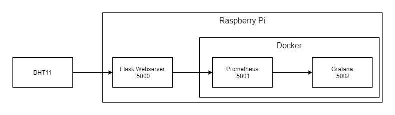

项目结构。

# 第一步

如果你想重新开始，用 Ubuntu 刷新你的 SD 卡，然后安装系统。现在，您应该可以在您的 Raspberry Pi 中全新安装 Python 3 了。执行*“sudo apt-get 更新”*和*“sudo apt-get 升级”*以使用最新软件。因为我们的应用程序可以从我们的网络访问，所以它应该有一个静态 IP 地址。使用以下[导轨](https://www.linuxtechi.com/assign-static-ip-address-ubuntu-20-04-lts/)进行设置。

# 在 Raspberry Pi 上安装 DHT11

首先，让我们把 DHT 11 安装在我们的树莓 Pi 上。如果您使用的是模块版本，这相当简单。将 5V 和 GND 连接到 Raspberry 的 GPIO，并为您的数据引脚选择模拟端口。以下由[电路基础](https://www.circuitbasics.com/how-to-set-up-the-dht11-humidity-sensor-on-the-raspberry-pi/)提供的原理图可能会有所帮助。如果你使用的是 4 针版本，检查这个[原理图](https://www.circuitbasics.com/how-to-set-up-the-dht11-humidity-sensor-on-the-raspberry-pi/)。

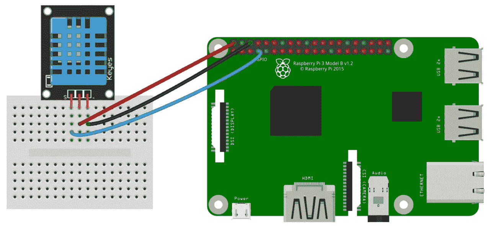

由[电路基础知识组成的布线示意图。](https://www.circuitbasics.com/how-to-set-up-the-dht11-humidity-sensor-on-the-raspberry-pi/)

# 读取 DHT11 传感器

正如大多数教程所述，您可以使用 [Adafruit Python DHT](https://pypi.org/project/Adafruit_Python_DHT) 库来轻松连接和读取传感器。您可以按照上述文档中的安装步骤将其安装到 python 环境中。

# **建立一个简单的 Flask 网络服务器**

因为我们想从我们的 GPIO 中读取数据，并且能够将其提供给 [Grafana](https://grafana.com/) ，我们可以使用 [Prometheus](https://prometheus.io/) 。为了向 Prometheus 发送数据，我们可以使用 [Flask](https://flask.palletsprojects.com/en/1.1.x/) 创建一个简单的 web 服务器。在下面的代码片段中，我们将读取来自传感器的数据(通过 GPIO 的引脚 2)并在调用端点“/metrics”时将其格式化为 Prometheus 语法(这是 Prometheus 的默认端点)。

要运行我们的 web 服务器，请从您的终端运行以下命令:

```
$ export FLASK_APP=app.py
$ flask run
```

更多关于启动 Flask 应用的信息，你可以在这里找到。

## 可选择的

如果您希望您的服务作为守护进程任务(后台任务)运行，您可以创建一个 shell 脚本并将其添加到您的服务中。您的脚本应该保存在一个文件夹中，并使用 *chmod* 命令设置为可执行。之后，将您的服务添加到 *systemctl* 中。对于一步一步的版本，查看这个[职位](https://stackoverflow.com/a/54989484)。

在所有这些之后，您的服务应该作为一个守护服务运行，所以如果您重新启动系统，它会自动再次启动。

# 码头时间到了

既然要像 Grafana 和 Prometheus 一样使用多个服务，那么最简单的方法就是通过 Docker 来使用。要安装 Docker，请遵循 Docker 文档中的说明。需要时记得使用 ARM64 变体。这是一个非常简单的过程。在这个过程的最后，您应该已经准备好安装 Docker 了。

# 设置 Portainer

通过命令行管理容器很好，但是有时候，使用 web 界面(尤其是在您的本地网络上)更好。搬运工来救援了。Portainer 是一个简化但功能强大的 docker 管理层，具有 Web GUI。要安装它，请遵循其[安装页面](https://www.portainer.io/installation/)上的说明。

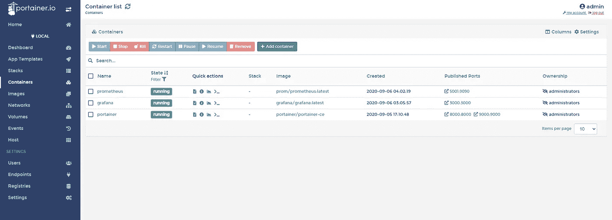

Portainer 的容器管理屏幕截图。

# 设置普罗米修斯

由于我们使用 Docker 和 Portainer，旋转普罗米修斯很容易。Prometheus 允许我们以时间序列的方式从 web 服务器中删除度量信息。只需在 Portainer 的**【添加容器】**中创建一个新的容器，让我们创建一个新的 Prometheus 实例。

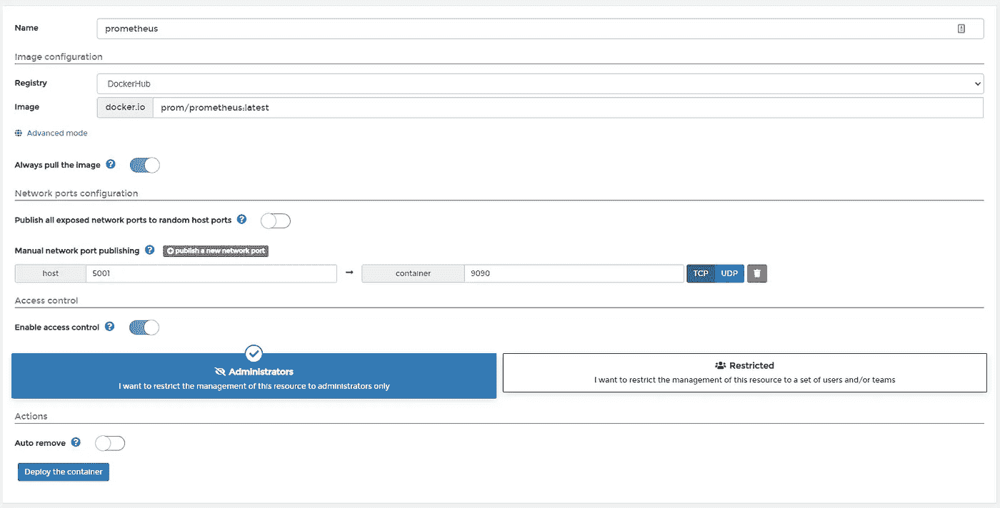

在 Portainer 上创建新容器

命名你的容器，使用 [*普罗米修斯:最新*](https://hub.docker.com/r/prom/prometheus/) 作为你的图像。您可以将 Prometheus 的默认端口(9090)更改为更接近我们的 webserver 端口的端口，比如我们主机上的 5001(将容器端口保留为 9090)。关于 docker 上普罗米修斯的更多信息，可以查看[文档](https://prometheus.io/docs/prometheus/latest/installation/#using-docker)。

## 配置文件

Prometheus 使用名为“prometheus.yml”的文件来设置其配置并定义废弃的服务。您可以使用这个基本配置文件，并用您的 [Raspberry Pi IP 地址](https://tecadmin.net/check-ip-address-on-linux/)和 web 服务器端口，例如 *192.168.0.103:5000* 来更改*" your . Raspberry . IP . Address "*。有关配置的更多信息，请查看 Prometheus 的[文档](https://prometheus.io/docs/prometheus/latest/configuration/configuration/)。

现在把它保存在主机上，并绑定到我们的容器，这样它就可以被普罗米修斯消耗掉了。

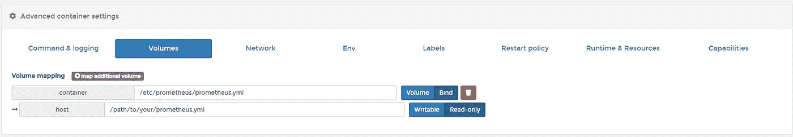

向/etc/prometheus/prometheus.yml 添加新绑定

现在，点击“**部署容器**”，我们应该准备好了。

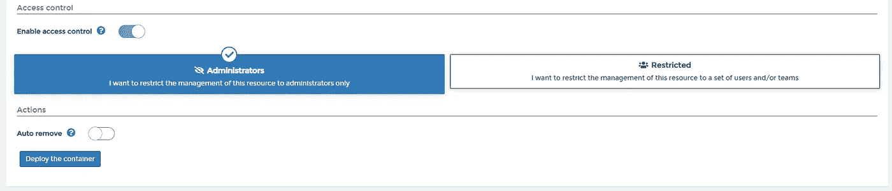

给 Portainer 几分钟时间旋转容器，它应该在您的**容器**面板上显示为正在运行。

# 设置 Grafana

现在轮到格拉法纳了。让我们使用与普罗米修斯相同的策略。使用[*grafana/grafana:latest*](https://hub.docker.com/r/grafana/grafana/)在 Portainer 上创建一个新容器，并将其映射到主机上的一个端口，如 5002。Grafana 不需要配置文件，所以启动它非常简单。**展开容器**并等待几分钟。容器应该在您的 Portainer 上显示为“正在运行”。

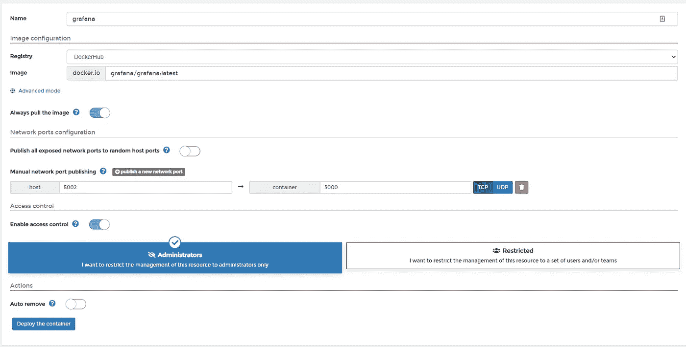

创建 Grafana 容器。

访问[http://*your.raspberry.ip.address*](http://your.raspberry.ip.address)*:5002(*用你的 Raspberry Pi IP 地址更改 your . Raspberry . IP . Address)访问 Grafana。您应该会看到一个登录屏幕。使用“admin”作为用户名和密码，[，您将进入](https://grafana.com/docs/grafana/latest/getting-started/getting-started/#:~:text=Log%20in%20for%20the%20first,for%20the%20username%20and%20password.)。

## 设置数据源

现在是时候建立我们的普罗米修斯数据源了。进入 Grafana 后，在侧边栏上，你会发现一个齿轮图标，在它里面，你会发现**数据源**项。点击它，然后点击**添加数据源**。

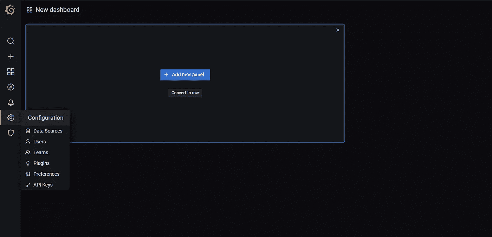

格拉夫纳的屏幕。

选择普罗米修斯，我们来配置一下。选择一个名称，输入 Prometheus 实例的 URL(您的 Raspberry Pi IP 地址)和服务端口。点击**保存并测试**，如果一切正常，您将看到一个绿色通知，表示成功。

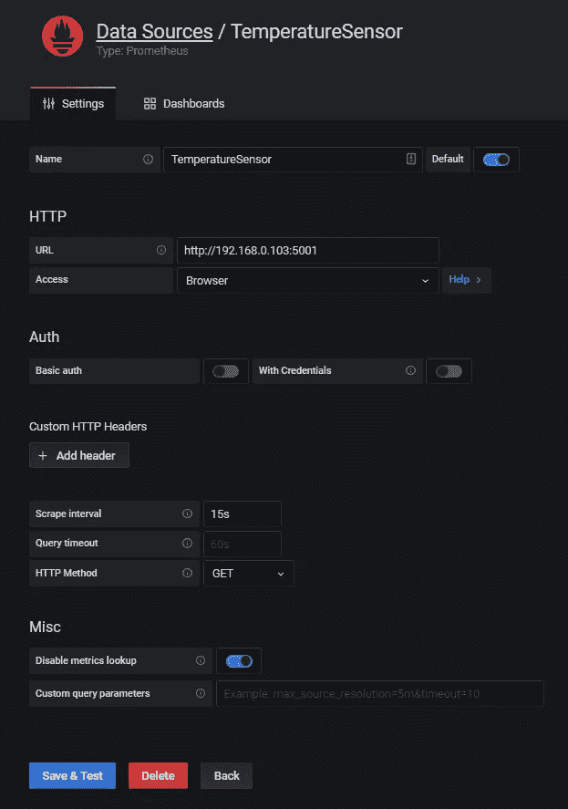

数据源配置。

# 创建仪表板

在我们设置了数据源之后，我们可以创建一个新的仪表板，添加一个新的面板，并向其中添加度量。我们的第一个面板将负责使用字段“ *local_temp* ”显示当前温度，如 Flask webserver 片段中所定义。

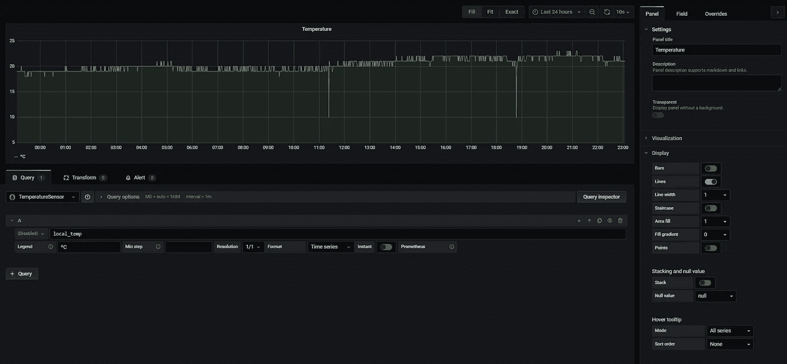

在仪表板内创建新面板。

我们的第二个面板将通过读取烧瓶片段中设置的字段*“local _ weather”*来显示湿度水平。两个面板都完成后，您将能够看到值随时间的变化。

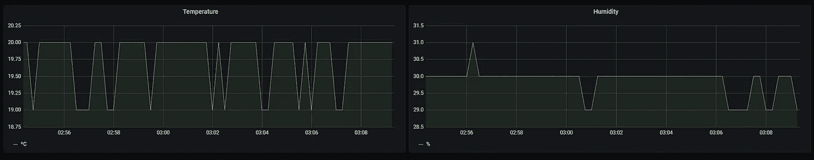

带有温度和湿度的简单仪表板。

# 物联网和数据可视化的第一步

这是一个简单的周末项目，可以帮助您熟悉从传感器读取数据，并通过互联网将其传播到数据可视化工具。在安全性、功能性和可靠性方面，这个项目还可以改进很多。我希望它能激励你开始修改它，如果有任何疑问，请告诉我。