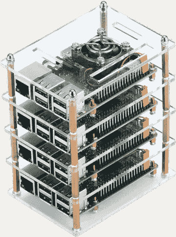
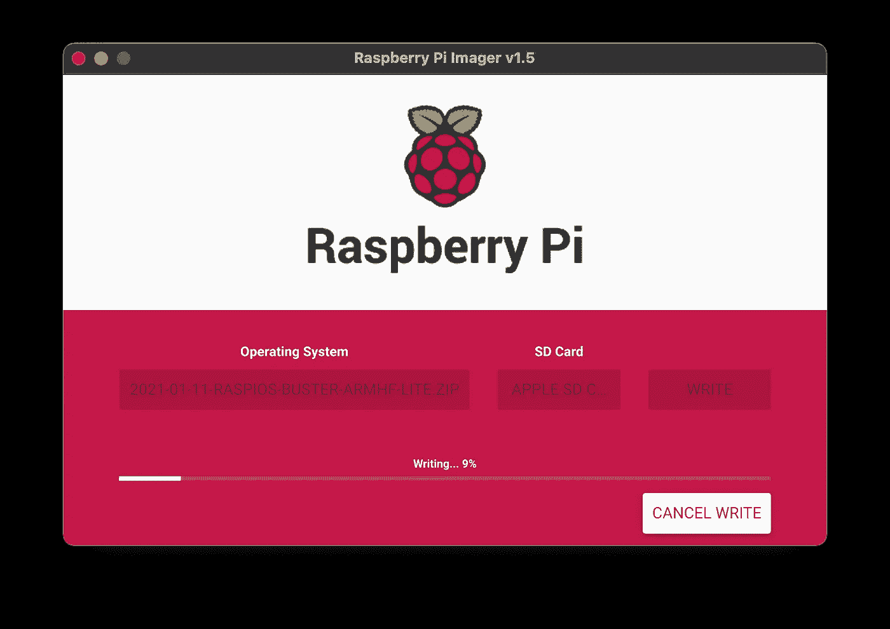
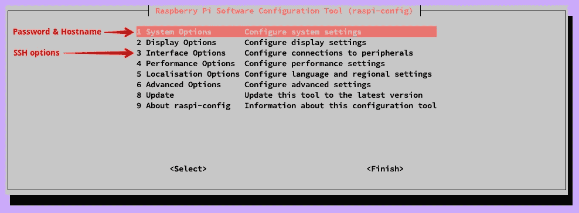

# 设置 Raspberry Pi 集群

> 原文：<https://levelup.gitconnected.com/setting-up-a-raspberry-pi-cluster-b0fda1ee44ba>


标志出自[raspberrypi.org](https://www.raspberrypi.org/)

在您的家庭桌面上设置本地 Raspberry Pi 集群的安装说明。

[sd 卡上的操作系统](#664d)
[网络设置](#034c)
[RPi 配置](#563e)
[SSH 配置](#54f7)
∘ [客户端](#cb08)
∘ [RPi 服务器](#3f73)
[验证](#ab77)
[故障排除](#3282)
∘ [区域设置问题](#952f)
[总结](#a3be)

> **注意:**在这篇文章发表的时候，还没有支持 64 位系统的官方`Raspberry Pi OS`图像。有[测试版](https://downloads.raspberrypi.org/raspios_arm64/images/)，但有局限性。这篇博文在正式发布之前不会涉及它们。



# SD 卡上的操作系统

1.将 SD 卡连接到您的本地机器(笔记本电脑/台式机)

2.从[这里](https://www.raspberrypi.org/software/operating-systems/#raspberry-pi-os-32-bit)下载`Raspberry Pi OS Lite (Debian Buster)`图像

3.使用此处中[指定的`Raspberry Pi Imager`刷新操作系统映像](https://www.raspberrypi.org/software/)



4.闪烁后，弹出 SD 卡并将其重新连接到本地机器

5.检查`boot`连接的设备

6.安装 SD 卡

7.打开一个终端会话，在引导分区中创建一个名为`ssh`的文本文件

```
# If you are working on macOS
sudo touch /Volumes/boot/ssh# Other Unix-like operating system
sudo touch <path-to-rpi-boot-volume>/ssh
```

8.弹出 SD 卡并将其连接到 Raspberry Pi

# 网络安装程序

1.  启动 RPi 并直接连接到家用路由器
2.  打开路由器网络[仪表板](http://192.168.1.1/)

> **注意:**您的路由器仪表板地址可能会有所不同，请查阅您的路由器制造指南。

3.在`LAN settings` - > `Client List`下验证是否有新的`raspberrypi`客户端

4.使用本[指南](http://blog.zachinachshon.com/rpi-network/)分配一个静态 IP 地址

# RPi 配置

1.使用前面步骤中的 IP 地址和默认密码`raspberry`使用`ssh pi@<RPI-IP-ADDRESS>`SSH 进入服务器

2.通过编辑 RPi 配置文件`sudo vi /boot/config.txt`并将`gpu_mem=16`追加到其中，将 GPU 内存分割设置为 16MB

> **注意:**我们指定了为 GPU(显示器)保留的最小内存，因为我们不需要用户界面。

3.使用`sudo reboot`重启以使更改生效

4.再次 SSH 到 RPI 服务器并键入`sudo raspi-config`。编辑以下设置:

*   更改`pi`用户的密码(**推荐**)
*   根据您的喜好设置主机名
*   确保 SSH 服务器已启用

> **注意:**如果您计划将这个服务器用作 Kubernetes 主服务器，那么就将其命名为`kmaster`。如果它是一个 Kubernetes worker 节点，将其命名为`knode<number>`，而`<number>`是集群栈的下一个内联编号。



5.关闭 SSH 会话，并重新连接到 RPi 服务器

6.验证主机名设置是否正确，如果需要，强制手动替换。从 RPi 终端:

*   运行`cat /etc/hostname`并检查`kmaster`
*   运行`cat /etc/hosts`并检查`127.0.1.1 kmaster`
*   运行`hostname`将返回`kmaster`，否则运行`sudo hostname kmaster`并再次检查

> **注意:**如果您正在设置 Kubernetes 集群，请根据服务器类型使用`kmaster`或`knode<number>`。

7.**(可选):**在 RPi 服务器上安装您喜爱的实用程序:

```
# Use Vim as a text editor
sudo apt-get -y install vim
```

8.**(可选):**在`~/.bashrc`上设置您的首选别名:

```
# Open bash run command file for editing
vim ~/.bashrc

# List all files/directories including hidden ones with size unit suffixes 
alias l="ls -lah"
```

9.**(可选):**如果您计划安装 Kubernetes 的 Rancher `k3s`版本，您应该通过将它们添加到 `*/boot/cmdline.txt*` *文件*的末尾*来启用一些容器特性:*

```
*# Edit file using sudo*
sudo vim /boot/cmdline.txt

*# Append the following*
cgroup_enable**=**cpuset cgroup_memory**=**1 cgroup_enable**=**memory
```

# SSH 配置

我们需要为客户端 RPi 服务器通信配置安全外壳访问。它将允许我们从客户端机器(如我们的笔记本电脑)访问 RPi 服务器，还允许 RPi 服务器和我们本地安装的实用程序之间的安全通信。

## 客户

这些说明与用于连接 RPi 服务器的计算机相关:

1.  如果目录`~/.ssh`不存在，则创建该目录，并放入 cd 中
2.  运行`ssh-keygen`(名字为`kmaster OR knode<number>`，无密码)
3.  将私钥`kmaster`添加到 ssh 代理中(在永久/临时之间选择)

```
ssh-add ~/.ssh/kmaster     # Add temporary to keychain
ssh-add -K ~/.ssh/kmaster  # Add permanently to keychain
```

> **注意:**这将允许安全通信，而无需每次都提示输入密码。

4.将公钥复制到 RPi 服务器，选择一个选项:

*   **备选方案 1:**

```
# Master node
ssh-copy-id -i ~/.ssh/kmaster.pub pi@<RPI-IP-ADDRESS>

# Worker node
ssh-copy-id -i ~/.ssh/knode<number>.pub pi@<RPI-IP-ADDRESS>
```

> **重要提示:**在此步骤中，您需要使用您的密码进行验证。一个名为`~/.ssh/authorized_keys`的文件是用 RPi 服务器上的公钥内容自动创建的。

*   **选项 2:(手动)**

将`kmaster.pub` / `knode<number>.pub`的内容直接复制到 RPi `authorized_keys`文件中:

```
*# Master node*
cat ~/.ssh/kmaster.pub | ssh pi@<RPI-IP-ADDRESS> 'mkdir -p ~/.ssh && cat >> ~/.ssh/authorized_keys'

*# Worker node*
cat ~/.ssh/knode<number>.pub | ssh pi@<RPI-IP-ADDRESS> 'mkdir -p ~/.ssh && cat >> ~/.ssh/authorized_keys'
```

> **重要提示:**在此步骤中，您需要使用您的密码进行验证。

5.**(可选):**如果您已经按照此处的[中所述为 RPi 服务器定义了一个静态 IP，请在您的本地机器上添加命名主机记录:](http://blog.zachinachshon.com/rpi-network/)

```
# Use names instead of IP addresses
echo -e "192.168.1.200\tkmaster" | sudo tee -a /etc/hosts
echo -e "192.168.1.201\tknode1" | sudo tee -a /etc/hosts
```

## RPi 服务器

这些说明旨在让 RPi 服务器启用 SSH 通信:

1.禁用 SSH `PasswordAuthentication`:

*   通过`sudo vim /etc/ssh/ssh_config`编辑`ssh_config`
*   通过移除前缀`#`取消对`PasswordAuthentication`的注释
*   将其值更改为`no`
*   确保`PasswordAuthentication`正确对齐(4 个空格)

2.重启 SSH 服务器

```
sudo /etc/init.d/ssh restart
sudo /etc/init.d/ssh status   # Verify SSH server is running
```

# 确认

要验证所有设置是否正确，请尝试使用以下命令从客户端机器(即笔记本电脑)连接到 RPi 服务器:

```
ssh pi@kmaster
ssh pi@knode<number>
```

# 解决纷争

## 区域设置问题

连接到 RPi 服务器和/或在服务器节点上运行`locale`时出现区域错误/警告。以下是一些错误示例:

```
setlocale: LC_ALL: cannot change locale **(**en_US.UTF-8**)**
locale: Cannot set LC_CTYPE to default locale: No such file or directory
locale: Cannot set LC_MESSAGES to default locale: No such file or directory
locale: Cannot set LC_ALL to default locale: No such file or directory
```

**解决方案:**我们将通过运行以下步骤将我们的语言环境设置为`en_US`:

1.  到 RPi 服务器的 SSH
2.  使用`sudo vi /etc/locale.gen`编辑`locale.gen`文件
3.  通过删除`#`字符取消带有`en_US.UTF-8`的行的注释(确保没有前导空格)
4.  跑`sudo locale-gen en_US.UTF-8`
5.  运行`sudo update-locale en_US.UTF-8`
6.  运行`locale`以确保没有错误/警告

# 摘要

到这篇文章结束时，你应该有一个无头(非图形用户界面)的 Raspberry Pi 连接到你的家庭网络，SSH 通信可用，干得好！👏

**现在怎么办？**欢迎您回来查看关于如何在令人惊叹的 RPi 集群上安装 Kubernetes 的未来博文。

请在下面的讨论中留下您的评论、建议或任何其他您认为与本文相关的意见。

**喜欢这个帖子？**
您可以通过以下方式了解更多信息:

查看我的博客:[https://blog.zachinachshon.com](https://blog.zachinachshon.com)
在推特上关注我: [@zachinachshon](https://twitter.com/zachinachshon)

感谢阅读！❤️