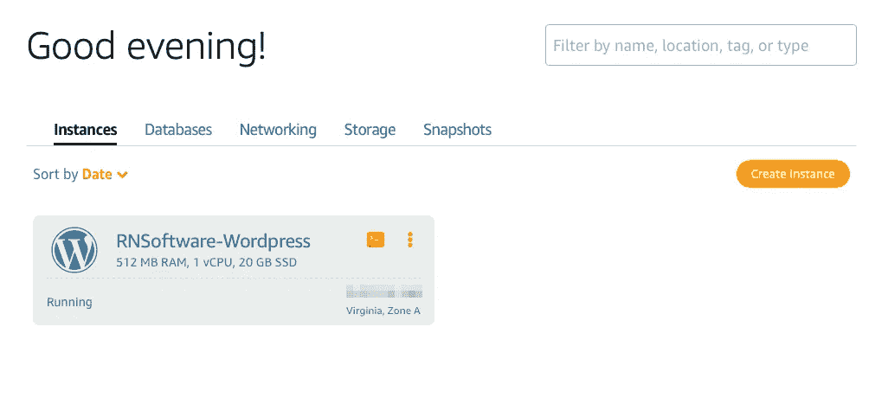
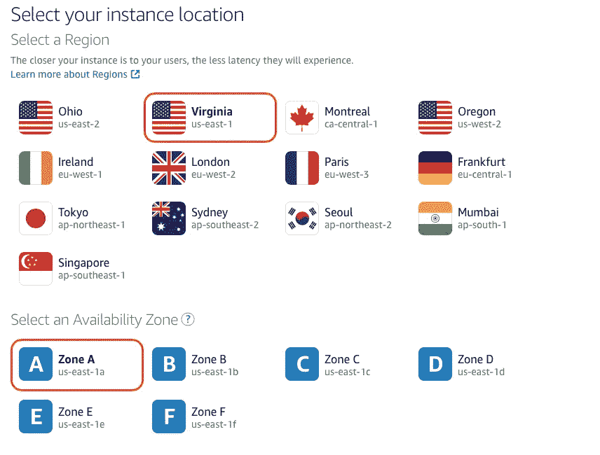
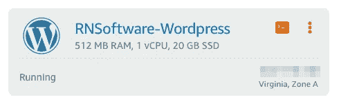
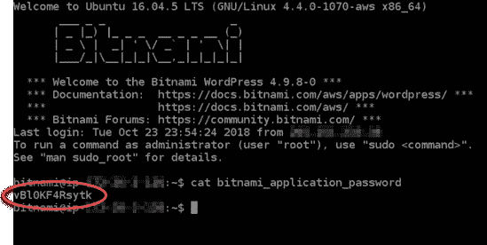
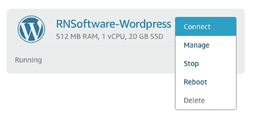

# 使用 AWS 设置 WordPress 站点

> 原文：<https://levelup.gitconnected.com/setting-up-a-wordpress-site-using-aws-a97e5e29c35>

# 绪论

你好。在写这篇文章的时候，我正在为我的公司做[的投资组合，并准备下个月推出开发服务。这个文件夹中的工作包括 WordPress 网站、Bootstrap 网站、Squarespace 网站、更新我的 iOS 应用程序“](http://rustynailsoftware.com/andrew-lundy/#portfolio) [RoadHazard](https://apps.apple.com/us/app/roadhazard/id1481914964) ”、我之前所有的网页设计和开发工作，以及在 GitHub 上的[其他 iOS 项目的一些工作。](https://github.com/andrew-lundy?tab=repositories)

我最近用 AWS 建立了一个 WordPress 网站——在我把它放入文件夹之前还有一些工作要做。在这里，我提供了一个简单的指南，展示了如何使用 Amazon Lightsail 启动并运行 WordPress！

如果你感兴趣，我还写了一篇关于使用亚马逊网络服务建立一个静态网站的指南。请注意，我不是 AWS 的专业人士。

— — —

# 在我们开始之前

亚马逊 Lightsail 是一种深入 AWS 的简单方法。该服务可用于简单的 web 应用、网站、企业软件和开发/测试环境。Lightsail 支持的‘一键’解决方案有很多，比如 WordPress，Ubuntu，Windows Server，Node.js，还有 [more](https://aws.amazon.com/lightsail/features/?opdp2=features) 。您可以在 [AWS 控制台](https://aws.amazon.com/lightsail/)中检查服务。

# 起航—在 Lightsail 中创建一个 WP 实例

确保您已登录到 [Lightsail 控制台](https://lightsail.aws.amazon.com/)。

1.)选择**创建实例**创建一个实例。

如果尚未选择，请选择 AWS 区域和可用性区域。您应该选择一个靠近用户的区域，因为这样做可以减少用户体验到的延迟。根据 Amazon 的文档:**通过在单独的可用性区域启动实例，您可以保护您的应用程序免受单个位置故障的影响。**这是我的设置:

2.)接下来，选择您的**实例图像**。平台选择 **Linux/Unix** ，蓝图选择 **WordPress** 。

3.)选择一个实例计划。

4.)最后，命名您的实例并选择**创建实例**。

# 连接到您的实例

用于登录 WordPress 管理仪表板的默认密码存储在实例中。要检索该密码，您必须使用 Lightsail 控制台中提供的基于浏览器的 SSH 客户端连接到实例。

1.)选择 Lightsail 控制台中的**实例**选项卡。点击 WordPress 实例的 SSH 快速连接图标。

2.)这将打开一个基于浏览器的 SSH 客户端窗口。要获得默认密码，请输入**cat $ HOME/bitnami _ application _ password**。

3.)记下密码，因为你需要用它来登录 WordPress 站点的管理面板。

接下来，我们将使用这个密码登录你的 WordPress 网站的管理面板。

# 登录您的 WordPress 仪表盘

WP 管理面板让你可以访问很多东西，比如编辑网站，管理用户账户，安装插件等等。

1.)前往[**http://public IP address/WP-log in . PHP**。](http://PublicIpAddress/wp-login.php.)代替 **PublicIpAddress** ，将其更改为在 WordPress 站点的**实例**上找到的 IP 地址。(该实例位于 Lightsail 的**实例**选项卡中)。

2.)这将打开您的管理仪表板登录门户。使用“用户”作为用户名和临时密码登录。我建议在管理仪表板中找到**用户**，并更改密码。

现在，你已经建立了一个可以通过 IP 地址访问的 WordPress 站点。注意，这个 WordPress 实例现在被认为是“正在运行”如果您**停止**该实例，当您**再次启动**它时，IP 地址将会改变。你可以在 Lightsail 控制台的**实例**选项卡中找到这些选项——在实例本身上。

如果你想给 WordPress 站点附加一个静态 IP，遵循亚马逊文档[中列出的步骤。你也可以用 AWS](https://lightsail.aws.amazon.com/ls/docs/en_us/articles/lightsail-create-static-ip) 设置一个 WordPress 站点的整个过程。

— — —

感谢您在百忙之中抽出时间来阅读这些内容。如果你想和我直接联系，你可以在 [Twitter](https://twitter.com/andrewlundydev) 、 [Medium](https://medium.com/@andrewlundydev) 和 [LinkedIn](https://medium.com/@andrewlundydev) 上关注我。也可以[在锈钉软件网站](https://rustynailsoftware.com/andrew-lundy/#portfolio)查看我的作品。

继续做出令人惊叹的东西。

安德鲁