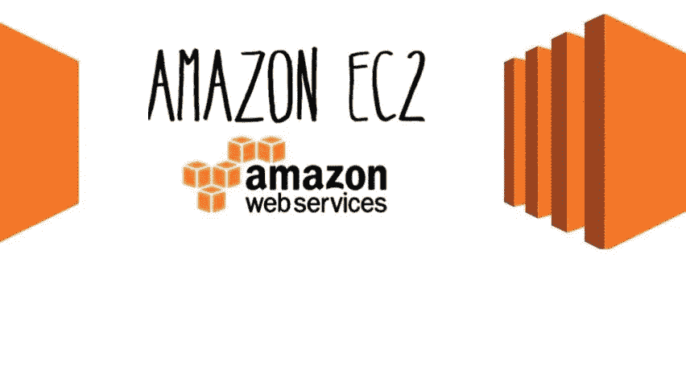
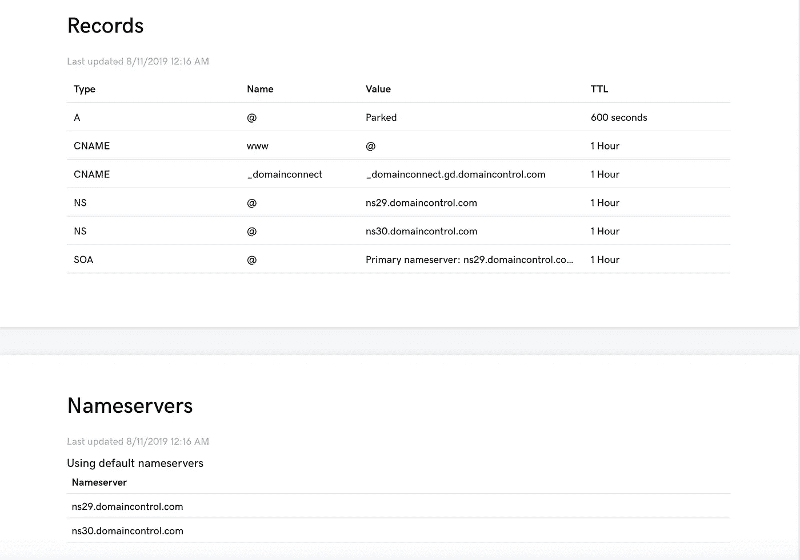
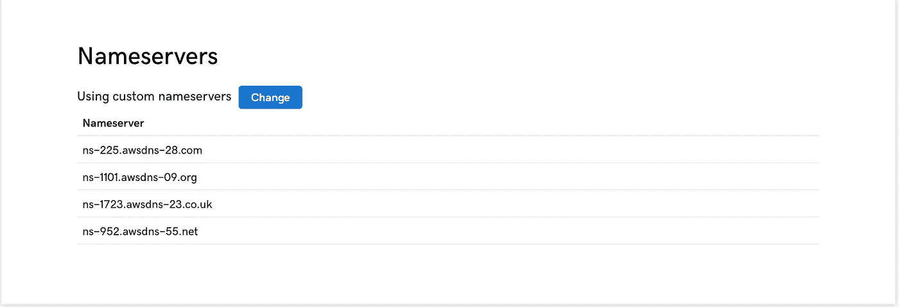
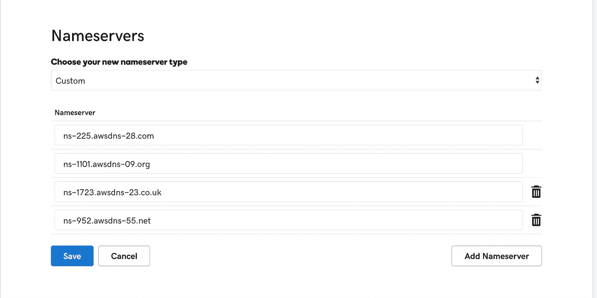
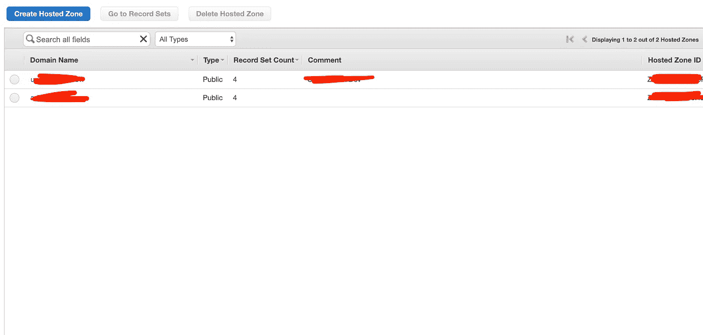
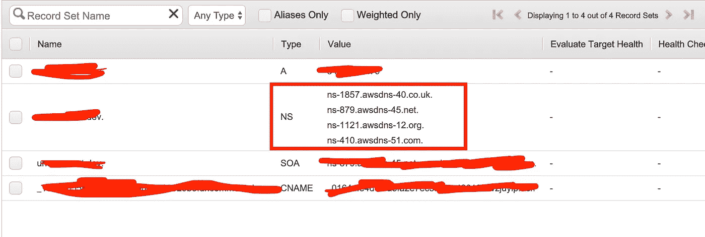
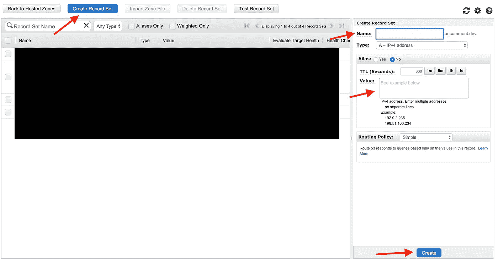

# 在 AWS Linux AMI 上几秒钟内建立一个 apache 网站

> 原文：<https://levelup.gitconnected.com/setting-up-an-apache-website-in-seconds-on-aws-linux-ami-2eecdf970e6e>

几年前建立一个域名可能需要几个小时到几天的时间才能看到你的域名显示你已经工作了一段时间的页面。AWS 的 SaaS 平台非常灵活，部署你的 HTML 网页只需几分钟。

让我们先来看一些领域。你可以从 GoDaddy 那里得到你的完美域名(*alert*非赞助帖)。我更喜欢 GoDaddy，因为它很容易设置和更改名称服务器。(我们肯定会谈到名称服务器)

让我们从获得域名开始。你可以点击[https://www.godaddy.com/](https://www.godaddy.com/)搜索你的域名。在这篇文章中，我将以 snoopypop.com 为例。一旦你购买了你的域名，你将导航到 DNS 管理屏幕，你的网址应该看起来像 https://dcc.godaddy.com/manage/[域名</DNS](https://dcc.godaddy.com/manage/dilsedesiradio.com/dns)。一旦你到达这一页，

DNS 管理 GoDaddy

您可能会看到一个“更改域名服务器”按钮。继续点击它。

让我们将此选项卡留在这里，打开 AWS 控制台。【https://aws.amazon.com 

如果您没有帐户，请创建一个。设置你的 AWS 账户非常简单。

进入 AWS 控制台后，搜索 Route 53。在 53 号公路上，您应该看到托管区域/创建新的托管区域。继续创建新的托管区域。

我们从这一页需要的是这个信息，NS 记录。

域记录管理 AWS 路由 53

从 AWS 获取这些名称服务器，并将其添加到 GoDaddy DNS 管理控制台。记得剥去圆点(。)在每个名称服务器的末尾，GoDaddy 不喜欢末尾有点。保存新的 NS 配置。

如何用 apache 设置 EC2 实例:[https://www . geeks forgeeks . org/AWS-EC2-instance-setup-with-Apache-server/](https://www.geeksforgeeks.org/aws-ec2-instance-setup-with-apache-server/)

假设您有一个 EC2 实例，使用您喜欢的服务器技术 Nginx/node/apache 运行。我将介绍如何将 EC2 实例连接到 AWS 域。

我们回到 53 号公路，我们将创建一个新的记录集。

托管区域—域设置

名称:(空)-这通常用于子域

值:您的 EC2 公共 IP v4 地址。(xx . xx . xx . xx . xx)

一旦您创建了这个记录，您应该能够 ping snoopypop.com，呈现您的 HTML 网页托管在 EC2 上。

如有任何疑问，欢迎评论或联系我。