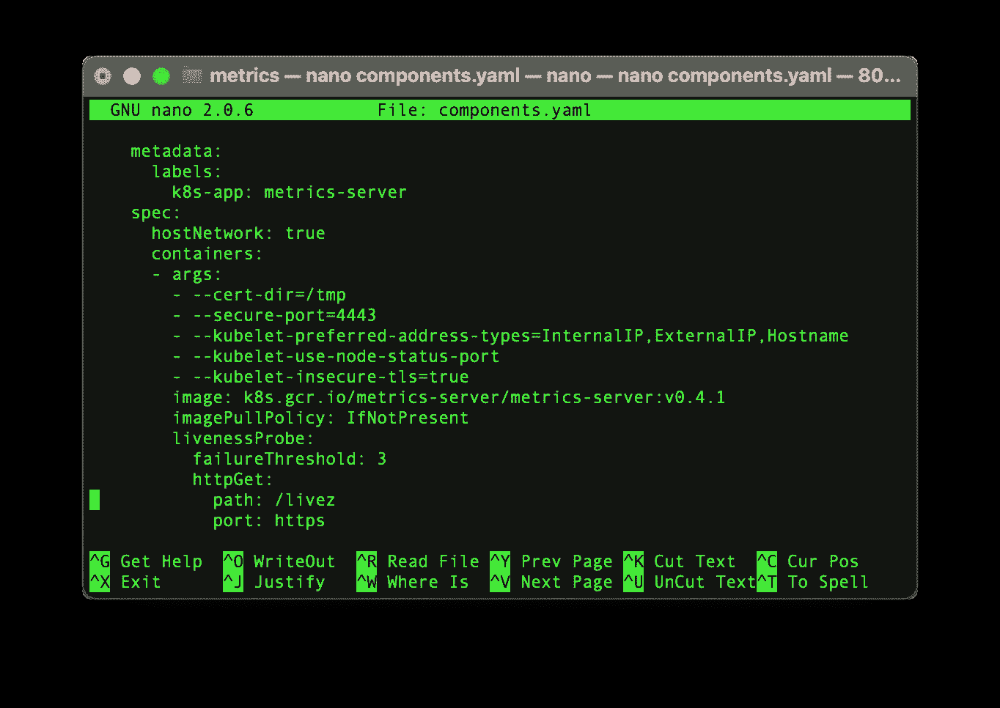
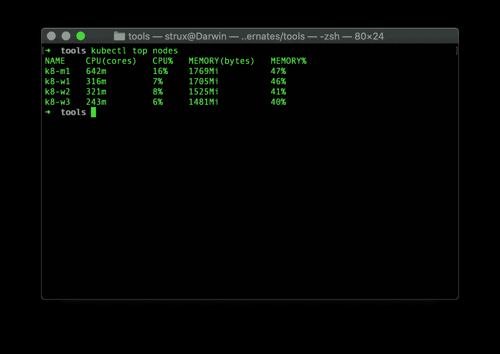
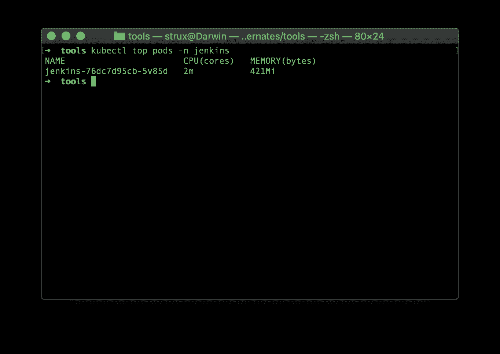
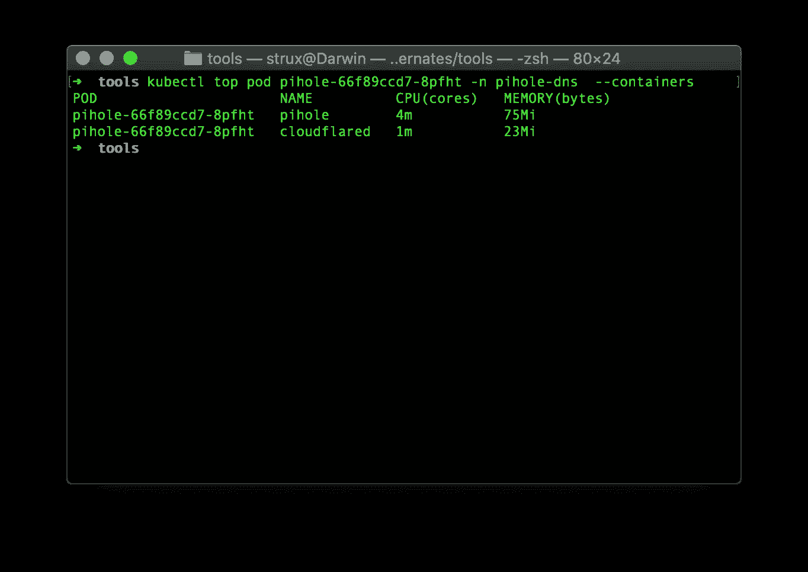

# 为 RaspberryPi Kubernetes 集群设置和使用度量服务器

> 原文：<https://levelup.gitconnected.com/setting-up-and-using-metrics-server-for-raspberrypi-kubernetes-cluster-de2e10bb9459>

如何安装和使用 MetricsServer 来快速获取 Kubernetes 集群的统计数据


照片由 [chuttersnap](https://unsplash.com/@chuttersnap?utm_source=medium&utm_medium=referral) 在 [Unsplash](https://unsplash.com?utm_source=medium&utm_medium=referral) 上拍摄

不久前，我写了一篇关于在 RaspberryPi 上建立 Kubernetes 集群的指南:

[](/step-by-step-slow-guide-kubernetes-cluster-on-raspberry-pi-4b-part-1-6e4179c89cbc) [## 循序渐进指南—树莓 Pi 4B 上的 Kubernetes 集群—第 1 部分

### 基于 RaspberryPi 4B、Containerd、Project Calico、MetalLB 和 Ubuntu Server 的 Kubernetes 集群

levelup.gitconnected.com](/step-by-step-slow-guide-kubernetes-cluster-on-raspberry-pi-4b-part-1-6e4179c89cbc) 

部署之后，人们首先希望看到和监控的是集群利用率。在本文中，我将解释如何安装和使用 Metrics Server v0.4.1，通过 kubectl top 命令获得一些快速统计数据。

Metrics Server 从集群中的所有节点和 pod 收集 CPU 和内存利用率信息，并且可以通过使用 kubectl top 命令轻松访问。

首先，我们需要通过运行以下命令来获取 MetricsServer yaml 文件:

```
wget [https://github.com/kubernetes-sigs/metrics-server/releases/download/v0.4.1/components.yaml](https://github.com/kubernetes-sigs/metrics-server/releases/download/v0.4.1/components.yaml)
```

现在我们需要为我们的 Pi arm64 架构修改文件，所以让我们打开文件:

```
nano components.yaml
```



对 components.yaml 的更改

您将在 spec 部分添加粗体行，这将允许 MetricsServer 使用自签名证书:

```
spec:
 **hostNetwork: true**
 containers:
  - args:
    - --cert-dir=/tmp
    - --secure-port=4443
    - --kubelet-preferred-address-types=InternalIP,ExternalIP,Hostname
    - --kubelet-use-node-status-port
   ** - --kubelet-insecure-tls=true**
```

接下来我们要做的是通过运行以下命令来部署到我们的集群:

```
kubectl apply -f components.yaml
```

最后，完成所有工作后，我们可以通过运行以下命令来获取集群的指标:

```
kubectl top get nodes
```

请注意，为了获得结果，您可能需要等待几分钟，直到收集到指标，同时您可能会看到以下错误:

```
error: metrics not available yet
```

最后，几分钟后，您应该会得到结果:



kubectl 顶级节点

现在，我们还应该能够通过运行`top pods`来获得 pod 统计信息，例如对于给定的名称空间:

```
kubectl top nodes -n jenkins
```



kubectl 顶级节点

如果每个 pod 运行多个容器，您可以通过指定 pod 名称和`--containers`标志来查看单个容器的统计信息，例如:

```
kubectl top pod pihole-66f89ccd7-8pfht -n pihole-dns --containers
```



获取 pod 内容器的统计信息

就是这样！我们在短短几分钟内就将一切准备就绪:)