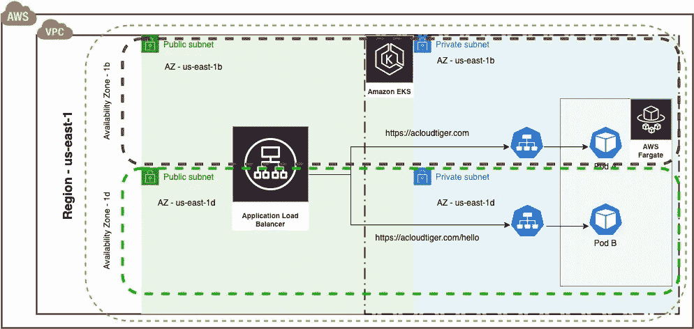
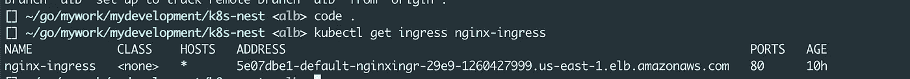
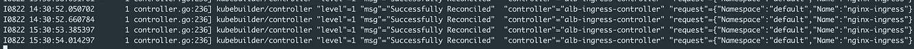
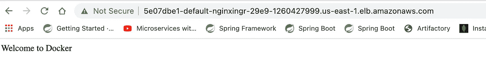

# 为在 AWS EKS Fargate 中运行的 pod 设置应用程序负载平衡器(入口)

> 原文：<https://levelup.gitconnected.com/setting-up-application-load-balancer-ingress-for-the-pods-running-in-aws-eks-fargate-519e20e97497>

H 高兴就是看到一个*成功的应用程序负载平衡器日志*为 Kubernetes 集群**在经历了如此多的奋斗和不眠之夜后终于**

```
I0822 10:55:53.658057 1 controller.go:236] kubebuilder/controller “level”=1 “msg”=”Successfully Reconciled” “controller”=”alb-ingress-controller” “request”={“Namespace”:”default”,”Name”:”nginx-ingress”}
I0822 10:57:22.687357 1 controller.go:236] kubebuilder/controller “level”=1 “msg”=”Successfully Reconciled” “controller”=”alb-ingress-controller” “request”={“Namespace”:”default”,”Name”:”nginx-ingress”} 
```


AWS EKS

一个**应用负载平衡器**在管理 Kubernetes 集群中不同微服务(pods)的流量方面扮演着重要角色。您可以随时创建多个 Kubernetes 服务(类型为 **LoadBalancer)** ，这些服务将在 AWS 中为您的所有后端设备/应用提供**经典负载平衡器**，但这将是一件昂贵的事情，因为它会成倍增加您的云账单。

在这篇博客中，您将看到如何配置**入口**控制器，以在 **AWS (Amazon Web Services)** 中提供单个 **ALB** ( **应用程序负载平衡器)**来管理 Kubernetes 集群(AWS EKS **版本** **1.20** )中运行的 pods 的所有流量。

# 我的建筑:-



ALB 入口控制器— AWS EKS 法盖特

首先，我假设您已经有了一个正在运行的 AWS EKS (Fargate)。

1.  为 Kubernetes 集群或 AWS EKS 建立 **OIDC 提供商**

```
eksctl utils associate-iam-oidc-provider — cluster $CLUSTER_NAME — approve
```

*(用您的 AWS EKS 集群名替换 CLUSTER _ NAME，除非它在环境变量中设置)*

2.为入口创建一个 **IAM 策略**

```
wget -O alb-ingress-iam-policy.json [https://raw.githubusercontent.com/kubernetes-sigs/aws-alb-ingress-controller/master/docs/examples/iam-policy.json](https://raw.githubusercontent.com/kubernetes-sigs/aws-alb-ingress-controller/master/docs/examples/iam-policy.json) aws iam create-policy — policy-name ALBIngressControllerIAMPolicy — policy-document file://alb-ingress-iam-policy.json
```

3.为入口 Kubernetes 对象创建一个**角色**和**角色绑定**

```
STACK_NAME=eksctl-$CLUSTER_NAME-cluster VPC_ID=$(aws cloudformation describe-stacks — stack-name “$STACK_NAME” | jq -r ‘[.Stacks[0].Outputs[] | {key: .OutputKey, value: .OutputValue}] | from_entries’ | jq -r ‘.VPC’) AWS_ACCOUNT_ID=$(aws sts get-caller-identity | jq -r ‘.Account’)---
apiVersion: rbac.authorization.k8s.io/v1
kind: ClusterRole
metadata:
  labels:
    app.kubernetes.io/name: alb-ingress-controller
  name: alb-ingress-controller
rules:
  - apiGroups:
      - ""
      - extensions
    resources:
      - configmaps
      - endpoints
      - events
      - ingresses
      - ingresses/status
      - services
    verbs:
      - create
      - get
      - list
      - update
      - watch
      - patch
  - apiGroups:
      - ""
      - extensions
    resources:
      - nodes
      - pods
      - secrets
      - services
      - namespaces
    verbs:
      - get
      - list
      - watch
---
apiVersion: rbac.authorization.k8s.io/v1
kind: ClusterRoleBinding
metadata:
  labels:
    app.kubernetes.io/name: alb-ingress-controller
  name: alb-ingress-controller
roleRef:
  apiGroup: rbac.authorization.k8s.io
  kind: ClusterRole
  name: alb-ingress-controller
subjects:
  - kind: ServiceAccount
    name: alb-ingress-controller
    namespace: kube-system
```

4.为入口创建**服务帐户**对象

```
eksctl create iamserviceaccount \ — name alb-ingress-controller \ — namespace kube-system \ — cluster $CLUSTER_NAME \ — attach-policy-arn arn:aws:iam::$AWS_ACCOUNT_ID:policy/ALBIngressControllerIAMPolicy \ — approve
```

5.现在让我们为应用程序负载平衡器部署入口控制器( **v 1.1.8** )

```
apiVersion: apps/v1
kind: Deployment
metadata:
  labels:
    app.kubernetes.io/name: alb-ingress-controller
  name: alb-ingress-controller
  namespace: kube-system
spec:
  selector:
    matchLabels:
      app.kubernetes.io/name: alb-ingress-controller
  template:
    metadata:
      labels:
        app.kubernetes.io/name: alb-ingress-controller
    spec:
      containers:
      - name: alb-ingress-controller
        args:
        - --ingress-class=alb
        - --cluster-name=eks-fargate-alb-demo
        - --aws-vpc-id=vpc-0dc46d370e38de475
        - --aws-region=us-east-1
        image: docker.io/amazon/aws-alb-ingress-controller:v1.1.8
      serviceAccountName: alb-ingress-controller
```

参数 **— aws-vpc-id** 和 **— aws-region** 只需要在 **AWS** **EKS 带有 Fargate profile** 的情况下传递。如果您有配备了**节点组**的 AWS EKS，您不需要传递这两个信息。

6.现在让我们部署一个带有节点端口服务的示例应用程序:-

```
apiVersion: v1
kind: Pod
metadata:
  creationTimestamp: null
  labels:
    run: mydocker
  name: mydocker
spec:
  containers:
  - image: ghcr.io/vinod827/my-docker:1.0
    name: mydocker
    resources: {}
    ports:
    - containerPort: 8080
  dnsPolicy: ClusterFirst
  restartPolicy: Always
status: {}---apiVersion: v1
kind: Service
metadata:
  creationTimestamp: null
  labels:
    eks.amazonaws.com/fargate-profile: fp-default
    run: mydocker
  name: mydocker-svc
  annotations:
    alb.ingress.kubernetes.io/target-type: ip
spec:
  ports:
  - port: 8080
    protocol: TCP
    targetPort: 8080
  selector:
    eks.amazonaws.com/fargate-profile: fp-default
    run: mydocker
  type: NodePort
status:
  loadBalancer: {}
```

7.最后，我们在集群中创建我们的**入口**对象

```
apiVersion: networking.k8s.io/v1
kind: Ingress
metadata:
  name: "nginx-ingress"
  namespace: "default"
  annotations:
    kubernetes.io/ingress.class: alb
    alb.ingress.kubernetes.io/scheme: internet-facing
    alb.ingress.kubernetes.io/security-groups: sg-014b302d73097d083
  labels:
    app: nginx-ingress
spec:
  rules:
  - http:
      paths:
      - path: /foo
        pathType: Prefix
        backend:
          service:
            name: "nginx-service"
            port:
              number: 80
      - path: /*
        pathType: Prefix
        backend:
          service:
             name: "mydocker-svc"
             port: 
               number: 8080
```

输入以下命令查看入口对象的详细信息:-

```
kubectl get ingress nginx-ingress
```



您将看到您的应用程序负载平衡器的一个端点 URL，如**5e 07 DBE 1-default-nginingr-29e 9–1260427999 . us-east-1 . elb . Amazon AWS . com**

还要检查入口控制器 Pod 的日志，查看负载平衡器是否有问题。如果您看到下面的日志(*)那么这意味着，您的负载平衡器是活跃的，并且正确地监听健康的目标组:-*

```
*kubectl logs alb-ingress-controller-5f6479d9c9-hg6xx -n kube-system -fI0822 15:30:53.385397 1 controller.go:236] kubebuilder/controller “level”=1 “msg”=”Successfully Reconciled” “controller”=”alb-ingress-controller” “request”={“Namespace”:”default”,”Name”:”nginx-ingress”}
I0822 15:30:54.014297 1 controller.go:236] kubebuilder/controller “level”=1 “msg”=”Successfully Reconciled” “controller”=”alb-ingress-controller” “request”={“Namespace”:”default”,”Name”:”nginx-ingress”}*
```

**

*入口控制器日志*

*现在，在浏览器上打开那个 URL(您在前面的步骤中收到的)，查看来自 Pods 的响应:)*

**

*来自 Pod 的响应*

*希望你喜欢这篇文章:)*

# *摘要:-*

*在这篇博客中，我们看到了如何在 Kubernetes 集群中创建一个入口对象，以在 AWS 中配置一个应用负载平衡器，并使用该负载平衡器将流量高效地路由到在您的 Kubernetes 集群中运行的各种应用或 pod，并将您的云账单成本降至最低。*

*通常，您总是可以在这里找到来自这个 GitHub 库的源代码*

*[https://github . com/vinod 827/k8s-nest/tree/main/IAC/k8s/ALB-DEM](https://github.com/vinod827/k8s-nest/tree/main/iac/k8s/alb-demo)o*

*请随意为它贡献更多的 IaC(基础设施代码)。*