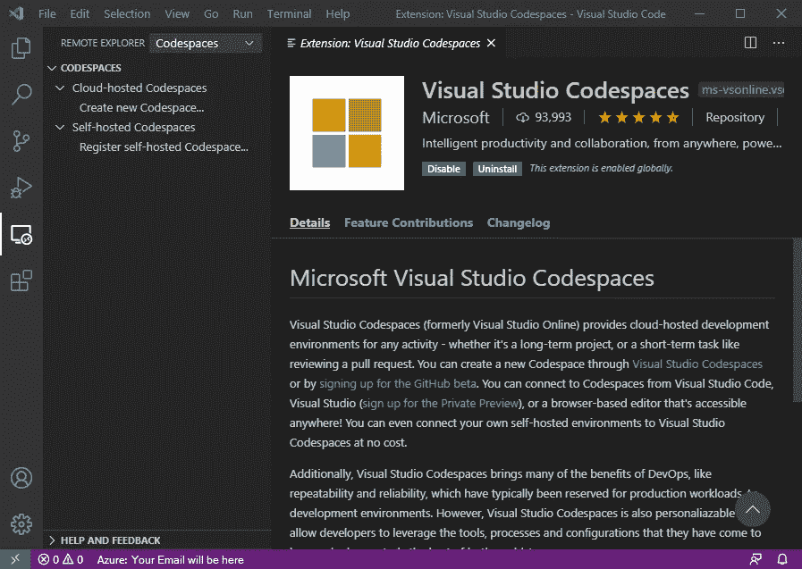
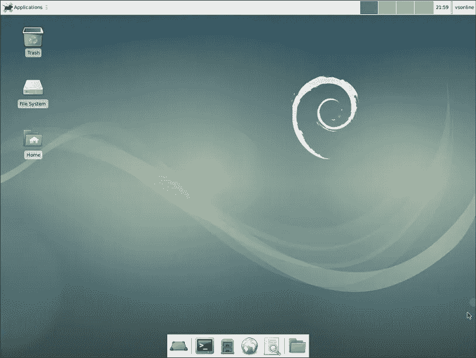

# 在 Visual Studio 代码空间中设置开发环境

> 原文：<https://levelup.gitconnected.com/setting-up-development-environment-in-visual-studio-codespaces-9e003e3ece61>

*在 Visual Studio 代码中用 VNC 服务器设置代码空间*

# 介绍

Visual Studio Codespaces 是一个基于云的开发环境。由于这完全在云中，我们可以从任何地方使用 Visual Studio 代码或任何浏览器连接到它。如果你在 Azure 中创建云托管的代码空间，代码空间是基于[订阅](https://aka.ms/vso-pricing)的环境，按使用量收费。您还可以在您的机器上设置自托管代码空间，这是免费的。

# 在 Windows 10 上安装和设置 VS 代码，如果你没有的话

在 Windows 10 上安装 VS 代码和集成 MobaXterm 终端的说明可以在我的[上一篇文章](https://medium.com/@nsanka/create-development-environment-with-vs-code-fe66f3892159)中找到。

# 在 VS 代码中安装代码空间插件

使用`Ctrl+Shift+X`键盘快捷键打开扩展市场，搜索“Visual Studio Codespaces”扩展并点击安装。安装后，在远程资源管理器中打开代码空间面板。同时安装“Azure 帐户”扩展，并使用您的 Microsoft 帐户登录。



使用`Ctrl+Shift+P`键盘快捷键打开命令面板，搜索“代码空间:创建计划”并继续输入。首先选择此代码空间计划将关联的 Azure 订阅。为此计划的资源组名称输入任意名称。如果您已经有资源组，最好保留一个不同的名称，这样，如果您在 [Azure portal](https://portal.azure.com/) 中删除该资源组，所有关联的资源将被一次性删除。选择您最常使用代码空间的地区。最后输入创建的代码空间计划的名称。

# 在代码空间中创建开发环境

让我们为开发创建一个新的代码空间环境。在代码空间面板中点击“创建新代码空间”。选择“默认设置”，即 4 个内核、8GB 内存和 30 分钟自动暂停时间。将 Repository 留空，并输入新代码空间的名称。创建基于 Linux 的环境只需几秒钟，它支持最流行的工具和 SDK，如 Python、Node.js、PHP、Java、Docker、nvm、nvs 等。，当这个新环境准备就绪时，您会看到一个通知。单击 Connect，这将重新打开 VS 代码窗口并连接到新环境。打开新终端查看流行的 bash 终端。

# 断开并挂起代码空间

在此环境中完成任务后，您可以断开连接，然后从离开的地方重新开始。使用 Codespace 环境的主要好处是，你可以在任何时间任何地点使用任何浏览器。它将在 30 分钟不活动时暂停，因此我们将只收取存储费用，而不收取计算资源费用。

# 安装 VNC 服务器

我们可以使用代码空间环境来开发控制台和 web 应用程序。我们可以使用代码空间中的端口转发特性在本地计算机中打开 web 应用程序，以查看和测试该应用程序。如果您想将此环境用于需要 GUI 的桌面应用程序，我们可以安装 vnc 服务器，并在任何 VNC 查看器中打开进行调试/测试。让我们看看下面安装 VNC 服务器的说明。

我们刚刚创建了 Linux 环境，所以让我们在终端中使用下面的命令来确保首先安装所有的更新。请注意，获得所有升级需要一些时间。

```
sudo apt update && sudo apt dist-upgrade
```

我们可以为 VNC 创建一个新用户，并将该用户添加到 sudoers，用您的选择替换 USER_NAME:

```
sudo adduser USER_NAME
usermod -a -G sudo USER_NAME
```

在安装 VNC 服务器之前，我们需要一些桌面环境。代码空间环境没有自带桌面环境，所以我们安装开源轻量级桌面环境 [XFCE](https://opensource.com/article/18/6/xfce-desktop) 如下:

```
sudo apt install xfce4 xfce4-goodies
```

安装时，它会要求选择键盘布局。根据您的键盘选择。安装 XFCE 桌面环境后，安装 VNC 服务器，如下所示:

```
sudo apt install tightvncserver
```

安装 VNC 服务器后，以用户名登录来配置 VNC 服务器。您可能需要创建用户环境变量，如下所示:

```
export USER="USER_NAME"
```

# 配置 VNC 服务器

使用`vncserver`命令设置安全密码，创建初始配置文件并启动服务器。您可以忽略只读密码。

由于我们将修改配置文件以使用 XFCE 桌面环境，请按照以下方式停止 vncserver:

```
vncserver -kill :1
```

将创建为初始配置的原始 xstartup 文件备份为:

```
mv ~/.vnc/xstartup ~/.vnc/xstartup.bak
```

创建另一个文件(`~/.vnc/xstartup`)并输入下面的命令，这些命令将在我们启动/重启 VNC 服务器时执行。

```
#!/bin/bash
xrdb $HOME/.Xresources
startxfce4 &
```

将上述文件设为可执行文件

```
sudo chmod +x ~/.vnc/xstartup
```

以下列方式重新启动 VNC 服务器:

```
vncserver
```

在 VS 代码远程资源管理器窗口中，单击代码空间详细信息中的“转发端口”，输入“5901”作为要转发的 TCP 端口。您可以保留建议的显示名称并输入。

使用 MobaXterm VNC 会话连接到 VNC 服务器。在 MobaXterm 中创建一个新的 VNC 会话，远程主机名为“localhost”，端口为“5901”。连接到这个新的 VNC 会话，并输入您在上面选择的密码。当您第一次连接时，它会要求选择面板设置配置，您可以选择默认配置。你会在 VNC 服务器上看到 XFCE 桌面。



VNC 服务器中的 XFCE 桌面环境

# 将 VNC 服务器作为服务启动

要在每次代码空间环境启动时启动 VNC 服务器，让我们配置服务。创建一个文件`/etc/init.d/vncserver`,通过替换用户、几何图形和名称，添加以下行。

```
#!/bin/bash -e

# The Username:Group that will run VNC
export USER="vsonline"

# The display that VNC will use
DISPLAY="1"

# Color depth (between 8 and 32)
DEPTH="16"

# The Desktop geometry to use.
#GEOMETRY="<WIDTH>x<HEIGHT>"
GEOMETRY="1280x1024"

# The name that the VNC Desktop will have.
NAME="vsc-vnc-server"

OPTIONS="-name ${NAME} -depth ${DEPTH} -geometry ${GEOMETRY} :${DISPLAY}"

. /lib/lsb/init-functions

case "$1" in
start)
log_action_begin_msg "Starting vncserver for user '${USER}' on localhost:${DISPLAY}"
su ${USER} -c "/usr/bin/vncserver ${OPTIONS}"
;;

stop)
log_action_begin_msg "Stoping vncserver for user '${USER}' on localhost:${DISPLAY}"
su ${USER} -c "/usr/bin/vncserver -kill :${DISPLAY}"
;;

restart)
$0 stop
$0 start
;;
esac

exit 0
```

将上述文件设为可执行文件，并更新服务

```
sudo chmod +x /etc/init.d/vncserver
sudo update-rc.d vncserver defaults 99
```

现在要启动 VNC 服务器，我们可以暂停代码空间并连接或开始使用下面的命令

```
sudo service vncserver start
```

我们可以使用以下命令检查所有服务及其状态

```
sudo service --status-all
```

# 结论

Visual Studio Codespaces 对于开发者来说是一个非常棒的基于云的环境，我们可以快速创建一个环境，测试一个应用程序，然后删除它。让 VNC 支持开发/测试基于 GUI 的应用程序也很有帮助。