# 为您的 Unity Android 游戏设置 Google Play 游戏服务

> 原文：<https://levelup.gitconnected.com/setting-up-google-play-games-services-for-your-unity-android-game-64814f8353c7>

您正在使用 Unity 制作一款 Android 游戏，并希望添加排行榜和成就等 Google Play 功能。你从哪里开始？这篇文章将带你穿过无尽的仪表盘，这些仪表盘是你开始工作所需要的。我不会谈论您需要编写的代码，尽管我很乐意就此单独发表一篇文章。

截至 2022 年 5 月 8 日更正。

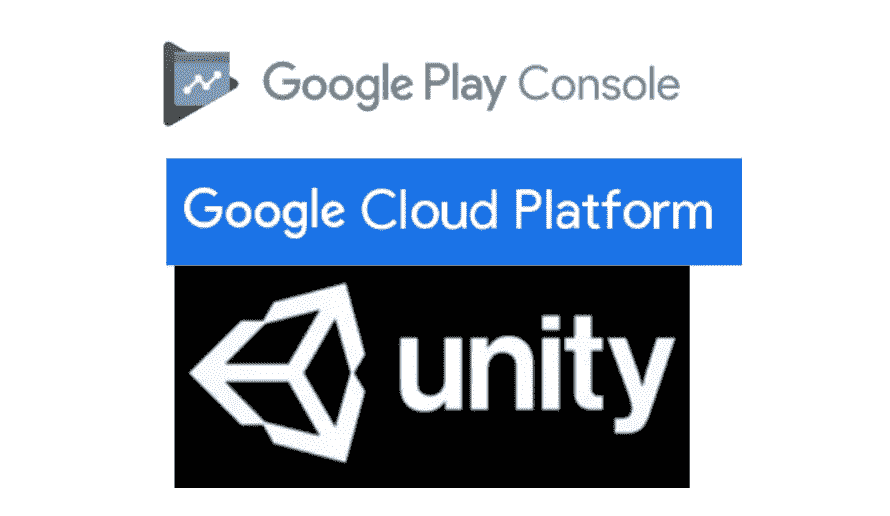

# 先决条件

*   向 Google Play 控制台注册的 Android 应用程序
*   用于将您的应用程序 APKs 上传到 Google Play 的签名密钥。在 Unity 中，这将是**构建设置> Android >项目设置>发布设置**中的 keystore。在 Google Play 控制台中，这是**发布> App 完整性> App 签名>上传密钥证书**中的 SHA 指纹
*   您已经启用了 Google Play 来签署您的发布——这是自 2021 年年中以来任何 Android 应用程序的默认设置

# 第一步——制作一个 Google Play 游戏服务项目

在 Google Play 控制台中，转到**增长>设置和管理>配置**:

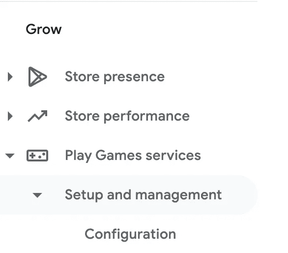

选择“**否，我的游戏不使用 Google API”**并继续——您将被带到标题为 **Play Games 服务配置**的页面。Google 刚刚为您将使用的 Google Play APIs 创建了一个 Google Cloud 项目。要访问此页面，向下滚动页面至**凭证**并点击此面板中的**配置**:

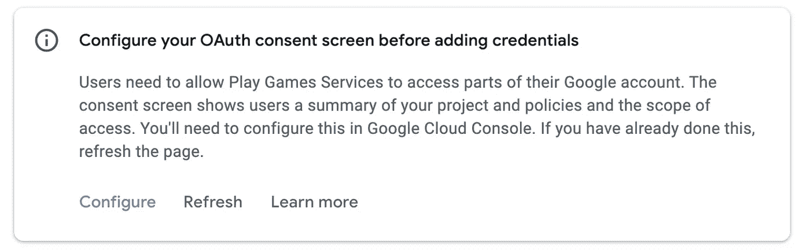

这将打开此弹出窗口—在新标签中打开**谷歌云平台**链接:

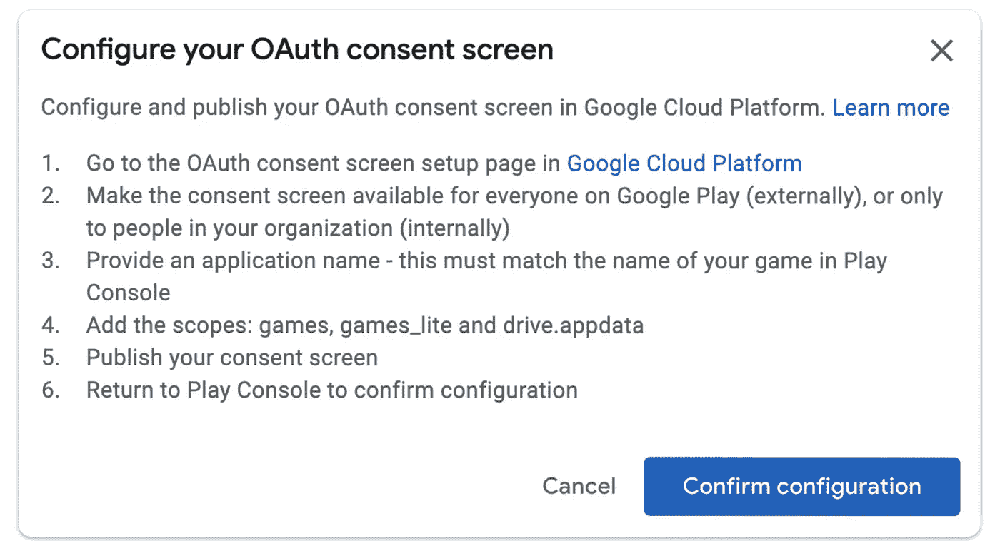

这将把你带到新创建的谷歌云项目——你可能需要先登录你的谷歌账户。

# 步骤 2 —制作 OAuth 同意屏幕

现在，让您的玩家能够使用他们的谷歌帐户在您的游戏中验证自己。为了让他们做到这一点，您需要一种方式来声明您将使用他们的哪些数据——这就是 OAuth 同意屏幕。幸运的是，我们不需要任何敏感的个人数据，所以这个设置非常简单。在侧边栏中，选择 **OAuth 同意屏幕**:

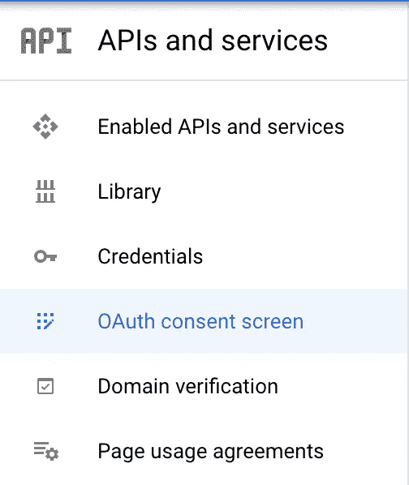

接下来，系统会询问您希望这个应用程序是外部的还是内部的——选择**外部**。

填写应用信息时，请提供您的应用名称和用户支持电子邮件地址。**不设置 APP LOGO** 。如果你这样做，你将需要经历一个漫长而痛苦的验证过程，这是谷歌每当你设置一个应用程序标志时所要求的。更糟糕的是，在谷歌云仪表板中有一个[错误](https://issuetracker.google.com/u/1/issues/158736319)，你不能删除你设置的任何应用程序标志。如果你像我一样犯了这个错误，回到游戏服务配置页面，滚动到底部，点击**删除游戏项目**重新开始。

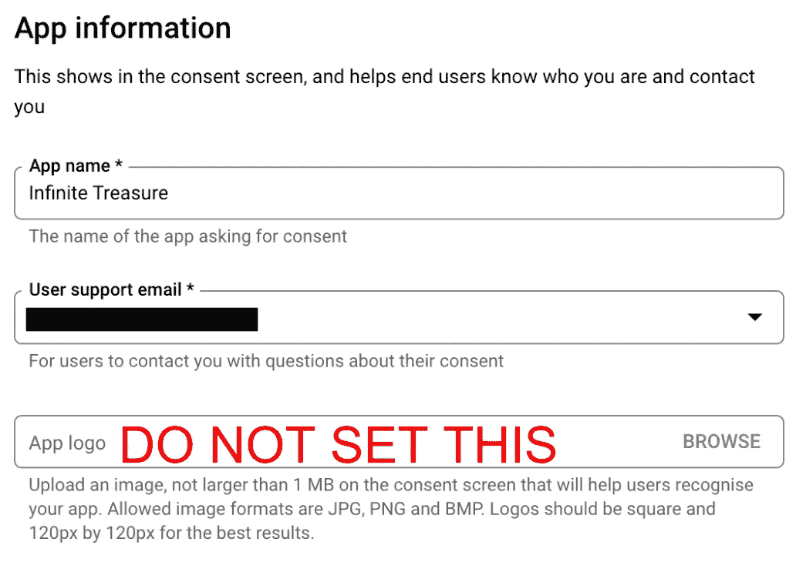

越过应用程序徽标，提供一个开发者联系电子邮件，然后点击**保存并继续**。在下一页中，您将指定希望您的应用程序拥有的权限。点击**添加或删除范围**并选择以下范围(**游戏**、**游戏 _ 精简**和**驱动.应用数据**):

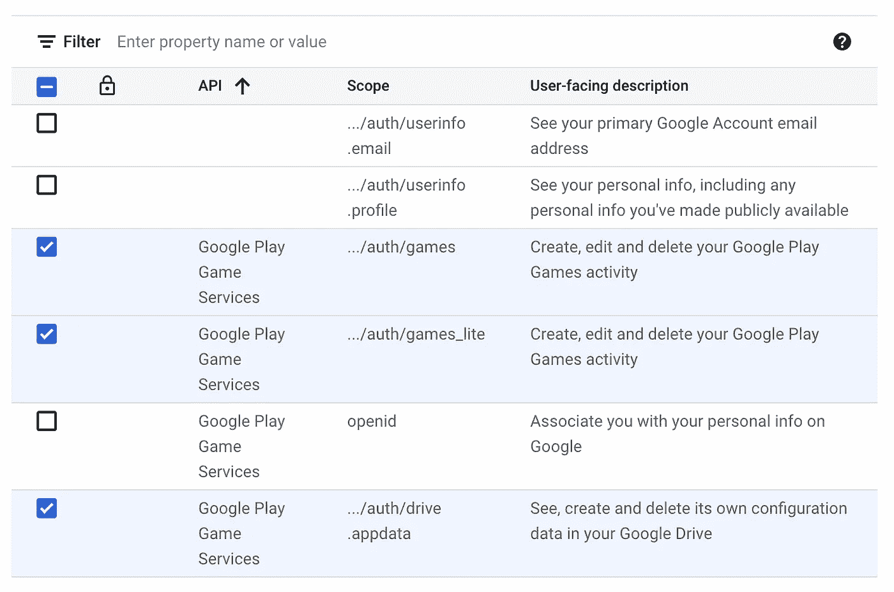

点击**保存并继续**。在下一页，您有机会指定一些测试人员。如果你想在本地测试你的 Google Play 功能，这是必要的。您可能需要添加您在手机上使用的任何 Google 帐户的电子邮件地址。单击表单的其余部分，您应该会看到 OAuth 同意屏幕处于“测试”状态:

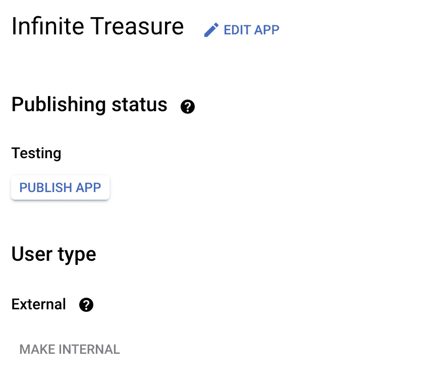

# 步骤 3-创建发展证书

打开 Google Play 控制台，返回第一个标签页。如果弹出窗口仍然打开，点击**确认配置**。你现在应该可以访问**凭证**部分了。

我们将制作两个凭据，允许您的应用在两种不同的环境中进行身份验证:

1.  开发，应用程序由您本地存储的“上传密钥”签名
2.  生产，应用程序由谷歌签署

先做开发一个吧。点击**添加凭证**。在表单中，选择以下选项:

*   **类型**:安卓
*   **名称**:您的应用程序的名称，尽管我建议添加“debug”或“dev”以区别于生产客户端
*   **用于新安装**:未选中
*   **启用防盗版**:关

在**授权**下，点击**创建 OAuth 客户端**。这将打开此弹出窗口:

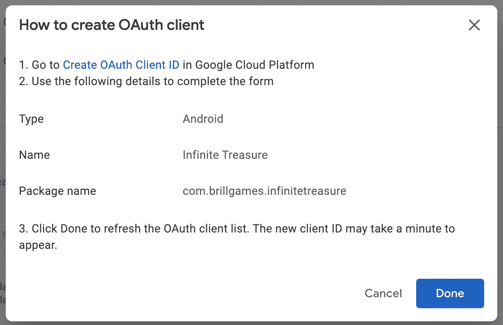

在新选项卡中打开**创建 OAuth 客户端 ID** 链接。您将返回到 Google Cloud 控制台，并看到以下表单:

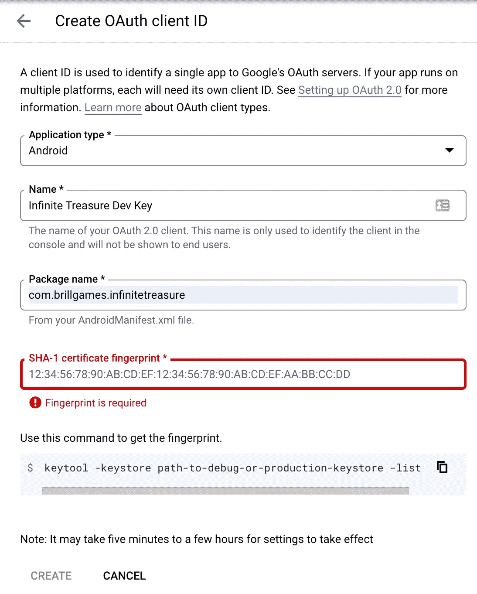

填写以下内容:

*   **应用类型**:安卓
*   **名称**:我建议您的应用程序的名称后跟“调试密钥”或“开发密钥”，以表明这不适用于生产
*   **包名**:这必须与您在发布中使用的包名相匹配。这是在 Unity 下设置的**构建设置>安卓>玩家设置>其他设置>身份识别>包名**
*   **SHA-1 证书指纹**:您可以按照表单中的说明从您本地的密钥库中获取这个指纹。或者，您可以从 Google Play 控制台的**发布>应用完整性>应用签名>上传密钥证书> SHA-1 证书指纹**处获取

点击**创建**并返回到 Google Play 控制台选项卡。在弹出窗口中，点击 **Done** 并从下拉菜单中选择您刚刚创建的 OAuth 客户端。

# 步骤 4—创建生产凭据

生产凭证的流程是相似的，只是有一些小的不同。再次点击**添加凭证**。在表单中，选择以下选项:

*   **类型**:安卓
*   **名称**:您的应用名称
*   **用于新安装**:勾选
*   **启用反盗版**:开启

Google Cloud 控制台中的表单需要填写以下内容:

*   **应用类型**:安卓
*   **名称**:我建议您的应用程序的名称后面加上“释放键”
*   **包装名称**:与上次相同
*   **SHA-1 证书指纹**:这是谷歌用来给你在 Play Store 上的应用签名的密钥的指纹。你可以在**发布>应用完整性>应用签名>应用签名密钥证书> SHA-1 证书指纹**从 Google Play 控制台获取

有了这两个证书，您就差不多可以开始围绕 Google Play 构建功能了！

# 步骤 5——添加一些测试人员

还记得您在步骤 2 中添加到 OAuth 同意屏幕的那些测试人员吗？如果你想让 Google Play 的功能为那些测试人员工作(以及在本地开发中)，你需要在 Google Play 控制台的**增长>设置和管理>测试人员**下再次添加它们*。在那里，点击**测试员**标签，然后**添加测试员**。*

# 第 6 步—开始在游戏中使用 Google Play 游戏服务

我不会深入讨论你需要在游戏中编写的代码(参见这里的[自述文件](https://github.com/playgameservices/play-games-plugin-for-unity)，但是我会向你展示如何将 Google Play 游戏服务(GPGS) SDK 添加到其中。谷歌在[GitHub repo](https://github.com/playgameservices/play-games-plugin-for-unity)制作了一个方便的 GPGS 插件。你不需要克隆这个库——你只需要下载[这个文件](https://github.com/playgameservices/play-games-plugin-for-unity/tree/master/current-build),并在 Unity 中导入它，如这里[所述](https://github.com/playgameservices/play-games-plugin-for-unity#plugin-installation)。

在继续之前，值得在 Google Play 控制台的**增长>设置和管理>成就/排行榜**设置您的 Google Play 排行榜和成就。一旦你完成了这些，点击**获取资源**进入这些页面。这将打开一个包含一大块 XML 的弹出窗口—复制它。

回到 Unity 打开**窗口> Google Play Games >设置> Android 设置**。将 XML blob 粘贴到**资源定义中。**该插件将生成一个文件，其中包含您创建的成就和排行榜的常数——您可能还想更改该文件所在的目录，并将该文件重命名为像我这样可读的名称。点击**设置**。

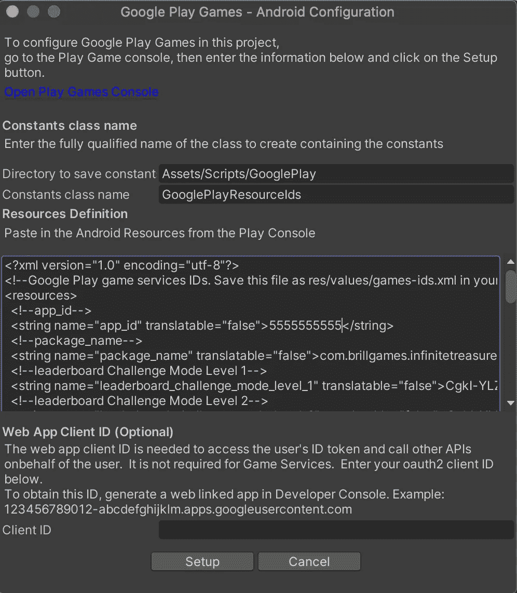

现在是时候使用 Google Play 游戏服务在你的游戏中构建一些很酷的功能了(如果你想写一篇关于这方面的博客，请告诉我)。但是我们还没有完成…

# 步骤 7-发布您的 Google Play 游戏服务项目

到目前为止，你的 Google Play 功能只能在本地运行，并且只适用于你之前指定的内部测试人员。当你完成构建和测试你的新特性，并准备好向每个人发布的时候，你还需要做一些事情。

首先，转到 Google Cloud 控制台，再次打开 OAuth 同意屏幕配置。在**发布状态**下，点击**发布 app** ，然后**确认弹出的**。应该*而不是*找你求证。如果是的话，那么你可能是误加了一个 app logo 或者敏感范围——在这种情况下，恐怕你需要重新开始(见第 2 步的警告)。

其次，转到 Google Play 控制台，打开 **Grow >设置和管理>配置**。点击**编辑属性**填写所需的其他细节，如特征图形——您可以复制您在商店列表中添加的任何内容。然后回到**配置**页面，点击右上角的蓝色大**发布**按钮。一旦发布，您的 Google Play 游戏功能就可以用于下一个应用程序版本了！

# 结论

希望这对您有所帮助！这个指南来自于我开发游戏《无限宝藏》的经历，这款游戏可以在 Android 的 Google Play 商店[这里](https://play.google.com/store/apps/details?id=com.brillgames.infinitetreasure)进行 beta 测试。这是一项正在进行中的工作(排行榜正在路上！)—目前，我正在寻求测试人员对最重要的事情给我反馈:这个游戏好玩吗，如何才能变得更好？关注此博客了解更多更新，或联系 infinitetreasureapp@gmail.com