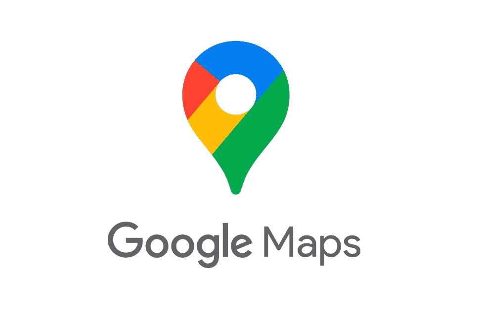
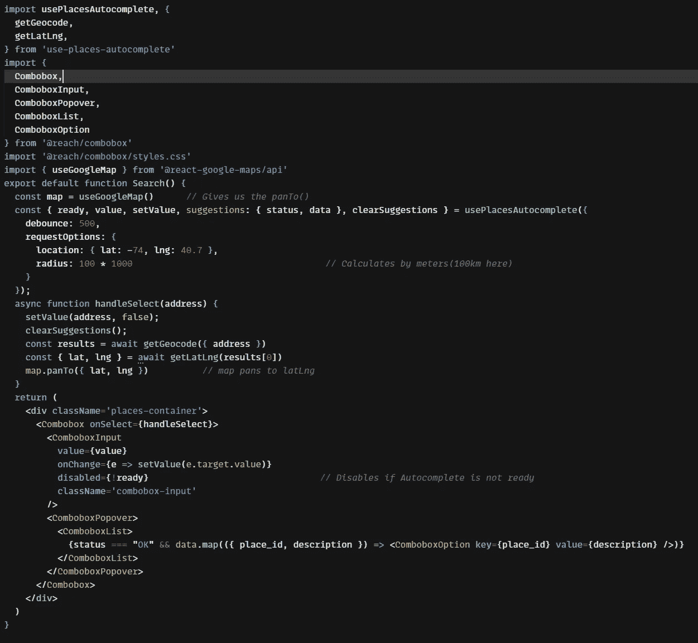

# 在 React.js 上设置 GoogleMaps API

> 原文：<https://levelup.gitconnected.com/setting-up-googlemaps-api-on-react-js-33c37b9eb63f>



在我的一个项目中，我决定集成谷歌地图 API。我很快发现网上有很多文档，但是它们都有不同的实现 Google Maps API 的方法。尽管 Google 有关于在 React.js 中使用 Google Maps API 的文档，但我发现很难理解。因此，在谷歌搜索了许多使用谷歌地图 API 的不同方法后，我想我应该推出一个我认为最简单的入门指南。

首先，导航到[https://developers.google.com/maps](https://developers.google.com/maps)开始。你需要在 Google 的 web 开发者网站上注册来获得一个 API 密匙。他们有几个 API 可以和 Maps API 一起使用，但是现在，我们只需要“Maps Javascript API”、“Geocoding API”、“T10”、“Places API”来开始地图和自动完成功能。一旦你得到了你的 API 密匙，建议保持它的安全，尤其是如果你打算把它上传到 Github 的话。我们将使用另一个节点包来帮助我们进行设置，而不是使用 Google 的文档。

```
npm i @react-google-maps/api
```

我们将使用这个包来运行我们的地图。这基本上是在地图组件中获得地图渲染所需的代码。

```
import { GoogleMap, useLoadScript } from '@react-google-maps/api';const libraries = ["places"]export default function Map() {*// Loads the map using API KEY*const { isLoaded } = useLoadScript({ googleMapsApiKey: <YOUR API KEY HERE>, libraries});*// This returns while map is being loaded*if (!isLoaded) return <div>Loading...</div>return (
    <GoogleMap 
        zoom={9}
        center={{lat: -74, lng: 40.7}} 
        mapContainerClassName='map-container'
    ></GoogleMap>
    )
}
```

谷歌地图使用纬度和经度来确定位置。中心值将决定地图的中心位置。在这种情况下，{纬度:-74，液化天然气:40.7}将以纽约市为中心。缩放值决定了渲染时地图的初始缩放值。该值的范围从 0 到 20，0 对应于一直缩小。

我们将需要设计 GoogleMap 组件的样式，以便您可以在窗口中看到它。您可以在 CSS 文件中或内嵌样式化组件。这取决于您，但是我将在样式表中对它进行样式化。

```
// App.css.map-container {
    height: 100vh;
    width: 100%
}
```

那很容易！现在我们应该在窗口上有一个地图渲染。但是我们可能想给我们的地图增加更多的功能，而不仅仅是在地图上滚动…如果能够在地图上搜索地点不是很好吗？

这就是 Places API 的用武之地。让我们继续安装更多的包来帮助利用位置 API。

```
npm i use-places-autocomplete    <-- Accesses the Places API
npm i @reach/combobox            <-- Gives us a search box
```

让我们将搜索框构建在它自己的组件中

```
** Map Component **
return (
    <>
      <Search />           <--
      <GoogleMap 
         zoom={9}
         center={{lat: -74, lng: 40.7}} 
         mapContainerClassName='map-container'
       />
    </>
 )
```



自动完成组件

**那可是一大堆代码。**

为了使事情变得简单， **usePlacesAutocomplete()** 让我们能够对它的行为方式设置许多不同的选项。我在这里使用了两个选项:

**位置&半径:**{纬度:-74，lng: 40.7} &半径 100 * 1000。

*   如果放在 requestOptions 中，这两个值必须一起声明
*   位置经过{纬度，液化天然气}
*   半径以米为单位。100 * 1000 米等于 100 公里

**去抖:** 500

*   限制搜索查询。这将停止查询，直到输入字段不变。如果它没有检测到变化，将启动搜索
*   值为 500 毫秒

Combobox 为我们提供了一个与谷歌地图兼容的搜索框，从而节省了我们的时间。

你也可以在这些 github 仓库上寻找更多信息:[https://github.com/wellyshen/use-places-autocomplete](https://github.com/wellyshen/use-places-autocomplete)https://github.com/JustFly1984/react-google-maps-apiT2

目前，谷歌向使用谷歌地图平台的开发者提供 300 美元的初始积分和每月 200 美元的积分。他们有一个现收现付的结构，这里简单介绍一下:【https://mapsplatform.google.com/pricing/

如果你想了解更多或者你被卡住了，你可以参考这个视频:[https://www.youtube.com/watch?v=2po9_CIRW7I&t = 593s](https://www.youtube.com/watch?v=2po9_CIRW7I&t=593s)

谷歌地图 API 的功能比我之前介绍的要多得多。它具有诸如方向、放置标记和自定义地图样式等功能。然而，这个指南应该有希望让你开始并熟悉 Google Maps API 是如何工作的，这样你就可以继续使用它，让它满足你的需要。