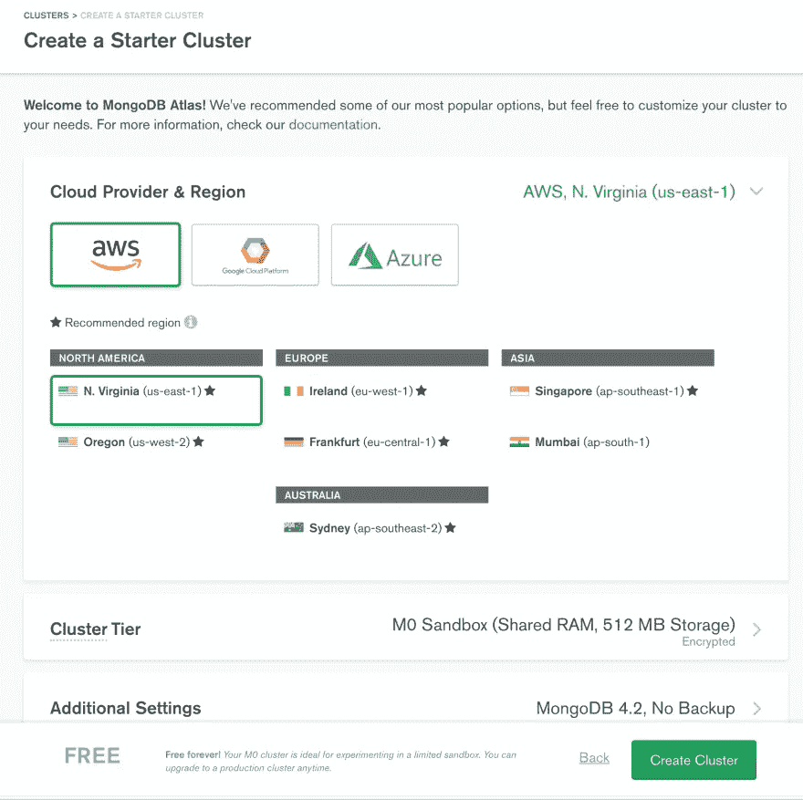
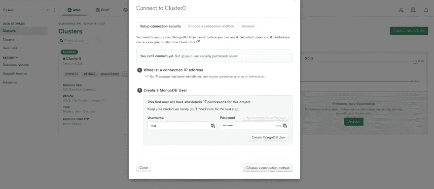
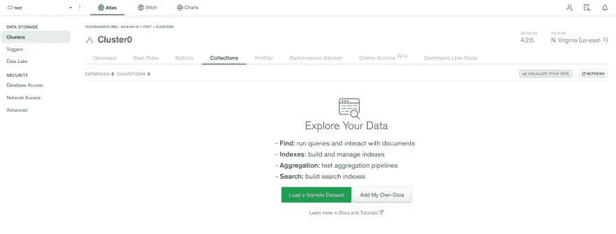
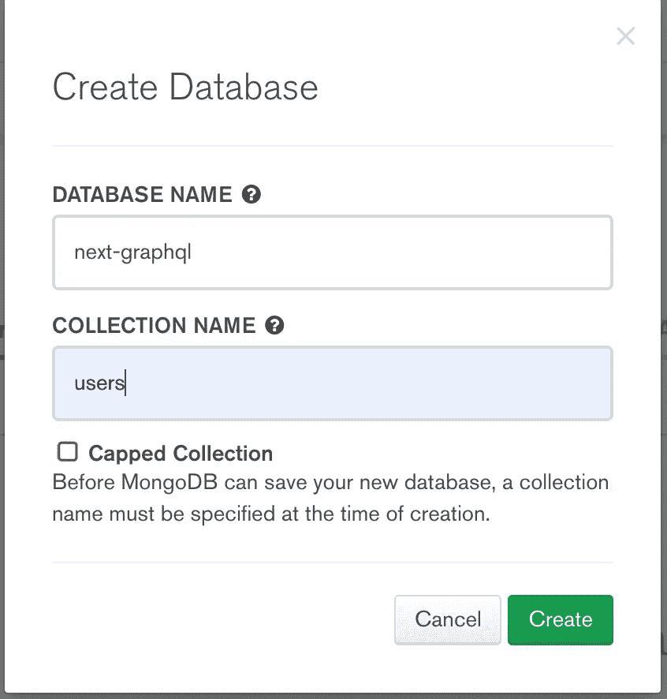
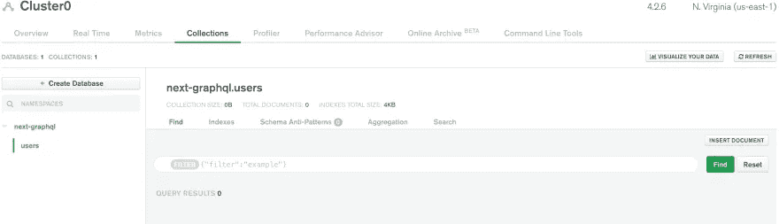
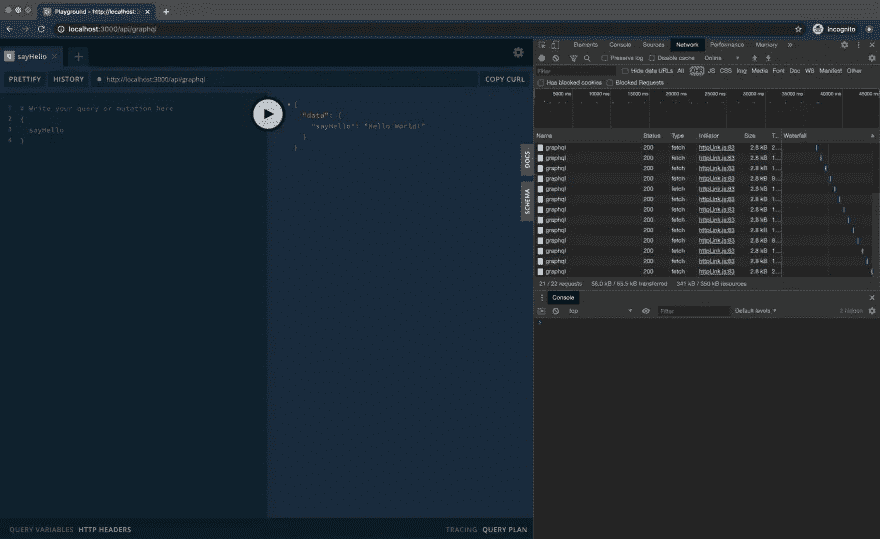
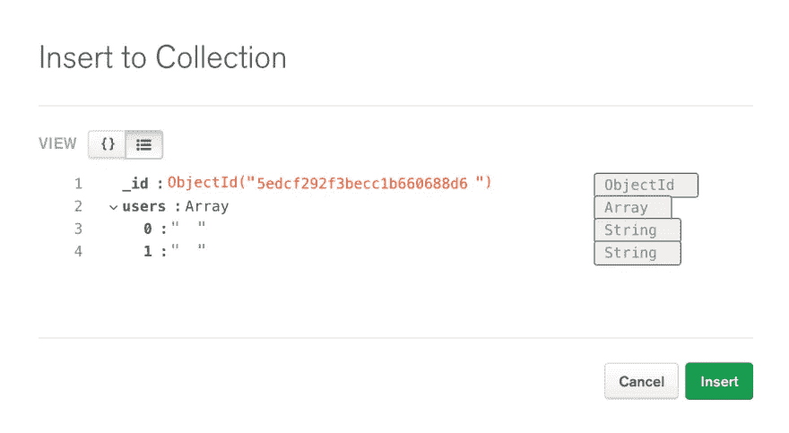
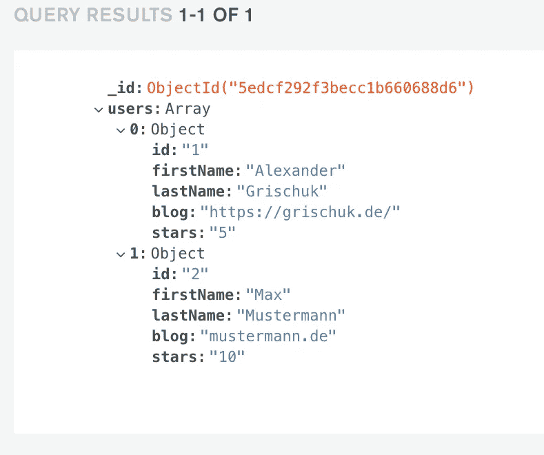
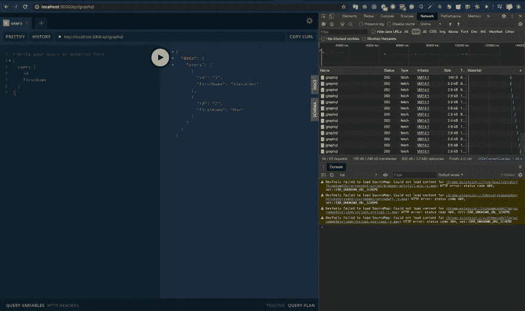

# 用 MongoDB 和 Apollo Server 为 NextJS 应用程序设置 GraphQL API

> 原文：<https://levelup.gitconnected.com/setting-up-graphql-api-with-mongodb-and-apollo-server-for-a-nextjs-app-cec7a9baedbf>

最近，我对使用服务器端渲染(SSR)应用程序的[next . js](https://nextjs.org/)React 框架产生了兴趣。我越来越多地将 Next 用于我喜欢的项目。我惊讶于使用 NextJS 是如此直观、简单和愉快。

在本文中，我们将为 NextJS 应用程序设置带有 [MongoDB](https://www.mongodb.com/) 连接的 [GraphQL](https://graphql.org/) API。令我惊讶的是，NextJS 和 Apollo GraphQL 示例都缺少 MongoDB 的这种通用用例。有一些使用 PostgreSQL 的例子，但是我想使用一个非 SQL 数据库。在花了一些时间学习和阅读之后，我整理了这个分步指南，介绍如何将 Apollo 服务器 GraphQL API 连接到 MongoDB，以及如何在 GraphQL 解析器中读取/写入数据到 Mongo 数据库。

# 初始化 NextJS 默认应用程序

通过 [create-next-app](https://nextjs.org/docs/getting-started#setup) 使用 Next 初始化项目有多种方式，类似于`create-react-app`或[手动](https://nextjs.org/docs/getting-started#setup)。

在这个例子中，我将使用带纱线的`create-next-app`(或者，你可以使用 NPM ):

```
yarn create next-app graphql-apollo-mongodb
```

选择模板默认入门应用

安装依赖项后:

```
cd graphql-apollo-mongodb
yarn dev
```

酷！我们的 NextJS 应用运行在`[http://localhost:3000](http://localhost:3000.)` [。](http://localhost:3000.)

# 设置 MongoDB Atlas

> *MongoDB Atlas 是面向现代应用的全球云数据库服务。跨 AWS、Azure 或 GCP 部署完全托管的 MongoDB。一流的自动化和成熟的实践保证了可用性、可扩展性，并符合最苛刻的数据安全性和隐私标准。使用 MongoDB 强大的驱动程序、集成和工具生态系统，以更快的速度构建和更少的时间管理您的数据库。*

我将使用 cloud Mongo 数据库的一个实例。

1.  导航到 [MongoDB Atlas](https://www.mongodb.com/cloud/atlas) 页面
2.  点击“免费开始”,注册 MongoDB 账户
3.  在“项目”页面上，单击“新建项目”,为其命名并创建
4.  添加成员。你已经是会员了->点击继续
5.  构建集群->选择空闲层
6.  选择云提供商和地区并创建集群



7.集群初始化后，单击“connect”



选择连接方法->选择连接您的应用程序并选择 Node.js

*   将连接字符串添加到应用程序代码中
*   复制并保存您的应用程序字符串

```
"mongodb+srv://<dbname>:<password>@cluster0-yvwjx.mongodb.net/<dbname>?retryWrites=true&w=majority"
```

很好。我们有一个指向云数据库实例的 URL，可以从我们的代码连接到这个实例，但是我们还没有一个数据库。让我们创建一个新的数据库。

8.导航至集合选项卡，然后单击添加我自己的数据



设置完成后，您应该看到您的集群正在运行:



我们可以手动或通过代码执行将一些文档/数据插入我们的数据库。我们到此为止。

# 使用 Apollo 服务器设置 GraphQL API

现在我们的应用程序中没有任何 graphql 设置。当我们导航到`http://localhost:3000/api/hello`时，我们会看到

```
{ "name": "John Doe" }
```

从`pages/api/hello.js`文件提供的输出。

我们需要的是在`pages/api/graphql.js`下创建一个新的端点，这就是我们的 Apollo Server GraphQL 设置的位置。从`[http://localhost:3000/api/graphql](http://localhost:3000/api/graphql.)` [调用 GraphQL API。](http://localhost:3000/api/graphql.)

# 安装 Apollo-server-micro graph QL MongoDB

让我们安装 Apollo 服务器设置所需的软件包

```
yarn add apollo-server-micro graphql mongodb
```

# 创建一个基本的 GraphQL 服务器

在`pages/api/`下添加`graphql.js`文件。

```
// pages/api/graphql.js
import { ApolloServer, gql } from 'apollo-server-micro'

const typeDefs = gql`
  type Query {
    sayHello: String
  }
`

const resolvers = {
  Query: {
    sayHello(parent, args, context) {
      return 'Hello World!'
    },
  },
}

export const config = {
  api: {
    bodyParser: false,
  },
}

const apolloServer = new ApolloServer({ typeDefs, resolvers })
export default apolloServer.createHandler({ path: '/api/graphql' })
```

我们创建了 ApolloServer 的一个新实例，将我们的类型定义和解析器传递给它，并在`/api/graphql`路径上服务这个 graphql。

当您导航到`http://localhost:3000/api/graphql`时，您应该会看到一个 GraphQL 游乐场，在这里您可以执行变异/查询。



这很好，但我们的 API 目前没有做太多。它只是为了测试而建造的。让我们添加一个 MongoDB 连接。

# 向我们的 Apollo 服务器添加 MongoDB 连接

在添加 MongoDB 连接之前，让我们先讨论一下数据。出于示例目的，我们的应用程序将显示来自 MongoDB 的用户列表。

以下是我的数据表示:

```
{
  "users": [
    {
      "id": 1,
      "firstName": "Alexander",
      "lastName": "Grischuk",
      "blog": "[https://grischuk.de/](https://grischuk.de/)",
      "stars": 5
    },
    {
      "id": 2,
      "firstName": "Max",
      "lastName": "Mustermann",
      "blog": "mustermann.de",
      "stars": 3
    }
  ]
}
```

我将手动将其插入 MongoDB:



# 创建可执行模式并将 mongo 客户端连接到数据库

Graphql 模式是`typeDefs`和`resolvers`的组合。

要使模式可执行，我们需要安装`graphql-tools`

```
yarn add graphql-tools
```

让我们在`typeDefs`和`resolvers`中描述一个数据查询。我们想从 MongoDB 中查询一个用户列表。

```
// pages/api/graphql.js
import { ApolloServer, gql } from 'apollo-server-micro'
import { makeExecutableSchema } from 'graphql-tools'
import { MongoClient } from 'mongodb'

const typeDefs = gql`
  type User {
    id: ID!
    firstName: String!
    lastName: String!
    blog: String
    stars: Int
  }

  type Query {
    users: [User]!
  }
`

const resolvers = {
  Query: {
    users(_parent, _args, _context, _info) {
      return _context.db
        .collection('users')
        .findOne()
        .then((data) => {
          return data.users
        })
    },
  },
}

const schema = makeExecutableSchema({
  typeDefs,
  resolvers,
})

let db

const apolloServer = new ApolloServer({
  schema,
  context: async () => {
    if (!db) {
      try {
        const dbClient = new MongoClient(
          'mongodb+srv://<dbname>:<password>@cluster0-yvwjx.mongodb.net/next-graphql?retryWrites=true&w=majority',
          {
            useNewUrlParser: true,
            useUnifiedTopology: true,
          }
        )

        if (!dbClient.isConnected()) await dbClient.connect()
        db = dbClient.db('next-graphql') // database name
      } catch (e) {
        console.log('--->error while connecting with graphql context (db)', e)
      }
    }

    return { db }
  },
})

export const config = {
  api: {
    bodyParser: false,
  },
}

export default apolloServer.createHandler({ path: '/api/graphql' })
```

# 正在配置。环境变量

为了安全和部署方便，不建议将您的 MongoDB URI 直接签入 git。我们将通过环境变量访问 Mongodb URI，并从那里提取它。

首先，安装`dotenv` npm 包

```
yarn add dotenv
```

用你的`MONGO_DB_URI`在项目根目录下创建`.env`文件

```
MONGO_DB_URI=mongodb+srv://<dbname>:<password>@cluster0-yvwjx.mongodb.net/next-graphql?retryWrites= true&w=majority
```

使用。代码中的 env:

```
// pages/api/graphql.js
import { ApolloServer, gql } from 'apollo-server-micro'
import { makeExecutableSchema } from 'graphql-tools'
import { MongoClient } from 'mongodb'

require('dotenv').config()

const typeDefs = gql`
  type User {
    id: ID!
    firstName: String!
    lastName: String!
    blog: String
    stars: Int
  }

  type Query {
    users: [User]!
  }
`

const resolvers = {
  Query: {
    users(_parent, _args, _context, _info) {
      return _context.db
        .collection('users')
        .findOne()
        .then((data) => {
          return data.users
        })
    },
  },
}

const schema = makeExecutableSchema({
  typeDefs,
  resolvers,
})

let db

const apolloServer = new ApolloServer({
  schema,
  context: async () => {
    if (!db) {
      try {
        const dbClient = new MongoClient(process.env.MONGO_DB_URI, {
          useNewUrlParser: true,
          useUnifiedTopology: true,
        })

        if (!dbClient.isConnected()) await dbClient.connect()
        db = dbClient.db('next-graphql') // database name
      } catch (e) {
        console.log('--->error while connecting via graphql context (db)', e)
      }
    }

    return { db }
  },
})

export const config = {
  api: {
    bodyParser: false,
  },
}

export default apolloServer.createHandler({ path: '/api/graphql' })
```

# 在 GraphQL Playground 中使用 MongoDB 连接测试 GraphQL API

导航至`http://localhost:3000/api/graphql`并进行查询

```
{
  users {
    id
    firstName
  }
}
```

来自 MongoDB 连接的查询结果:



在我们的 MongoClient 设置中，我们通过 MongoDB cloud 使用`new MongoClient()`初始化一个新的数据库连接，URI 从我们的`.env`文件中读取。我们从上下文函数中返回 db 对象`{ db }`，以便通过解析器中的`_context`进行访问。就是这样！一旦您可以访问解析器中的数据库，您就可以在那里为您的查询和变异执行读/写操作。

# graph QL-Apollo-MongoDB-示例

我为本文创建了一个支持性的[存储库](https://github.com/alexandr-g/graphql-apollo-mongodb-example)，这样您就可以一个接一个地提交了。

*原载于 2020 年 6 月 8 日 https://grischuk.de/**。*