# 在 Kubernetes 集群中建立 Istio 服务网格

> 原文：<https://levelup.gitconnected.com/setting-up-istio-service-mesh-in-kubernetes-cluster-f1077b136411>

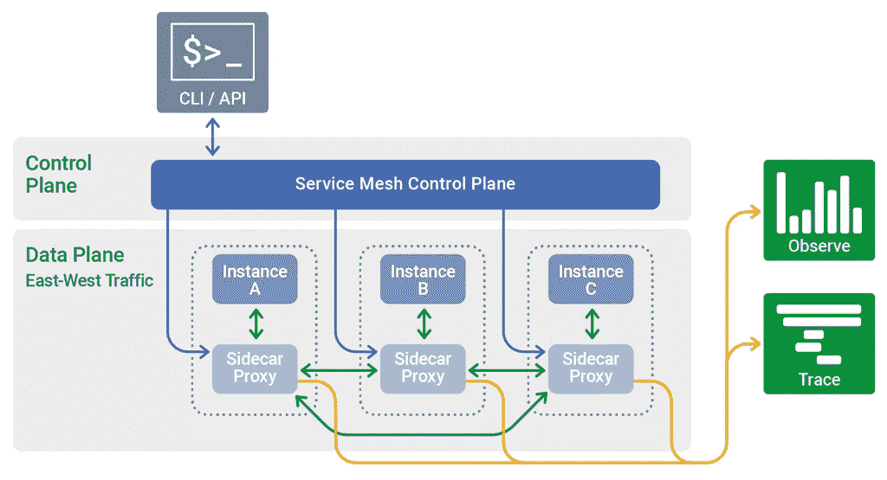

来源[nginx.com](https://www.nginx.com/)

# 1.概观

在本文中，我们将了解什么是服务网格以及我们为什么需要它，我们还将看到在 Kubernetes 集群中升级 istio 服务网格是多么容易。我们也将启用像 Jaeger，Prometheus，Grafana 和 Kiali 这样的插件，并且将看到微服务之间的通信是如何发生的。

# 2.什么是服务网格

*服务网格*是一个可配置的低延迟基础设施层，旨在使用应用编程接口(API)处理应用基础设施服务之间的大量基于网络的进程间通信。服务网格确保容器化的、通常短暂的应用基础设施服务之间的通信是快速、可靠和安全的。网格提供了关键的功能，包括服务发现、负载平衡、加密、可观察性、可跟踪性、认证和授权，以及对断路器模式的支持。

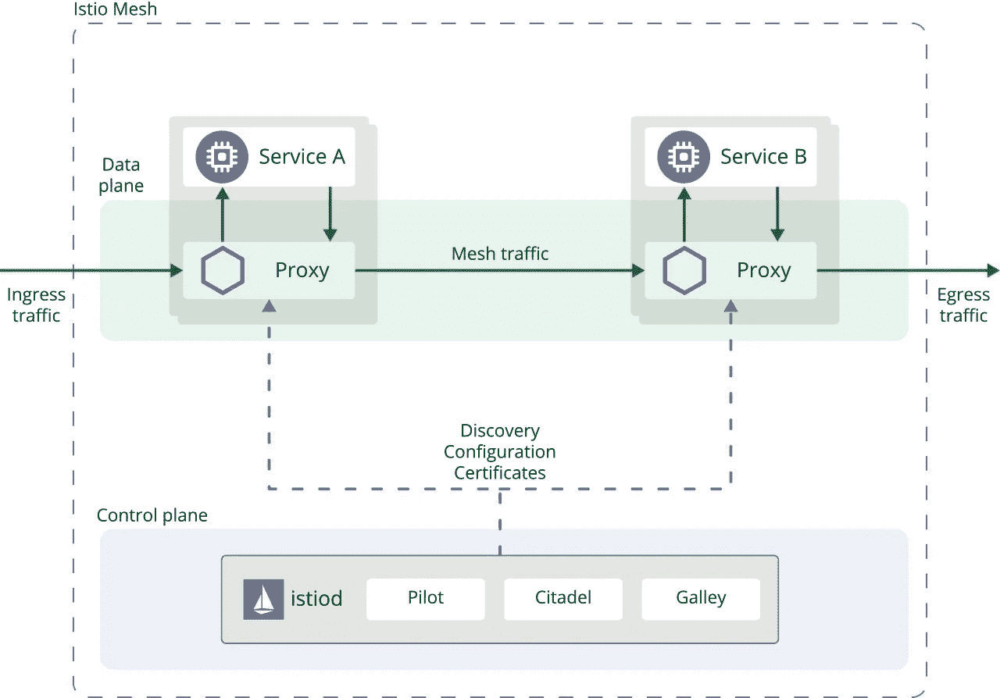

来源 istio.io

# 3.为什么我们需要服务网格？

服务网格管理通信层，它们允许开发人员专注于为他们构建的每个服务增加业务价值，而不是担心每个服务如何与所有其他服务通信。

它们有助于将业务逻辑与非功能逻辑分开

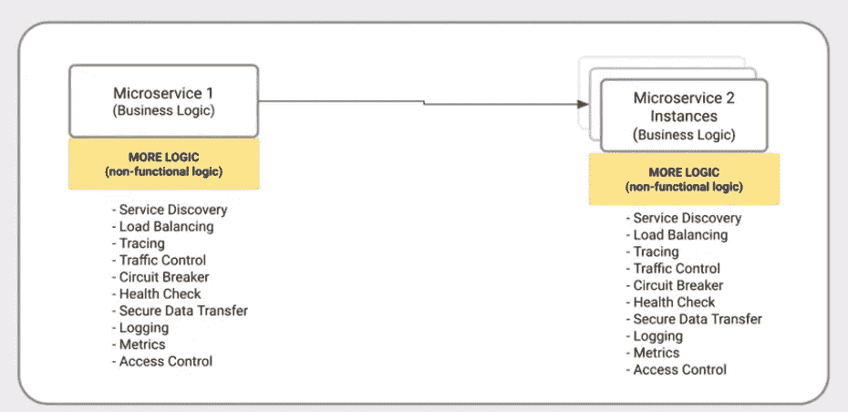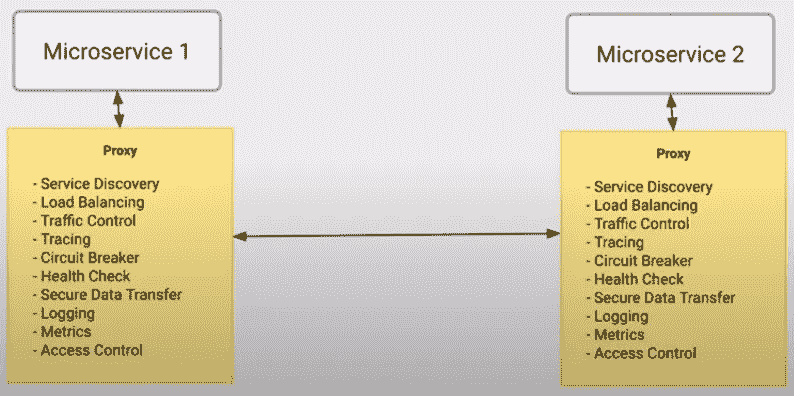

在微服务之外分离 NFR

# 4.Istio 的特点

Istio 使用了一个扩展版本的[特使](https://envoyproxy.github.io/envoy/)代理。Envoy 是用 C++开发的高性能代理，用于协调服务网格中所有服务的所有入站和出站流量。特使代理是唯一与数据平面流量交互的 Istio 组件。

Envoy 代理被部署为服务的附属设备，逻辑上增加了 Envoy 的许多内置功能，例如:

*   动态服务发现
*   负载平衡
*   TLS 终止
*   HTTP/2 和 gRPC 代理
*   断路器
*   健康检查
*   基于%流量分割的分阶段部署
*   故障注入
*   丰富的指标

# 5.先决条件

1.  为了在您的 Kubernetes 集群上设置 istio，您显然需要一个运行中的至少有 12GB 内存的 Kubernetes 集群。


2.为您的 Kubernetes 平台提供商进行配置更改。参考此[连杆](https://istio.io/latest/docs/setup/platform-setup/)进行导向。

# 6.履行

1.  下载 istio 并设置环境路径。以下命令将下载最新版本的 istio，但也可以转到 [Istio 发布](https://github.com/istio/istio/releases/tag/1.11.3)页面，为您的操作系统下载特定版本的安装文件。

```
curl -L [https://istio.io/downloadIstio](https://istio.io/downloadIstio) | sh -
```

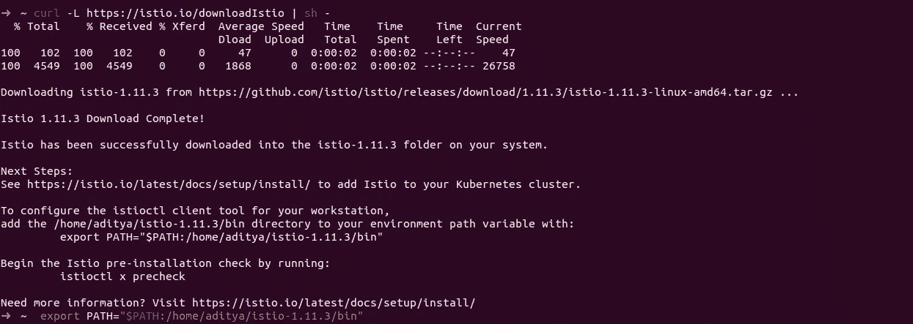

2.现在，让我们检查 istio-cli 是否设置正确。

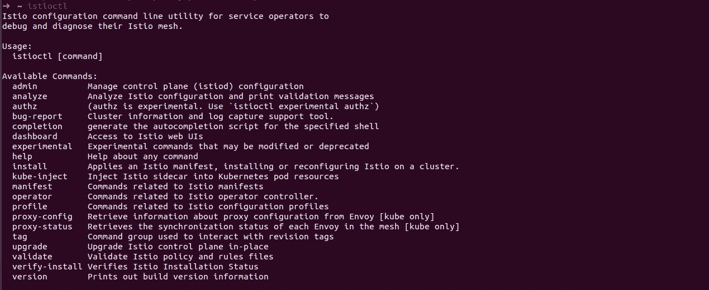

3.在 Kubernetes 中安装 istio，这里我使用的是演示配置文件，但是您可以根据自己的需求选择配置文件。您可以在这里获得可用的配置文件[。](https://istio.io/latest/docs/setup/additional-setup/config-profiles/)

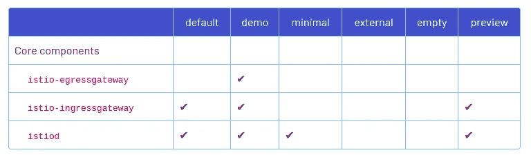

```
istioctl install --set profile=demo -y
```

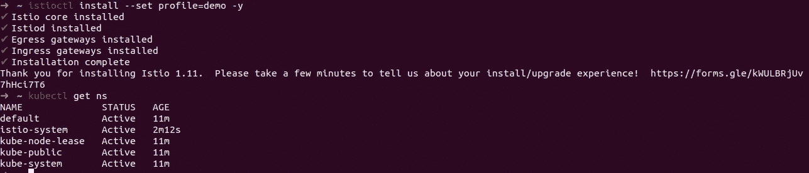

4.现在，我们的 istio 已成功安装，我们可以开始在集群中部署微服务了。对于本教程，我使用的是 [google-cloud 微服务示例](https://github.com/GoogleCloudPlatform/microservices-demo/)。

```
kubectl apply -f [https://raw.githubusercontent.com/GoogleCloudPlatform/microservices-demo/master/release/kubernetes-manifests.yaml](https://raw.githubusercontent.com/GoogleCloudPlatform/microservices-demo/master/release/kubernetes-manifests.yaml)
```

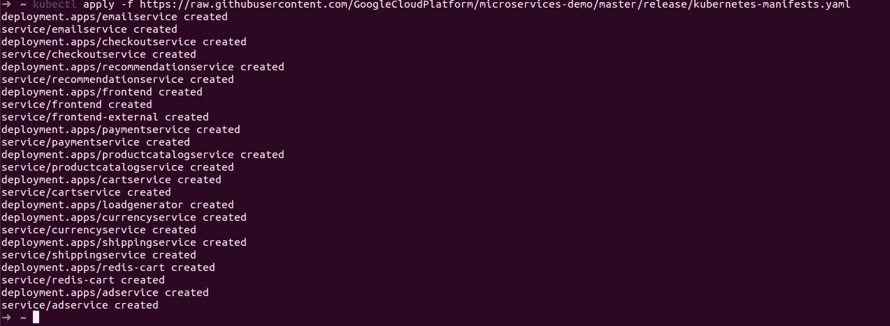

5.现在让我们检查作为上述部署的一部分而创建的所有 pod。但是等等，我们看到的是，作为部署的一部分，只创建了一个容器，而没有创建代理(特使)容器。

这意味着，对于任何 pod，必须有两个容器，一个用于实际的微服务，另一个用于代理，但是我们看到没有创建代理容器。


6.上述问题的解决方案是，我们需要向名称空间添加一些标签，以便`istiod`可以在 pod 内注入代理容器。

首先，让我们检查一下`default`名称空间的标签。

```
kubectl get ns default --show-labels
```


现在让我们将`istio-injection=enabled`标签添加到名称空间中。

```
kubectl label namespace default istio-injection=enabled
```


7.现在，让我们再次尝试部署同一个示例，但在此之前，我们将删除之前的部署。

```
kubectl delete -f [https://raw.githubusercontent.com/GoogleCloudPlatform/microservices-demo/master/release/kubernetes-manifests.yaml](https://raw.githubusercontent.com/GoogleCloudPlatform/microservices-demo/master/release/kubernetes-manifests.yaml)
```

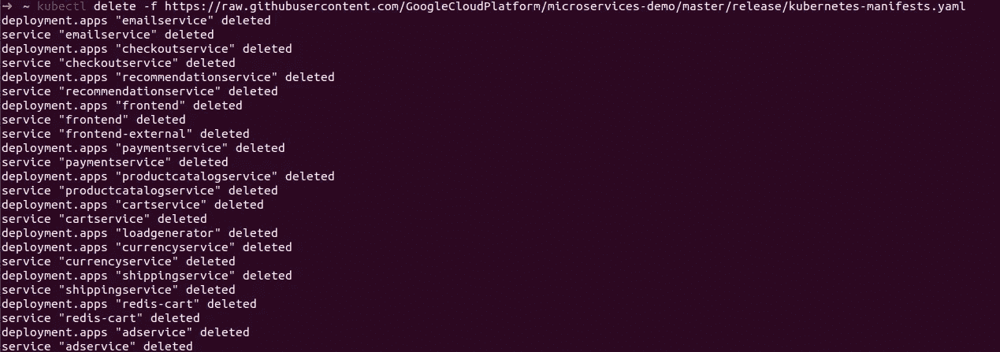

现在，让我们创建一个与之前步骤中相同的部署。

```
kubectl apply -f [https://raw.githubusercontent.com/GoogleCloudPlatform/microservices-demo/master/release/kubernetes-manifests.yaml](https://raw.githubusercontent.com/GoogleCloudPlatform/microservices-demo/master/release/kubernetes-manifests.yaml)
```

现在，如果我们看一看创建的 pod，我们将能够看到每个 pod 有两个容器。

```
kubectl get pods -n default
```


如果我们仔细看看 pod 内有哪些容器，那么我们可以清楚地看到 pod 包含一个服务容器和其他`istio-proxy.`


8.现在，让我们试着检查一下我们的应用程序。为此，我将进行端口转发，以便可以在浏览器上访问它。

```
kubectl port-forward services/frontend-external 8081:80
```

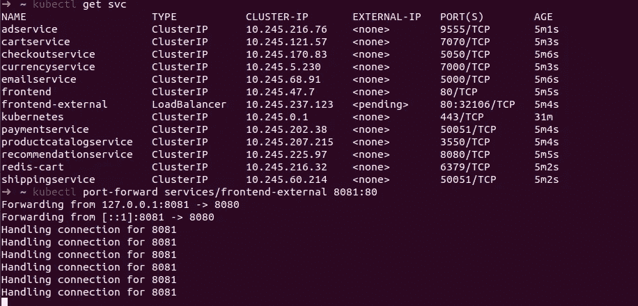

我们现在可以在`http://localhost:8081`访问我们的应用程序。


# 7.遥测应用(插件)

Istio 集成了几种不同的遥测应用。这些可以帮助您了解服务网格的结构，显示网格的拓扑结构，并分析网格的健康状况。

当我们下载 istio 时，这些应用程序是示例的一部分。我们可以部署这些应用程序，这些应用程序将提供对微服务健康状况、请求跟踪等的洞察。

```
cd istio-1.11.3
kubectl apply -f samples/addons
```

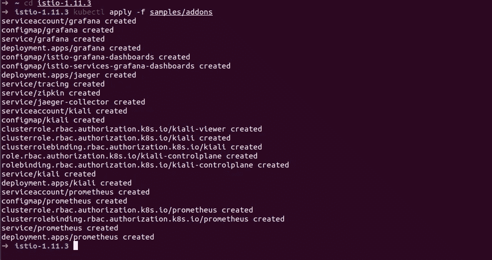

让我们将跟踪应用程序进行端口转发，并检查请求跟踪。

```
kubectl port-forward services/tracing 8081:80 -n istio-system
```

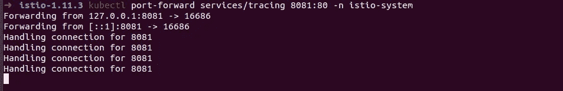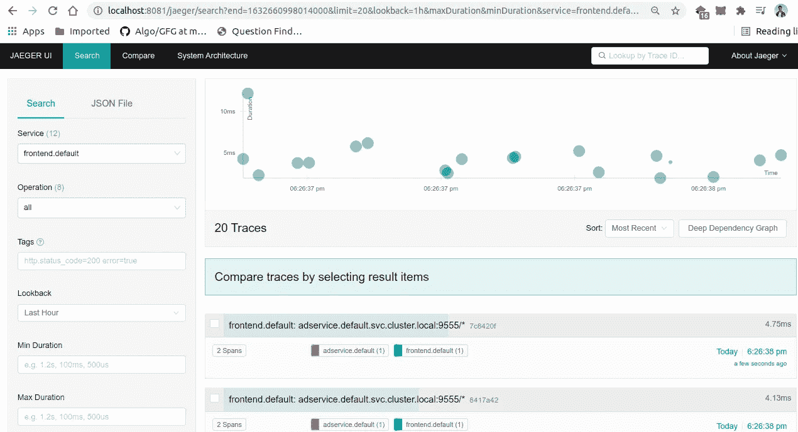

我们还可以使用以下命令访问 Kiali 仪表板

```
istioctl dashboard kiali
```

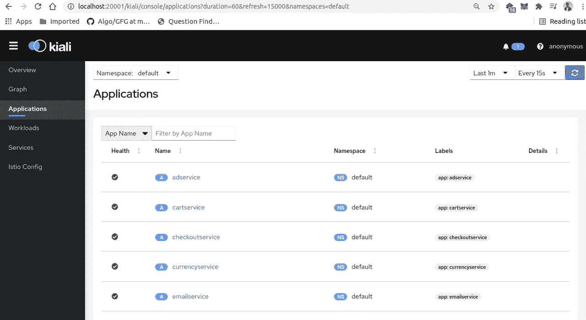

# 8.结论

在本文中，我们了解了什么是服务网格以及我们为什么需要它们，还了解了如何在 Kubernetes 集群中建立服务网格。

如果你觉得这篇文章很有帮助，请点击拍手按钮，并跟随我阅读更多这样的信息丰富的文章。

你可以在 [Linkedin](https://linkedin.com/in/adityajoshi12) 上找到我或者在 [GitHub](https://github.com/adityajoshi12) 上跟踪我？如果这对你来说太社交化了，如果你想和我讨论技术，就给 adityaprakashjoshi1@gmail.com 发封邮件。

