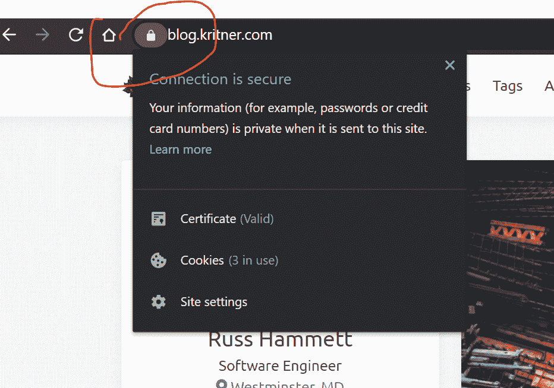
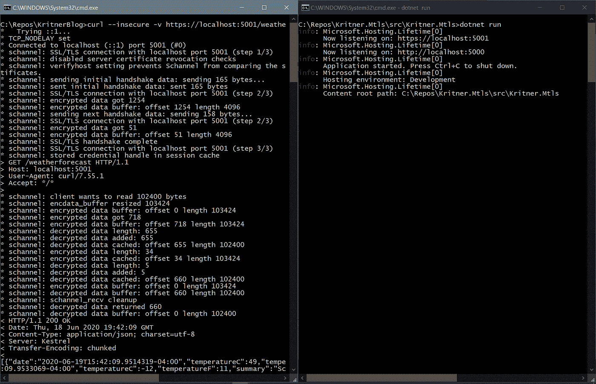
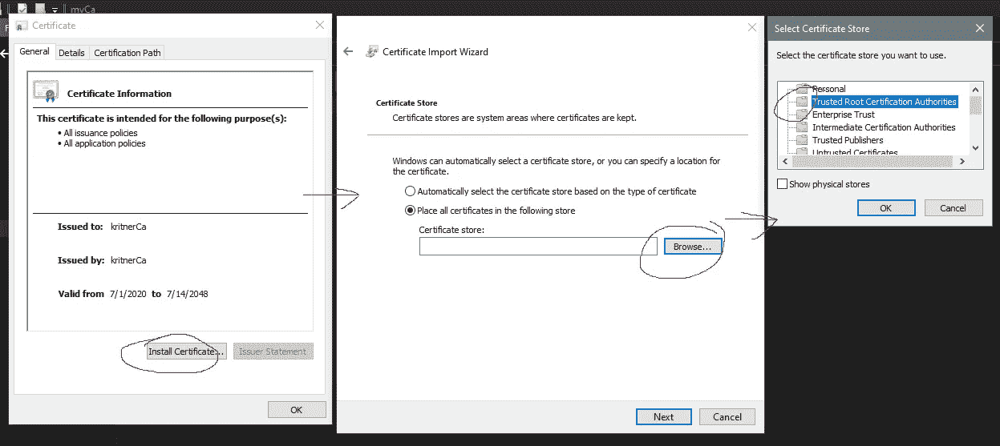
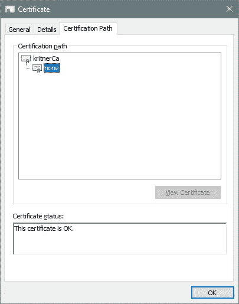
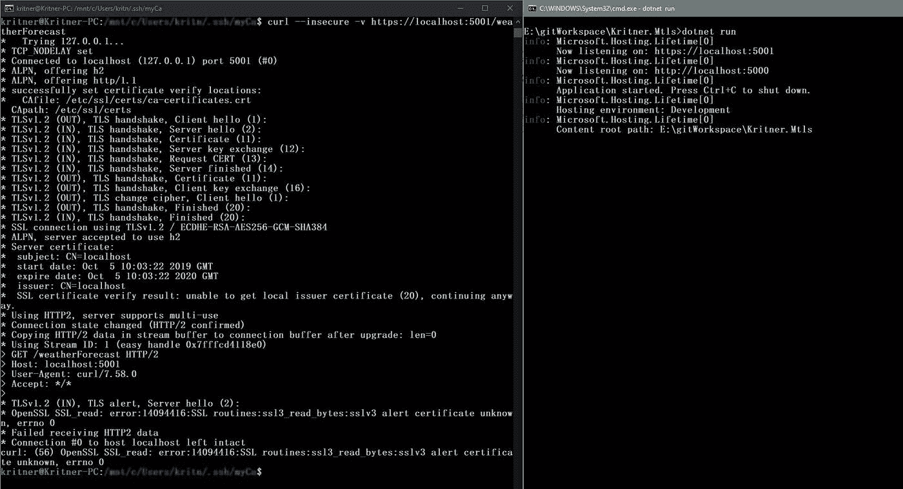
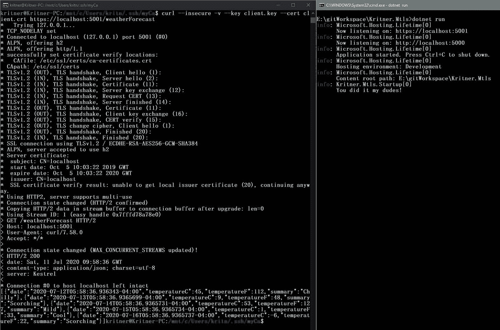

# 设置 mTLS 和 Kestrel

> 原文：<https://levelup.gitconnected.com/setting-up-mtls-and-kestrel-a4f8b146a32e>


由[马科斯·迈尔](https://unsplash.com/@mmayyer?utm_source=medium&utm_medium=referral)在 [Unsplash](https://unsplash.com?utm_source=medium&utm_medium=referral) 上拍摄的照片

大多数人都知道 TLS 是什么，但是 mTLS 呢？和 TLS 有什么不同，是用来做什么的？

# 坦克激光瞄准镜（Tank Laser-Sight 的缩写）

TLS，即传输层安全性，是 SSL 的后继者；这两者都是安全通信的手段。TLS 有几个版本，每个后续版本都更安全、更易于使用，或者两者兼而有之。我们已经升级到 TLS v1.3 版了。

你可以在这里阅读更多关于 TLS [的内容。](https://www.cloudflare.com/learning/ssl/transport-layer-security-tls/)

TLS 的基本思想是保护多方之间的通信，当你访问像这样的网站时，你可能非常习惯于“看到”它。



当连接到一个网站时，有很多“魔法”在进行，以客户端和服务器之间来回的形式。我发布的链接对此进行了更详细的描述，但是我们也可以很容易地使用 cURL 命令看到其中的一些内容。

在这篇文章中，我们将使用一个测试 web api 项目，我将从以下内容开始:

```
mkdir Kritner.Mtls
cd Kritner.Mtls
dotnet new webapi
```

现在用`dotnet run`运行项目，并向默认的 WeatherForecast 控制器提交 cURL 命令:

```
curl --insecure -v https://localhost:5001/weatherForecast
```



您会注意到，在上面的内容中，我们在 cURL 命令中使用了`--insecure`标志，因为我们通过 web api 使用“开发”证书来建立安全连接。

# mTLS

既然我们已经对 TLS 及其外观有了很高的认识，那么什么是 mTLS 呢？

来自维基百科:

> *相互认证或双向认证是指双方同时对彼此进行认证，在一些协议(IKE、SSH)中是默认的认证方式，在另一些协议(TLS)中是可选的。
> 默认情况下，TLS 协议仅使用 X.509 证书向客户端证明服务器的身份，客户端向服务器的认证由应用层负责。TLS 还使用客户端 X.509 身份验证提供客户端到服务器的身份验证。[1]由于它需要向客户端提供证书，并且用户体验不太友好，因此很少在最终用户应用程序中使用。
> 双向 TLS 认证(mTLS)在企业对企业(B2B)应用中更为普遍，在这种应用中，有限数量的编程式同构客户端连接到特定的 web 服务，运营负担有限，并且与消费者环境相比，安全性要求通常更高。*

上面有相当多的信息，但我认为 tdlr 是:

*   双方通过某种方式提供他们的身份
*   通常用于企业对企业的应用

这意味着可以通过我们的系统生成供用户使用的“密码”来控制应用程序对我们系统的访问，该密码以我们的 CA 签名的证书的形式提供给用户。

请注意(我将在整个帖子中多次提到),代码的设置并不是为了验证客户端提供的证书是由我们的 CA*签名的，它只是被签名了。这不是*想要的行为，但是我会在另一篇文章中尝试处理额外的认证。此外，除了证书、由一次性密码提供的某种双重身份验证或类似的东西之外，您通常还想设置另一层安全措施。这将*有助于*在客户证书/私钥泄露的情况下保护您的系统；没有这“第二个因素”，用户将无法进入(也不包括在本文中)。**

# mTLS 设置

mTLS，至少以我们在这篇文章中将要设置的方式，有几个步骤，其中许多步骤超出了“编码”的范围。步骤的高级列表包括:

*   创建本地 CA
*   导入 CA 作为我们的“服务器”(在本例中是我们的本地机器)的受信任根 CA
*   创建由 CA 签名的“客户端”使用的证书
*   在我们的中启用/强制客户端证书。网络核心应用
*   再次对我们的代码运行 cURL 命令，不提供证书，看到我们的请求被拒绝
*   对我们的代码运行 cURL 命令，这次提供我们的客户端证书，看看我们的请求是否通过

# 创建本地 CA

我按照这个教程:[https://delicious brains . com/SSL-certificate-authority-for-local-https-development/](https://deliciousbrains.com/ssl-certificate-authority-for-local-https-development/)

```
# Generate a key
openssl genrsa -aes256 -out myCA.key 2048# Generate root certificate
openssl req -x509 -new -nodes -key myCA.key -sha256 -days 10240 -out myCA.pem# Create a .crt file so it can be installed on yucky windows (can *probably* just out in this format from the step above, but i don't know much about openssl)
openssl x509 -outform der -in myCa.pem -out myCa.crt
```

# 将 CA 证书作为受信任的根 CA 导入

现在，双击 crt 并选择“安装证书”，将其安装为受信任的根颁发机构:



# 创建一个由 CA 签名的证书供客户端使用

使用以下信息创建文件 client.ext:

```
authorityKeyIdentifier=keyid,issuer
basicConstraints=CA:FALSE
keyUsage = digitalSignature, nonRepudiation, keyEncipherment, dataEncipherment
```

现在生成客户端密钥/证书:

```
# Generate a key for the "client" to use
openssl genrsa -out client.key 2048# Generate a Certificate Signing Request (csr)
openssl req -new -key client.key -out client.csr# Using the CA, create client cert based on the CSR
openssl x509 -req -in client.csr -CA myCA.pem -CAkey myCA.key -CAcreateserial -out client.crt -days 1024 -sha256 -extfile client.ext
```

现在您应该有一个可用的 client.crt，在查看时，您应该能够看到“完整的证书链”,因为证书是由 myCa 签名的(在我的例子中是 kritnerCa):



# 从 Kestrel/启用 mTLS。网络核心代码

让 mTLS 与 Kestrel 一起工作是非常简单的，更多地涉及 IIS(我可能会在另一篇文章中讨论…？)

向项目文件添加一个 NuGet 包，该包允许客户端证书身份验证:

```
<ItemGroup>
    <PackageReference Include="Microsoft.AspNetCore.Authentication.Certificate" Version="3.1.0" />
</ItemGroup>
```

我们将在`Program.cs`中添加“要求客户端证书”到我们的应用程序引导中:

```
public static IHostBuilder CreateHostBuilder(string[] args) =>
    Host.CreateDefaultBuilder(args)
        .ConfigureWebHostDefaults(webBuilder =>
        {
            webBuilder.UseStartup<Startup>();
            // vvv requires client certificate when connecting vvv 
            webBuilder.ConfigureKestrel(options =>
            {
                options.ConfigureHttpsDefaults(configureOptions =>
                {
                    configureOptions.ClientCertificateMode = ClientCertificateMode.RequireCertificate;
                });
            });
            // ^^^ requires client certificate when connecting ^^^
        });
```

然后在`Startup.cs`中，我们需要更新`ConfigureServices`和`Configure`来设置认证并注册认证中间件。

`ConfigureServices`:

```
public void ConfigureServices(IServiceCollection services)
{
    services
        .AddAuthentication(CertificateAuthenticationDefaults.AuthenticationScheme)
        .AddCertificate(options =>
        {
            // Only allow chained certs, no self signed
            options.AllowedCertificateTypes = CertificateTypes.Chained;
            // Don't perform the check if a certificate has been revoked - requires an "online CA", which was not set up in our case.
            options.RevocationMode = X509RevocationMode.NoCheck;
            options.Events = new CertificateAuthenticationEvents()
            {
                OnAuthenticationFailed = context =>
                {
                    var logger = context.HttpContext.RequestServices.GetService<ILogger<Startup>>();logger.LogError(context.Exception, "Failed auth.");return Task.CompletedTask;
                },
                OnCertificateValidated = context =>
                {
                    var logger = context.HttpContext.RequestServices.GetService<ILogger<Startup>>();// You should implement a service that confirms the certificate passed in
                    // was signed by the root CA.

                    // Otherwise, a certificate that is valid to one of the other trusted CAs on the webserver,
                    // would be valid in this case as well.

                    logger.LogInformation("You did it my dudes!");return Task.CompletedTask;
                } 
            };
        });

    services.AddControllers();
}
```

***请注意上面代码块中的注释。*** 如果您没有在普通证书验证的基础上实现您自己的验证，那么*任何从客户端传入的*有效证书都将被允许，不管它是否由我们在本文前面创建的 CA 签名。我不打算在这篇文章中介绍如何编写这样的验证器，但是我会在另一篇文章中尽量记住这样做；这篇文章花费了我比预期更多的时间！

`Configure`:

```
app.UseAuthentication();
```

注意上述`app.UseAuthentication`应该在`app.UseRouting();`之后`app.UseAuthorization();`之前完成。整个`Configure`方法现在看起来像这样:

```
public void Configure(IApplicationBuilder app, IWebHostEnvironment env)
{
    if (env.IsDevelopment())
    {
        app.UseDeveloperExceptionPage();
    }app.UseHttpsRedirection();app.UseRouting();// vvv Order is important vvv
    app.UseAuthentication();
    // ^^^ Order is important ^^^
    app.UseAuthorization();app.UseEndpoints(endpoints =>
    {
        endpoints.MapControllers();
    });
}
```

# 测试它

现在，我们已经针对我们的系统和代码设置了 MTL。让我们试一试吧！

首先，启动 web 应用程序。

接下来，让我们尝试我们在本文开始时使用的 curl 命令:

```
curl --insecure -v https://localhost:5001/weatherForecast
```

看起来像是:



以上是有道理的，我们还没有给 web 应用提供证书，所以被拒绝了。

现在，让我们使用下面的命令来确保我们实际上可以使用我们的签名证书进入:

```
curl --insecure -v --key client.key --cert client.crt https://localhost:5001/weatherForecast
```

看起来像是:



有用！

# 自我注释/未来帖子

*   涵盖在 IIS 上设置 mTLS 在某些情况下需要更新注册表设置(讨厌！)
*   设置一个自定义证书验证器，现在我们只是放入任何非自签名的证书，而不是检查签名的证书是否由我们的 CA 签名。
*   多因素认证

# 参考

*   [如何为本地 HTTPS 开发创建自己的 SSL 证书颁发机构](https://deliciousbrains.com/ssl-certificate-authority-for-local-https-development/)
*   [什么是传输层安全性(TLS)](https://www.cloudflare.com/learning/ssl/transport-layer-security-tls/)
*   [相互认证—维基百科](https://en.wikipedia.org/wiki/Mutual_authentication)
*   [发布后的代码](https://github.com/Kritner-Blogs/Kritner.Mtls/releases/tag/v0.9)

*原载于 2020 年 7 月 15 日*[*https://blog.kritner.com*](https://blog.kritner.com/2020/07/15/setting-up-mtls-and-kestrel/)*。*