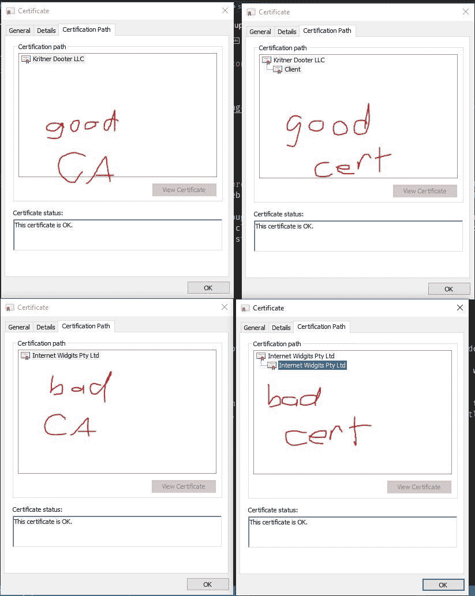
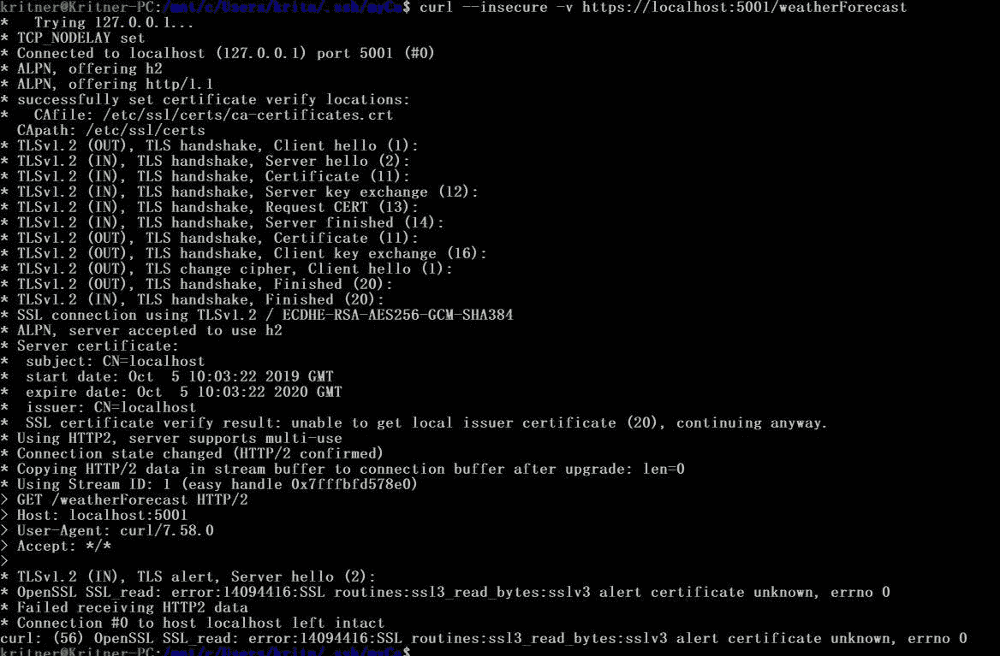
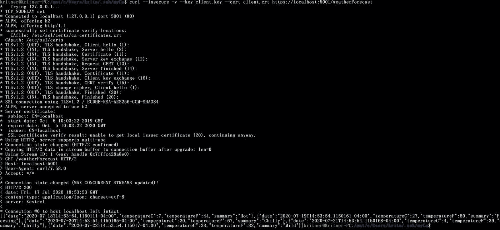
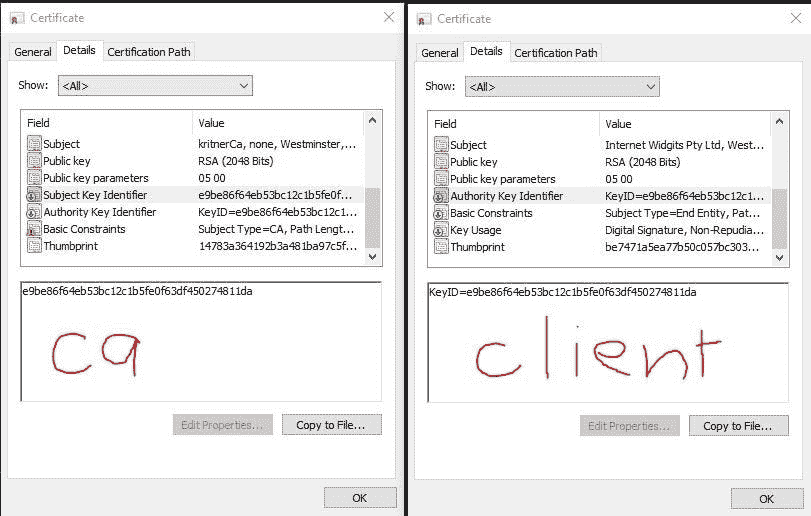
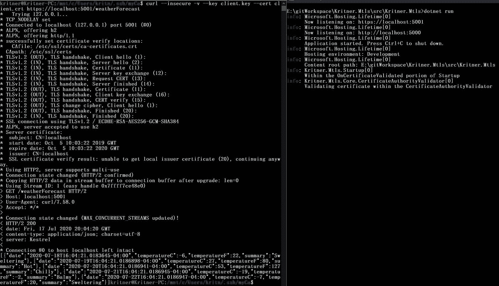
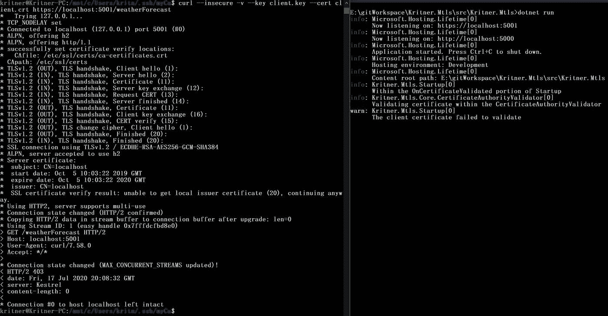
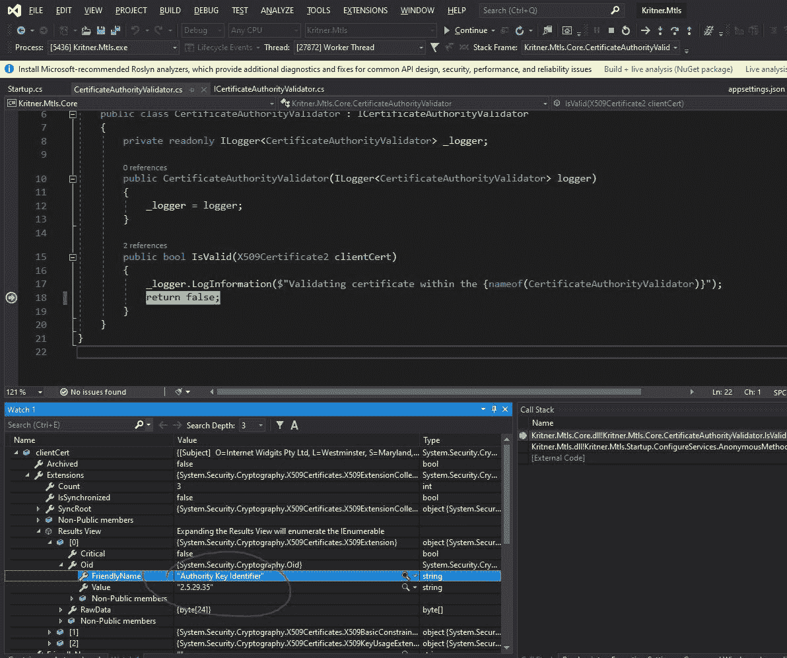
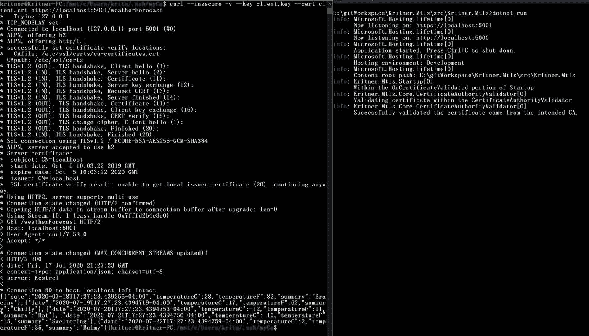
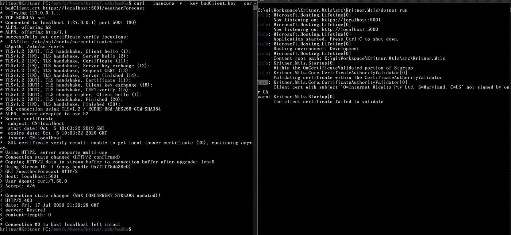

# 设置 mTLS 和 Kestrel(续。)

> 原文：<https://levelup.gitconnected.com/setting-up-mtls-and-kestrel-cont-3f4deb849e47>


照片由[克里斯蒂安·威迪格](https://unsplash.com/@christianw?utm_source=medium&utm_medium=referral)在 [Unsplash](https://unsplash.com?utm_source=medium&utm_medium=referral) 上拍摄

在[上一篇文章](/setting-up-mtls-and-kestrel-a4f8b146a32e)中，我们开始谈论 mTLS。在帖子中我指出客户端证书的签名证书没有被验证，让我们来解决这个问题吧！

# 问题是

在[上一篇文章](/setting-up-mtls-and-kestrel-a4f8b146a32e)中完成的主要事情是建立一个 CA 并使用该 CA 签署的客户端证书运行。我们更新了 web api，要求客户端证书，并使用新的客户端证书成功连接到应用程序。

前一篇文章中的缺陷是，虽然我们验证了客户端证书的存在，但我们实际上并没有验证客户端证书是由我们创建的 CA 签名的。如果客户端证书由于其他原因有效(比如它是由系统中另一个受信任的根 CA 签署的，比如一个实际的 internet CA)，它仍然会“进入”。

# 补救步骤

*   为描述问题而设置
*   演示问题
*   用代码解决问题

## 为描述问题而设置

所以首先，我们需要证明这确实是一个问题。我已经描述了这个问题，但是我们如何着手证明它呢？

在我看来，最简单的事情就是用新的 CA 创建另一个 CA 和客户端证书。web api 应该接受原始的“client”证书，以及“badClient”证书。

我将按照上一篇文章中的所有步骤来设置 CA，包括信任我们的“badCa”。这样做的原因已经在上面介绍过了，但只是重申一下，我们想显示任何有效的证书当前都在进入；其中我们希望*只有来自预期 CA* 的有效证书才能进入。

所以现在我们应该有以下内容:

*   一个“好”的 CA——我们希望确保检查出的客户端证书
*   一个“好的”客户端证书——应该通过我们的应用程序接受的证书
*   一个“坏”的 CA——一个有效的 CA，但不应该被允许签署可以进入我们的应用程序的证书
*   “不良”客户端证书——由“不良”ca 签署，应该*不会*(但目前能够)进入我们的应用程序

如果您正在检查证书，它看起来会像这样:



这么多证书

## 演示问题

现在要做的就是用“好”证书和“坏”证书点击我们的 web api，并确认我们实际上能够从两者中获得输出。

就像前面一样，让我们确保 web api 使用来自“Kritner”的`dotnet run`运行。Mtls”项目。

然后在没有证书的情况下首先点击应用程序:

```
curl --insecure -v https://localhost:5001/weatherForecast
```



没有证书

具有“良好”证书:

```
curl --insecure -v --key client.key --cert client.crt https://localhost:5001/weatherForecast
```



好证书

使用“坏”证书:

```
curl --insecure -v --key badClient.key --cert badClient.crt https://localhost:5001/weatherForecast
```


错误证书

正如所料，您可以看到，没有客户端证书的请求被拒绝，而带有“好”和“坏”客户端证书的请求都通过了。现在，我们需要弄清楚如何将应用程序限制为只接受由我们“好的”CA 签署的客户端证书

## 用代码解决问题

所以首先，我们需要确定什么使得“好的”客户端证书“好”，什么使得“坏的”客户端证书“坏”。如果您检查系统上的证书，您会看到有一个“授权密钥标识符”作为属性。客户端证书上的“授权密钥标识符”与签署证书的 CA 上的[“授权密钥标识符”](https://knowledge.digicert.com/solution/SO18140#AKI)和/或[“主题密钥标识符”](https://knowledge.digicert.com/solution/SO18140#SKI)相匹配:



授权密钥标识符

抱歉，所有不同的 CA 标签等等，如果你在截图中注意到了，我像个疯子一样在电脑间切换！

在上面的内容中，您将能够看到“好的”证书“属于”好的 CA，而“坏的”证书“属于”坏的 CA——这是我们需要的信息！现在我们只需要一种用代码获取信息的方法。

注意，我正在处理的代码的起点是[https://github.com/Kritner-Blogs/Kritner.Mtls/releases/tag/v0.9.1](https://github.com/Kritner-Blogs/Kritner.Mtls/releases/tag/v0.9.1)

让我们回顾一下当前的代码，在上一篇文章中，我甚至给自己和其他人留了一个小纸条:

```
OnCertificateValidated = context =>
{
    var logger = context.HttpContext.RequestServices.GetService<ILogger<Startup>>();// You should implement a service that confirms the certificate passed in
    // was signed by the root CA.

    // Otherwise, a certificate that is valid to one of the other trusted CAs on the webserver,
    // would be valid in this case as well.

    logger.LogInformation("You did it my dudes!");return Task.CompletedTask;
}
```

## 实现存根

让我们在这部分代码中引入一个服务，它的抽象如下所示:

```
public interface ICertificateAuthorityValidator
{
    bool IsValid(X509Certificate2 clientCert);
}
```

在上面的抽象中，我们接收一个客户端证书，并返回它是否有效(显然)。`OnCertificateValidated`内的`context`可以访问`ClientCertificate`，并且已经是`X509Certificate2`的形式。

让我们来看看我们的实现:

```
public class CertificateAuthorityValidator : ICertificateAuthorityValidator
{
    private readonly ILogger<CertificateAuthorityValidator> _logger;public CertificateAuthorityValidator(ILogger<CertificateAuthorityValidator> logger)
    {
        _logger = logger;
    }public bool IsValid(X509Certificate2 clientCert)
    {
        _logger.LogInformation($"Validating certificate within the {nameof(CertificateAuthorityValidator)}");
        return true;
    }
}
```

以上显然只是一个“起点”，我们总是说它是有效的。我们将通过将它注册为服务，并将其插入我们的`OnCertificateValidated`来连接它。我已经在其他帖子中多次提到过这些服务，但是如果你需要帮助，看看完成的代码(TODO 在这里放一个链接...如果我在评论中漏掉了这个，底部可能会有一个链接)。

```
OnCertificateValidated = context =>
{
    var logger = context.HttpContext.RequestServices.GetService<ILogger<Startup>>();
    logger.LogInformation("Within the OnCertificateValidated portion of Startup");var caValidator = context.HttpContext.RequestServices.GetService<ICertificateAuthorityValidator>();
    if (!caValidator.IsValid(context.ClientCertificate))
    {
        const string failValidationMsg = "The client certificate failed to validate";
        logger.LogWarning(failValidationMsg);
        context.Fail(failValidationMsg);
    }return Task.CompletedTask;
}
```

上面，一旦客户端证书被验证(否则)，我们将得到我们的`ICertificateAuthorityValidator`的一个实例，然后在它上面运行额外的验证过程。如果验证失败，它会将验证标记为失败，否则仍然会成功。

随着我们的存根实现从`IsValid`返回`true`，让我们看看是什么样子:



实现存根总是返回真

更改存根实现以从`IsValid`返回`false`:



实现存根总是返回假

## 实际实施

现在我们可以开始实际实现`CertificateAuthorityValidator`了。您还记得，我们可以(希望)依靠“授权密钥标识符”来确保只有我们预期的 CA 签署的证书才能通过验证。

我们做些调试好吗？



调试以查找 X509Certificate2 中的信息

上面的截图显示，我们需要的信息实际上存在于从`X509Certificate2`呈现给我们的数据中。为了节省一点时间和文字，要知道这个扩展上的“原始数据”确实表示 CA cert 上的相同值，但是还有一些额外的信息字节，即“KeyID= ”(如前面的截图所示)。我实际上无法从要确认的字节中获取这些数据(尝试获取 ascii、utf8 和其他几种格式的字节字符串)，但看起来就是这样。这意味着对于我们的实现，我们需要来自这个扩展的“原始数据”，减去最初的几个字节，以说明我只能假设是“KeyID=”。

完整的`CertificateAuthorityValidator`:

```
public class CertificateAuthorityValidator : ICertificateAuthorityValidator
{
    private readonly ILogger<CertificateAuthorityValidator> _logger;// this should probably be injected via config or loaded from the cert
    // Apparently the bytes are in the reverse order when using this BigInteger parse method,
    // hence the reverse
    private readonly byte[] _caCertSubjectKeyIdentifier = BigInteger.Parse(
        "e9be86f64eb53bc12c1b5fe0f63df450274811da",
        System.Globalization.NumberStyles.HexNumber
    ).ToByteArray().Reverse().ToArray();private const string AuthorityKeyIdentifier = "Authority Key Identifier";

    public CertificateAuthorityValidator(ILogger<CertificateAuthorityValidator> logger)
    {
        _logger = logger;
    }public bool IsValid(X509Certificate2 clientCert)
    {
        _logger.LogInformation($"Validating certificate within the {nameof(CertificateAuthorityValidator)}");

        if (clientCert == null)
            return false;
        foreach (var extension in clientCert.Extensions)
        {
            if (extension.Oid.FriendlyName.Equals(AuthorityKeyIdentifier, StringComparison.OrdinalIgnoreCase))
            {
                try
                {
                    var authorityKeyIdentifier = new byte[_caCertSubjectKeyIdentifier.Length];
                    // Copy from the extension raw data, starting at the index that should be after the "KeyID=" bytes
                    Array.Copy(
                        extension.RawData, extension.RawData.Length - _caCertSubjectKeyIdentifier.Length, 
                        authorityKeyIdentifier, 0, 
                        authorityKeyIdentifier.Length);if (_caCertSubjectKeyIdentifier.SequenceEqual(authorityKeyIdentifier))
                    {
                        _logger.LogInformation("Successfully validated the certificate came from the intended CA.");
                        return true;
                    }
                    else
                    {
                        _logger.LogError($"Client cert with subject '{clientCert.Subject}' not signed by our CA.");
                        return false;
                    }
                }
                catch (Exception e)
                {
                    _logger.LogError(e, string.Empty);
                    return false;
                }
            }
        }

        _logger.LogError($"'{clientCert.Subject}' did not contain the extension to check for CA validity.");
        return false;
    }
}
```

相对来说*应该是*在上面自我解释清楚了，但是这里有细目:

*   设置一个变量作为 CA 证书的“主题密钥标识符”(SKI)，使用 post 开头附近图像中的十六进制字符串。(我在代码的注释中指出了这一点，但是请注意，字节数组与我们想要的是相反的，所以我们颠倒了字节以得到我们需要的)
*   通过`clientCert.Extensions`进行枚举，直到找到具有“授权密钥标识符”的“友好名称”的那个
*   找到后，通过从完整的原始字节长度减去 SKI 的长度开始进行数组复制，删除" KeyID= "(假定的)字节
*   比较这两个序列
*   如果匹配，返回真，否则返回假

# 测试它

现在是检查我们工作的时候了！如果应用程序尚未运行，请运行它，让我们检查一下是否可以使用我们的有效证书获取信息:

```
curl --insecure -v --key client.key --cert client.crt https://localhost:5001/weatherForecast
```



好证书

```
curl --insecure -v --key badClient.key --cert badClient.crt https://localhost:5001/weatherForecast
```



错误证书


有用！

# 参考

*   [设置 mTLS 和 Kestrel](/setting-up-mtls-and-kestrel-a4f8b146a32e)
*   SSL 证书包含哪些扩展和细节？
*   [帖子开头的代码起点](https://github.com/Kritner-Blogs/Kritner.Mtls/releases/tag/v0.9.1)
*   [代码结束点](https://github.com/Kritner-Blogs/Kritner.Mtls/releases/tag/v1.0)

*原载于 2020 年 7 月 22 日 https://blog.kritner.com**[*。*](https://blog.kritner.com/2020/07/22/setting-up-mtls-and-kestrel-cont/)*