# 设置 RabbitMQ 集群

> 原文：<https://levelup.gitconnected.com/setting-up-rabbitmq-cluster-c247d61385ed>

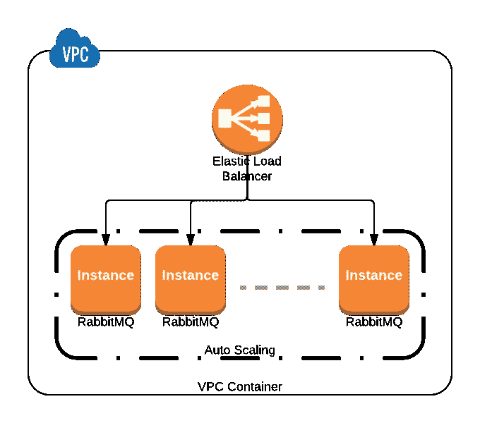

# 概观

在本文中，我们将在基于 docker 的环境中设置 RabbitMQ 集群。我们将从设置单个实例开始，之后，我们将添加更多配置以向集群添加更多节点，我们还将使用 RabbitMQ 的管理标记 docker 映像，因为它提供了管理插件。我们还将设置发布者和消费者来观看 rabbitmq 的运行。我们将设置一个 3 节点群集。

> ***查看我的*** [***科目关于 Hyperledger Fabric 的部署关于多主机***](https://www.udemy.com/course/learn-to-deploy-hyperledger-fabric-v22-on-multihost/?referralCode=8AF12D11DDC9A3D5B636)

# 1.建立工作关系网

RabbitMQ 节点由节点名标识。节点名由两部分组成，前缀(通常是`rabbit`)和主机名。例如，`rabbit@node1.messaging.svc.local`是一个节点名，前缀为`rabbit`，主机名为`node1.messaging.svc.local`。

群集中的节点名称必须唯一。如果给定主机上运行多个节点(这通常是开发和 QA 环境中的情况)，它们必须使用不同的前缀，例如`rabbit1@hostname`和`rabbit2@hostname`。

在集群中，节点使用节点名称来识别和联系彼此。这意味着每个节点名称的主机名部分都必须解析。

我们将保留主机名作为容器名，因此我们的节点名将是`rabbit@rabbit-1`、`rabbit@rabbit-2`、`rabbit@rabbit-3`来运行我们的 rabbitmq 实例。

我们需要建立一个 docker 网络，以便我们的 rabbitmq 实例可以相互通信。

```
docker network create rabbit
```

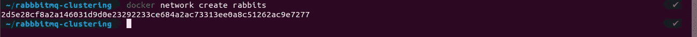

# 2.证明

RabbitMQ 节点和 CLI 工具(例如`rabbitmqctl`)使用 cookie 来确定它们是否被允许相互通信。为了让两个节点能够通信，它们必须拥有相同的共享秘密，称为 **Erlang cookie** 。cookie 只是一个最多 255 个字符的字母数字字符串。每个群集节点必须有相同的 cookie。实例之间的通信也需要它。

我们可以通过启动 rabbitmq 的一个实例来获取 Erlang cookie，然后这个 cookie 需要与其他 rabbitmq 实例共享

```
# run a standalone instance
docker run -d --rm --net rabbits --hostname rabbit-1 --name rabbit-1 rabbitmq:3.8
# how to grab existing erlang cookie
docker exec -it rabbit-1 cat /var/lib/rabbitmq/.erlang.cookie
# clean up
docker rm -f rabbit-1
```

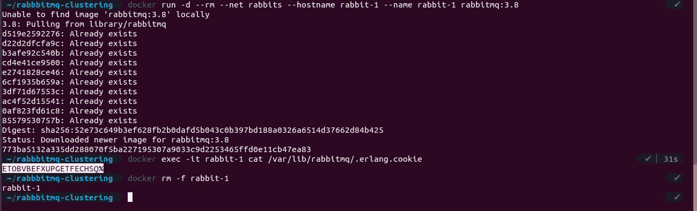

# 3.使聚集

RabbitMQ 集群可以通过多种方式形成:

*   通过在[配置文件](https://www.rabbitmq.com/configure.html)中列出集群节点
*   以声明方式使用基于 DNS 的发现
*   声明性地使用 [AWS (EC2)实例发现](https://github.com/rabbitmq/rabbitmq-peer-discovery-aws)(通过插件)
*   声明性地使用 [Kubernetes 发现](https://github.com/rabbitmq/rabbitmq-peer-discovery-k8s)(通过插件)
*   声明性地使用[基于 Consul 的发现](https://github.com/rabbitmq/rabbitmq-peer-discovery-consul)(通过插件)
*   声明性地使用[基于 etcd 的发现](https://github.com/rabbitmq/rabbitmq-peer-discovery-etcd)(通过插件)
*   用`rabbitmqctl`手动

我们将使用第一种方法，即使用配置文件，也称为**自动集群**。

因为我们是在基于容器的环境中运行实例，所以我们需要某种持久性，以便如果任何 rabbitmq 实例(容器)死亡，它不会丢失其状态并返回到先前的状态。为了实现持久性，我们需要将配置文件作为一个卷挂载到容器中。

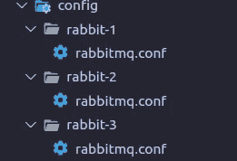

所有配置文件都包含相同的配置，详细信息包括发现方法的类型和节点名称。

```
**loopback_users.guest** = false**listeners.tcp.default** = 5672**cluster_formation.peer_discovery_backend** = rabbit_peer_discovery_classic_config**cluster_formation.classic_config.nodes.1** = rabbit@rabbit-1**cluster_formation.classic_config.nodes.2** = rabbit@rabbit-2**cluster_formation.classic_config.nodes.3** = rabbit@rabbit-3
```

创建多个配置文件而不是一个文件的原因是 rabbitmq 需要对配置文件的读写权限，这些实例将会覆盖配置文件。为了避免这种覆盖问题，我们需要多个文件。

现在，我们可以使用我们生成的 **Erlang Cookie** 以及挂载**配置文件**来启动所有三个节点。

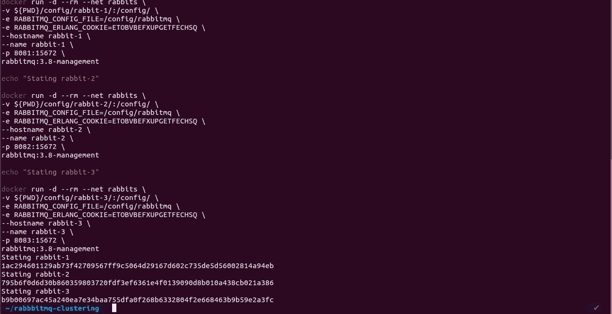

现在，如果我们访问管理控制台(http://localhost:8081)，我们可以将所有 3 个节点连接在一起，形成一个集群。

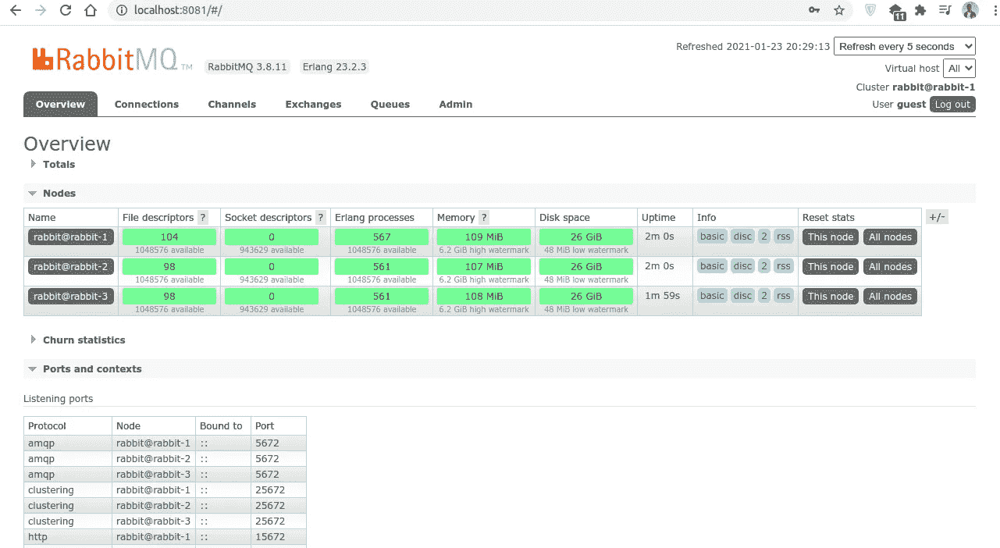

# 4.分身术

RabbitMQ 代理操作所需的所有数据/状态都在所有节点上复制。一个例外是消息队列，默认情况下，消息队列驻留在一个节点上，尽管它们在所有节点上都是可见和可达的。若要跨群集中的节点复制队列，请使用支持复制的队列类型。

这意味着，如果任何消费者应用程序连接到任何节点，并且如果该节点死亡，则队列中存在的消息也将消失。

为了解决这个问题**镜像**出现了。

# **5。镜子**

默认情况下，RabbitMQ 集群中队列的内容位于单个节点上(声明队列的节点)。这与交换和绑定相反，交换和绑定总是可以被认为是在所有节点上。队列可以有选择地在多个节点上被镜像。

每个镜像队列由一个*主*和一个或多个*镜像*组成。主节点位于一个通常称为主节点的节点上。每个队列都有自己的主节点。给定队列的所有操作首先应用于队列的主节点，然后传播到镜像。镜像允许我们将队列和数据镜像到所有节点。

可以使用策略设置镜像。策略按名称匹配一个或多个队列(使用正则表达式模式)，并包含一个定义(可选参数的映射),该定义被添加到匹配队列的总属性集中。

让我们为所有节点设置镜像，但在此之前，我们需要启用联盟插件。

```
docker exec -it rabbit-1 rabbitmq-plugins enable rabbitmq_federationdocker exec -it rabbit-2 rabbitmq-plugins enable rabbitmq_federationdocker exec -it rabbit-3 rabbitmq-plugins enable rabbitmq_federation
```

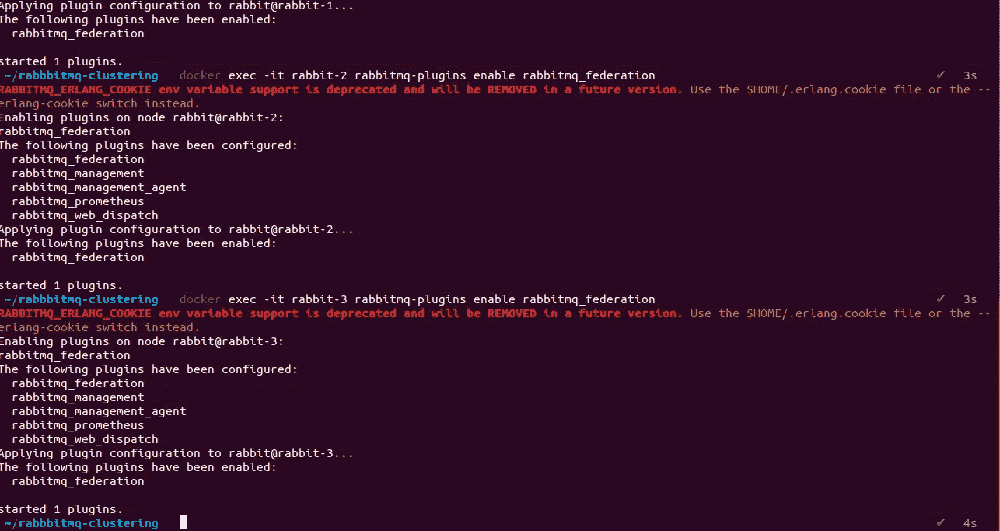

```
docker exec -it rabbit-1 bash
rabbitmqctl set_policy ha-fed \
    ".*" '{"federation-upstream-set":"all","ha-sync-mode":"automatic", "ha-mode":"nodes", "ha-params":["rabbit@rabbit-1","rabbit@rabbit-2","rabbit@rabbit-3"]}' \
    --priority 1 \
    --apply-to queues
```

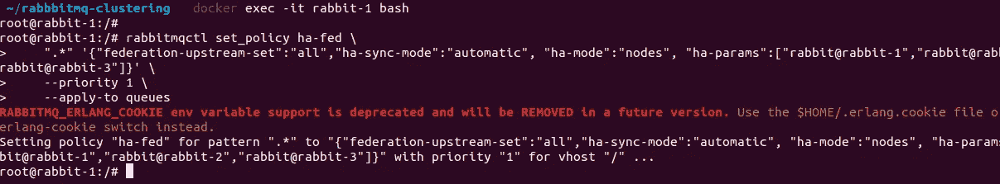

# 6.应用

现在我们将创建两个应用程序，一个是发布者，另一个是消费者。发布者将负责向队列提供数据。消费者将在终端消费数据。

执行这些操作的队列的名称将是`publisher`。

我已经在 golang 上创建了 publisher 应用程序。发布者将消息放入队列，然后使用者从队列中读取消息。消费者应用程序构建在 NodeJS 之上。

要构建和运行 publisher 应用程序，请运行:

```
docker build ./applications/publisher -t aditya/rabbitmq-publisher:v1.0.0docker run -it --rm --net rabbits -e RABBIT_HOST=rabbit-1 -e RABBIT_PORT=5672 -e RABBIT_USERNAME=guest -e RABBIT_PASSWORD=guest -p 80:80 aditya/rabbitmq-publisher:v1.0.0
```

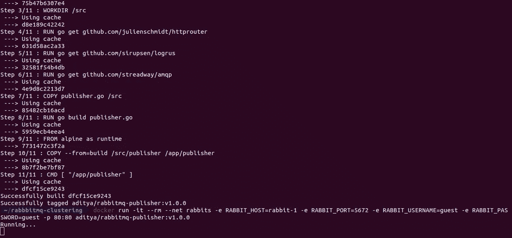

要构建和运行消费者应用程序，请打开一个新的终端窗口并运行:

```
docker build ./applications/consumer -t aditya/rabbitmq-consumer:v1.0.0docker run -it --rm --net rabbits -e RABBIT_HOST=rabbit-1 -e RABBIT_PORT=5672 -e RABBIT_USERNAME=guest -e RABBIT_PASSWORD=guest aditya/rabbitmq-consumer:v1.0.0
```

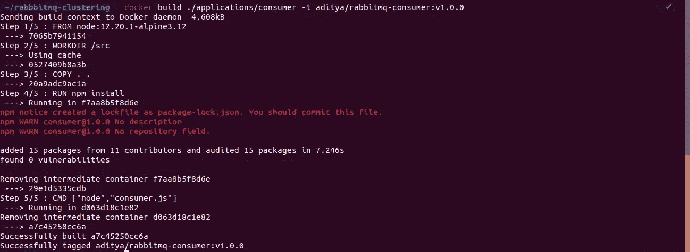

现在要测试应用程序，打开另一个终端并运行:

```
curl -X POST localhost:80/publish/hello
```

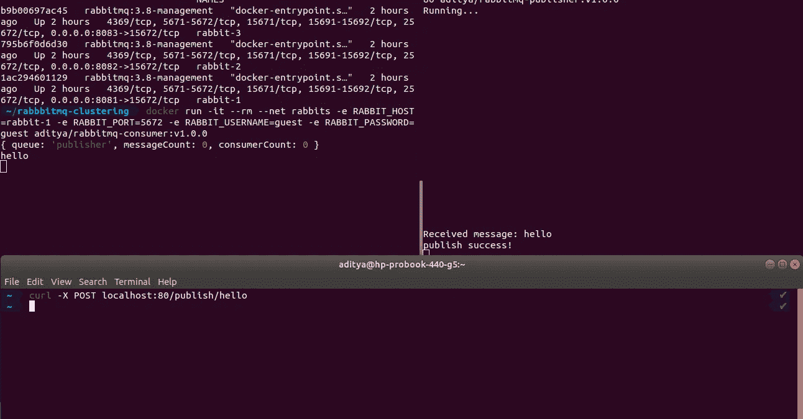

您可以看到消费者应用程序已经收到了通过发布者应用程序发送的消息。

# 7.摘要

在本文中，我们学习了如何设置一个 3 节点 rabbitmq 集群，首先使用 Erlang Cookie 设置身份验证，然后设置复制和队列镜像，最后设置发布者和消费者应用程序。你可以在这里找到[源代码](https://github.com/adityajoshi12/rabbitmq-clustering)。

如果你觉得这篇文章很有帮助，请点击拍手按钮，并跟随我阅读更多这样的信息丰富的文章。

你可以在 [Linkedin](https://linkedin.com/in/adityajoshi12) 上找到我或者在 [GitHub](https://github.com/adityajoshi12) 上跟踪我？如果这对你来说太社交化了，如果你想和我讨论技术，就给 adityaprakashjoshi1@gmail.com 发封邮件。

