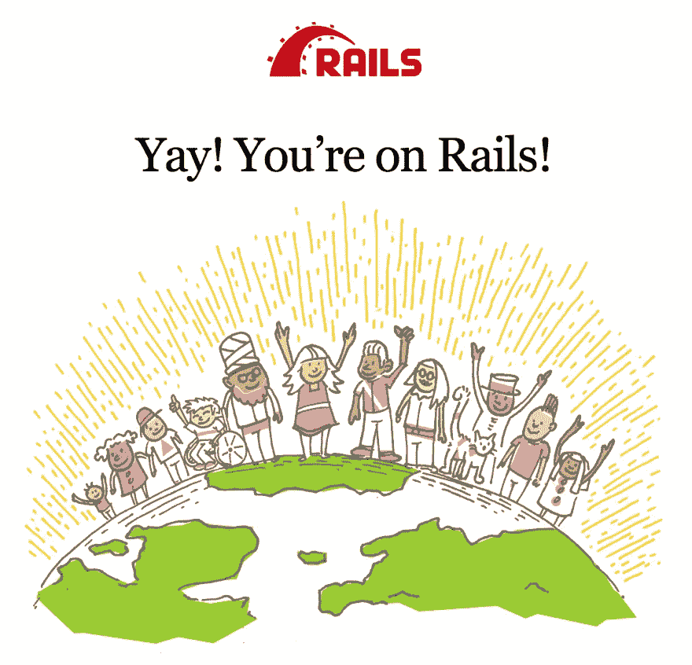
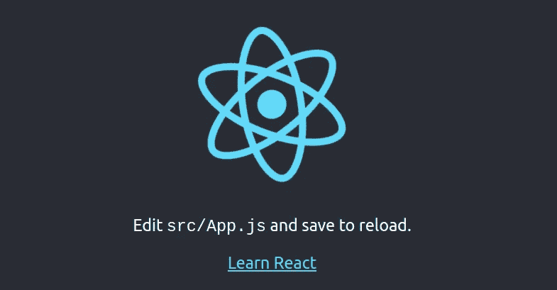

# 使用 React 设置轨道 6

> 原文：<https://levelup.gitconnected.com/setting-up-rails-6-with-react-4b4d3076545>


照片由[肖恩·林](https://unsplash.com/@seanlimm?utm_source=medium&utm_medium=referral)在 [Unsplash](https://unsplash.com?utm_source=medium&utm_medium=referral) 拍摄

# **简介**

有许多方法可以将 React 用作 web 应用程序的前端。有了 Rails，就有了一些可以在 Rails 代码中嵌入 React 的 gem，本质上创建了一个内置 React 的 Rails 应用程序。

但是，如果您想完全分离关注点，或者换句话说，不想混合 React 和 Rails 代码，该怎么办呢？

使用 Rails 6 可以很容易地做到这一点，这也将是今天的主题。

# 设置轨道

从概念上讲，我们正在做的是将 Rails 设置为一个 API。这意味着，从面向客户端的应用程序，我们将对 Rails 后端进行 API 调用，以检索和存储我们的数据。

Rails 自带的视图、控制器和测试对于完整的 Rails 应用程序来说很棒，但对于 Rails API 来说却不是必需的。相反，我们将只需要最基本的东西，为我们的后端节省了一大块空间。

首先，我们将创建一个新文件夹来存放我们的 Rails 和 React 应用程序，并通过在安装过程中包含 API 标志来将 Rails 设置为方便的“API 模式”。

```
$ mkdir app && cd app
$ rails new server --api
```

Rails 现在将创建一个只支持 API 的应用程序，它将排除所有不必要的文件。

在 Rails 完成安装之后，我们将在一个新的端口上运行服务器，因为我们的 React 应用程序将使用正常的端口 3000。为了方便起见，我使用了 3001 端口。

```
$ cd server
$ rails server -p 3001
```

一旦应用程序启动并运行，我们将通过在浏览器中导航到我们的本地主机来检查一切是否按预期工作。

```
[https://localhost:3001](https://localhost:)
```

如果一切顺利，您应该会在浏览器中看到 Rails 欢迎屏幕。



Rails 欢迎屏幕

# API 版本控制

尽管不是必需的，但强烈建议通过为所有当前和未来版本创建一个自定义名称空间来跟踪 API 版本。

这可以通过在您的`routes.rb`文件中创建一个新的名称空间来完成。

这里我们将空间命名为 API 及其当前版本，以免混淆任何未来版本和实现。

现在，我们通过创建一个类似于命名空间 API 的文件夹结构来访问我们的控制器。

```
app > controllers > api > v1 > your_model
```

应用程序的文件夹结构与我们创建的名称间距相匹配非常重要，否则它将无法正常工作。

# 设置 React

既然我们已经正确地设置了 Rails API，我们就可以用 React 包含应用程序的面向客户端部分了。

我们将把目录改回我们的 app 文件夹，并创建一个新的 React 应用程序。

```
$ cd ..
$ npx create-react-app client
```

安装完成后，我们通过将目录更改到新的客户端文件夹并启动 React 开发服务器来检查一切是否顺利。

```
$ cd client
$ npm start
```

接下来，我们前往我们的浏览器，以确保 React 正在工作。

```
https://localhost:3000
```

如果一切正常，我们应该会在屏幕上看到这个。



反应开始屏幕

# 把所有的放在一起

现在，我们应该已经准备好了两个应用程序，Rails 后端和 React 前端。在这一步中，我们将把两个独立的应用程序链接在一起，成功地允许前端应用程序 React 从后端 Rails 存储和检索数据。

为了做到这一点，我们需要使用一个接口来进行 API 调用。我们可以使用[获取](https://developer.mozilla.org/en-US/docs/Web/API/Fetch_API) API 来发出我们的 API 请求，但是我倾向于选择 [Axios](https://github.com/axios/axios) 。两者都可以。

首先，我们需要在我们的客户端目录中安装 Axios。

```
$ npm install axios
```

安装完成后，我们就可以开始从前端向后端进行 API 调用了。

本质上，我们将把我们的 Rails 服务器放在端口 3001 和它的名称空间 API 上，并把这个信息和相关路径一起传递给 Axios。

例如，如果我们想为假设的用户页面调用一个 GET 请求，我们的请求应该是这样的。

获取请求示例

在上面的例子中，我们调用 Rails 服务器`https://localhost:3001`，我们使用的名称空间`/api/v1`，最后是我们想要的路径`/users`。显然，您自己的应用程序会有所不同。

在任何情况下，我们都将这些信息传递给“get”函数，该函数调用 Rails API，并处理“then”函数中返回的内容，最后，如果有任何错误，我们会在“catch”函数中捕获它们。查看 [Axios](https://github.com/axios/axios) 文档了解更多信息。

此外，请注意这里使用了名称 spaced API:`**/api/v1/**some_path`

我们在 Rails-API 中对名称空间所做的任何更改也将反映在我们的 API 请求中。我知道这可能是显而易见的，但我想我会提到它。

# 最后的想法

好了，我们已经成功地设置了 Rails API，React 前端，并且我们已经将它们与 Axios 连接在一起。如果我们想要一个全栈应用程序，但希望将前端与后端分开，这将使我们能够正常运行。

然而，在这样的系统中，可以进行一些生活质量的改变来简化工作流程，但这是另一个话题了。