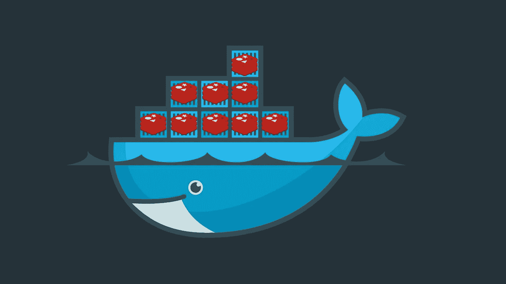
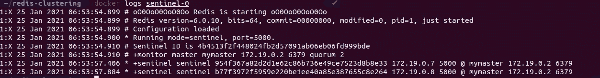
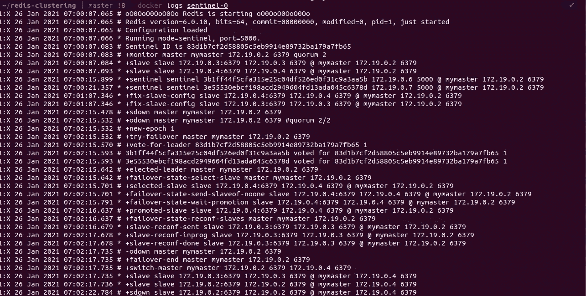

# 设置高可用性 Redis 集群

> 原文：<https://levelup.gitconnected.com/setting-up-redis-cluster-6a1012155868>



# 1.概观

在本文中，我们将在基于 docker 的环境中建立一个 Redis 集群。首先，我们将设置 3 个 redis 实例并启用数据复制，然后，我们将为集群设置 3 个 sentinel 服务。我们还将设置一个客户端应用程序来与 Redis 集群进行交互。

> **查看我的** [**课程，了解多主机上的 Hyperledger Fabric 部署**](https://www.udemy.com/course/learn-to-deploy-hyperledger-fabric-v22-on-multihost/?referralCode=8AF12D11DDC9A3D5B636)

# 2.分身术

在 Redis 复制的基础上(不包括 Redis 集群或 Redis Sentinel 作为附加层提供的高可用性特性)，有一个使用和配置非常简单的 *leader follower* (主从)复制:它允许副本 Redis 实例成为主实例的精确副本。每当链接断开时，副本将自动重新连接到主服务器，并尝试成为其精确副本*而不管主服务器发生了什么*。

# **3。认证**

使用强密码运行 redis 非常重要，因为默认情况下，redis 没有配置为使用密码，因此任何人都可以作为复制的一部分连接到它。我们必须为每个副本配置一个强密码，还必须为每个副本配置主节点密码。

这是使用配置文件`redis.conf`配置的

```
#redis-1 configuration
protected-mode no
port 6379
slaveof redis-0 6379

#authentication
masterauth a-very-complex-password-here
requirepass a-very-complex-password-here
```

`slaveof`属性定义该实例是`redis-0`实例的从实例。而这个`slaveof`属性让`redis-0`主和复制工作。而`requirepass`是认证这个节点的密码，任何想要连接到这个实例的人都必须有这个密码。我们还必须使用`masterauth`属性指定主节点密码。

# 4.集群设置

为了设置 redis 集群，我们需要一个网络，所有 redis 实例、sentinel 服务和客户端应用程序都可以通过这个网络进行通信。

创建`redis`网络运行:

```
docker network create redis
```

一旦创建了网络，我们就可以设置 redis 实例:

```
docker run -d --rm --name redis-0 \
 --net redis \
 -v ${PWD}/redis-0:/etc/redis/ \
 redis:6.0-alpine redis-server /etc/redis/redis.confdocker run -d --rm --name redis-1 \
--net redis \
-v ${PWD}/redis-1:/etc/redis/ \
redis:6.0-alpine redis-server /etc/redis/redis.confdocker run -d --rm --name redis-2 \
--net redis \
-v ${PWD}/redis-2:/etc/redis/ \
redis:6.0-alpine redis-server /etc/redis/redis.conf
```

# 5.高可用性

Redis **Sentinel** 为 Redis 提供高可用性。实际上，这意味着使用 Sentinel 我们可以创建一个 Redis 部署，在没有人工干预的情况下抵御某些类型的故障。

Redis Sentinel 提供了类似于**监控**、**通知**、**自动故障转移和配置提供者**的特性。

要建立 sentinel，我们至少需要 3 个 Redis 节点，以便获得法定人数的大多数选票。

# 6.配置哨兵

为了设置 sentinel 流程，我们需要一些配置文件。

```
port 5000sentinel monitor mymaster redis-0 6379 2sentinel down-after-milliseconds mymaster 5000sentinel failover-timeout mymaster 60000sentinel parallel-syncs mymaster 1sentinel auth-pass mymaster a-very-complex-password-here
```

`port 5000`定义 sentinel 进程运行的端口。`mymaster`是**主群名称。** `redis-0`是 redis-0 的 DNS 名称，`6379`是 redis-0 运行的端口，数字`2`是法定人数，因此该设置要求至少 2 票才能做出任何决定。

之后，我们将 down-after-milliseconds 定义为 5 `000`毫秒，这意味着如果主节点在 5000 毫秒内没有响应，那么它将被认为是死的，或者 sentinel 将等待主节点初始化故障转移多长时间。

`parallel-syncs`设置故障转移后可以重新配置为同时使用新主服务器的副本服务器的数量。

最后，我们使用`auth-pass`定义认证密码。

# **7。启动哨兵服务**


要启动 sentinel 服务运行:

```
docker run -d --rm --name sentinel-0 --net redis \
-v ${PWD}/sentinel-0:/etc/redis/ \
redis:6.0-alpine \
redis-sentinel /etc/redis/sentinel.confdocker run -d --rm --name sentinel-1 --net redis \
-v ${PWD}/sentinel-1:/etc/redis/ \
redis:6.0-alpine \
redis-sentinel /etc/redis/sentinel.confdocker run -d --rm --name sentinel-2 --net redis \
-v ${PWD}/sentinel-2:/etc/redis/ \
redis:6.0-alpine \
redis-sentinel /etc/redis/sentinel.conf
```

验证日志，在日志中，我们应该可以看到其他 sentinel 节点，如果看不到，则意味着存在一些配置问题。

```
docker logs sentinel-0
```



# 8.客户应用程序

我在 nodejs 上编写了一个客户端应用程序，它将当前时间戳存储在 Redis 集群上。客户端应用程序与 sentinel 服务通信，而不是直接与 Redis 实例通信，这确保了如果我们的主 Redis 实例死亡，我们的应用程序仍将正常运行，因为我们的读/写请求将被转发到从仲裁中选出的当前主 Redis 实例。

```
***const*** redis **=** **new** Redis({
db: 0,
password: "a-very-complex-password-here",
sentinels: [
{ host: host1, port: port },
{ host: host2, port: port },
{ host: host3, port: port },
],
name: "mymaster",
});
```

要构建客户端应用程序，请运行:

```
docker build ./applications/client/ -t aditya/redis-client:v1.0.0
```

运行客户端应用程序:

```
docker run -it --net redis \
--env-file .env \
-p 80:80 \
aditya/redis-client:v1.0.0
```

现在打开浏览器并访问`[http://localhost:80](http://localhost:80)`，每次刷新页面时，我们都会将值存储到 redis 中。

为了测试高可用性，我们可以通过以下方式终止主 redis 实例

```
docker rm -f redis-0
```

现在，如果您尝试访问客户端应用程序，我们仍然可以看到该应用程序正在工作。

为了检查哪个实例是当前的主节点，我们可以运行以下命令:

```
docker logs sentinel-0
docker exec -it sentinel-0 sh
redis-cli -p 5000
info
sentinel master mymaster
```



# 摘要

在本文中，我们学习了如何设置 3 节点 Redis 集群，首先设置身份验证和应用程序，然后设置 sentinel 服务，最后设置客户端应用程序并测试高可用性。你可以在这里找到[的源代码。](https://github.com/adityajoshi12/redis-clustering)

如果你觉得这篇文章很有帮助，请点击拍手按钮，并跟随我阅读更多这样的信息丰富的文章。

你可以在 [Linkedin](https://linkedin.com/in/adityajoshi12) 上找到我或者在 [GitHub](https://github.com/adityajoshi12) 上跟踪我？如果这对你来说太社交化了，如果你想和我讨论技术，就给 adityaprakashjoshi1@gmail.com 发封邮件。

