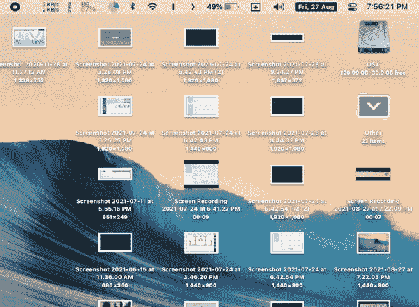
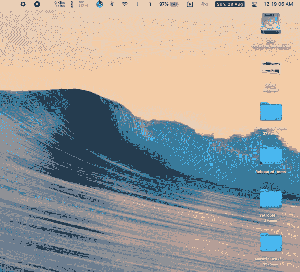
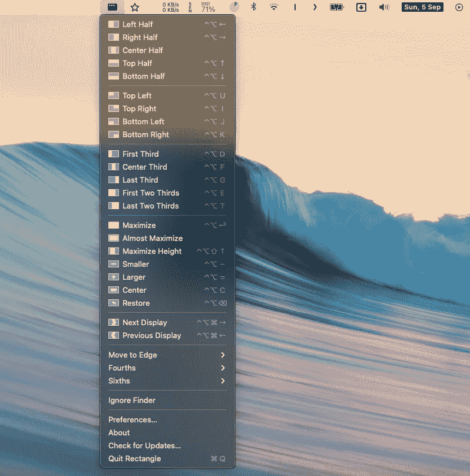
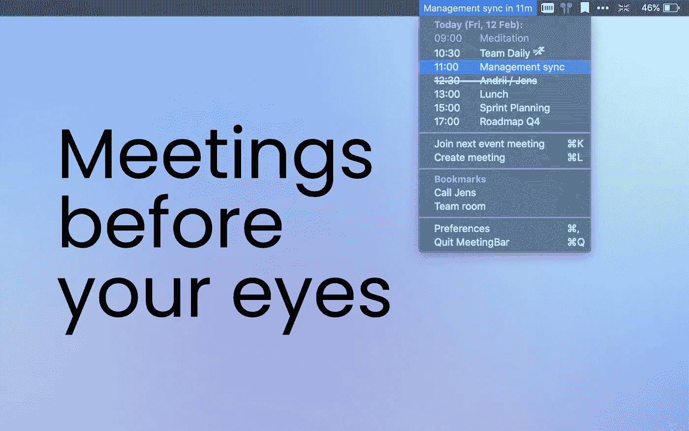
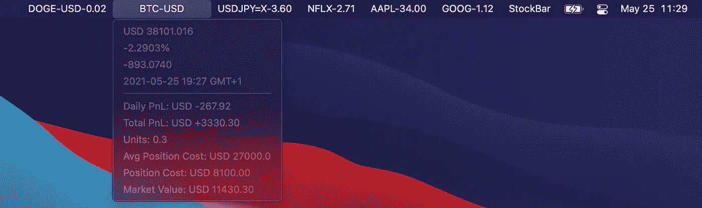

# 设置完美的 MacOS 菜单栏！

> 原文：<https://levelup.gitconnected.com/setting-up-the-perfect-macos-menu-bar-ba495b8f2db>

按照下面的步骤建立一个整洁而实用的菜单栏。

照片由 [Remy_Loz](https://unsplash.com/@axellvak?utm_source=unsplash&utm_medium=referral&utm_content=creditCopyText) 在 [Unsplash](https://unsplash.com/s/photos/macbook?utm_source=unsplash&utm_medium=referral&utm_content=creditCopyText) 上拍摄

菜单栏显然是 MacOS 中最被低估和利用不足的部分之一。它可以提供关于你的 Mac 的重要信息，**可以永远改变你使用 Mac 的方式*。***

若要重新组织菜单栏，请按住⌘ (command)键并拖移菜单栏项。

# 1.拖放区 4

[**Dropzone 4**](https://apps.apple.com/in/app/dropzone-4/id1485052491?mt=12) 升级您在 Mac 上访问和移动文件的方式。下拉栏提供了一个方便的位置，您可以在其中放置最常用的文件，或者临时存储您稍后需要返回的数据。

您可以轻松地将它们拖放到不同的快捷图标上，这些图标都显示在从菜单栏下拉的网格中。一定有！

> 成本:带云操作的专业版——35 美元

拖动—定位—放下

# 2.统计数据

[**Stats**](https://github.com/exelban/stats) 是一个有趣的应用程序，可以让你从菜单栏监控你的 macOS 系统。这是一个开源项目，在 GitHub 上有 5.4K 的星星。如需定制，请查看应用程序设置。

检查您的系统！

*   CPU / GPU /磁盘利用率
*   内存使用
*   传感器信息(温度/电压/功率)
*   电池电量
*   网络使用
*   蓝牙设备

> 费用:免费([开源](https://github.com/exelban/stats))

# 3.HiddenBar

[**HiddenBar**](https://superbits.co/hidden/) 让你隐藏菜单栏项目，让你的 Mac 看起来更整洁。这个超轻的菜单栏实用程序将帮助您通过完全隐藏图标来完善您的菜单栏。

> 费用:免费([开源](https://github.com/dwarvesf/hidden)

## 4.ItsyCal

Itsycal 是 Mac 菜单栏上的一个小日历。一旦你拥有了它，你就离不开它。

> 费用:免费([开源](https://github.com/sfsam/Itsycal)

## 5.矩形

Rectangle 是 BetterSnapTool 或 telegraph 的开源替代品，它解决了 MacOS 中明显缺乏活动窗口管理的问题。使用键盘快捷键或捕捉区域在 **macOS** 中移动窗口并调整其大小。一定有！！

> 费用:免费([开源](https://github.com/rxhanson/Rectangle))

## 6.会议栏

如果过去几年让你从 Mac 上参加会议，Meeting 会让你的会议在菜单栏上井然有序。集成了 20 多种会议服务，因此您可以从事件中快速加入会议或创建临时会议。

> 费用:免费([开源](https://github.com/leits/MeetingBar))

## 7.StockBar

一个菜单栏应用程序，每分钟跟踪股票价格，货币汇率和加密货币价格的变化。如果设置中提供了单位尺寸，则菜单栏项目显示每日位置变化。否则，将显示单位每日变化。

单击符号名称显示详细信息，如价格、变化百分比、最后更新的时间戳和头寸信息。

> 费用:免费([开源](https://github.com/fhl43211/StockBar))

在评论区分享你最喜欢的菜单栏插件！