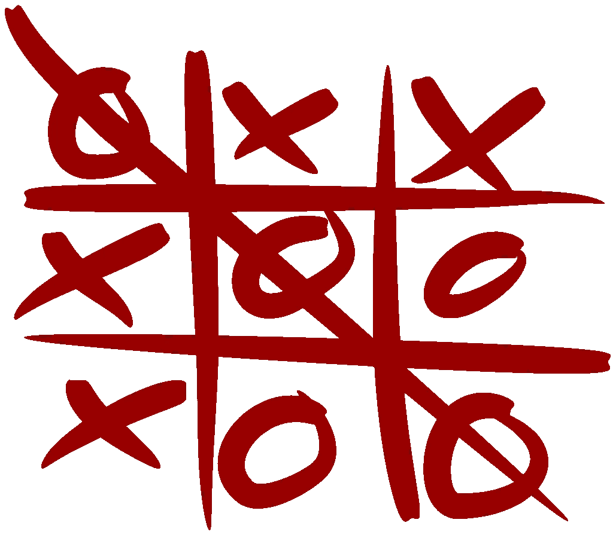
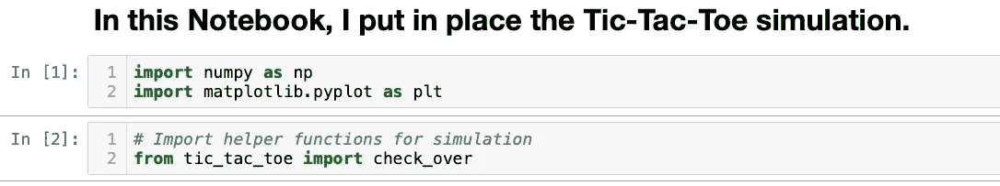
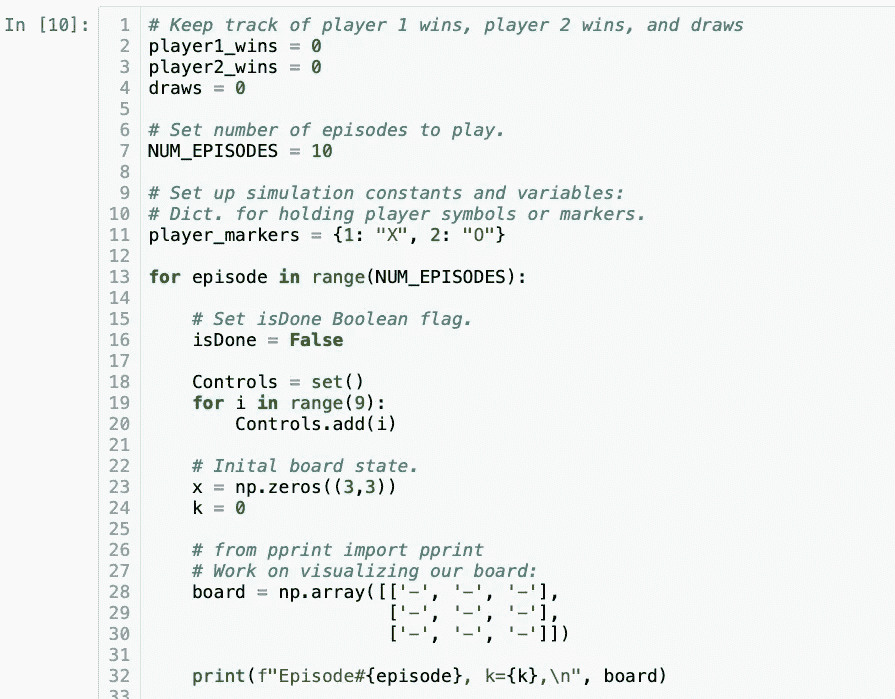
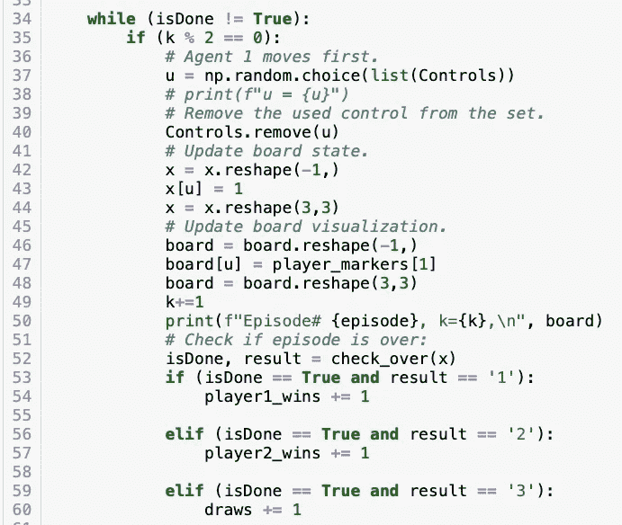
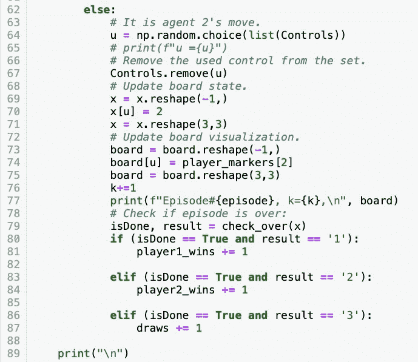
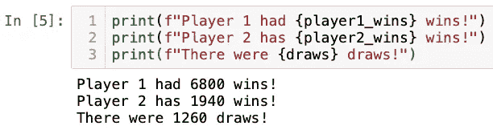

# 在 Python 中为强化学习设置井字游戏

> 原文：<https://levelup.gitconnected.com/setting-up-tic-tac-toe-for-reinforcement-learning-in-python-43e2f42cfce8>



图片来自[https://en.wikipedia.org/wiki/Tic-tac-toe](https://en.wikipedia.org/wiki/Tic-tac-toe)

在我之前的 Medium 文章:[https://Medium . com/@ CalebMBowyer/framing-Tic-Tac-Toe-as-a-Reinforcement-Learning-problem-EB 76 b 6 ECE 4 de](https://medium.com/@CalebMBowyer/framing-tic-tac-toe-as-a-reinforcement-learning-problem-eb76b6ece4de)我把井字游戏公式化为一个情景强化学习(RL)问题。

# **简介**

在本教程中，我为 agent 1 设置了在下一个教程中应用表格 Q-learning 所必需的模拟元素。为了简化本教程的内容并解释游戏动力学和 Python 代码，代理 1 和代理 2 将在游戏演化过程中从当前控制空间中随机选择控制，每个控制的概率相等。

# 进口



在第一个单元中，我们导入标准 Python 模块 Numpy 和 Matplotlib。在第二个单元格中，我导入了自己的自定义函数“check_over ”,该函数将用于测试当前游戏状态，以确定该集是否结束，如果结束，结果是什么:代理 1 赢，代理 2 赢，还是平局。

# 界限条件

## 参与人 1 赢得终端条件

我想到了根据状态值为三种可能结果中的每一种指定每集结束条件的最佳和最简单的方法，以及如何在井字游戏棋盘上传播这些结果。对于代理人 1 或参与人 1，因为当它将其 X 放在实际状态记录为 1 的棋盘上时，可以使用简单的乘积规则来扫描每列、行和两条对角线，以查看每行中每个条目的乘积是否为 1，每列中每个条目的乘积是否为 1，或者每条对角线上的乘积是否为 1。如果在某一集的任何一行、一列或一条对角线满足这个条件，那么玩家 1 就赢了。

## 参与人 2 赢得终端条件

类似地，有一个简单且最佳的数字规则来确定玩家 2 是否赢得了井字游戏。因为我选择用整数 2 来编码参与人 2 在棋盘上的移动 O，我们可以使用一个简单的求和规则来检查每一行、每一列和每一条对角线，看看参与人 2 是否赢得了这一集。简单地说，如果任何一列中每个条目的总和是 6，则玩家 2 赢得了该集。如果任何一行中每个条目的总和是 6，那么玩家 2 赢得了该集。最后，如果任意对角线上每个条目的总和是 6，那么玩家 2 赢得了这一集。

## 绘制终止条件

对于最后一个可能的终端条件，平局，我们可以使用 Numpy 的 all()方法来检查所有的状态值是否为非空或非零，以便在检查了玩家 1 和玩家 2 的胜利并确认两个玩家都没有获胜之后，确认该集结束。这是因为我们用整数 0 编码了一个空单元格。如果一号玩家没有赢，二号玩家也没有赢，我们也没有平局，那么游戏继续。这涵盖了 check_over 函数的所有情况。

# tic_tac_toe.py 中的代码:

```
import numpy as npdef check_over(x):
    """
    Takes in the current board state x,
    and determines if the game is won by 
    any player or if there is a draw.    
    Returns True if episode is over. 
    Returns False if episode is not over. 
    Also, returns a string '1' if player 1
    has won, a string '2' if player 2 has
    won, or a string '3' if there is a draw. 
    """ # CHECK WHETHER PLAYER 1 WON. 
    # CHECK EACH ROW: 
    if (np.prod(x[0,:]) == 1):
        print("PLAYER 1 WON!")
        isDone = True
        player_win = '1'
        return isDone, player_win
    if (np.prod(x[1,:]) == 1):
        print("PLAYER 1 WON!")
        isDone = True
        player_win = '1'
        return isDone, player_win
    if (np.prod(x[2,:]) == 1):
        print("PLAYER 1 WON!")
        isDone = True
        player_win = '1'
        return isDone, player_win
    # CHECK EACH COLUMN:
    if (np.prod(x[:,0] == 1)):
        print("PLAYER 1 WON!")
        isDone = True
        player_win = '1'
        return isDone, player_win
    if (np.prod(x[:,1] == 1)):
        print("PLAYER 1 WON!")
        isDone = True
        player_win = '1'
        return isDone, player_win
    if (np.prod(x[:,2] == 1)):
        print("PLAYER 1 WON!")
        isDone = True
        player_win = '1'
        return isDone, player_win # CHECK EACH DIAGONAL
    # CHECK MAIN DIAGONAL:
    if (np.prod(np.diag(x)) == 1):
        print("PLAYER 1 WON!")
        isDone = True
        player_win = '1'
        return isDone, player_win # CHECK OPPOSITE DIAGONAL:
    if (np.prod(np.diag(np.rot90(x))) == 1):
        print("PLAYER 1 WON!")
        isDone = True
        player_win = '1'
        return isDone, player_win####################################################################
    # CHECK WHETHER PLAYER 2 WON. 
    # CHECK EACH ROW: 
    if (np.sum(x[0,:]) == 6):
        print("PLAYER 2 WON!")
        isDone = True
        player_win = '2'
        return isDone, player_win if (np.sum(x[1,:]) == 6):
        print("PLAYER 2 WON!")
        isDone = True
        player_win = '2'
        return isDone, player_win if (np.sum(x[2,:]) == 6):
        print("PLAYER 2 WON!")
        isDone = True
        player_win = '2'
        return isDone, player_win

    # CHECK EACH COLUMN:
    if (np.sum(x[:,0] == 6)):
        print("PLAYER 2 WON!")
        isDone = True
        player_win = '2'
        return isDone, player_win if (np.sum(x[:,1] == 6)):
        print("PLAYER 2 WON!")  
        isDone = True
        player_win = '2'
        return isDone, player_win if (np.sum(x[:,2] == 6)):
        print("PLAYER 2 WON!")
        isDone = True
        player_win = '2'
        return isDone, player_win # CHECK EACH DIAGONAL
    # CHECK MAIN DIAGONAL:
    if (np.sum(np.diag(x)) == 6):
        print("PLAYER 2 WON!")
        isDone = True
        player_win = '2'
        return isDone, player_win # CHECK OPPOSITE DIAGONAL:
    if (np.sum(np.diag(np.rot90(x))) == 6):
        print("PLAYER 2 WON!")
        isDone = True
        player_win = '2'
        return isDone, player_win####################################################################
    # CHECK TO SEE IF THERE IS A DRAW. 
    if np.all(x):
        print("Draw!")
        isDone = True
        player_win = '3'
        return isDone, player_win

    return False, ' '
```

# 设置井字游戏模拟:



在模拟的设置中，我们设置变量来跟踪玩家的赢和平。我们还可以设置想要播放的剧集数量。我们首先将 isDone 布尔标志设置为 false。对于每一集，我们从一个完整的控制空间开始，并使用一个 set 对象来保存每个玩家在轮到自己时可以选择的控制。每一集我们都从一个空板子开始，时间在第 0 阶段。我使用一个数组来直观地描述棋盘，其中'-'是一个空单元格，' X '是代理 1 的移动，' O '是代理 2 的移动。然后，我使用 Python f-string 很好地打印出与模拟相关的数据。



在上面的 while 循环体中，我们运行了完整的一集。while 循环中的第一个 if 块用于让代理 1 开始行动。当轮到代理 2 移动时，形成下一个代码块:



# 对每个代理使用随机控制的十集游戏:

```
Episode#0, k=0,
 [['-' '-' '-']
 ['-' '-' '-']
 ['-' '-' '-']]
Episode# 0, k=1,
 [['-' '-' '-']
 ['-' 'X' '-']
 ['-' '-' '-']]
Episode#0, k=2,
 [['O' '-' '-']
 ['-' 'X' '-']
 ['-' '-' '-']]
Episode# 0, k=3,
 [['O' '-' '-']
 ['X' 'X' '-']
 ['-' '-' '-']]
Episode#0, k=4,
 [['O' '-' '-']
 ['X' 'X' 'O']
 ['-' '-' '-']]
Episode# 0, k=5,
 [['O' '-' 'X']
 ['X' 'X' 'O']
 ['-' '-' '-']]
Episode#0, k=6,
 [['O' '-' 'X']
 ['X' 'X' 'O']
 ['O' '-' '-']]
Episode# 0, k=7,
 [['O' '-' 'X']
 ['X' 'X' 'O']
 ['O' 'X' '-']]
Episode#0, k=8,
 [['O' '-' 'X']
 ['X' 'X' 'O']
 ['O' 'X' 'O']]
Episode# 0, k=9,
 [['O' 'X' 'X']
 ['X' 'X' 'O']
 ['O' 'X' 'O']]
PLAYER 1 WON!

Episode#1, k=0,
 [['-' '-' '-']
 ['-' '-' '-']
 ['-' '-' '-']]
Episode# 1, k=1,
 [['-' '-' '-']
 ['-' '-' '-']
 ['-' 'X' '-']]
Episode#1, k=2,
 [['-' '-' '-']
 ['O' '-' '-']
 ['-' 'X' '-']]
Episode# 1, k=3,
 [['-' '-' '-']
 ['O' '-' '-']
 ['-' 'X' 'X']]
Episode#1, k=4,
 [['-' '-' '-']
 ['O' '-' '-']
 ['O' 'X' 'X']]
Episode# 1, k=5,
 [['-' 'X' '-']
 ['O' '-' '-']
 ['O' 'X' 'X']]
Episode#1, k=6,
 [['-' 'X' '-']
 ['O' '-' 'O']
 ['O' 'X' 'X']]
Episode# 1, k=7,
 [['-' 'X' 'X']
 ['O' '-' 'O']
 ['O' 'X' 'X']]
Episode#1, k=8,
 [['-' 'X' 'X']
 ['O' 'O' 'O']
 ['O' 'X' 'X']]
PLAYER 2 WON!

Episode#2, k=0,
 [['-' '-' '-']
 ['-' '-' '-']
 ['-' '-' '-']]
Episode# 2, k=1,
 [['-' '-' '-']
 ['-' '-' '-']
 ['-' 'X' '-']]
Episode#2, k=2,
 [['-' '-' 'O']
 ['-' '-' '-']
 ['-' 'X' '-']]
Episode# 2, k=3,
 [['-' '-' 'O']
 ['-' 'X' '-']
 ['-' 'X' '-']]
Episode#2, k=4,
 [['-' 'O' 'O']
 ['-' 'X' '-']
 ['-' 'X' '-']]
Episode# 2, k=5,
 [['X' 'O' 'O']
 ['-' 'X' '-']
 ['-' 'X' '-']]
Episode#2, k=6,
 [['X' 'O' 'O']
 ['-' 'X' '-']
 ['O' 'X' '-']]
Episode# 2, k=7,
 [['X' 'O' 'O']
 ['X' 'X' '-']
 ['O' 'X' '-']]
Episode#2, k=8,
 [['X' 'O' 'O']
 ['X' 'X' 'O']
 ['O' 'X' '-']]
Episode# 2, k=9,
 [['X' 'O' 'O']
 ['X' 'X' 'O']
 ['O' 'X' 'X']]
PLAYER 1 WON!

Episode#3, k=0,
 [['-' '-' '-']
 ['-' '-' '-']
 ['-' '-' '-']]
Episode# 3, k=1,
 [['-' '-' '-']
 ['-' 'X' '-']
 ['-' '-' '-']]
Episode#3, k=2,
 [['-' '-' '-']
 ['-' 'X' '-']
 ['O' '-' '-']]
Episode# 3, k=3,
 [['-' '-' 'X']
 ['-' 'X' '-']
 ['O' '-' '-']]
Episode#3, k=4,
 [['-' 'O' 'X']
 ['-' 'X' '-']
 ['O' '-' '-']]
Episode# 3, k=5,
 [['-' 'O' 'X']
 ['-' 'X' 'X']
 ['O' '-' '-']]
Episode#3, k=6,
 [['-' 'O' 'X']
 ['-' 'X' 'X']
 ['O' '-' 'O']]
Episode# 3, k=7,
 [['X' 'O' 'X']
 ['-' 'X' 'X']
 ['O' '-' 'O']]
Episode#3, k=8,
 [['X' 'O' 'X']
 ['O' 'X' 'X']
 ['O' '-' 'O']]
Episode# 3, k=9,
 [['X' 'O' 'X']
 ['O' 'X' 'X']
 ['O' 'X' 'O']]
Draw!

Episode#4, k=0,
 [['-' '-' '-']
 ['-' '-' '-']
 ['-' '-' '-']]
Episode# 4, k=1,
 [['-' '-' '-']
 ['X' '-' '-']
 ['-' '-' '-']]
Episode#4, k=2,
 [['-' 'O' '-']
 ['X' '-' '-']
 ['-' '-' '-']]
Episode# 4, k=3,
 [['-' 'O' '-']
 ['X' 'X' '-']
 ['-' '-' '-']]
Episode#4, k=4,
 [['-' 'O' '-']
 ['X' 'X' '-']
 ['-' '-' 'O']]
Episode# 4, k=5,
 [['-' 'O' '-']
 ['X' 'X' '-']
 ['-' 'X' 'O']]
Episode#4, k=6,
 [['-' 'O' '-']
 ['X' 'X' 'O']
 ['-' 'X' 'O']]
Episode# 4, k=7,
 [['-' 'O' '-']
 ['X' 'X' 'O']
 ['X' 'X' 'O']]
Episode#4, k=8,
 [['-' 'O' 'O']
 ['X' 'X' 'O']
 ['X' 'X' 'O']]
Episode# 4, k=9,
 [['X' 'O' 'O']
 ['X' 'X' 'O']
 ['X' 'X' 'O']]
PLAYER 1 WON!

Episode#5, k=0,
 [['-' '-' '-']
 ['-' '-' '-']
 ['-' '-' '-']]
Episode# 5, k=1,
 [['-' 'X' '-']
 ['-' '-' '-']
 ['-' '-' '-']]
Episode#5, k=2,
 [['-' 'X' '-']
 ['-' '-' '-']
 ['O' '-' '-']]
Episode# 5, k=3,
 [['-' 'X' '-']
 ['-' 'X' '-']
 ['O' '-' '-']]
Episode#5, k=4,
 [['O' 'X' '-']
 ['-' 'X' '-']
 ['O' '-' '-']]
Episode# 5, k=5,
 [['O' 'X' '-']
 ['-' 'X' '-']
 ['O' 'X' '-']]
PLAYER 1 WON!

Episode#6, k=0,
 [['-' '-' '-']
 ['-' '-' '-']
 ['-' '-' '-']]
Episode# 6, k=1,
 [['-' '-' '-']
 ['-' '-' '-']
 ['X' '-' '-']]
Episode#6, k=2,
 [['-' 'O' '-']
 ['-' '-' '-']
 ['X' '-' '-']]
Episode# 6, k=3,
 [['-' 'O' '-']
 ['X' '-' '-']
 ['X' '-' '-']]
Episode#6, k=4,
 [['O' 'O' '-']
 ['X' '-' '-']
 ['X' '-' '-']]
Episode# 6, k=5,
 [['O' 'O' '-']
 ['X' 'X' '-']
 ['X' '-' '-']]
Episode#6, k=6,
 [['O' 'O' 'O']
 ['X' 'X' '-']
 ['X' '-' '-']]
PLAYER 2 WON!

Episode#7, k=0,
 [['-' '-' '-']
 ['-' '-' '-']
 ['-' '-' '-']]
Episode# 7, k=1,
 [['-' '-' 'X']
 ['-' '-' '-']
 ['-' '-' '-']]
Episode#7, k=2,
 [['-' '-' 'X']
 ['-' '-' 'O']
 ['-' '-' '-']]
Episode# 7, k=3,
 [['-' '-' 'X']
 ['X' '-' 'O']
 ['-' '-' '-']]
Episode#7, k=4,
 [['O' '-' 'X']
 ['X' '-' 'O']
 ['-' '-' '-']]
Episode# 7, k=5,
 [['O' 'X' 'X']
 ['X' '-' 'O']
 ['-' '-' '-']]
Episode#7, k=6,
 [['O' 'X' 'X']
 ['X' 'O' 'O']
 ['-' '-' '-']]
Episode# 7, k=7,
 [['O' 'X' 'X']
 ['X' 'O' 'O']
 ['X' '-' '-']]
Episode#7, k=8,
 [['O' 'X' 'X']
 ['X' 'O' 'O']
 ['X' 'O' '-']]
Episode# 7, k=9,
 [['O' 'X' 'X']
 ['X' 'O' 'O']
 ['X' 'O' 'X']]
Draw!

Episode#8, k=0,
 [['-' '-' '-']
 ['-' '-' '-']
 ['-' '-' '-']]
Episode# 8, k=1,
 [['-' '-' '-']
 ['X' '-' '-']
 ['-' '-' '-']]
Episode#8, k=2,
 [['-' '-' '-']
 ['X' '-' '-']
 ['-' '-' 'O']]
Episode# 8, k=3,
 [['-' '-' '-']
 ['X' '-' 'X']
 ['-' '-' 'O']]
Episode#8, k=4,
 [['-' '-' '-']
 ['X' '-' 'X']
 ['-' 'O' 'O']]
Episode# 8, k=5,
 [['-' '-' 'X']
 ['X' '-' 'X']
 ['-' 'O' 'O']]
Episode#8, k=6,
 [['-' '-' 'X']
 ['X' 'O' 'X']
 ['-' 'O' 'O']]
Episode# 8, k=7,
 [['-' '-' 'X']
 ['X' 'O' 'X']
 ['X' 'O' 'O']]
Episode#8, k=8,
 [['O' '-' 'X']
 ['X' 'O' 'X']
 ['X' 'O' 'O']]
PLAYER 2 WON!

Episode#9, k=0,
 [['-' '-' '-']
 ['-' '-' '-']
 ['-' '-' '-']]
Episode# 9, k=1,
 [['-' '-' '-']
 ['-' '-' '-']
 ['X' '-' '-']]
Episode#9, k=2,
 [['-' '-' '-']
 ['-' 'O' '-']
 ['X' '-' '-']]
Episode# 9, k=3,
 [['-' 'X' '-']
 ['-' 'O' '-']
 ['X' '-' '-']]
Episode#9, k=4,
 [['O' 'X' '-']
 ['-' 'O' '-']
 ['X' '-' '-']]
Episode# 9, k=5,
 [['O' 'X' '-']
 ['-' 'O' '-']
 ['X' '-' 'X']]
Episode#9, k=6,
 [['O' 'X' 'O']
 ['-' 'O' '-']
 ['X' '-' 'X']]
Episode# 9, k=7,
 [['O' 'X' 'O']
 ['X' 'O' '-']
 ['X' '-' 'X']]
Episode#9, k=8,
 [['O' 'X' 'O']
 ['X' 'O' 'O']
 ['X' '-' 'X']]
Episode# 9, k=9,
 [['O' 'X' 'O']
 ['X' 'O' 'O']
 ['X' 'X' 'X']]
PLAYER 1 WON!
```

由此我们可以看出，这三种可能的结果确实是很好的组合。在模拟的最后一部分，我将集数增加到 10，000，并打印代理 1 获胜、代理 2 获胜以及该集以平局结束的次数:



所以，当两个代理人在可用的控制上使用一致随机策略时，也就是说，两个参与人都是非理性的，我们可以看到参与人 1 的第一次移动优势是非常重要的。此外，大约有 10 %的剧集以平局告终。

直到下一次，

凯勒。

考虑成为一个媒体成员，永远不会错过我的故事。无限制地访问我的作品和其他作者的作品:

[](https://medium.com/@CalebMBowyer/membership) [## 加入我的介绍链接媒体-迦勒鲍耶

### 作为一个媒体会员，你的会员费的一部分会给你阅读的作家，你可以完全接触到每一个故事…

medium.com](https://medium.com/@CalebMBowyer/membership)