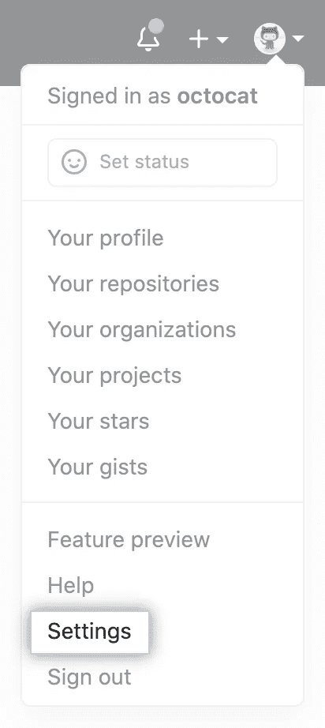
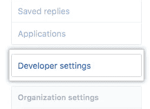
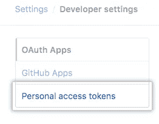
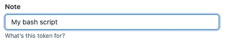
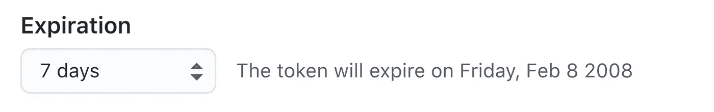
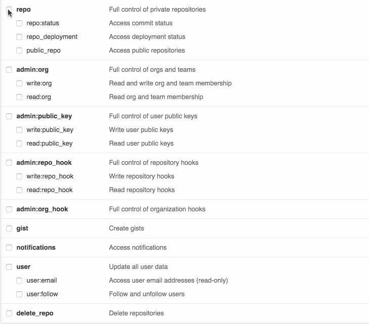
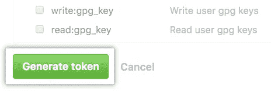

# 通过访问令牌使用 GitHub 设置您的电脑

> 原文：<https://levelup.gitconnected.com/setting-up-your-computer-with-github-via-access-tokens-1fb4e0dc1f67>

如果你和我一样，你可能还在使用旧的方式，通过密码用 GitHub 设置你的电脑。令我们沮丧的是(我认为是有效的原因，但我还没有调查)，截至 8 月 13 日(是的，一个星期五)，我们无法推动我们的代码，因为我们落后于时代。我想和你们分享我快速恢复代码的方法(因为我在网上看到的任何地方都过于复杂或者没有给出足够的信息)。

# 创建访问令牌

#1 — [验证您的电子邮件地址](https://docs.github.com/en/github/getting-started-with-github/verifying-your-email-address)，如果尚未验证的话。

#2 —在任一页面的右上角，点按您的个人资料照片，然后点按“设置”。

#3 —在左侧边栏中，单击开发者设置。

#4 —在左侧边栏中，单击个人访问令牌。

#5 —单击生成新令牌。

#6 —为您的令牌指定一个描述性名称。

#7 —要让您的令牌过期，请选择“过期”下拉菜单，然后单击默认值或使用日历选择器。

#8 —选择您想要授予此令牌的范围或权限。要使用令牌从命令行访问存储库，请选择 repo。

#9 —单击生成令牌。

#10 —将令牌存储在安全的地方。我个人使用密码管理器(LastPass)，但是你可以使用任何安全的方法。如果没什么事情的话，你可以把它写下来，塞到你的床垫下。

# 将您的代码投入使用

更新远程 URL `git remote set-url origin https://<token>@github.com/<git_url>`

拉一次:`git pull https://<token>@<git_url>.git`

(将代码压入存储库也将像上面一样工作，只是使用`push`而不是`pull`)

希望这至少能帮助一个人！如果您有任何问题，请随时联系我们！