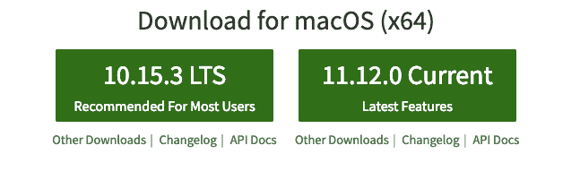

# 为 MEAN Stack 开发设置您的新 Mac

> 原文：<https://levelup.gitconnected.com/setting-up-your-new-mac-for-mean-stack-development-152aaf927133>


在本文中，我们将探讨如何正确设置和配置新的 Mac 来进行 MEAN Stack 开发。请注意，这只是众多方法中的一种，尽管这是一种屡试不爽的方法，对我来说效果很好。

# 基础知识:系统更新

这一部分虽然很明显，但实际上是设置系统最重要的部分之一。确保您的操作系统和其他系统软件更新到最新版本。设置过程的这一部分也相当简单。假设您运行的是 macOS Mojave，请按照以下步骤更新所有内容:

1.  从苹果()菜单中选取“系统偏好设置”，然后点按“软件更新”来检查更新。
2.  如果有更新，点击 ***立即更新*** 按钮进行安装。或者单击“更多信息”查看每个更新的详细信息，并选择要安装的特定更新。
3.  当“软件更新”提示您的 Mac 是最新的时，macOS 及其所有应用程序也是最新的。


若要在将来自动安装 macOS 更新，包括从 App Store 下载的应用程序，请选择“自动让我的 Mac 保持最新”。就我个人而言，我推荐这样做，因为即使你忘记了定期检查更新，它也会帮助你的系统保持最新。

# 节点时间

现在您的系统已经更新了，是时候准备好开发工具了，您需要的最基本的工具是 Node 和 Node package Manager(NPM)。MEAN(或者 MERN)中的“N”是 Javascript 运行时，我们所有的 Angular 和 React 应用程序都在其上运行。与此同时，NPM 是一个很好的工具，它将帮助你——你猜对了，改变你将需要和使用的众多软件包。有多种方法可以在您的系统上设置节点。但是首先要做的是检查您的系统是否已经安装了 Node。这可以通过以下方式完成:

1.  打开终端
2.  输入`node -v`
3.  如果您的系统上有 Node，它会显示版本
4.  使用`npm i -g npm`更新至最新版本。如果您得到一堆`checkPermissions`警告，您应该以超级用户的身份像这样运行命令:`sudo npm i -g npm`


假设您尚未安装节点，请继续使用以下方法之一:

**安装者**

如果你想去老学校，保持简单和整洁，这是你的方式。

1.  转到[https://nodejs.org/](https://nodejs.org/)
2.  在这个页面上，在正常情况下，你会看到安装程序的链接。这里有两个选项:当前版本和长期支持(LTS)版本。虽然两者大部分相同，但与 LTS 相比，当前版本将有一些更新的功能，尽管它可能有缺陷。
3.  下载安装程序，在 Finder 中找到它，并按照屏幕上的说明在您的系统上安装节点。
4.  完成后，再次运行`node -v`验证安装。你现在应该得到一个版本号。



**自制方式**

如果你更喜欢通过终端安装节点，那么家酿就是你需要的。正如他们的网站([https://brew.sh/](https://brew.sh/))所说，家酿是“macOS 缺失的软件包管理器”。基本上，它们使安装过程简单到只需运行一两个命令行。更重要的是，他们也不再要求我们在安装时运行的命令后面加上`sudo`。

首先，您需要安装 Homebrew，这可以通过在 Termnal 上运行以下命令来完成:

```
/usr/bin/ruby -e "$(curl -fsSL https://raw.githubusercontent.com/Homebrew/install/master/install)"
```


请注意，您可能必须安装 Xcode 才能确保 Homebrew 正常工作。所以如果系统提示你这么做，去 App Store 安装 Xcode。虽然我们可以很容易地通过终端安装 Node，但这看起来似乎要经历很多。但是作为一个开发者，迟早会有一天你会意识到安装自制软件是一个好的决定。

一旦家酿安装完成，所有你必须做的是运行以下命令安装节点:

```
brew install node
```

你就完了。为了确保万无一失，运行`node -v`来验证一切正常。

到目前为止，一切顺利吗？酷，越来越好了。

# 在数据库上

现在节点已经就位，让我们在您系统上设置 M，即 MongoDB。同样，您有两条路可走。

**用自制软件安装并运行 MongoDB**

*   **打开终端 app** ，输入`brew update`。
*   **更新家酿后**
*   **下载 Mongo 后，**创建“db”目录。这是 Mongo 数据文件将存在的地方。您可以通过运行`mkdir -p /data/db`在默认位置创建目录
*   **通过运行`sudo chown -R `id -un` /data/db`确保** `**/data/db**` **目录有正确的权限**
*   **运行 Mongo 守护进程**，在你的一个终端窗口运行`mongod`。这应该会启动 Mongo 服务器。
*   **运行 Mongo shell** ，Mongo 守护进程在一个终端中运行，在另一个终端窗口中键入`mongo`。这将运行 Mongo shell，这是一个访问 MongoDB 中数据的应用程序。
*   **退出 Mongo shell** 运行`quit()`
*   **停止 Mongo 守护进程**点击`ctrl-c`

**手动下载安装运行 MongoDB**

*   **去 MongoDB 网站的** [**下载栏目**](https://www.mongodb.org/downloads#production) 下载正确版本的 MongoDB。
*   **下载 Mongo 后**移动 gzipped tar 文件(文件扩展名为。您下载的 tgz)到您希望安装 Mongo 的文件夹中。在这种情况下，我们会说我们希望 Mongo 位于我们的主文件夹中，因此命令可能如下所示:

> `*mv mongodb-osx-x86_64-3.0.7.tgz ~/*`
> 
> `*cd Downloads*`
> 
> `*mv mongodb-osx-x86_64-3.0.7.tgz ~/*`

*   `cd ~/`
*   `tar -zxvf mongodb-osx-x86_64-3.0.7.tgz > mv mongodb-osx-x86_64-3.0.7 mongodb`
*   **创建 Mongo 存储数据的目录**，创建“db”目录。您可以通过运行`mkdir -p /data/db`在默认位置创建目录
*   **通过运行`sudo chown -R `id -un` /data/db`确保** `**/data/db**` **目录拥有正确的权限**
*   **运行 Mongo 守护进程**，在一个终端窗口运行`~/mongodb/bin/mongod`。这将启动 Mongo 服务器。
*   **运行 Mongo shell** ，在一个终端中运行 Mongo 守护进程，在另一个终端窗口中键入`~/mongodb/bin/mongo`。这将运行 Mongo shell，这是一个访问 MongoDB 中数据的应用程序。
*   **退出 Mongo shell** 运行`quit()`
*   **停止 Mongo 守护进程**点击`ctrl-c`

如果你完全做到了上面的任何一个，那么你的本地 MongoDb 应该是不错的。

# 然后是有棱角的

现在，我们已经有了一个更新的系统，节点，NPm 和 MongoDB 都设置好了。最后，是时候使用 Angular 了，这是一个强大的 javascript 框架，它完善了 MEAN 堆栈，使漂亮的单页面应用程序成为现实。

与我们目前所拥有的相比，安装 Angular 相当容易。打开终端并运行

```
sudo npm i -g @angular/cli
```

输入您的密码，等待过程完成，瞧！你已经准备好开始工作，或者更确切地说，开始发展。

# 别忘了快递

没有 E 的意思是什么？ [Express](https://expressjs.com/) 是 Node.js 框架，它使得 Node.js 成为过去几年中最受欢迎的服务器端语言之一。虽然 Express.js 本身是一个完整的博客，但我将在您的项目中设置 Express，就像在项目的节点目录中运行以下代码一样简单:

```
npm i express --save
```

# 还有几件事

虽然您现在已经准备好了所有的运行时和框架，但是还有更多的事情需要为开发建立一个系统。

**正文编辑**

这听起来可能很傻，但是对于任何开发人员来说，正确的文本编辑器可以设置正确的语气和情绪，让众所周知的创造性的汁液流动起来。的确，即使是像记事本(或 Notepad++这样微不足道的东西也能做到这一点。像 Sublime 或 Atom 这样的“进化路线更远”的替代品也是如此。但是我更喜欢 Visual Studio 代码。为什么？

*   这是可定制的
*   易于调试
*   扩展ˌ扩张
*   Git 集成
*   集成终端
*   智能感知
*   主题化和更多…

简而言之，到目前为止，VS 代码是编辑器所能得到的最好的代码。这是完全免费的，你可以从 https://code.visualstudio.com/的[得到](https://code.visualstudio.com/)

我将在另一篇文章中详细讨论 VS 代码。

**Chrome 开发工具**

作为一个已经在 Angular 上开发了一段时间的人，我可以直接告诉你，你会遇到很多我称之为“白屏错误”的问题——就像这样，你在浏览器上得到的将是一个空白的白色页面，不管你有多少行代码或多少个组件。通常情况下，这是由于 HTML 中出现了意外的结束标记，或者更糟糕的是，HTML 中出现了拼写错误。这就是控制台的救援之处——有点儿。它向您显示“模板解析错误:意外的结束标记”或类似的内容，允许我们相对容易地修复错误。

[Chrome DevTools](https://developers.google.com/web/tools/chrome-devtools/) 是一套直接内置在[谷歌 Chrome](https://www.google.com/chrome/) 浏览器中的网络开发工具。DevTools 可以帮助你即时编辑页面并快速诊断问题，最终帮助你更快地建立更好的网站。附带的主要工具有:

*   **设备模式**是一个一站式解决方案，用于评估您的网站或应用在不同设备上的响应能力
*   **元素面板**允许你根据组成页面的元素和样式来检查页面，让你修补和尝试一些东西，而不是为每一个小的变化更新代码并等待页面再次呈现
*   **控制台面板**，在这里您可以获得所有正在进行的进程的日志以及各种`console.log()`语句的输出
*   **网络面板**您可以在其中查看所有来自应用程序的请求和响应
*   还有更多…

所以你看，Safari 是一个很棒的浏览器，毫无疑问。但是如果你是一个开发者，并且没有使用 Googlr Chrome 和 Chrome DevTools，你会错过很多。

**节点门**

Node.js 开发真的很烦人，因为你对代码做的每一个小的改变，你都必须停止运行的服务器并重新启动它。这就是 nodemon 成为救命恩人的地方。


[nodemon](https://www.npmjs.com/package/nodemon) 是一个工具，通过在检测到目录中的文件更改时自动重启节点应用程序，帮助开发基于 node.js 的应用程序。

nodemon】不要求*对你的代码或开发方法做任何*额外的改变。nodemon 是`node`的替换包装器，在执行脚本时使用`nodemon`替换命令行上的单词`node`。您可以通过运行以下命令在系统上安装 nodemon:

```
npm i -g nodemon
```

好了，这些是你需要和/或应该在你的新 Mac 上运行 MEAN Stack development 的最基本的东西。记住——这就是我做事的方式。其他人可能会以不同的方式来做，这也可能是一个更好的方法。所以继续寻找更多的东西，保持领先。

开心的意思！

> 有兴趣和我就这个故事或 Angular、Typescript 和 Javascript 进行一对一的交谈吗？前往[雇佣作者](https://www.hiretheauthor.com/ashwinSathian)让我们连线！