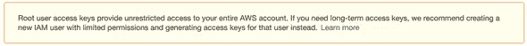
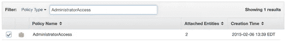
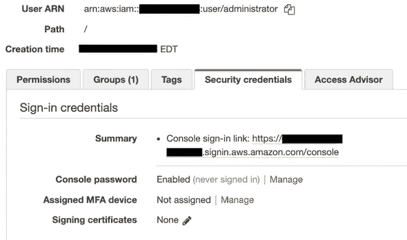
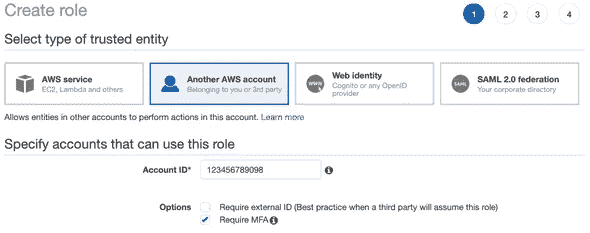
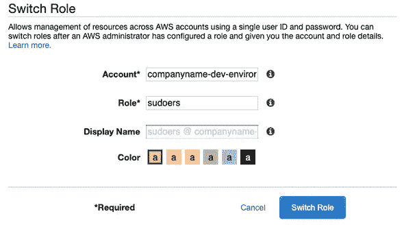

# 为 AWS 的成功做准备

> 原文：<https://levelup.gitconnected.com/setting-yourself-up-for-aws-success-5dd1d35993ea>

用户、组和角色，天啊！

照片由 [Unsplash](https://unsplash.com/s/photos/hacker?utm_source=unsplash&utm_medium=referral&utm_content=creditCopyText) 上的 [Fotis Fotopoulos](https://unsplash.com/@ffstop?utm_source=unsplash&utm_medium=referral&utm_content=creditCopyText) 拍摄

对于任何涉足云计算的人来说，AWS(亚马逊网络服务)很可能会出现在候选名单上。多年来，AWS 一直是世界上最大的云提供商，没有放缓的迹象。它们提供了对大量优秀功能的轻松访问，并使入门变得非常简单:你所需要的只是一个电子邮件地址和一张信用卡。但是，在创建新的 AWS 帐户时，您应该了解一些最佳实践。

# 金科玉律

1.  不要使用根帐户
2.  始终使用多因素身份认证
3.  使用最小权限

在本文中，我们将介绍创建帐户、保护帐户、然后创建用户和角色以授予所需权限的过程，而不会让我们暴露在过多的风险中。

# 获取密码管理器

在我们创建 AWS 帐户之前，让我们确保正确管理我们的密码。在这个时代，一切都是在线的，大多数人至少有 10 项服务需要密码。我们很多人都有超过 100 个密码。

*为了安全起见，你的每个密码都应该是不同的！*

显然，一个人不可能记住 100 多个密码，以及它们所用于的服务。这就是密码管理器发挥作用的地方。你，简单的人类，必须记住一个单一的，高质量的密码。此密码是打开其他高质量密码库的钥匙。

市场上有相当多的密码管理器，但我个人经验如下:

*   比特看守(免费)
*   [LastPass](https://www.lastpass.com/) (免费或付费)
*   [1 密码](https://1password.com/)(已支付)

你选哪个都没关系，只要你选了一个。根据我工作中需要的功能，我个人已经从 LastPass 升级到 BitWarden，然后最终升级到 1Password。

# 虚拟 MFA 设备:谷歌认证器

我们需要保护 AWS 帐户的下一个软件是虚拟多因素身份认证设备。这将为您提供基于时间的一次性密码，即每分钟都在变化的数字。

为了简单起见，我会推荐你安装 Google Authenticator。它是免费的，适用于 iOS 和 Android 系统。

如果您正在使用 1Password，也可以使用它来管理您的 MFA 令牌，而不需要安装 Authenticator。

如果您还没有创建 AWS 帐户，现在是时候了。只需导航到 [AWS 控制台](https://aws.amazon.com/)并按照帐户创建说明进行操作。

**确保使用强密码，并将 Root 帐户凭证保存到您的密码管理器中**

# Root 帐户配置

您注册的电子邮件地址被称为“根帐户”。这是你的 AWS 账单发送的地方。我们将在一些基本任务中使用 Root 帐户，然后最好不要再使用它。

Root 帐户是全能的，只应在必要时使用。所有其他操作都应该使用 IAM 用户和/或角色来完成。

# 在 Root 帐户上启用 MFA

登录到 Root 帐户时

1.  导航到[身份和访问管理(IAM)控制台](https://console.aws.amazon.com/iam/home)
2.  单击“在您的根帐户上激活 MFA”
3.  在多因素身份验证(MFA)部分，按照说明将 Google Authenticator 设置为 root 帐户的虚拟 MFA 设备

设置好 MFA 后，注销，然后重新登录到 Root 帐户，以确保它正常工作。

# 启用 CloudTrail

AWS CloudTrail 是一项在 AWS 帐户中记录所有“有趣”活动的服务。这可能包括修改用户、权限和资源的任何活动。当你的账户出现问题时，这是你弄清楚发生了什么、为什么、是谁的第一道防线。

如果没有 CloudTrail，您只能查看最近 90 天的管理事件。启用 one CloudTrail 将允许您查看更早的事件。您只需支付 S3 存储成本，这对于正常活动来说是非常少的(每月几美分)。

1.  导航到服务->CloudTrail，为您的帐户启用 CloudTrail
2.  选择 S3 桶，或为您的踪迹创建一个新的。S3 存储桶必须具有全球唯一的名称，因此我建议您根据您的帐户名、地区和服务选择一个名称(即“my-demo-account-us-east 1-cloud trail”)

# 创建 IAM 组

IAM 组允许您将权限集分配给不同的 IAM 用户。在本例中，我们将创建两个组:管理员和开发人员

## 管理员组

Administrators 组将拥有对 AWS 帐户的完全访问权限，并且应该仅限于负责创建其他用户并分配其权限的用户。

1.  导航到 [IAM 控制台](https://console.aws.amazon.com/iam/home)，并选择“组”
2.  设置组名:Administrators，然后单击 Next
3.  在附加策略上，搜索“AdministratorAccess”，选中策略旁边的复选框，然后单击“后续步骤”

查看群组信息，然后点击“创建群组”

# 创建您的“管理员”用户

我们将创建一个管理 IAM 用户，然后注销我们的 Root 帐户。

1.  在 IAM 控制台中，导航到用户，然后单击“添加用户”
2.  将用户称为“管理员”，并为其分配“AWS 管理控制台访问权限”。不要将其指定为“编程访问”，因为这将生成一个密钥对，可用于滥用您的帐户(即，锁定您和/或花费您大量金钱)。
3.  为简单起见，您可以在此时分配一个自定义密码，并取消选择“用户下次登录时必须创建一个新密码”
4.  单击“下一步:权限”并将用户添加到“管理员”组
5.  根据需要添加任何标签
6.  查看，然后点击“创建用户”
7.  记下 AWS 管理控制台的签名 URL(即[https://123456789098.signin.aws.amazon.com/console](https://123456789098.signin.aws.amazon.com/console))
8.  下载。csv 文件
9.  打开 credentials.csv 文件，将新用户和 URL 添加到您的密码管理器中

## 向您的“管理员”用户添加 MFA

在我们结束 Root 帐户之前，我们将把 MFA 添加到新的管理员用户帐户中

1.  在 IAM 用户中，单击“管理员”用户
2.  导航到“安全凭证”，然后单击“分配的 MFA 设备”旁边的“管理”

按照步骤将 Google Authenticator 添加为虚拟 MFA 设备

**至此，我们完成了基本的账户设置。注销 Root 账户**

现在我们已经完成了基本的帐户设置，我们将为日常操作添加一些额外的组、角色和用户。

**使用您的“管理员”帐户登录，然后继续进行**

# 自定义帐户签名链接

与其使用账号，不如给账户取一个可读的别名

1.  导航至 IAM 仪表板
2.  单击 IAM 用户登录链接旁边的“定制”
3.  为您的帐户取一个易于记忆的名称，描述该帐户的预期用途(如“公司名称-开发环境”)

# 创建您的“开发人员”小组

开发人员需要能够创建和管理资源，但不需要创建新用户或修改权限。

1.  在 IAM 组控制台中，创建另一个名为“Developers”的组
2.  搜索并分配“PowerUserAccess”策略
3.  查看，然后点击“创建群组”

# 创建“sudoers”角色

对于开发人员需要提升权限的情况，我们将给予他们临时转换角色的能力。如果我们的一个用户在启用 MFA 的情况下登录，他们将能够临时切换到具有提升权限的角色。这将记录在我们的 CloudTrail 中，以便我们可以在必要时关注任何此类活动。

1.  记下您的 AWS 帐户 Id。你可以通过点击你的用户名，然后点击“我的账户”找到它
2.  导航到 IAM 角色控制台
3.  点击“创建角色”，然后选择“另一个 AWS 帐户”
4.  填写您的帐户 ID 并选择“要求 MFA”

1.  单击“下一步:权限”并将“管理员访问权限”附加到该角色
2.  如果需要，添加标签，然后单击“下一步:查看”
3.  将角色命名为“sudoers ”,并检查权限。唯一的“可信实体”应该是您自己的帐户 ID
4.  创建角色

# 创建“开发人员”用户

在 IAM 用户控制台中，为团队中的每个开发人员创建用户(即使只有您)。

1.  添加用户
2.  启用“编程访问”和“AWS 管理控制台访问”
3.  分配密码或让系统为用户生成一个密码
4.  决定下次登录时是否必须更改密码
5.  在“权限”页面上，将用户分配到“开发人员”组
6.  标记、检查，然后创建用户
7.  下载。csv 并将其提供给开发人员。让他们将信息添加到密码管理器中

# 为用户分配 MFA

在允许开发人员将其角色更改为“sudoers”之前，他们必须在其帐户上启用 MFA

1.  让用户在他们的移动设备上安装谷歌认证器
2.  为每个开发人员启用 MFA 时，请遵循与“管理员”用户相同的步骤。用户必须使用自己的验证器应用程序扫描二维码，然后在登录时使用提供的一次性密码

# 切换到“sudoers”

一旦用户使用 MFA 登录，他们将能够切换到“sudoers”角色来临时提升他们的权限

1.  单击 AWS 管理控制台右上角的用户名(即“my user @ company name-dev-environment”)
2.  选择“切换角色”
3.  在 Account 字段中，使用您之前创建的别名(companyname-dev-environment)
4.  在“角色”字段中，输入“sudoers”
5.  保留显示名称字段的默认值

单击“切换角色”承担“sudoers”角色

注意:对于 sudoers 角色，您只需输入一次数据。之后，当用户点击他们的用户名时，它将出现在用户的角色历史中

# 返回普通用户

当用户切换到“sudoers”时，他们可以通过点击“sudoers @ company name-dev-environment”，然后选择“返回用户名”来切换回来

本文中的概念可以扩展到包括其他组和角色，以及特定任务所需的权限。始终努力使用权限尽可能少的帐户/角色，对所有 AWS 访问使用多因素身份验证，避免使用 Root 帐户支付 AWS 账单以外的任何事情。

*最初发表于*[*【https://chrisrouffer.com】*](https://crouffer.github.io/aws-account-creation/)*。*