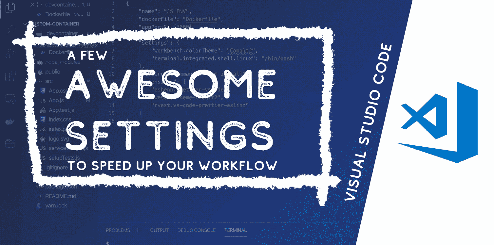
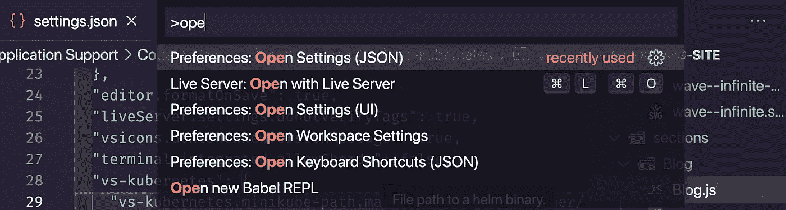
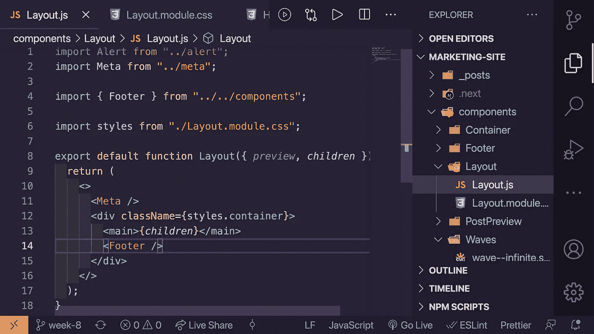
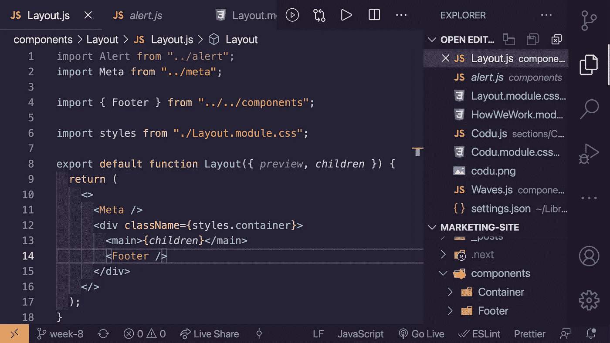
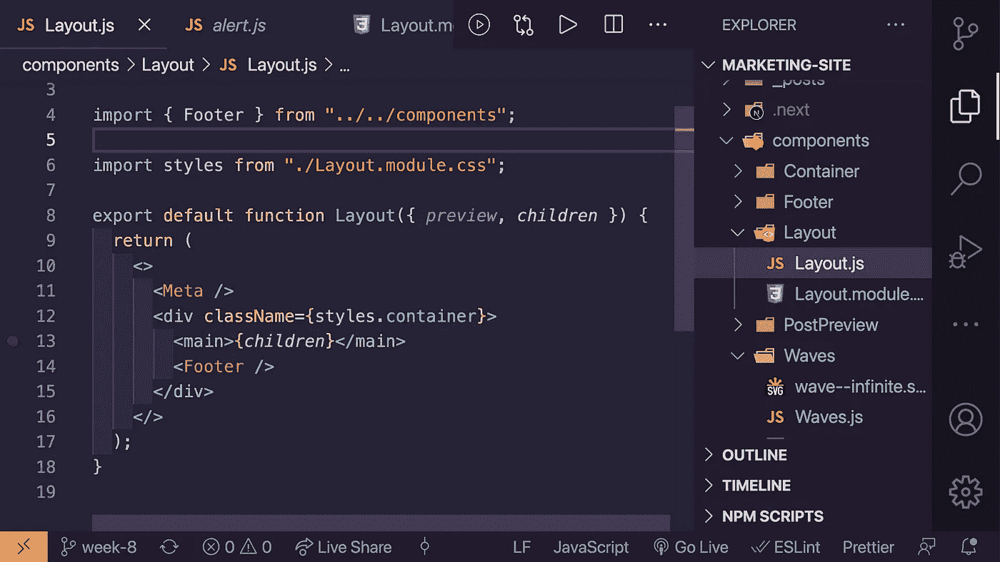
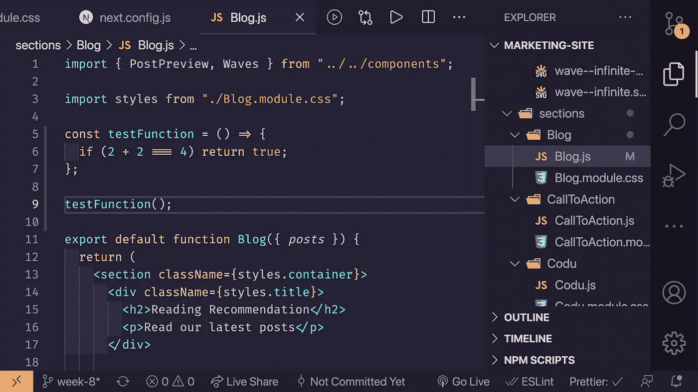

# 一些提高 Visual Studio 代码生产率的设置

> 原文：<https://levelup.gitconnected.com/settings-to-boost-productivity-in-visual-studio-code-a65fce760cf>



使用 Visual Studio 代码加速工作流的一些很棒的设置

## 给你的工作流程添加一些奇怪但不错的额外功能

这个短披肩只是为了展示我最近添加的一些我一直喜欢的设置，并帮助我更长时间地工作。我有很多自定义设置，比如保存格式和自定义主题，但我在这里列出的几个稍微不太传统，但对我的工作流程有很大的影响。

如果你想看我解释更多关于设置和为什么我喜欢他们，你可以在这里看视频或滚动阅读。

使用 Visual Studio 代码加速工作流的一些很棒的设置

我正在更改的设置都可以在 JSON 设置中找到。您可以通过几种方式找到这一点:

*   可以在菜单中找到，方法是选择:文件>首选项>设置
*   ⇧⌘P /ctrl⇧P 打开你的选项，开始输入“打开设置”并选择“打开设置(JSON)”选项。



显示设置的搜索

## 向右移动侧边栏

这个设置肯定是最大的改变，所以请听我说…通过将侧边栏放在右边，您的代码不会在每次打开侧边栏时从左边移入，这样您可以保持更长时间的关注。作为开发人员，我们知道我们是多么容易被分心的事物所破坏，所以通过将滚动条向右移动，我们的代码将会一直在屏幕上的同一个位置，很好地隐藏在右边。

```
"workbench.sideBar.location": "right"
```



在右侧显示侧栏的 Visual Studio

## 禁用小地图

小地图占据了你的编辑器屏幕的一小部分，所以我发现通过禁用它，我可以看到更多的代码和更长时间的关注。

```
"editor.minimap.enabled": false
```



显示禁用小地图的 Visual Studio

## 禁用打开的编辑器

默认情况下，当您在 VS 代码编辑器中单击并打开文件时，您会得到两个浏览器，一个是您的普通浏览器，另一个是打开的文件。我发现自己经常在打开的文件浏览器中寻找一些东西，然后才意识到我在错误的浏览器中，所以禁用它帮助我节省了一些时间(并感觉不那么愚蠢)。

```
"explorer.openEditors.visible": 0
```



显示禁用打开的编辑器资源管理器的 Visual Studio

## 启用字体连字

这肯定是一件精神上的事情，但我总是喜欢看到字体连字来表明我已经正确地或如预期地键入了一些东西。当你在 JS 中弄乱了一个箭头函数或者一个三重等号的时候，当你安装了字体连字的时候，这种情况会更加明显。这使我们不必尝试和思考符号的组合意味着什么，并且当我们正确键入组合时，可以获得一个清晰的新符号，这反过来又稍微降低了我们的认知负荷。



显示启用了连字的 Visual Studio

首先你需要在你的系统上安装一个有连字的字体。我用的是 [Fira 代码](https://github.com/tonsky/FiraCode/tree/master/distr/ttf)，你可以在这里得到[(也可以阅读如何安装它们)。对于 Mac 来说，就像下载`.tff`文件然后点击安装一样简单。安装完成后，你只需要将字体系列添加到编辑器中，并启用连字。](https://github.com/tonsky/FiraCode/wiki/Installing)

```
"editor.fontFamily": "Fira Code", 
"editor.fontLigatures": true
```

如果您想使用不同的字体系列，这里有几个备选方案:

[](https://www.slant.co/topics/5611/~monospace-programming-fonts-with-ligatures) [## 截至 2021 年，Slant - 11 最佳等宽连字编程字体

### Fira Code、Hasklig 和 Iosevka 可能是 11 个选项中的最佳选择。“许多连写……

www.slant.co](https://www.slant.co/topics/5611/~monospace-programming-fonts-with-ligatures) 

随着时间的推移，这些小小的改变让我的工作更加专注和一致。我希望它也能帮助你！

要复制并粘贴所有这些设置:

```
"workbench.sideBar.location": "right","editor.minimap.enabled": false,"explorer.openEditors.visible": 0,"editor.fontFamily": "Fira Code","editor.fontLigatures": true,
```

直到下一个，编码快乐！

[在 Twitter 上关注我](https://twitter.com/nialljoemaher)

订阅 [Codú社区](https://www.youtube.com/c/Cod%C3%BACommunity)