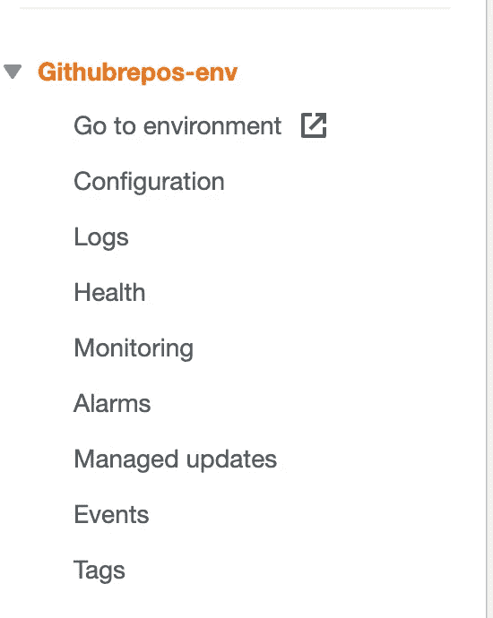

# 设置 CI/CD 管道以将 Node.js 应用程序部署到 AWS

> 原文：<https://levelup.gitconnected.com/setup-a-ci-cd-pipeline-to-deploy-node-js-application-to-aws-95635b15675b>

当代码被推送到存储库时，自动将更改部署到 AWS


照片由[凯特琳·贝克](https://unsplash.com/@kaitlynbaker?utm_source=medium&utm_medium=referral)在 [Unsplash](https://unsplash.com?utm_source=medium&utm_medium=referral) 上拍摄

在本文中，我们将在 AWS 上建立一个环境，将代码推送到 GitHub 存储库，并将使用`Express`服务器创建的`Node.js`应用程序自动部署到 AWS

## 我们开始吧

**为节点设置弹性豆茎**

1.创建一个 Github 存储库，并将您的代码推送到该存储库

2.在此导航至 AWS 控制台

3.在搜索框中输入`Elastic Beanstalk`，并从下拉菜单中选择


弹性豆茎

4.在下一个屏幕中，点击`Create Application`按钮


创建应用程序

5.给应用程序起个名字


提供应用程序的名称

6.向下滚动，从平台中选择`Node.js`


选择平台

7.保持默认选择值并点击`Create application`按钮


保留默认设置

8.这将需要几分钟时间。所以要有耐心。

9.完成后，您将看到以下屏幕


成功屏幕

10.记下显示的`Environment name`。这种情况下是`Githubrepos-env`。我们将在设置代码管道部分使用相同的名称

**设置代码管道:**

1.在搜索框中输入`CodePipeline`并从下拉菜单中选择


代码管道

2.在下一个屏幕中，点击`Create pipeline`按钮


3.输入特定于应用程序的管道名称，并保持默认设置，然后单击`Next`按钮


提供应用程序名称

4.选择您拥有项目源代码的源代码提供者。我将选择`GitHub`


代码源

5.点击`Connect to GitHub`按钮


连接到 github

6.在下一个屏幕中，选择要部署的 GitHub 存储库和分支名称，然后单击`Next`按钮


选择 Github 存储库

7.在下一个屏幕中，选择`Build provider`，在这种情况下，选择`AWS CodeBuild.`不要为项目名称输入任何值


选择生成提供程序

8.点击`Add Environment variable`按钮，添加一个值为`8081` 的`PORT`变量，然后点击`Skip build stage`按钮


9.当要求确认时，单击跳过


跳过构建阶段

10.对于`Deploy provider`，从下拉菜单中选择`AWS Elastic Beanstalk`


选择部署提供程序

11.给出一些应用程序名称，对于环境名称，选择我在`step 10`中告诉您要记住的环境名称。


添加部署阶段

12.点击`Next`按钮。在查看部分，向下滚动并点击`Create pipeline`按钮


审查屏幕


创建管道

13.现在，AWS 将开始从`Github`提取您的代码，并将其部署到 AWS


Github 代码拉取进度


部署进度

14.一旦部署完成，转到您的弹性豆茎页面[这里](https://console.aws.amazon.com/elasticbeanstalk/home)并选择您的环境

15.在左侧，你会看到一个链接，上面写着`“Go to Environment”`。点击它，您将看到您的应用程序正在运行



转到环境链接


实时应用

16.现在，当您对代码进行任何更改并将其推送到您的`Github`存储库时，`AWS CodePipeline`将自动检测并将您的更改部署到 AWS


代码推送的部署进度

恭喜你！您已经成功地将 Node.js 应用程序部署到 AWS Elastic Beanstalk

**注意事项:**

*   当我们将更改部署到`Elastic Beanstalk`时，AWS 使用的`Nginx`服务器将始终在默认端口`8081`上为我们的应用程序提供服务。因此，我们在`index.js`文件中将其定义为后备端口

```
const PORT = process.env.PORT || 8081;app.listen(PORT, () => { 
 console.log(`server started on port ${PORT}`);
});
```

*   如果出现错误，应用程序无法部署，您可能会得到`502 bad gateway`错误。要了解错误是什么，您可以到您的 Elastic Beanstalk 环境[这里](https://console.aws.amazon.com/elasticbeanstalk/home)并点击如下所示的`Logs`菜单


日志菜单

*   然后点击`Request Logs`按钮，选择`Last 100 Lines`选项


日志选项

*   然后下载文件并检查错误，然后尝试修复错误


下载日志选项

*   要编辑/添加环境变量，点击`Configurations`菜单，点击`Software`类别前的`Edit`按钮，然后向下滚动到`Environment properties`部分。


添加/编辑环境变量弹性豆茎

*   输入环境变量的`name`和`value`，点击`Apply`按钮

**注意:**在日志文件中，日志将按降序排列，因此最新的日志将显示在文件的顶部。

您可以在这里找到这个应用程序[的完整 GitHub 源代码](https://github.com/myogeshchavan97/github-repos-nodejs-api)

今天到此为止。我希望你学到了新东西。

**别忘了订阅我的每周时事通讯，里面有惊人的技巧、诀窍和文章，直接在这里的收件箱** [**订阅。**](https://yogeshchavan.dev/)

[](https://skilled.dev) [## 编写面试问题

### 一个完整的平台，在这里我会教你找到下一份工作所需的一切，以及…

技术开发](https://skilled.dev)