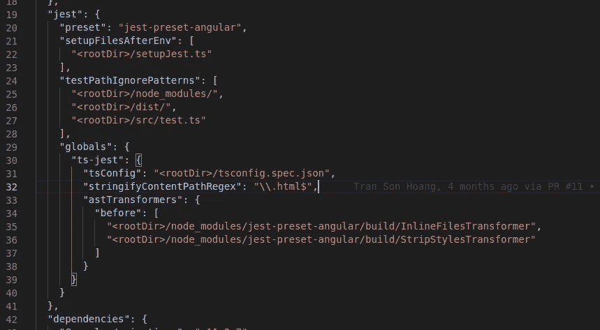
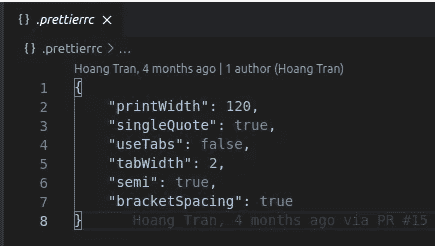
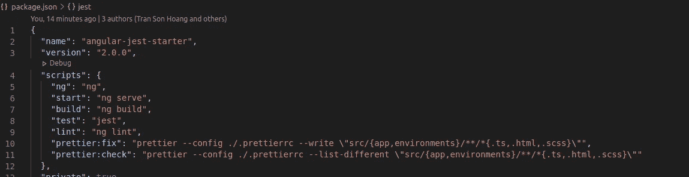
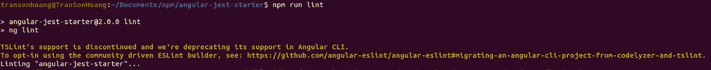
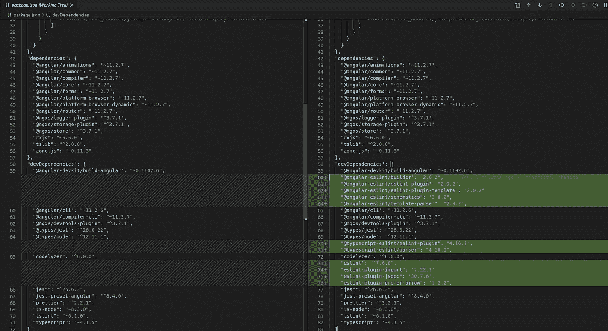
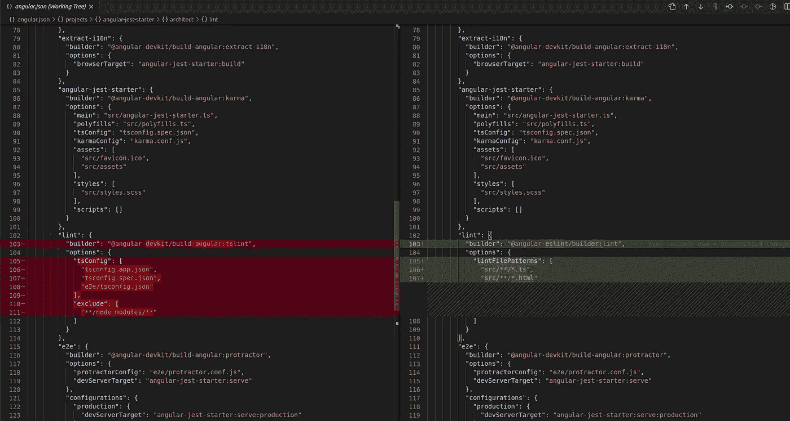

# 设置一个好的角度启动项目

> 原文：<https://levelup.gitconnected.com/setup-a-good-angular-starter-project-3504c994d7f7>

## 有角的

## 了解如何通过添加 Jest、State Management、appeller 和 Eslint 来设置项目。


[萨布里·图兹库](https://unsplash.com/@sabrituzcu?utm_source=unsplash&utm_medium=referral&utm_content=creditCopyText)在 [Unsplash](https://unsplash.com/s/photos/coffee?utm_source=unsplash&utm_medium=referral&utm_content=creditCopyText) 拍摄的照片

在这篇文章中，我将分享一个我去年创建的 [Angular starter 项目](https://github.com/hoangtranson/angular-jest-starter)，我前几天刚刚把它移植到 Angular 11 上。

[](https://github.com/hoangtranson/angular-jest-starter) [## 黄川/angular-jest-starter

### 此项目是使用 Angular CLI 版本 11.0.3 生成的。git 克隆…

github.com](https://github.com/hoangtranson/angular-jest-starter) 

# 目录

1.  设置笑话
2.  设置 Ngxs 状态管理
3.  设置更漂亮
4.  从 Angular-cli 重新配置 Eslint

# 设置笑话

比起 Angular-cli 生成的单元测试，我更喜欢使用 [Jest](https://jestjs.io/docs/getting-started) 来编写 Angular 应用程序的单元测试。

所以，去年我写了一篇关于[为 Angular 8 在 Angular 项目](https://itnext.io/how-i-do-configure-jest-to-test-my-angular-8-project-2bd84a21d725)中设置 Jest 的文章。

[](https://itnext.io/how-i-do-configure-jest-to-test-my-angular-8-project-2bd84a21d725) [## 我如何配置 Jest 来测试我的 Angular 8 项目

### 指导端到端地在 Angular 上设置 Jest，并移除旧的测试框架。

itnext.io](https://itnext.io/how-i-do-configure-jest-to-test-my-angular-8-project-2bd84a21d725) 

与上面的指南相比，现在在 **Angular 11** 上配置 Jest 没有太大的不同。

唯一不同的是`package.json`处的配置`astTransformers`有一点改变。



package.json 上的 jest 配置

# 设置 Ngxs 状态管理

要安装 Ngxs，我们需要做两件主要的事情，[这里的](https://www.ngxs.io/getting-started/installation)是安装指南。在这个路径中，我将分享我是如何设置它的。

*注意:不同的开发者有不同的安装和构造源代码的方法，不需要像我一样完全一样。*

## 安装 Ngxs 插件

```
npm i @ngxs/logger-plugin @ngxs/storage-plugin @ngxs/store
npm i -D @ngxs/devtools-plugin
```

## 创建商店模块

运行`ng g module store`创建一个商店模块，并在里面设置关于状态管理的一切。

[https://github . com/Hoang transon/angular-jest-starter/blob/master/src/app/store/store . module . ts](https://github.com/hoangtranson/angular-jest-starter/blob/master/src/app/store/store.module.ts)

```
export class StoreModule {}
```

# 设置更漂亮

为什么我们需要更漂亮的[？我们需要更漂亮的东西来帮助我们格式化代码。](https://prettier.io/)

有几种方法可以设置得更漂亮。我将指引一条最简单的路，这条路不会花太多时间。

首先，需要运行`npm i -D prettier`来安装这个库。

其次，创建`.prettierrc`,在那里添加您的格式规则。



。包含一些格式规则的 prettierrc 文件

最后，将脚本添加到`package.json`文件中，检查格式错误并修复它们。

```
"prettier:fix": "prettier --config ./.prettierrc --write \"src/{app,environments}/**/*{.ts,.html,.scss}\"","prettier:check": "prettier --config ./.prettierrc --list-different \"src/{app,environments}/**/*{.ts,.html,.scss}\""
```

上面的脚本会检查`src`里面扩展名为`.ts`、`.html`、`.scss`的文件。如果我们有一个由`ng g library`命令生成的`projects`文件夹，我们也可以将它添加到这个脚本中。



在 package.json 文件中添加检查更漂亮的错误并修复脚本

# 从 Angular-cli 重新配置 Eslint

目前，当我们运行`npm run lint`时，我们会在终端中看到这个警告。



TSLint 的支持已经停止，我们在 Angular CLI 中取消了对它的支持。

我们需要在这里运行两个命令行来将 eslint 添加到 Angular 项目中:

1.  第一步是运行原理图，将`@angular-eslint`添加到您的项目中。

```
ng add @angular-eslint/schematics
```

这将为您安装所有相关包的最新版本，并将它们添加到您的`package.json`的`devDependencies`中。



将 angular-eslint 添加到 angular 项目后的相关包

2.接下来要做的事情是考虑要迁移哪个“项目”来使用 ESLint。

```
ng g @angular-eslint/schematics:convert-tslint-to-eslint {{YOUR_PROJECT_NAME_GOES_HERE}}// for example
ng g @angular-eslint/schematics:convert-tslint-to-eslint angular-jest-starter
```

这将创建`.eslintrc.json`并更新项目中的`angular.json`文件。



迁移后使用 ESLint 的 angular.json 文件

我希望这篇文章对你有用！可以跟着我上[媒](https://medium.com/@transonhoang?source=post_page---------------------------)。我也在推特上。欢迎在下面的评论中留下任何问题。我很乐意帮忙！