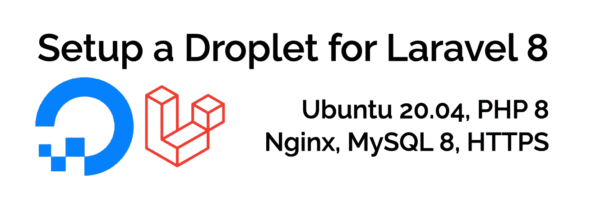
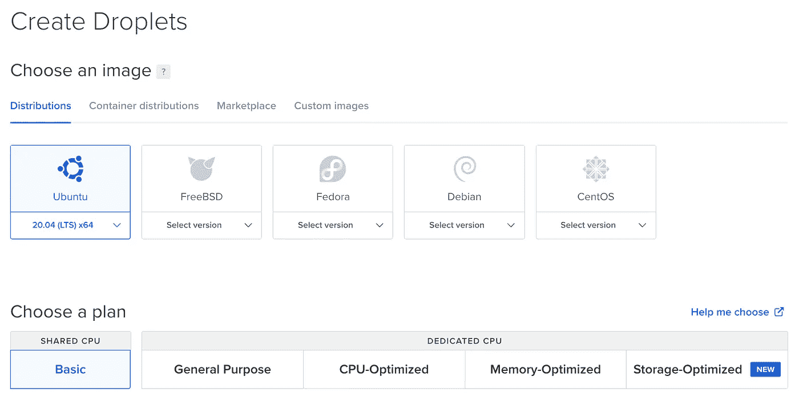
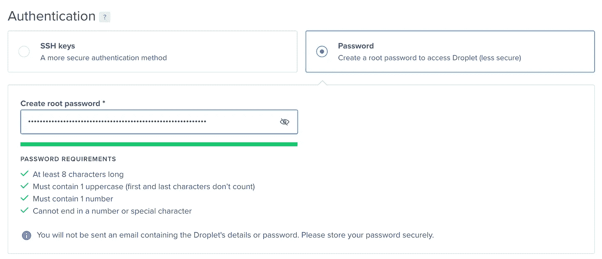
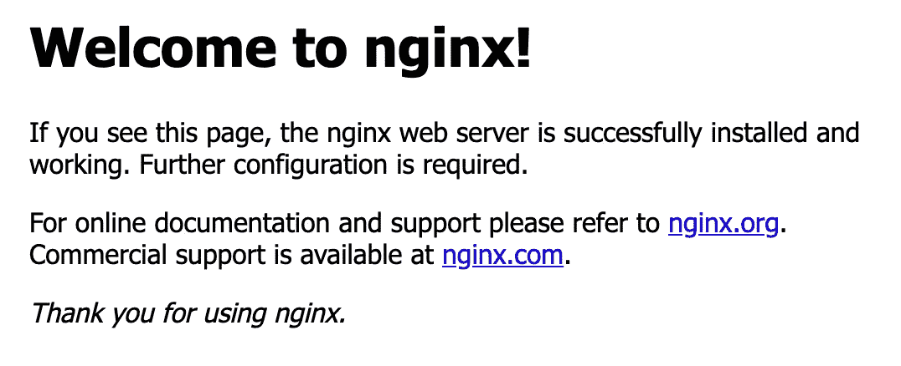
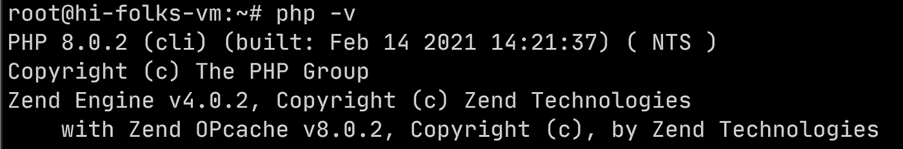

# 用 Ubuntu 20.04、PHP8、Nginx 和 MySql 为 Laravel 8 设置一个虚拟机

> 原文：<https://levelup.gitconnected.com/setup-a-vm-for-laravel-8-with-ubuntu-20-04-php8-nginx-and-mysql-4b709de88154>



为 Laravel 8 设置 Droplet

我的目标是用 Ubuntu 20.04 LTS、PHP8、Nginx 和 MySql 建立一个 GNU/Linux VM 来服务 Laravel 8 应用程序。对于 Web 服务器，我将使用 Nginx，所以我需要 php-fpm。

有一些方法可以实现这一点，您可以考虑使用:

*   像 Forge([https://forge.laravel.com/](https://forge.laravel.com/))这种帮你维护服务器的软件；
*   一种无服务器的方法，使用 Vapor(【https://vapor.laravel.com/】)；
*   像数字海洋应用平台(【https://www.digitalocean.com/products/app-platform/】T4)这样的应用平台
*   DigitalOcean Droplets 提供的一个 Linux 虚拟机。

对于我的辅助项目，我通常使用数字海洋液滴，因为:

*   这是一个“手动”的方法，但是我的一个目标是，当我在边项目上工作时，学习和理解“引擎盖下”的过程/工具/配置；
*   成本是可以预测的；
*   我喜欢在我的副业上动手。

对于我的工作项目，我通常选择“管理的”解决方案。

关于自动化的思考。我是“自动化一切”的粉丝。但在自动化流程、设置或工作流之前，我认为我们需要弄清楚幕后发生了什么。

# 设置 Droplet

正如我之前提到的，我将使用 DigitalOcean 的一滴。droplet 本质上是一个带有操作系统的虚拟机，您可以在其中添加软件堆栈，以及操作系统提供的工具和应用程序。在我们的例子中，我将选择 Ubuntu 20.04，所以我将使用 Apt 添加软件。创建 Droplet 时，您可以选择一些参数，如操作系统、虚拟机大小(CPU/内存)、数据中心位置等



创建一个水滴，你需要选择一些选项

最便宜的配置(但性能较差):

*   选择图像:发行版 Ubuntu 20.04 LTS
*   选择计划:共享 CPU 基本版—每月 5 美元(1 GB、1 个 CPU、25 GB 固态硬盘、1000 GB 传输)
*   选择一个数据中心区域:法兰克福 1(离意大利最近)，如果你想进行速度测试，你可以使用这个工具:[http://speedtest-fra1.digitalocean.com/](http://speedtest-fra1.digitalocean.com/)
*   身份验证，如果您能够上传您的公钥，您可以选择 SSH 密钥，否则您可以使用 root 用户的经典方式登录/密码。



身份验证方法。我的建议是使用 SSH 密钥，而不是非常长的复杂密码。

创建 Droplet 后，您可以看到新的 IPv4 地址。

这对于访问您的新虚拟机非常重要。

# 你的第一次访问

如果您在创建 droplet 时选择了 ssh 密钥验证方法而不是登录/密码，我建议您在您的机器中创建一个 SSH 别名，以便有一个快捷方式来定义“SSH”用户名、IP 地址和用于访问您的虚拟机的密钥。

在这种情况下在您的 *~/中。ssh/config，*添加这些行:

```
host <alias_name>
    HostName <ip_address>
    User <user_name>
    IdentityFile <key_file>
```

其中:

*   <alias_name>是你要启动 ssh 的时候用的名字；</alias_name>
*   <ip_address>水滴提供的 IP 地址；</ip_address>
*   <user_name>用户，对于初始配置使用*根*即可。在设置过程中，我们将创建一个“无根”用户；</user_name>
*   <key_file>ssh 密钥文件，在我的例子中是 *~/。ssh/id _ RSA _ side project _ dev*；</key_file>

要访问您的 Droplet，您可以使用 ssh:

```
ssh <alias_name>
```

第一次访问时，会提示您一个关于创建 ECDSA 密钥指纹的问题。选择“是”接受它。

如果您选择登录/密码方法而不是 SSH 密钥，您可以使用 ssh root@ <ip_address>来访问您的虚拟机。</ip_address>

# 升级您的系统软件包

首先我建议你用 Apt 命令升级你的包(我们用的是 Ubuntu 所以有 Apt)。第一次访问时，您使用的是“root”用户，所以现在您不需要使用 sudo。

```
apt-get update
apt-get upgrade
```

现在，我们可以开始安装所有需要的软件包:

*   Nginx
*   PHP 8 (fpm)(以及 Laravel 8 需要的模块)
*   MySql 8

您正在安装一些服务，所以我的建议是也配置防火墙。

# 安装 Nginx

```
apt-get install nginx
```

可选:如果你想托管多个域(或子域),我建议为你想用 Nginx 服务的每个子域创建一个目录。反正默认目录是:/var/www/html/。所以，安装 nginx 后你尝试去 tu url http:// <ip_address>，你会看到 Nginx 提供的默认 html 文件来自/var/www/html 目录。</ip_address>



Nginx 全新安装的欢迎页面

我们将安装 Laravel，因此我们需要将 *public/* 设置为文档根。

```
mkdir -p /var/www/mydomain/htdocs/public
```

在这种情况下:

*   /var/www/mydomain/htdocs 将是您的 Laravel 应用程序被复制到的目录；
*   /var/www/my domain/htdocs/public 将是文档根。

# 安装 PHP 8

我们刚刚安装了搭载 PHP 7.4 的 Ubuntu 20.04。在安装 PHP 之前，我们需要添加一个存储库，以便有机会安装 PHP 8。所以我们将从 *ondrej/php* PPA 库安装 PHP。要启用回购和更新包:

```
apt install software-properties-common
add-apt-repository ppa:ondrej/php
apt update
apt upgrade
```

现在你可以安装 PHP 8:

```
apt install php8.0-fpm
```

要测试您是否有 PHP 8:

```
php -v
```



你的新 PHP 8

要检查 PHP-fpm 是否启动并运行:

```
systemctl status php8.0-fpm
```

现在我们可以为您的 Laravel 8 应用程序安装所有 PHP 依赖项了:

```
apt-get install php8.0-mysql php8.0-mbstring php8.0-xml php8.0-bcmath
```

# 配置 Nginx 和 PHP 8 fpm

现在您使用的是根用户，这对于初始设置来说很好。我建议创建一个非特权用户来登录系统，并访问部署 Laravel 应用程序的目录。

```
adduser deploy
usermod -aG www-data deploy
chown -R deploy:www-data /var/www/mydomain/
```

现在让我们关注 Nginx 配置，我们可以从 Nginx 的默认配置开始，然后我们将对其进行自定义:

```
cp /etc/nginx/sites-available/default /etc/nginx/sites-available/mydomain
```

按照以下示例编辑新文件:

然后，您需要创建一个符号链接来激活新的配置(看看站点-可用与站点-启用):

```
ln -s /etc/nginx/sites-available/mydomain /etc/nginx/sites-enabled/
```

如果您想检查配置的语法:

```
nginx -t
```

要重启 Nginx 并加载新配置:

```
service nginx restart
```

# 安装数据库

我们将安装 MySql server 8:

```
apt install mysql-server
mysql_secure_installation
```

在这个脚本的执行过程中，它会要求您键入根数据库密码。执行完成后，尝试访问您的数据库服务器:

```
mysql -u root -p
```

并键入新密码以访问数据库管理控制台。在数据库管理控制台中:

*   创建数据库*db _ laravel 8*；
*   创建用户，使用密码 *somepassword* 访问数据库( *userdb*
*   向新用户授予适当的权限；

```
CREATE DATABASE db_laravel8;
CREATE USER 'userdb'@'localhost' IDENTIFIED BY 'somepassword';
GRANT ALL PRIVILEGES ON * . * TO 'userdb'@'localhost';
FLUSH PRIVILEGES;
```

# 设置防火墙

仅打开 HTTP 和 SSH 端口:

```
ufw allow 'Nginx HTTP'
ufw allow 'OpenSSH'
```

激活防火墙:

```
ufw enable
```

最后检查状态:

```
ufw status
```

输出应该是这样的:

```
Status: active
To Action From
 — — — — — — 
Nginx HTTP ALLOW Anywhere
OpenSSH ALLOW Anywhere
Nginx HTTP (v6) ALLOW Anywhere (v6)
OpenSSH (v6) ALLOW Anywhere (v6)
```

# 设置 HTTPS

对于辅助项目，我通常使用[https://letsencrypt.org/](https://letsencrypt.org/)来获得证书，以启用 HTTPS 协议。

作为 root 用户，要安装安装证书的工具，请运行:

```
apt-get install certbot python3-certbot-nginx
```

如果需要为主机名*host.mydomain.com*安装证书:

```
certbot --nginx -d host.mydomain.com
```

该命令还将更新 Nginx 配置文件(启用指令*监听端口 443 上的*并加载刚刚创建的证书)。

您还需要打开 HTTPS 端口的防火墙:

```
ufw allow 'Nginx HTTPS'
```

# 包裹

如果您遵循这些步骤，我们将:

*   用 LTS 的 Ubuntu 20.04 在数字海洋上创建了一个虚拟机
*   安装 Nginx 通过 HTTP 提供文件服务；
*   安装了 PHP8 和 Laravel 8 需要的模块
*   安装了 MySql 8 服务器；
*   配置 Nginx 以服务 PHP 文件和一个我们可以复制 Laravel 文件的特定目录；
*   配置了一个非特权用户来访问虚拟机；
*   配置一个数据库用户，并创建一个新的数据库来使用 Laravel 应用程序(记得更新您的。带有 DB_NAME、DB_USER、DB_PASSWORD 的 env 文件)；
*   设置 HTTPS 以服务于 Laravel 应用。

现在，您可以在/var/www/mydomain/htdocs 中部署您的应用程序。

请随意留下评论和反馈，我可以改进这个教程(或者我的英语；) )