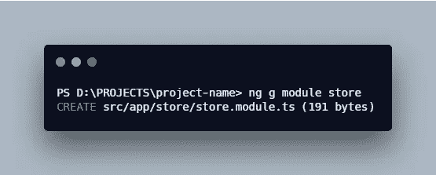

# 使用材质和 NGXS 设置 Angular 8 项目

> 原文：<https://levelup.gitconnected.com/setup-angular-8-project-with-material-and-ngxs-9589f51b6927>

## 有角的

## 使用角度材料(flex 布局)和 NGXS 创建角度项目以进行状态管理的指南


照片由 [Math](https://unsplash.com/@builtbymath?utm_source=unsplash&utm_medium=referral&utm_content=creditCopyText) 在 [Unsplash](https://unsplash.com/s/photos/coffee?utm_source=unsplash&utm_medium=referral&utm_content=creditCopyText)

在这篇文章中，我将向你展示如何建立一个完整的角度项目。

1.  使用 Angular CLI 创建项目
2.  安装角形材料
3.  使用 NGXS 安装状态管理

*更多类似内容，请查看*[*https://betterfullstack.com*](https://betterfullstack.com)

# 使用 Angular CLI 创建项目

对于那些不熟悉 Angular 的人来说， [Angular CLI](https://angular.io/cli) 是一个命令行界面工具，可以用来初始化、开发、搭建和维护 Angular 应用程序。

对于想要将 angular-cli 升级到当前版本 8 的用户，请运行以下命令:


升级 angular-cli 命令

就我个人而言，我不会在电脑上运行`npm cache verify`。但是，有些计算机需要运行该命令。

这个命令意味着它**验证**缓存文件夹的内容，垃圾收集任何不需要的数据，并验证缓存索引和所有缓存数据的完整性。

然后，我们检查`ng --version`以查看您计算机上的最新版本。

最后，运行`ng new project-name`创建一个项目。


ng 新项目-名称

如果您选择`scss`作为您的风格，并且您的公司有一个代理，那么您需要再运行一个命令


在代理的情况下安装节点-sass

完成了。现在我们可以安装角形材料。

# 安装角形材料

本节将把它分成 3 个部分:

1.  安装角形材料
2.  展示将材料汇入角度项目的正确方式
3.  添加角度灵活布局带来的好处

## 安装角形材料

安装角形材料非常容易。从本指南[开始](https://material.angular.io/guide/getting-started)您只需运行:

```
ng add @angular/material
```

然后，他们会在安装过程中问你一些问题:


安装角形材料时的问题

在这个例子中，我没有选择任何主题，我选择了**自定义**选项，并安装了 **HammerJS** 和**浏览器动画。**

## 将材料导入角度项目的正确方法

这里的想法是，作为一个前端开发人员，我不希望在我工作的每个角度模块中导入角度材质模块。

因此，我将创建一个共享的角度模块，并把我需要的所有角度材料模块放入其中。然后我根据需要将其导入到我的应用程序中。


创建物料模块

然后，我们将把我们需要的所有材料模块放入那个材料模块。


材料模块

完成了。现在，当我们使用 angular material 来开发 UI 时，我们将使用这个模块来导入 Angular 模块。

## 添加角度灵活布局带来的好处

[Angular Flex Layout](https://github.com/angular/flex-layout) 使用 **Flexbox CSS** 和 **mediaQuery** 提供了一个复杂的布局 API。

该模块使用自定义布局 API、mediaQuery observables 和注入的 DOM flexbox-2016 CSS 样式为 Angular 开发者提供组件布局功能。

要安装:

```
npm i -s @angular/flex-layout
```

安装后，您只需将它导入到您的共享模块中并使用它。对我来说，我把它放在`material`模块中，因为我将把它和材料组件一起使用。

现在，您可以在 flex 布局的 HTML 标记中使用角度布局属性。

查看[在您的应用中使用角度布局的所有可用选项](https://github.com/angular/flex-layout/wiki/Declarative-API-Overview)。

# 安装状态管理

有一些状态管理选项可供选择，如 [NGRX](https://ngrx.io/) 、 [NGXS](https://www.ngxs.io/) 或[使用 Rxjs 管理应用程序中的数据](/angular-and-rxjs-patterns-use-reactive-programming-to-compose-and-manage-data-in-angular-apps-2e0c4ce7a39c?source=friends_link&sk=be4b4ec70b1564b9802d1e5afac805a8)。

在本节中，我将使用 NGXS 作为状态管理，因为这种状态管理非常容易设置和使用。

首先，运行命令:

```
npm i -s @ngxs/store @ngxs/logger-plugin @ngxs/storage-plugin
```

这个命令将把商店和 2 个插件安装到你的 angular 应用程序中。

@ngxs/logger-plugin 是一个简单的控制台日志插件，用于记录正在处理的操作。

**@ngxs/storage-plugin** 会用 **localStorage** 、 **sessionStorage** 或者你希望的任何其他机制来支持你的商店。

其次，创建 store 模块，为您的应用程序配置它:



创建商店模块

最后，更新`store.module.ts`文件:


商店.模块. ts

现在你可以创建你的**状态**和**动作**。然后，把**状态的**文件放在`NgxsModule`里面。

# 摘要

在本文中，我建立了一个项目，使用 Angular 8、Angular Material 和 Angular flex 布局进行快速开发，使用 NGXS 进行状态管理..

我希望这篇文章对你有用！你可以通过我的[网站](https://www.hoangtran.co/)找到我。欢迎在下面的评论中留下任何问题。我很乐意帮忙！

[](https://betterfullstack.com/stories/) [## 故事-更好的全栈

### 关于 JavaScript、Python 和 Wordpress 的有用文章，有助于开发人员减少开发时间并提高…

betterfullstack.com](https://betterfullstack.com/stories/)