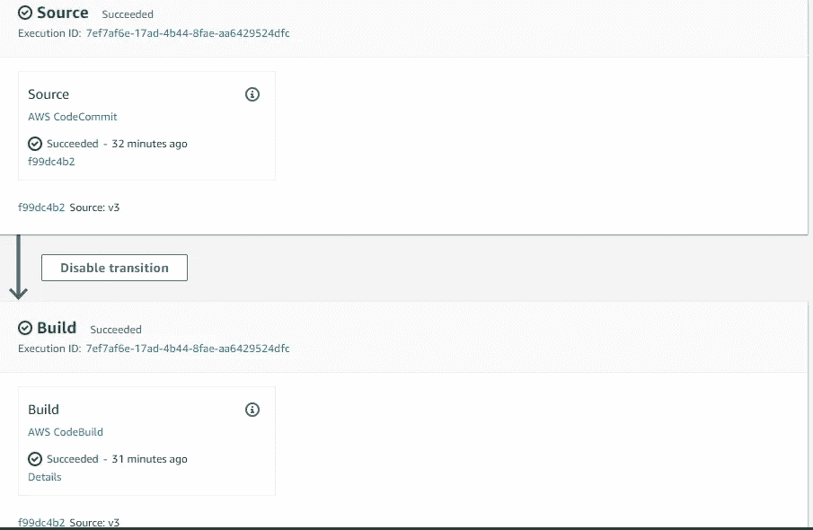

# 为无服务器部署设置 AWS CI/CD

> 原文：<https://levelup.gitconnected.com/setup-aws-ci-cd-for-serverless-deployment-5d346e60bf96>


在本文中，我们将使用 AWS CI/CD 工具自动部署我们的无服务器应用程序。我们将使用 AWS 的三个服务:代码提交、代码构建、代码管道。


## **AWS 代码提交**

AWS 代码提交是一个源代码控制服务，它允许您托管基于 git 的存储库。您也可以将 Github/Github Enterprise 与 AWS 代码提交一起使用。在本文中，我们将使用代码提交来托管我们的应用程序代码

## **AWS 代码构建**

AWS CodeBuild 是一个持续的集成服务，帮助打包和有选择地部署我们的无服务器应用程序

## **AWS 代码管道**

AWS CodePipeline 是一种持续的交付服务，有助于自动化部署和发布周期

**一些先决条件:**

*   安装 npm 和 node . js—[https://nodejs.org/en/download/](https://nodejs.org/en/download/)
*   安装无服务器框架— `npm install -g serverless`
*   在你的机器上安装 Git—[https://git-scm.com/download](https://git-scm.com/download)

## **发起并创建无服务器项目**

```
serverless create --template aws-nodejs --path serverles-cicd
```

## 设置项目和本地 **GIT 存储库**

*   在`serverless-cicd`项目文件夹中初始化 Git

```
git init
```

*   创建主分支和特征分支

```
git checkout -b featuregit checkout -b master
```

**特性分支** —这将是开发分支，在代码库被合并到主分支之前，开发代码将在其中被推送和测试

主分支——这个分支将在 Codebuild 中被进一步使用来构建最终的包，我们将在下面看到

## 设置代码提交—远程存储库

在 AWS 的 Codecommit 中设置新的存储库。将其命名为 servless-cicd 并创建存储库。


回购已创建

## **代码提交权限**

在这个例子中，我们将使用 HTTPS Git 凭证从本地机器连接我们的远程存储库。为了创建 Git 凭证，建议不要使用 root 用户，而是创建非 root 用户。

创建具有管理员访问权限和编程权限以及 AWS 控制台权限的 IAM 用户，并使用与非 root 用户相同的权限登录 AWS 控制台。

使用您的帐户的非根用户登录后，创建另一个拥有[AWSCodeCommitFullAccess](https://console.aws.amazon.com/iam/home#/policies/arn%3Aaws%3Aiam%3A%3Aaws%3Apolicy%2FAWSCodeCommitFullAccess)权限的用户


## **创建 HTTP Git 凭证**

转到 security credentials 选项卡，为 Codecommit 生成 ***HTTP GIT 凭证。*** 你可以把它下载到你的机器上保存下来，以后再用。把它存放在安全的地方。

因为我们已经创建了无服务器项目。让我们编写/修改给我们的基本代码。

在 handler.js 文件中，插入以下代码。代码将在我们的 body 对象中返回消息节点。

handler.js

在 serverless.yml 文件中插入以下代码。

无服务器. yml

**提供商** —因为我们使用 AWS 云，所以名称必须是 AWS

**阶段** —指定开发阶段

**区域** —指定将创建云形成堆栈的区域

**内存大小** —指定内存大小。如果未指定，默认大小为 1GB。

**超时** —指定功能运行的超时时间。

**函数**—这是 Lambda 函数，可以在`functions`属性下的`serverless.yml`中找到。

无服务器. yml

## **将原点从本地存储库更改到远程存储库**

```
git remote add origin [https://git-codecommit.ap-south-1.amazonaws.com/v1/repos/serverless-cicd](https://git-codecommit.ap-south-1.amazonaws.com/v1/repos/serverless-cicd) (this should be the URL of your repository)
```

现在提交本地存储库中的代码，并输入 HTTP Git 凭证。

```
git commit -m “first commit ”
```

将代码推送到远程存储库

```
git push — set-upstream origin featuregit checkout mastergit push — set-upstream origin master
```

## 设置代码构建


AWS 代码构建

## **在代码构建中设置环境变量**


## 创建 BuildSpec 文件

构建规范是构建命令集合，采用 YAML 格式，代码构建器用于构建项目。

将以下代码插入 buildspec.yml 文件。

buildspec.yml

代码构建有四个阶段——安装、预构建、构建和后构建。

我们需要在 CodeBuild 上全局安装 serverless 命令。构建命令将在我们的 AWS 云中部署无服务器项目。

## **设置代码管道**

我们将使用 CodePipeline 来自动化上述过程，这将确保我们的项目持续交付。

一旦我们将代码提交到代码提交，它将自动部署到 AWS 云。


AWS 代码管道

CodePipeline 将为我们创建新的服务角色，并转到下一步。


源提供者、存储库名称和分支名称


构建阶段


我们需要跳过部署阶段，因为我们在代码构建中使用了无服务器框架，并且我们已经定义了内置的构建规范文件。



由于源代码和构建成功，我们现在可以检查 API 网关，并在浏览器测试中复制和粘贴地址。或者，我们也可以检查尾部日志


构建日志

CodePipeline 还允许您在将代码推送到生产环境之前创建一些手动批准。我们将在以后的文章中看到这一点。

我们最初将 ENV 创建为 dev，并将构建命令部署到我们的 AWS 云中。我们同样可以将代码构建用于生产环境。

有关 env 变量的安全存储，请访问了解更多信息。

[https://docs . AWS . Amazon . com/code build/latest/user guide/build-env-ref-env-vars . html](https://docs.aws.amazon.com/codebuild/latest/userguide/build-env-ref-env-vars.html)

## 测试生产部署

出于测试目的，请更改代码库并将代码库提交给 CodeCommit。CodePipeline 将自动构建源代码，通过无服务器框架构建云形成堆栈，并为我们创建 Lambda 函数和 API 网关。

## API 网关


api 网关

## **λ函数**


λ函数


测试来自浏览器的 get 请求

## 结论

在本文中，我们学习了如何使用 AWS CI/CD 工具自动部署无服务器应用程序。

*如果你喜欢，请留下一些掌声以示支持。此外，请在下面留下您的回答，如果您遇到任何问题，请联系我。*

> *关注我*[*Twitter*](http://www.twitter.com/beingjaydesai)*|查看我的*[*LinkedIn*](https://www.linkedin.com/in/iamjaydesai/)*|查看我的* [*GitHub*](https://github.com/desaijay315)