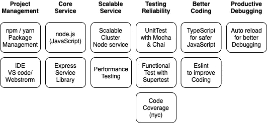
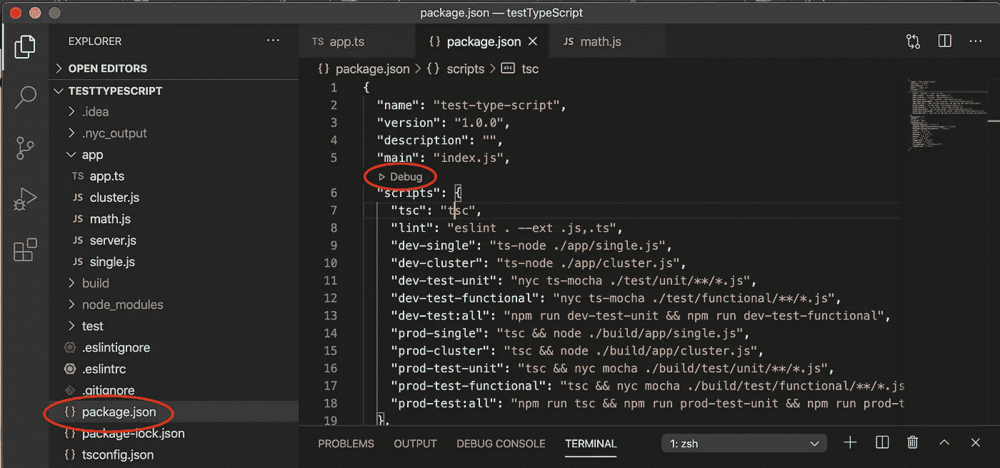
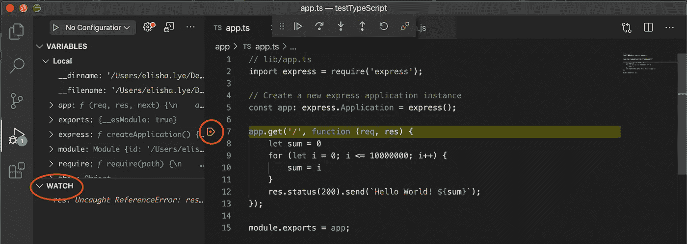
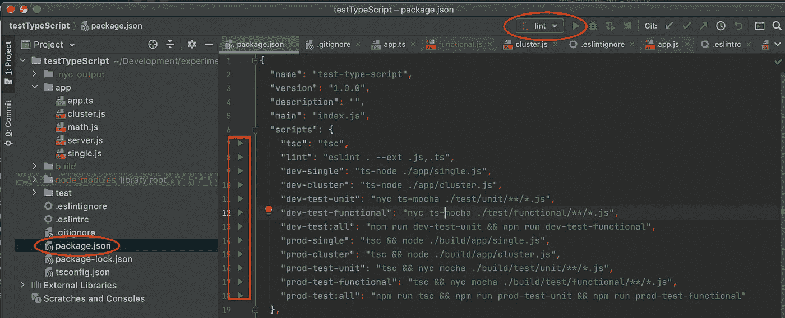
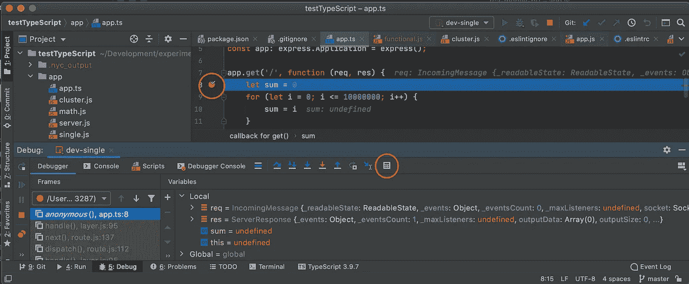
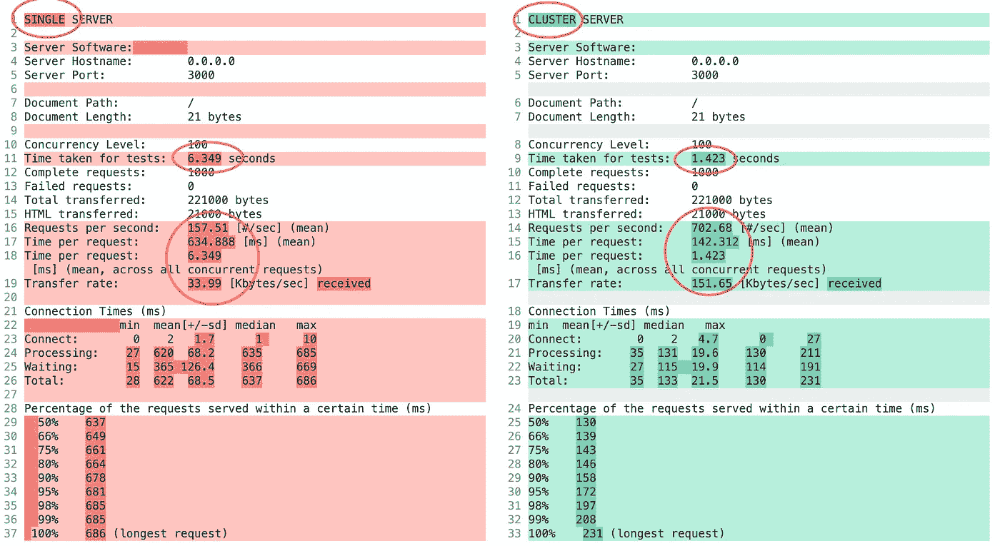
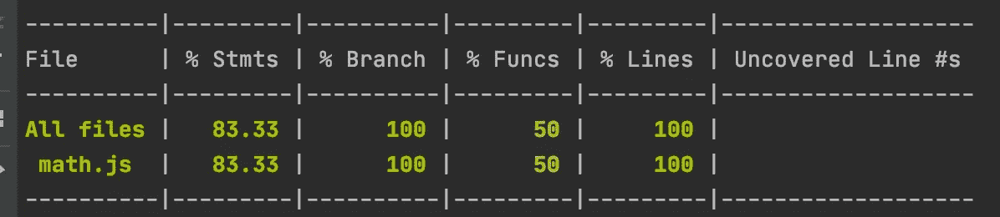
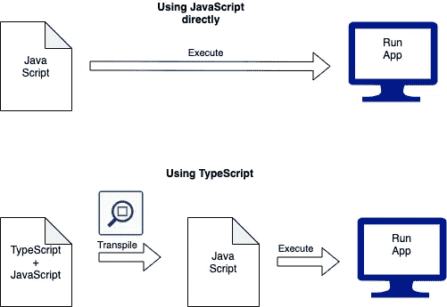
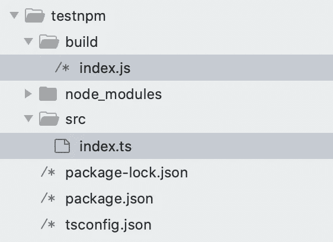

# 设置可部署的 Node.js 框架

> 原文：<https://levelup.gitconnected.com/setup-deployable-node-js-framework-58abdaab232f>

## 设置后端服务

## 了解除了学习 node.js 之外还需要什么


由 [Kelvin Ang](https://unsplash.com/@kelvin1987?utm_source=medium&utm_medium=referral) 在 [Unsplash](https://unsplash.com?utm_source=medium&utm_medium=referral) 拍摄的照片

作为后端服务的新手，当你想学习 Node.js 时，有很多很棒的网站向我们展示如何建立一个基于 node.js 的服务，比如 w3school 中的[教程。](https://www.w3schools.com/nodejs/)

这些都是很好的教程，为我们提供了 node.js 的一些深度，不幸的是，在学习了整个教程之后，我们所学到的仍然不足以在现实环境中制作可部署的 node.js 服务。它需要的不仅仅是 node.js

有一本书，[node . js Notes for Professionals book](https://goalkicker.com/NodeJSBook/)，可能会为你提供一切，但它有 300 多页可供阅读。

因此，我在下面提供了设置 node.js 服务所需的广泛观点(以及实际的示例项目代码)，在设置了适当的框架之后，可以深入研究它的任何其他方面。



概述设置 Node.js 服务所需的内容

有了一个合适的框架，您就可以放心地开始开发，而不用担心遗漏任何重要的方面。

我们开始吧

# 项目管理


[Icons8 团队](https://unsplash.com/@icons8?utm_source=medium&utm_medium=referral)在 [Unsplash](https://unsplash.com?utm_source=medium&utm_medium=referral) 上的照片

如果你直接进入 node.js 教程，它可能会告诉你运行 node.js，你只需要[安装 node.js](https://nodejs.org/en/download/) 。之后，通过键入`node -v`来知道你已经准备好了版本。

然而，这是不可扩展的，因为你不能正确地管理你的项目，比如安装库，运行测试，林挺等等。

## NPM(节点包管理)

要学习 node.js，首先要安装的是 [npm](https://www.npmjs.com/get-npm) 。它被用来管理你的整个 Node.js 开发框架，比如安装库，运行你的测试，林挺等，以及启动你的 node.js 服务。

> 除了 npm，[还可以用纱](/know-yarn-before-learning-node-js-bf39a50fb27f)。我在这里使用 npm，因为它是默认的节点包管理，它已经赶上了相当多，可以与今天的 yarn 相媲美。

安装 npm 后，

*   创建一个文件夹，并进入该文件夹。
*   然后，您可以使用 below 命令创建您的项目(注意,`-yes`是跳过所有问题并获得默认设置)

```
npm init -yes
```

这个命令基本上只是创建`package.json`文件，它是定义你整个项目框架的文件。

```
{
  "name": "projectname",
  "version": "1.0.0",
  "description": "",
  "main": "index.js",
  "scripts": {
    "test": "echo \"Error: no test specified\" && exit 1"
  },
  "keywords": [],
  "author": "",
  "license": "ISC"
}
```

重点关注的主要部分是`"scripts"`部分，在这里您将创建您的测试运行或节点 js 服务执行。

如果你创建一个如下的文件`index.js`

```
console.log('Hello World!')
```

并在`package.json`编辑剧本

```
"scripts": {
    "start": "node index.js"
},
```

然后在命令提示符下，你只需要`npm run start`(即`start`匹配脚本键)。然后它会执行`node index.js`(即从`index.js`文件开始运行节点服务)并在命令提示符下打印`Hello World!`。

使用 npm，您还可以安装这个库，这将在后面的小节中用到。

## IDE

有各种编辑器可以用来为 node.js 服务器编写 JavaScript 代码。我选了两个有能力

1.  自动完成(根据从库中加载的对象的功能)
2.  并调试和显示变量。

Visual Studio 代码:这是我的选择，因为它是免费的。你可以从 https://code.visualstudio.com/那里得到

要执行您的服务或测试等，您只需要打开`package.json`文件，然后单击那里的`Debug`来选择您想要运行的脚本。



对于带断点的调试，你只需要点击代码的左边来插入断点，代码会暂停。您可以在“监视”部分添加要监视的变量。



Webstorm:这是我的选择，因为它是由 IntelliJ 开发的，使用方式与 Android Studio 几乎相同(因为我最熟悉 Android 开发)。但是，它需要付费许可证才能运行。你可以从 https://www.jetbrains.com/webstorm/那里得到它

要执行，您可以转到`package.json`文件，并单击脚本左侧的任何绿色箭头。您也可以单击播放按钮，运行之前运行的配置。



要在断点处进行调试，可以将断点放在代码的左侧。当代码到达时，它会暂停。您可以单击计算器图标来评估您的代码变量内容。



可以参考 Webstorm 的更多[快捷方式。](https://resources.jetbrains.com/storage/products/webstorm/docs/WebStorm_ReferenceCard.pdf)

# 服务的代码


由 [Kelly Sikkema](https://unsplash.com/@kellysikkema?utm_source=medium&utm_medium=referral) 在 [Unsplash](https://unsplash.com?utm_source=medium&utm_medium=referral) 上拍摄的照片

这是您为 node.js 后端服务项目编码的项目的主要部分。大多数想学习 node.js 的人将从这里开始，这并不理想，因为他们错过了上面的项目管理部分。

已经设置了项目管理端(npm 和 ide)，现在您可以在这里探索为您的项目编码。

## 节点. js

w3school 教程为 node.js 的编码基础提供了很好的指导。尽管如此，它提供了一个核心 node.js，而没有使用流行的框架，以简化开发。例如，它使用`http`来提供服务

```
var http = require('http');http.createServer(function (req, res) {
  res.writeHead(200, {'Content-Type': 'text/html'});
  res.end('Hello World!');
}).listen(8080);
```

虽然这是可行的，但是大量的编码需要验证。例如，默认情况下，所有到您的服务的路径都是有效的，如果您想将您的服务访问限制在特定的路径，您需要使它们无效。

## 快速服务图书馆

因此，我们可以利用一个轻量级的 web 框架，即 [Express](https://expressjs.com/) ，而不是自己编写所有这些代码。

要安装该库，只需在项目文件夹命令提示符下键入以下内容

```
npm install -s express
```

`-s`是为项目在本地安装库。会的

1.  将库添加到`node_modules`文件夹中。
2.  它将添加库也在`package.json`
3.  它将创建`package-lock.json`来锁定我们下载的库的确切版本。

有了`package.json`和`package-lock.json`文件，我们允许其他人复制我们在项目中使用的精确的库版本，只需键入`npm install`。(它将再次下载所有库到`node_modules`，即`node_modules`应该在`.gitignore`文件中)

在 Express 中，我们只需要编码有效的路径(例如下面例子中的`'/'`)，默认情况下另一个路径将返回`404`。因此表达

```
const express = require('express');
const app = express();app.get('/', (req, res) => {
  res.send('Hello World!')
})app.listen(3000, () => {
  console.log('Listening on port 3000...')
})
```

[这个 youtube 教程](https://www.youtube.com/watch?v=pKd0Rpw7O48)将进一步提供更多关于如何编码和路由到所有 CRUD 的其他路径的指导，以及使用`joi`库进行输入验证。

# 可扩展服务


由 [Max Duzij](https://unsplash.com/@max_duz?utm_source=medium&utm_medium=referral) 在 [Unsplash](https://unsplash.com?utm_source=medium&utm_medium=referral) 上拍摄的照片

与应用程序客户端(如 web 前端或移动客户端，如 iOS 或 Android)的编码不同，node.js 是一个后端服务，可以在多个客户端中同时访问。因此，如果我们只有一个处理器运行服务，它将极大地影响响应。

因此，启用处理器集群来运行服务以获得更好的性能是非常重要的。

## 群集节点服务

作为一个后端服务框架，node.js 已经准备好使用`cluster`API。

首先，可以使用`os`检查主机有多少 CPU。

```
const ***os*** = require('os');const numCPUs = ***os***.cpus().length;
```

然后，可以开始使用第一个 CPU 生成工作 CPU(通过如下所示的`cluster.isMaster`检查)。如果它不是主 CPU，那么它将启动服务(处理单个节点时启动的默认服务)。

```
if (***cluster***.***isMaster***) {
    createWorkers();
    setRecreateWorkerOnExit();
} else {
    ***server***.startService();
}
```

如果是 master，我们将使用`fork()`创建 workers

```
function createWorkers() {
    ***Array***(numCPUs).fill().forEach(() => {
        ***cluster***.fork();
    });
}
```

此外，如果 CPU 由于某种原因退出，可以重新创建 worker。这确保了服务以相同的速率继续。

```
function setRecreateWorkerOnExit() {
    ***cluster***.on('exit', () => {
        ***cluster***.fork();
    });
}
```

[点击这里](https://medium.com/tech-tajawal/clustering-in-nodejs-utilizing-multiple-processor-cores-75d78aeb0f4f)了解更多关于集群节点的信息。

## 性能试验

让多个节点为您工作似乎很酷。但是如何确保它们确实提高了性能呢？

有一种快速的测试方法，那就是使用 Apache 基准测试[](https://www.petefreitag.com/item/689.cfm)*，也就是 *ab* 。*

*为了确保更清晰可见的结果差异，我通过添加一个无用的 for 循环来明显降低节点服务的速度*

```
*app.get('/', function (req, res) {
    let sum = 0
    for (let i = 0; i <= 10000000; i++) {
        sum = i
    }
    res.status(200).send(`Hello World! ${sum}`);
});*
```

*然后，我设置了一个不同的启动脚本来运行单个节点或节点集群。*

```
*"scripts": {
  "single": "node ./app/single.js",
  "cluster": node ./app/cluster.js",
}*
```

*然后，我尝试运行 1000 个并发请求的测试。*

```
*ab -n 1000 -c 100 http://0.0.0.0:3000/*
```

*下面是单个 CPU 和集群 CPU (12 核)的比较结果。速度提高 4 倍以上。*

**

# *测试可靠性*

**

*照片由[斯科特·格雷厄姆](https://unsplash.com/@sctgrhm?utm_source=medium&utm_medium=referral)在 [Unsplash](https://unsplash.com?utm_source=medium&utm_medium=referral) 上拍摄*

*没有经过任何测试的项目是不值得生产的。因此，了解我们有什么样的测试框架是很重要的。*

*另外，这是 JavaScript。代码不会失败，除非它们被执行。这使得对所有代码进行测试变得更加重要。*

## *单元测试*

*常用的测试框架是`Mocha`和`Chai`。Mocha 主要用于描述测试，并使用`mocha`作为命令运行它(就像`node`，但用于测试目的)。Chai 是为了提高比较断言的可读性。*

*要将 Mocha 和 Chai 作为本地库安装到项目中，只需运行*

```
*npm install -s mocha chai*
```

*之后，您可以通过访问`describe`和`it`来创建一个测试文件*

```
*const { ***describe***, ***it*** } = require('mocha')*
```

*假设你有一个数学模块，你可以像下面这样写你的测试(非常像 iOS 快速灵活的风格)*

```
****describe***('math.add() Test', () => {
    ***it***('should equal 2', () => {
        const result = ***math***.add(1, 1);
        expect(result).to.equal(2);
    });
    ***it***('should equal 4', () => {
        const result = ***math***.add(2, 2);
        expect(result).to.equal(4);
    });
});*
```

*要运行测试，在`package.json`文件中，只需添加这一行，通过指定文件夹，您就可以运行所有的测试。*

```
*"scripts": {
  "test-unit": "mocha ./test/unit/**/*.js",
}*
```

*你可以在这里阅读更多关于单元测试的内容。*

## *功能测试*

*除了单元测试之外，人们还希望进行一些功能测试(例如测试服务是否正常，例如返回 200 或 404 等)。*

*使用的方法是通过使用`Supertest`库来允许对服务进行测试，再加上`Mocha`(单元测试也使用了它)。*

*要像往常一样安装…*

```
*npm install -s supertest*
```

*同样，请求需要的对象。*

```
*const request = require('supertest')
const { ***describe***, ***it*** } = require('mocha')*
```

*然后我们可以写摩卡的风格测试。*

```
****describe***('GET /', () => {
    ***it***('respond with 200', (done) => {
        request(app)
            .get('/')
            .expect(200, done)
    })
})*
```

*要运行它，添加到`package.json`脚本。也可以同时运行单元测试和功能测试。*

```
*"scripts": {
  "test-unit": "mocha ./test/unit/**/*.js",
  "test-functional": "mocha ./test/functional/**/*.js",
 **"test-all": "npm run test-unit && npm run test-functional",** }*
```

*要获得更多关于功能测试的信息，请查看这篇[文章](https://hackernoon.com/api-testing-using-supertest-1f830ce838f1)。*

## *代码测试覆盖率*

*除了测试，我们还想看看测试了多少百分比的代码。如上所述，JavaScript 代码在编译时不会出错，因为没有编译，因此有足够的单元测试来测试所有代码和分支。*

*确保它的一个方法是运行代码测试覆盖度量。与 mocha 配合良好的一个简单库是`nyc`。*

*要像往常一样安装…*

```
*npm install -s nyc*
```

*使用`nyc`不需要代码。只需要添加到我们的`package.json`脚本来执行它。*

```
*"scripts": {
  "test-unit": "**nyc** mocha ./test/unit/**/*.js",
  "test-functional": "**nyc** mocha ./test/functional/**/*.js",
  "test-all": "npm run test-unit && npm run test-functional",}*
```

*通过运行测试，您可以看到如下内容。*

**

*有选项检查转储文件输出的结果，也设置百分比目标。查看[这篇文章](https://medium.com/@asemiloore/nodejs-testing-with-mocha-and-code-coverage-with-nyc-9d1d6e428ac1)了解更多信息。*

# *更好的编码*

**

*[Fatos Bytyqi](https://unsplash.com/@fatosi?utm_source=medium&utm_medium=referral) 在 [Unsplash](https://unsplash.com?utm_source=medium&utm_medium=referral) 上拍照*

*由于其灵活性，JavaScript 并不是一种理想的生产语言，在这种情况下，它可能很容易陷入一些编码错误，而没有人会注意到。因此，开发人员社区想出了一些办法来使它更加健壮。*

## *更安全的 JavaScript 的类型脚本*

*TypeScript 纯粹是为了让 JavaScript 以更严格的方式编写而构建的(例如，必须定义每个变量)。*

*一旦编写了 TypeScript，就可以将它转换成 JavaScript。如果有任何错误，它将被捕获。如果没有，那么输出可以用于生产。*

*下面是一个简单的例子。transpile 过程使它更安全，因为它提供了一个捕捉任何危险代码的网。*

**

*可以用 TypeScript 编写，或者将 JavaScript 和 TypeScript 组合作为源代码(这种组合对于迁移现有的 JavaScript 项目很有用)。*

*[本文](https://medium.com/javascript-in-plain-english/typescript-with-node-and-express-js-why-when-and-how-eb6bc73edd5d)很好地介绍了 TypeScript 以及其他好处。*

*像往常一样去拿打字稿*

```
*npm install -s typescript*
```

*然后要执行它，您可以将其设置为`package.json`脚本。*

```
*"scripts": {
   "tsc": "tsc"  
}*
```

*然后初始化以获得默认的配置文件。*

```
*npm run tsc -- --init*
```

*使用默认设置生成一个 TypeScript 配置文件`tsconfig.json`。*

*我修改了下面一些粗体的设置。*

```
*{
  "compilerOptions": {
   ** "target": "ES2016"**,
    "module": "commonjs",
    **"allowJs": true,**
    **"outDir": "./build"**,
    "strict": true,
    "esModuleInterop": true,
    "skipLibCheck": true,
    "forceConsistentCasingInFileNames": true
  }
}*
```

*   *`target` —瞄准新版本的 JavaScript 标准*
*   *`allowJs` —允许类型脚本和 JavaScript 都是可转换的*
*   *`outDir` —将输出设置到与源不同的文件夹*

*接下来，您可以开始编写您的类型脚本(或者 JavaScript，如果您喜欢的话)。*

*一旦完成编码，您就可以运行*

```
*npm run tsc*
```

*这将自动生成各自的源文件到各自的`build`文件夹中的`js`文件中*

**

*从这里，您可以使用*

```
*node ./build/src/index.js*
```

*当然，您可以在您的`package.json`中编写如下代码*

```
*"scripts": {
  "tsc": "tsc",
  "start": "node ./build/src/index.js"
}*
```

*但这意味着你必须先运行`tsc`，然后再运行`start`。为了改进它，你可以把它组合在一起，这样你的`start`也会默认运行`tsc`。*

```
*"scripts": {
  "tsc": "tsc",
  "start": "**tsc &&** node ./build/src/index.js"
}*
```

*现在一切都好了。*

## *运行 TypeScript 代码*

*但是，如果您喜欢运行原始的 TypeScript 代码并从那里进行调试呢？您不能使用`node`，因为它是`TypeScript`。*

*为此，您需要使用`ts-node`。照例去取`ts-node`*

```
*npm install -s ts-node*
```

*然后在您的`package.json`文件中，添加到`script`*

```
*"scripts": {
  "tsc": "tsc",
  "debug": "ts-node ./src/index.ts",
  "start": "tsc && node ./build/index.js"
}*
```

*同样对于测试，你需要`ts-mocha`。照例去取`ts-node`*

```
*npm install -s ts-mocha*
```

*然后在您的`package.json`文件中，添加到`script`*

```
*"scripts": {
  "tsc": "tsc",
  "debug": "**ts-node** ./src/index.ts",
  "debug-test-unit": "nyc **ts-mocha** ./test/unit/**/*.js",
  "debug-test-func": "nyc **ts-mocha** ./test/functional/**/*.js",
  "start": "**tsc** && node ./**build**/src/index.js"  
  "test-unit": "**tsc** && nyc mocha ./**build**/test/unit/**/*.js",
  "test-func": "**tsc** && nyc mocha ./**build**/test/functional/**/*.js",
  "test-all": "npm run test-unit && npm run test-functional"
}*
```

## *林挺与埃斯林*

*TypeScript 虽然通过严格控制代码的类型来帮助改进代码，但是它不执行其他林挺检查。*

*TypeScript 和 JavaScript 的流行 lint 是`Eslint`。*

*这篇博客为你提供了一个很好的指导。*

*要安装它，你需要安装它的解析器和一些插件*

```
*npm install -s eslint 
    @typescript-eslint/parser @typescript-eslint/eslint-plugin*
```

*要设置配置，创建一个文件`.eslintrc`，并将配置设置为*

```
*{
  "root": true,
  "parser": "@typescript-eslint/parser",
  "env": {
    "node": true
  },
  "plugins": [
    "@typescript-eslint"
  ],
  "extends": [
    "eslint:recommended",
    "plugin:@typescript-eslint/eslint-recommended",
  ]
}*
```

*我们还需要告诉哪些文件要排除。这可以通过创建一个文件`.eslintignore`并设置排除哪个文件夹来实现*

```
*node_modules
build*
```

*最后，在`package.json`中设置脚本来运行它。*

```
*"scripts": {
 **"lint": "eslint . --ext .js,.ts"** }*
```

*通过运行它，假设您已经从测试代码中省略了以下内容，*

```
*const { ***describe***, ***it*** } = require('mocha')*
```

*它将显示如下错误*

```
*/Users/testTypeScript/test/unit/math.js
 4:1 error ‘describe’ is not defined no-undef
 5:5 error ‘describe’ is not defined no-undef
 6:9 error ‘it’ is not defined no-undef
 10:9 error ‘it’ is not defined no-undef
 16:5 error ‘describe’ is not defined no-undef
 17:9 error ‘it’ is not defined no-undef
 21:9 error ‘it’ is not defined no-undef✖ 7 problems (7 errors, 0 warnings)*
```

# *生产调试*

**

*照片由 [Grzegorz Walczak](https://unsplash.com/@grzegorzwalczak?utm_source=medium&utm_medium=referral) 在 [Unsplash](https://unsplash.com?utm_source=medium&utm_medium=referral) 上拍摄*

*与许多编译代码开发不同，Node.js 开发允许“热重新加载”,可以自动获取更改并继续运行。因此，当一个代码和调试，服务器不需要停止。*

*这不能通过运行`node`或`ts-node`来完成。*

*取而代之的是其他执行`nodemon`、`supervisor`、`forever`、`node-dev`、`ts-node-dev`。*

*这里有一个[博客](https://strongloop.com/strongblog/comparison-tools-to-automate-restarting-node-js-server-after-code-changes-forever-nodemon-nodesupervisor-nodedev/)对他们进行比较。*

*我希望这篇博客为您提供 node.js 框架的一个广阔的方面。现在您已经准备好深入每个部分，而不用担心在设置 Node.js 服务的工作中遗漏任何主要部分。*

*查看这个 [github](https://github.com/elye/demo_nodejs_framework) 来获得上面所有例子的样本代码。*

*编码快乐！*