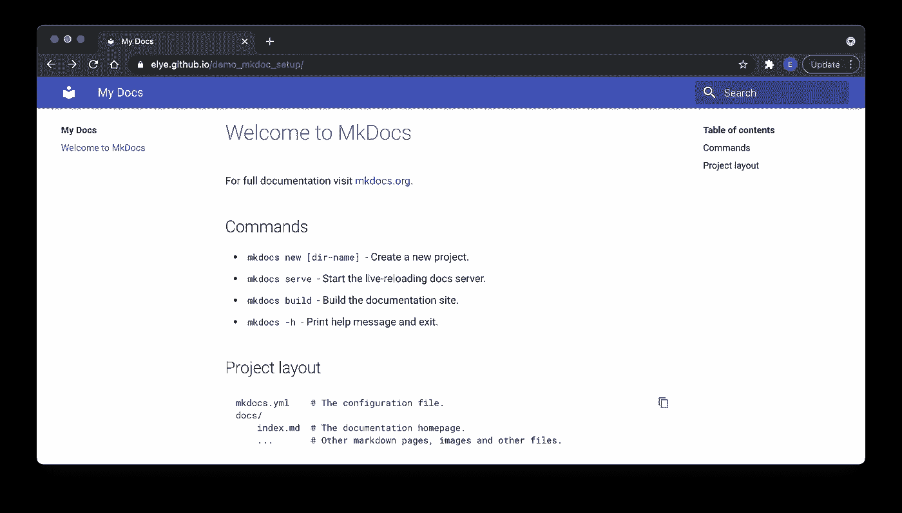

# 使用 MkDocs 在 Github 上设置文档站点

> 原文：<https://levelup.gitconnected.com/setup-document-site-on-github-with-mkdocs-49acdaf06998>

## 安装软件文档

## 在 Github 上制作专业文档页面的简单教程


照片由[西格蒙德](https://unsplash.com/@sigmund?utm_source=medium&utm_medium=referral)在 [Unsplash](https://unsplash.com?utm_source=medium&utm_medium=referral) 上拍摄

我们经常需要在 Github 页面上有文档。有几种记录方式:

1.  使用默认的 readme 就不那么好了(虽然还不错)。
2.  使用 wiki 页面也不太好(虽然还不错)。
3.  另一种方式是使用`gh-pages`来托管一些 HTML，这很棒。详情请查看本博客的【GitStats 提供了什么**部分。但是这需要大量的工作**

使用 Github 制作好文档的一个好方法是使用 [MkDocs](https://www.mkdocs.org/) 。

看看它会是什么样子[https://elye.github.io/demo_mkdoc_setup/](https://elye.github.io/demo_mkdoc_setup/)



# 设置 MkDocs 的简单方法

我去了 MkDocs 的[安装指南，需要一个才能在本地机器上安装`mkdocs`。](https://www.mkdocs.org/user-guide/installation/)

安装后，需要运行`mkdocs new <folder>`

这一步基本上会为您创建以下文件

```
[mkdocs.yml](https://github.com/elye/demo_mkdoc_setup/blob/master/mkdocs.yml)      // YML define the structure of your document
[/docs/index.md](https://github.com/elye/demo_mkdoc_setup/blob/master/docs/index.md)  // Your page content
```

因此，如果你不想在你的机器上安装`mkdocs`，你也可以手动创建它们。

# 在本地查看

要在本地查看它，我们可以使用`docker`来执行它。

```
docker run --rm -it -p 8000:8000 -v ${PWD}:/docs squidfunk/mkdocs-material
```

它会显示一个如下的注释。

```
INFO     -  Cleaning site directory
INFO     -  Documentation built in 0.96 seconds
INFO     -  [13:49:24] Serving on http://0.0.0.0:8000/
```

然后我们可以在本地看到它。

为了更简单，我在这里写了一个脚本,它会自动启动一个浏览器来查看加载后的内容。

# 发布更改

要发布更改，我们也可以运行 docker 命令，如下所示

```
docker run --rm -it -v ~/.ssh:/root/.ssh -v ${PWD}:/docs squidfunk/mkdocs-material gh-deploy
```

一旦它运行，我们可以看到如下内容。

```
To github.com:elye/demo_mkdoc_setup.git
* [new branch]      gh-pages -> gh-pages
INFO     -  Your documentation should shortly be available at:
            https://elye.github.io/demo_mkdoc_setup/
```

从这里，我们可以清楚地看到该文件在[https://elye.github.io/demo_mkdoc_setup/](https://elye.github.io/demo_mkdoc_setup/)上公开

> 它使用 Github 的`gh-pages`分支特性来托管文档。

# TL；速度三角形定位法(dead reckoning)

嗯，以上都是储存在下面的回购。

> 一个注意事项:当您提交您的更改时，请记住`.gitignore`文件夹

[](https://github.com/elye/demo_mkdoc_setup) [## GitHub - elye/demo_mkdoc_setup:演示简单的 mkdoc 设置 https://www.mkdocs.org/和…

### 演示简单的 mkdoc 设置 https://www.mkdocs.org/和 https://squid funk . github . io/mkdocs-material/getting-started/…

github.com](https://github.com/elye/demo_mkdoc_setup) 

享受制作 Github 文档页面的乐趣。